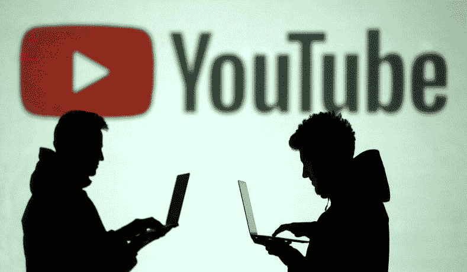
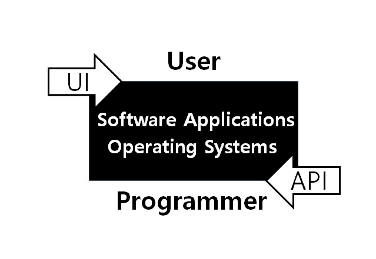
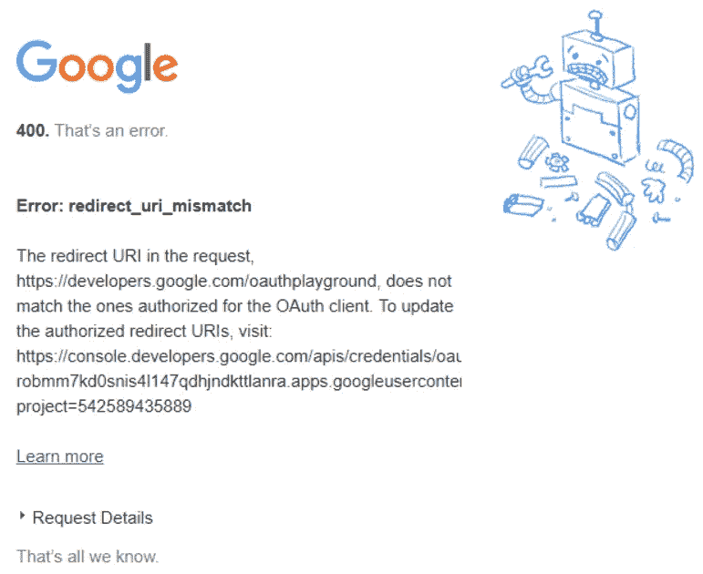

# 什么是 API，如何使用 Youtube API

> 原文：<https://towardsdatascience.com/what-is-api-and-how-to-use-youtube-api-65525744f520?source=collection_archive---------5----------------------->

用简单的英语解释 API 的概念，以及如何使用 tuber package 抓取 Youtube 数据



上次我谈到了成功优步的策略。对我来说，这是一个令人兴奋的项目。但这并不容易，因为我必须努力搜索如何获得 Youtube API 密钥。已经有很多资源了，但是大部分是给 web 开发者的，给 R 用户的教程几乎看不到。在我花了一整天的时间设法得到 API 密匙之后，我突然有了一个想法，为什么不把帖子留给和我有同样问题的人。

今天我要讲的是 API 的概念，以及如何获取 API key。我还将介绍用于在 r 中分析数据的 tuber 包。如果你没有使用过 Google APIs，并且你有兴趣用它们做一个数据科学项目，这篇文章将是一个好的开始。

# 什么是 API？

如果你不熟悉 API 这个词，一开始可能很难理解它的意思。API 代表应用程序编程接口。对你来说这是不是太“程序员”语言了？那很好。我会一步一步解释这个概念。

为了您的理解，最好从两个不同的接口开始。有两种接口，[用户接口](https://en.wikipedia.org/wiki/User_interface)和[应用编程接口](https://en.wikipedia.org/wiki/Application_programming_interface)。简单来说，UI 是普通用户的接口，API 是程序员的接口。你可以在下面看到一个 UI 的例子。这是我们每天都会遇到的常见网页。我们如何使用它们？我们可以简单地通过点击图片或单词来使用它们。这是面向普通人的级别，面向用户的界面。怎么可能呢？这是因为 web 开发人员将所有需要的代码都藏在了按钮后面。这是程序员的界面，代码和命令就在这里。换句话说，API。您可以将 API 视为一组代码、协议和功能，用于与软件应用程序进行工作和交互。对于 UI，我们使用简单的按钮和工具，而对于 API，我们使用预定义的功能。



Two kinds of interfaces (on the left) and the screenshot of Airbnb apps (on the right)

对你来说还很难吗？那么让我们假设你正坐在一家餐馆里。你晚餐想要一份美味的牛排和一杯红酒。你坐在桌子上打电话..谁啊。服务员！然后你拿到菜单，点你想要的。几分钟后，他们会把菜端上来。这就是 API 的作用。你不需要卷起袖子一个人做所有的事情，比如准备食材、切蔬菜、烤肉。服务员会为你做这些步骤，你所要做的只是叫他们，然后从那个架子开始你的工作。

同样，当开发人员使用编程工具时，或者当数据科学家与数据争论时，他们不会每次都编写每一个代码。他们使用预制的功能，这些功能是在引擎盖下运行的基本代码集。例如，当您想要将两个数据合并成一个数据时，您可以调用 join 函数(一个“join”服务员)并命令它按照您的命令工作(对菜单进行排序)。然后它会返回需要的结果(你的菜)。

# 为什么是 API？

API 现在已经成为企业在大数据时代装备的一种新的商业模式和战略。那有什么特别的？是什么让 API 这些天这么火？让我们简单地谈谈在商业环境中我们可以用它做什么。

API 可以在内部和永久产生大量的价值。管理和处理数据是企业管理的关键因素之一，每个公司都建立了 IT 系统。然而，随着数据的规模呈指数级增长，通过传统 IT 系统处理所有数据存在局限性。从这个意义上说，应用 API 可以是一个效率更高、安全性更好的解决方案。它可以打破系统之间的壁垒，从而简化工作流程，促进组织之间的合作，并提高数据保护。

API 的外部优点甚至更花哨。如果一家公司公开或以额外费用开放他们的 API，它可以提供新的服务并获得潜在客户。客户可以体验到前所未有的更高级别的服务。通过提供 API 服务，第三方开发者可以构建全新类型的产品，这甚至是公司从未想过的。例如，谷歌地图，开发者中最受欢迎的应用程序接口，最初并没有预期会产生那么大的影响。通过将这些数据应用到房地产和其他各种领域，开发者为谷歌带来了更高的价值和资产。

如今 API 的数量在不断增加，而且这种趋势将会持续下去甚至更多。现在我们可以说，一个公司 API 的实施和管理是其竞争和战略价值的关键因素之一。

# 那么如何使用 API 呢？

要使用 API，您需要首先获得一个授权密钥。它用于获取与 API 连接的授权密钥。API 提供者，在这里是 Youtube，不仅仅是无控制地提供他们的服务。为了保留这个界面并管理用户，他们为每个用户提供了一个唯一的访问密钥。这样，我们就可以连接到应用程序的接口。就像我们通过将电源线插入电源插座来连接电源一样，我们使用这个唯一的密钥将服务器插入存储设备。从这一点出发，我们可以使用 API 的数据和协议。

那么现在让我们从如何获得授权密钥开始。有一个非常好的获取钥匙的教程。如果你是一个网站开发人员，你可以一步一步地遵循这个教程。

[](https://help.aolonnetwork.com/hc/en-us/articles/218079623-How-to-Create-Your-YouTube-API-Credentials) [## 如何创建你的 YouTube API 证书

### 创建您的 YouTube API 凭证是通过执行以下主要阶段来完成的:第一阶段——创建 Google OAuth…

help.aolonnetwork.com](https://help.aolonnetwork.com/hc/en-us/articles/218079623-How-to-Create-Your-YouTube-API-Credentials) 

如果你要做一些数据分析，你不需要所有这些步骤。您按照步骤进行，直到第 9 步，然后选择“其他”而不是“web 应用程序”开发人员控制台上有两种不同类型的客户端，每种情况下的访问方法都不同。因此，如果您尝试通过“web 应用程序”获取密钥，并从您的本地计算机请求 Oauth，您可能会遇到类似我所得到的错误消息。



因此，单击“其他”选项，然后您将获得客户端密钥和秘密密钥。将它们复制并粘贴到本地计算机上。

# Youtube API 的 tuber 包

R 里有 *tuber* 包，是专门为 Youtube 数据分析做的。您可以绘制各种数据，包括特定频道的视频数量、观看次数、对视频的喜欢和评论等等。要在 R 中调用这些数据，需要先安装‘tuber’包。然后，您向 Google 请求授权令牌。

```
install.packages('tuber')
library(tuber)client_key = ''
client_secret = ''
yt_oauth(app_id = client_key, app_secret = client_secret)
```

当您注释这段代码时，浏览器会弹出一些数字，允许您授权应用程序。如果您检查您的本地工具，R 将已经在等待编号，所以复制并粘贴序列号。现在你终于可以和 Youtube API 连接了。

我还将介绍一些对分析来自`tuber` 包的 Youtube 数据有用的函数。

*   `get_all_channel_video_stats`:统计一个频道中所有视频的功能。您需要一个 channel_id 来使用它。
*   `get_stats`:这给你一个视频 id 的统计数据。返回值是视图、喜欢、不喜欢、喜爱和评论的计数。
*   `get_video_details`:提供视频发布日期等更具体的信息。您还可以获得标题、描述、缩略图和类别。
*   `get_all_comments`:它给你一个视频的所有评论，因此在特定主题或频道的文本挖掘方面有很大的用处
*   `list_channel_activities`:返回频道活动列表。
*   `list_videos`:返回最受欢迎的视频。

还有其他有用的 API 调用，推荐大家去查一下。你可以从[这里](https://www.rdocumentation.org/packages/tuber/versions/0.9.7)浏览它们。

# 资源

*   什么是 API 的一个优秀视频:[https://www.youtube.com/watch?v=s7wmiS2mSXY&t = 75s](https://www.youtube.com/watch?v=s7wmiS2mSXY&t=75s)
*   哈佛 API 战略价值报告:[https://hbr.org/2015/01/the-strategic-value-of-apis](https://hbr.org/2015/01/the-strategic-value-of-apis)
*   想多研究 API？ProgrammableWeb 是一所“API”大学，提供几乎所有关于 API 的内容:【https://www.programmableweb.com/ 
*   不知道怎么处理 Youtube 的数据？看看我以前的作品。你可以从中获得新的灵感！

[](/strategies-to-be-a-successful-youtuber-extensive-youtube-exploratory-analysis-part-1-2-40eee29554e6) [## 成为成功 Youtube 的策略:广泛的 Youtube 探索性分析(第 1/2 部分)

### 为 Youtubers 推荐数据驱动的策略

towardsdatascience.com](/strategies-to-be-a-successful-youtuber-extensive-youtube-exploratory-analysis-part-1-2-40eee29554e6) [](/strategies-to-be-a-successful-youtuber-extensive-youtube-exploratory-analysis-part-2-2-6862cd4f40be) [## 成为成功 Youtube 的策略:广泛的 Youtube 探索性分析(第二部分)

### 揭开单词嵌入的神秘面纱并拟合模型以预测视图

towardsdatascience.com](/strategies-to-be-a-successful-youtuber-extensive-youtube-exploratory-analysis-part-2-2-6862cd4f40be) 

已经有很多 API 了，但是只有一小部分是公开的。由于数据将直接转化为当今世界的竞争力，我理解企业的意图。然而，我认为他们不应该忽视共享经济的潜力。通过使他们的内部数据可访问，他们将释放全世界开发人员和数据科学家的创造力，为数据设计全新的用途。就像过去几年我们对开源所做的一样。

感谢您的阅读，希望这篇文章对您有所帮助。如果有需要改正的地方，请分享你的见解！如果您想鼓励一位有抱负的数据科学家，请点击👏 👏 👏！我总是乐于倾听你的想法，所以请在 [LinkedIn](https://www.linkedin.com/in/jiwon-jeong/) 上分享或联系我。我将带来另一个激动人心的故事。在那之前，机器学习快乐。