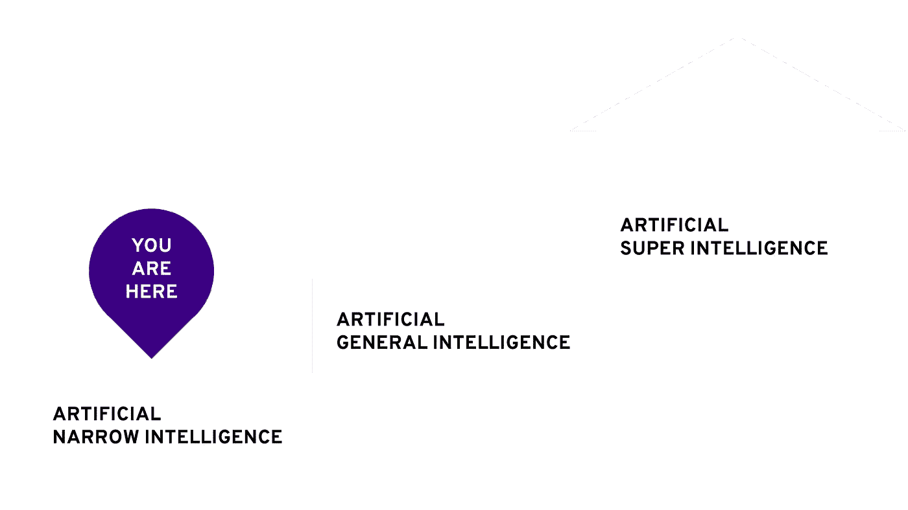
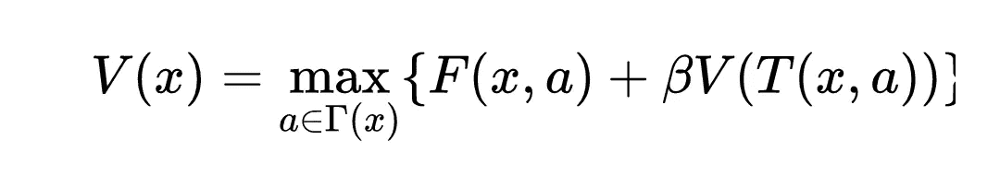
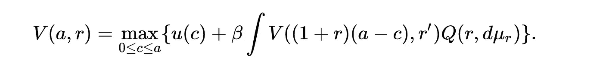
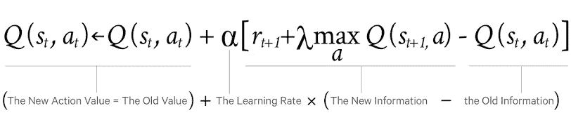
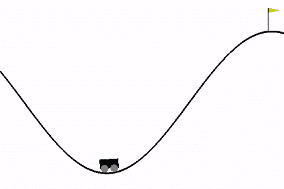

# 什么是人工通用智能？

> 原文：<https://towardsdatascience.com/what-is-artificial-general-intelligence-5b395e63f88b?source=collection_archive---------1----------------------->

## 首先，什么是人工智能？

人工智能是计算机科学(或科学)的一个分支，研究智能系统的创造。智能系统是那些像人类一样拥有智能的系统。

人工智能科学并不新鲜，人工智能一词在古希腊和埃及的手稿中就已被提及。希腊人信奉神**赫菲斯托斯，**也被称为**铁匠之神，**根据一个希腊神话赫菲斯托斯为所有的神制造了智能武器，在他们看来，人工智能的目标是:有助于人们实现某个目标，能够自动操作并预先被编程以根据情况做出不同的反应。

嗯，人工智能这个词在娱乐领域变得很流行，我们可以看到很多基于超级智能概念的电影。(前 machina，Her，AI，复仇者联盟-奥创时代等。) .但是我们今天看到的人工智能系统无法与所谓的“超级智能”系统相提并论。

## 真实人工智能和当今人工智能系统的区别:

如前所述，人工智能并不是一个新的领域，自从人类出现以来，许多哲学家和科学家都对人工智能有过一些想象，但他们都受到了当时技术的限制。今天，随着强大的超级计算机的出现，我们能够建立服务于所需目的的人工智能系统。 ***但是，他们真的聪明吗？？答案是否定的，他们不是。让我们看看怎么做。***

在计算机和互联网上足够大的数据集的帮助下，所谓的**机器学习**进入了画面**。机器学习提供了一套可以在现实世界中实现的数学概念。**

神经网络，大致模拟人脑的工作，让机器从例子中学习。深度学习已经帮助许多技术巨头，如谷歌和苹果，通过实施许多新的热门技术，如人脸识别，语言理解，图像理解等，经济地改进他们的产品。但是你想到的，所谓的深度学习并不是真正的智能。机器学习领域需要大量数据集来学习对对象进行分类或进行预测，这被称为监督学习。

> 所谓的监督学习创造了一种智能的假象，但其核心只是一种数学优化。尽管它拥有决策和分类数据集的能力，但它的工作方式非常狭窄。

我们非常熟悉创建监督学习系统的技术。给定一个大数据集，监督学习系统学习输入和输出之间的映射，因此它可以预测未知输入的输出。但这不是我们的大脑实际做的事情，我们的大脑不需要 10000 张猫的图像来识别一只猫，甚至我们的大脑可以做很多监督学习系统不能做的事情。

## 监督学习的局限性:

即使监督学习可以用来创造如此多令人惊奇的东西，它也有如此多的限制:

*   它的思维总是局限于某个特定的领域。
*   它的智能取决于你使用的训练数据集。再说一次，你在控制。
*   它不能用于动态变化的环境。
*   只能用于分类和回归。但不是为了控制问题。
*   它需要庞大的数据集，否则就缺乏准确性。获取数据集可能是一个问题。

## 什么是 AGI？

AGI(人工通用智能)是一个用来描述真正智能系统的术语。真正的智能系统拥有全面思考的能力，不管以前受过什么训练都可以做出决定，这里的决定是基于他们自己所学的。设计这样的系统可能真的很难，因为今天的技术有些有限，但是我们可以创建所谓的“部分 AGI”。

## **强化学习:**

甚至在今天，许多科学家认为强化学习是实现所谓 AGI 的一种方式。强化学习可以用来解决监督学习无法解决的问题。让我们举一个简单的例子来理解行走的基本任务之一，行走是我们非常自然和擅长的一项人类任务。婴儿自己学会走路，而不必搜索数据集，人脑可以通过从错误中学习来做到这一点。但是一旦它变得完美，它可以走上千步，甚至一个步长的不匹配都能被它识别出来。大脑采取的步骤总是最优的，采取的速度(或简单的步长)总是以这样的方式，以同样的方式，在最短的时间内到达目的地，每一步花费的能量应该是最小的。所以行走的速度取决于能量以及你到达目的地的速度。同样的行走问题也可以应用到机器人学等许多需要运动的领域。当然，如前所述，监督学习无法做到这一点。

## **与动态规划和控制理论的联系:**

正如我们已经熟悉的，动态规划是一种获得任何问题的最优解的方法。动态规划已经成为解决旅行商问题和其它图论相关问题最成功的算法之一。这种方法使用迭代方法，其中一组解决方案可以在一个或多个步骤中找到，然后算法的剩余部分决定哪个解决方案是最优的。

**动态规划方程:**动态规划的标准方程被称为贝尔曼方程。该方程可应用于所有决策问题，例如，在旅行推销员问题中，给定一组城市及其距离，问题是获得穿过所有城市至少一次的最短路径。贝尔曼方程可由下式给出:

这个方程包括寻找一个函数 V(x，a)，这个函数的目标是为每个状态 x 选择一个动作 a，使得 a 对于 x 总是最优的。这是解释贝尔曼方程的最简单的形式(不是数学的，为了证明，参考维基百科)。目前广泛使用的所有强化学习算法都是动态可编程的，也就是说它们都采用贝尔曼方程的形式。我们稍后会看到 Deep-Q 算法，它类似于贝尔曼方程。一些强化学习算法遵循马尔可夫决策规则，如 SARSA 算法等。在这种情况下，它们采用随机空间中的贝尔曼方程的形式，如下所示:

## 深度 Q 学习算法:

谷歌的 Deepmind 在 2015 年发表了一篇关于所谓深度 Q 学习算法的非常有趣的论文。这种算法能够在大多数人类难以完成的任务中表现出色。该算法能够在超过 2600 个雅达利游戏中脱颖而出。

他们的工作代表了有史以来第一个能够在没有任何人类干预的情况下不断适应其行为的通用智能体，这是在寻求通用人工智能的过程中向前迈出的一大步。

代理是使用一种称为 Q-learning 的算法开发的，Q 学习算法的核心是 Bellman 方程的一个结果，因此它遵循动态规划的方法论。

**实用方法:**每个强化学习问题都包含以下成分:

*   代理:学习算法或任何有学习能力的物理实体。
*   环境:是部署代理的地方或空间。地球是一个环境，在这里人类是代理人。一个环境是由状态、行动和奖励形成的一套定义明确的规则组成的。
*   状态:代理在任何情况下的有效位置称为状态。代理可以通过执行动作从一种状态转换到另一种状态。每一个行动，不管对国家来说是否正确，都有回报。

*   奖励:奖励是由特定行动的环境定义的结果。如果行动正确，奖励是积极的，否则是消极的。

任何代理人的长期目标都是了解环境，以便获得最大的回报。奖励只有在积极的情况下才能最大化，积极的奖励反过来又是对那个状态采取正确行动的结果。因此，最大化问题处理以下序列，简单来说:

*   给定有效状态 si，生成随机动作 ai。
*   假设动作是正确的，并经历到下一个随机状态 si+1 的转换。
*   计算过渡的奖励 ri。
*   如果奖励是积极的，记住这种状态下的行动，因为这是适当的行动，但不是最佳行动。
*   如果奖励是负的，放弃行动。
*   从获得的一组最佳行动中，找出奖励最大的最佳行动。
*   对环境中的每个状态都这样做。

该等式可由下式给出:

意味着，Q 值，即状态-动作值取决于旧值+新信息和旧信息之间的差异。旧的信息已经存在于记忆中，而新的信息是通过最大化从行动中获得的回报而获得的。所以在许多强化学习问题中，我们构造了一个神经网络，如果动作是正的，它可以学习状态和动作之间的映射。一旦训练完成，我们就可以部署网络，使它为任何有效状态创建正确的动作，从而最大化回报。

## 登山车示例:

Openai gym 提供了一套可以训练智能体的环境，Mountain Car 是一个很好的例子，强化学习可以用来学习最佳加速度。这个游戏的目标是训练一辆汽车成功爬山。

我们可以从头开始实现 Q 学习，或者我们可以简单地使用 Kears-rl。Krars - rl 只是一个 API 集合，通过它可以使用预先编写的算法。

Car learning to produce optimal acceleration.

如图所示，在 4000 集结束时，汽车已经学会产生足够的加速度来爬山。

代码:

Code for MountainCar-v0

谢谢大家！更多关于强化学习的例子，请参考我的 GitHub 简介:[https://github.com/Narasimha1997](https://github.com/Narasimha1997)

我的 Linkedin 个人资料:[https://www . Linkedin . com/in/narasimha-pras Anna-HN-17aa 89146/](https://www.linkedin.com/in/narasimha-prasanna-hn-17aa89146/)

谢谢:)