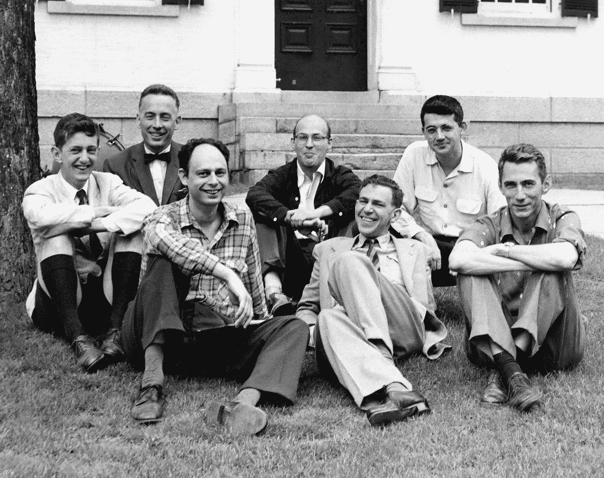
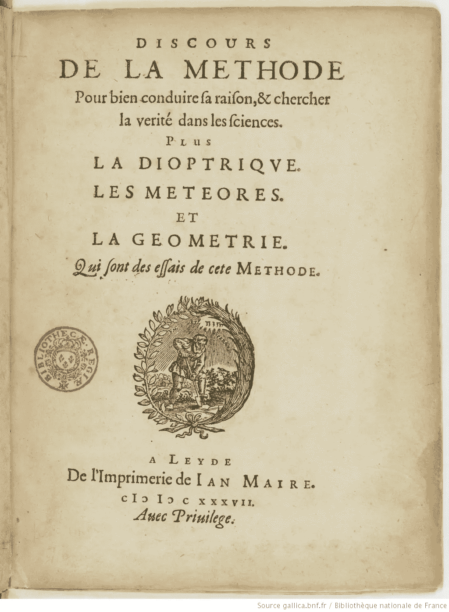
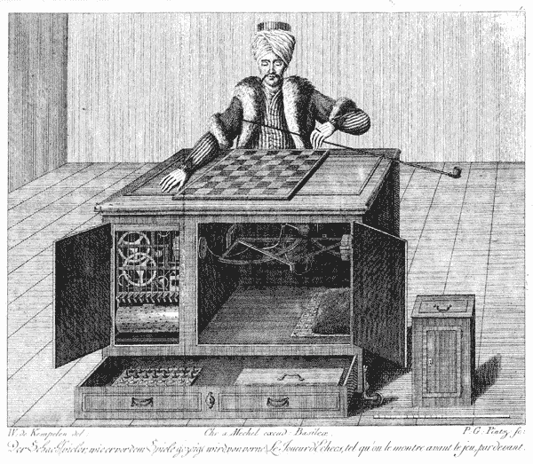
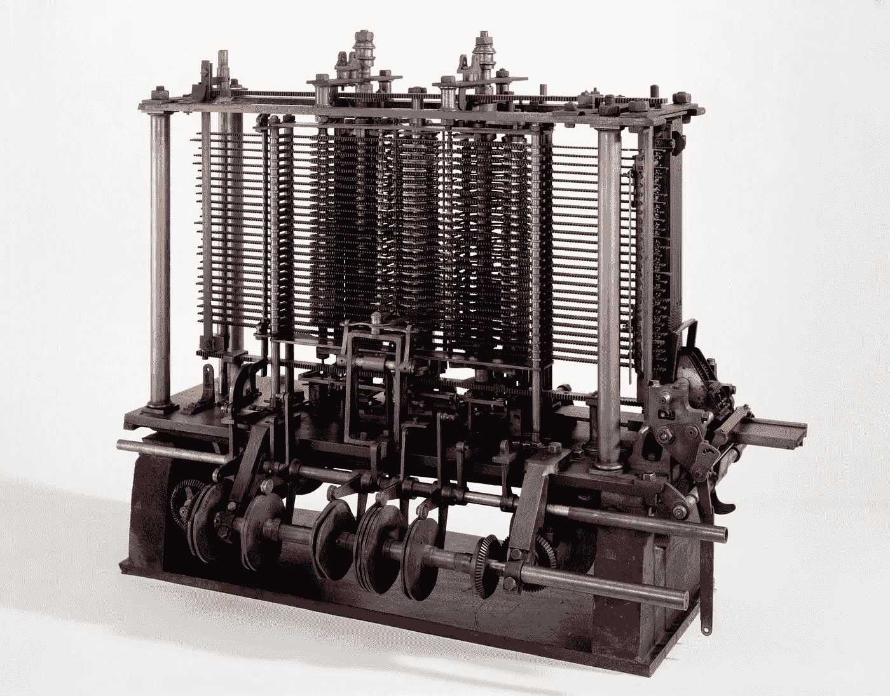

# 什么是人工智能？第一部分

> 原文：<https://towardsdatascience.com/what-is-artificial-intelligence-part-1-75a6de110141?source=collection_archive---------8----------------------->

虽然人工智能(AI)这个术语已经存在很多年了，但近年来它似乎已经成为一个流行语。像许多从科学中获得的流行词汇一样，人工智能似乎已经成为一个相当恼人的现象的受害者:大多数使用这个术语的人并不真正知道它的意思。

好吧，也许这有点太苛刻了。当然，使用人工智能这个术语的人对它的意思有一些了解，但是我注意到在很多情况下，非专家(甚至一些所谓的专家)的用法偏离了这个术语在学术界最初的意图。

没有人真正知道是谁创造了“人工智能”这个术语。许多人将其归因于已故的计算机科学家[约翰·麦卡锡](http://jmc.stanford.edu/)，但是根据丹尼尔·克勒维耶的采访，麦卡锡否认提出了这个术语。

Participants of the 1956 Dartmouth Summer Research Project on Artificial Intelligence in front of Dartmouth Hall. Based on my wife’s highly tuned facial recognition algorithm, the photo includes Claude Shannon (front right), John McCarthy (back right), Marvin Minsky (center), Ray Solomonoff (front left), and Nathaniel Rochester (back left). Photo credit Margaret Minsky via www.achievement.org

尽管如此，人工智能一词在 20 世纪 50 年代中期开始流行，尽管主要是在美国科学家的小圈子里。一个同义术语，*机器智能，*似乎起源于英国，至今仍在使用，虽然没有人工智能广泛。在本文中，我主要使用术语 AI 来指代“思维机器”的概念，除非我讨论的是一贯使用“机器智能”的作者。

总的来说，本文旨在从历史的角度阐明人工智能的概念，并简要追溯其发展到现代。作为免责声明，我需要指出我不是专业的历史学家。在这段简短的历史中，可能有许多遗漏的情节，但我将通过引用许多更权威的参考文献来试图弥补这一点。

我打算分几部分发表这篇文章。在第 1 部分中，我将重点放在能够思考的机器的概念上。第二部分将集中在 1936 年到大约 1954 年间英国的发展。第三部分将继续从 1954 年左右开始的故事，当时焦点开始转移到美国。

# 早期人工智能简史

为了理解人工智能是什么，我们回顾过去，看看伟大的思想家认为机器可能做什么。我将人工智能的早期历史分为三个时期:“从自动机到分析引擎”，“从图灵机到跳棋”，以及“从逻辑理论家到自我编写程序”。这将我们带到大约 20 世纪 50 年代末，在这一点上，我们可以说人工智能是一个根深蒂固的科学学科。

## 从自动机到分析引擎

一些作者将思考机器的想法追溯到古埃及或古希腊(例如[2])，但我个人并不认为这些例子，如苏格拉底和 Euthypro 之间关于虔诚标准的对话，与思考机器或人工智能有太多关系(见[3])。另一个例子是 *Talos* ，希腊神话中的青铜雕像。由于他被认为是由希腊神*赫菲斯托斯创造的，他很难被称为人造生物。*

In 1637, Descartes presumed that it would be impossible to create machines that reasoned like humans. Image from a first edition copy of *Discourse on the Method (Source:* Bibliothèque nationale de France, département Réserve des livres rares, RESM-R-76, Available from: [http://gallica.bnf.fr/ark:/12148/btv1b86069594](http://gallica.bnf.fr/ark:/12148/btv1b86069594))

基于我有限的研究，我认为思考机器的想法可以追溯到 17 世纪[5]。特别是，勒内·笛卡尔在 1637 年发表了关于方法的*论文(著名的短语“我思故我在”就来自于此)，在论文中，他推测不可能创造出像人类一样推理的机器[6]:*

> “……从道德上讲，任何一台机器都不可能存在多种多样的器官，足以让它像我们的理性使我们能够行动那样，在生活的所有事件中发挥作用。”

事实上，在同一篇文章中，他概述了图灵测试，这个话题我们稍后会谈到:

> 对于那些熟悉不同的自动机或人类工业制造的移动机器所执行的各种运动的人来说，这也不会显得奇怪，与在每个动物体内发现的大量骨骼、肌肉、神经、动脉、静脉和其他部分相比，这只是很少的一部分…
> 
> ……但是，如果有一些机器带有我们身体的形象，并且能够在道德上尽可能模仿我们的行为，那么仍然会有两种最确定的测试来证明它们不是真正的人。其中第一个是，他们永远不能使用我们能够胜任的词语或其他符号来向他人表达我们的思想:因为我们可以很容易地设想一台机器被构造成能够发出词汇，甚至能够发出一些与外部物体对它的作用相对应的信号，这些外部物体引起它的器官发生变化；例如，如果在一个特定的地方被触摸，它可能要求我们想对它说的话；如果在另一个地方，它可能会大叫说它受伤了，诸如此类；但不是说它应该把它们排列成不同的形式，以便恰当地回答在它面前所说的话，就像智力水平最低的人所能做的那样。
> 
> 第二个测试是，虽然这种机器可能执行许多事情与我们任何人一样完美，或者可能更完美，但毫无疑问，它们在某些其他方面会失败，从中可以发现它们不是根据知识行事，而是仅仅根据它们的器官的配置…

他所指的*自动机*本质上是对各种生物的机械化模仿。据报道，这种自动机在古代就已经被制造出来，但它们很难被称为模仿人类思维的机器。

Image of the Great Chess Automaton *from “*Briefe über den Schachspieler des Hrn. von Kempelen” *by Karl Gottlieb von Windisch and published in 1783 (Source:* [Krešimir Josić*, University of Houston*](https://www.uh.edu/engines/epi2765.htm)*)*

一个例外是 Wolfgang von Kempelen 的*大象棋自动机*，它建于 1769 年*。*它被设计来下棋，而且下得很好。它甚至打败了本杰明·富兰克林！大多数人都认为擅长下棋是一种需要智力的能力。唯一的问题是冯·肯佩兰的象棋自动机原来是假的。这个奇妙的装置里真的有人！直到 1837 年，也就是它诞生近 70 年后，这一点才被揭示出来。

然而，这个例子表明，到 18 世纪，思考机器的想法肯定仍然存在，而且很好，一些人愿意试图证明笛卡尔是错误的(如果他们甚至知道他的断言)。事实上，似乎没有人知道如何制造会思考的机器，但至少梦想是存在的。

19 世纪上半叶是一个巨大的飞跃，当时发明家查尔斯·巴贝奇提出了*分析引擎。它被广泛认为是通用计算机的第一个设计。虽然分析引擎从未完全建成，但许多人认为它在推进机械化通用计算的梦想方面具有影响力。*

Trial model of Charles Babbage’s Analytical Engine. (Source: Science Museum Group. Babbage’s Analytical Engine, 1834–1871\. (Trial model). 1878–3\. Science Museum Group Collection Online. Accessed March 10, 2018\. [https://collection.sciencemuseum.org.uk/objects/co62245](https://collection.sciencemuseum.org.uk/objects/co62245).)

1843 年，阿达·洛芙莱斯翻译并注释了 Luigi Menabrea 的一篇论文，该论文基于 1840 年巴贝奇在都灵的演讲，描述了巴贝奇的分析引擎[8]。似乎没有人想到分析引擎确实是一台思考机器:

> 因为机器不是一个有思想的生物，而只是一个根据强加给它的法则行动的自动机。

洛夫莱斯在她的笔记中补充道:

> 分析引擎并不自命能创造任何东西。它可以做我们知道如何命令它执行的任何事情。它可以*跟随*分析；但是它没有预见任何分析关系或真理的能力。它的职责是帮助我们利用我们已经熟悉的东西。

尽管*分析引擎*不被认为是思维机器，但它在设计能够进行复杂数学计算的计算机方面向前迈出了一大步。这将被证明是对其他计算机先驱的鼓舞，比如艾伦·图灵，我们接下来会谈到他。

继续[第 2 部分](/what-is-artificial-intelligence-part-2-bad0cb97e330)。

# 参考

[1]克勒维耶博士(1993 年)。人工智能:探索人工智能的动荡历史。纽约:基础书籍。

[2]哈克，s .(未注明)。*人工智能简史*。检索自[https://www . atariarchives . org/deli/artificial _ intelligence . PHP](https://www.atariarchives.org/deli/artificial_intelligence.php)。

[3]柏拉图。(约。【公元前 399 年】T4。从[http://www.gutenberg.org/ebooks/1642](http://www.gutenberg.org/ebooks/1642)取回。

[4] *塔罗斯。*检索自[https://www . Greek mythology . com/Myths/Creatures/Talos/Talos . html](https://www.greekmythology.com/Myths/Creatures/Talos/talos.html)。

【5】人工智能。(2010) *你知道吗？。*从[https://didyouknow.org/ai/.](https://didyouknow.org/ai/.)取回

[6]笛卡尔(1637 年)。*论正理求真的方法*。从 http://www.gutenberg.org/ebooks/59 取回。

[7]伟大的国际象棋自动机。(未注明)。恶作剧博物馆。检索自[http://hoaxes . org/archive/permalink/the _ great _ chess _ automaton](http://hoaxes.org/archive/permalink/the_great_chess_automaton)。

[8]梅纳布雷亚，L. F. (1843 年)。查尔斯·巴贝奇发明的分析引擎草图。a .洛夫莱斯)。*科学回忆录*。第三卷。从[https://www.fourmilab.ch/babbage/sketch.html](https://www.fourmilab.ch/babbage/sketch.html)取回(原作发表于 1842 年)。