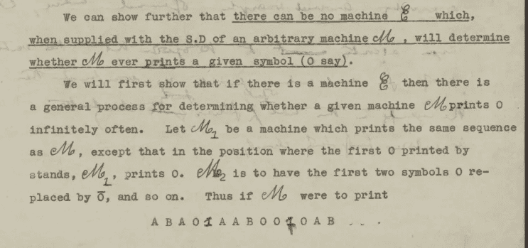
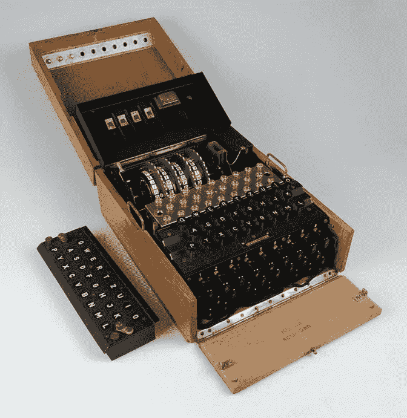
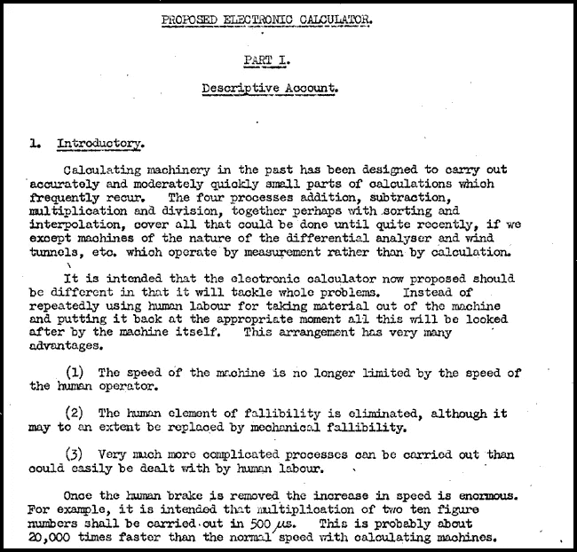
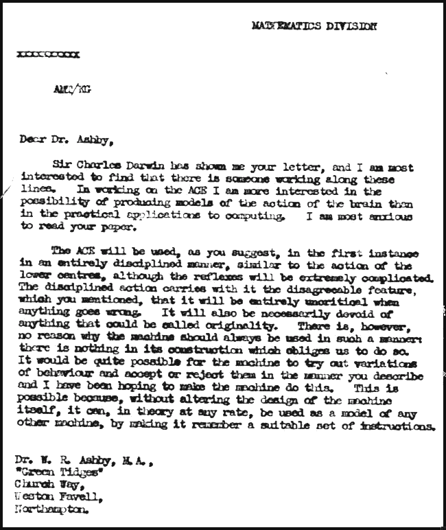
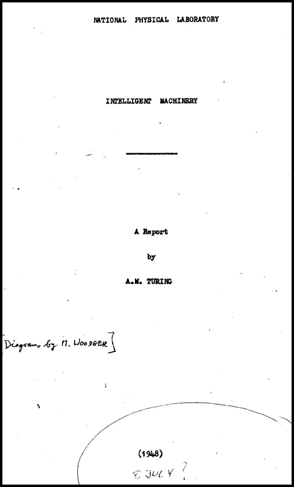
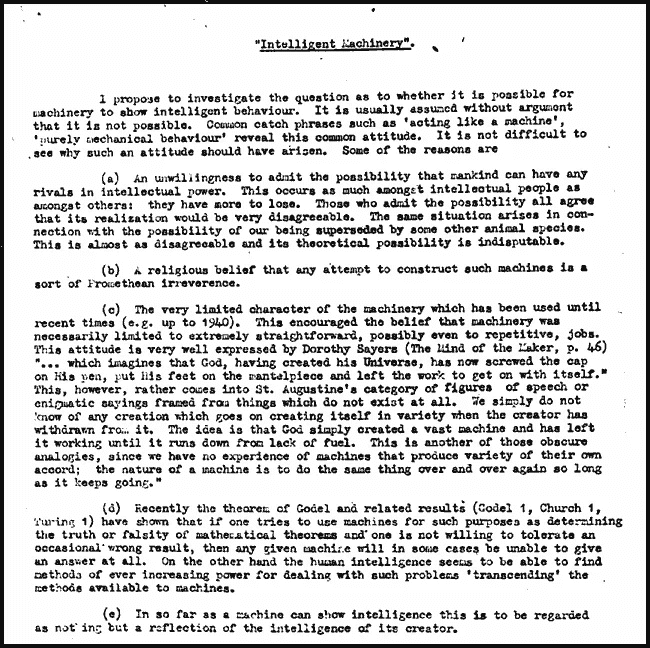
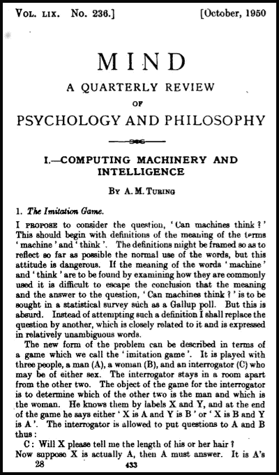
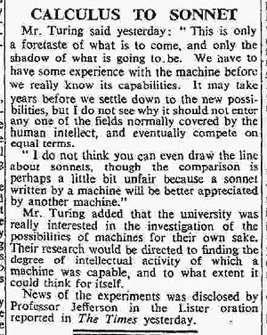

# 什么是人工智能？第二部分

> 原文：<https://towardsdatascience.com/what-is-artificial-intelligence-part-2-bad0cb97e330?source=collection_archive---------9----------------------->

## 从图灵机到跳棋

在这篇文章中，这是从一开始就追溯人工智能概念的系列文章的第二部分，我们继续讲述艾伦·图灵的故事，他被许多人认为是计算机科学之父。正如我们将看到的，艾伦·图灵不仅有资格被称为计算机科学之父，也有资格被称为最早的人工智能先驱之一(或者他会称之为*机器智能*)。因此，我对他短暂而非凡的职业生涯倾注了相当多的关注，包括一些生平细节。

我重申我的免责声明，我不是专业的历史学家。相反，我希望这一系列文章能够激励其他人进一步研究这一迷人的历史，并为“人工智能”的实际含义提供见解。

# 论可计算数(1936)

1936 年，艾伦·图灵发表了科学史上具有里程碑意义的论文之一《论可计算数，以及对 entscheidungpolymer 的应用》[1] *。在书中，他描述了他所谓的“通用计算机器”。为了纪念他，这个理论构造现在被称为*通用图灵机*，它不仅具有理论意义:许多人认为它是现代计算机的基础思想。*

图灵在计算科学方面的早期工作与人工智能相关，因为它提出了以巴贝奇的分析引擎为代表的计算思想。图灵的论文从数学角度证明了*一般计算由单台机器*完成的可能性。也就是说，图灵证明了任何可以被计算的数或序列，都可以被一种单一类型的机器计算，即所谓的通用图灵机。虽然这可能无法证明机器能够思考，但它表明，完成一般计算任务的机器是可以设计出来的(至少在理论上是如此)。

Several pages of a typed draft of “*On Computable Numbers” are known to exist. Another unpublished paper was handwritten by Turing on the back of these pages. I gratefully acknowledge [2] for this information (Image Source:* AMT/C/15/image 01a.2\. [The Turing Digital Archive](http://www.turingarchive.org/browse.php/C/15) [6]. Copyright © P.N. Furbank*)*

# 谜和炸弹(1939-1942)

1939 年 9 月 4 日，也就是英法对德宣战的第二天，图灵从剑桥搬到了英国政府代码和密码学校(GC & CS)的总部布莱切利公园[3]。在那里，他成了破译机*Bombe*的主要设计者，这种破译机用于破译德国 *Enigma* 密码机的密码。

谜*和炸弹*的故事是一个漫长而有趣的故事，但它已经被很好地记录下来了。我将只叙述基本的细节。我向感兴趣的读者推荐杰克·科普兰的优秀著作《图灵的本质》和其中引用的参考资料。

Example of a wartime *Enigma* cipher machine. (Source: [National Museum of the Royal Navy](https://www.nmrn.org.uk/explore/curators-highlights/enigma))

在这篇文章中，我想简要探讨的是图灵的工作和人工智能的发展之间的联系，我相信这有助于阐明人工智能实际上是什么的概念。

在许多方面，Bombe 可以被认为是机器学习的原始实现。“炸弹”是一种机器，它装有复制几份“谜”的元件，建造的目的是发现能解开德国密码信息的“T2 之眼”。它使用*启发式搜索*来找到一个候选关键字，该关键字将解决一组特定的约束条件(即，一个启发式的，由炸弹的特定设置来表示)，然后人工操作员将检查该关键字，应用于编码信息，是否会产生连贯的德语。图灵后来推测“智力活动主要由各种各样的搜索组成。”[4].

我认为上述过程是机器学习的原始形式，因为这是当今许多机器学习算法在高层次上所做的:(1)从一大组可能的配置中选择一个配置，表示满足某些约束的函数的参数，(2)根据某种正确性度量来检查/测量候选解(即参数集)，(3)根据需要重复，以及(4)一旦对性能满意，就使用所选配置作为模型来计算其他尚未看到的数据的一些输出。

Images of a “Bombe,” which was about 2 meters high (including the wheels and cabinet). The left image shows the front with its nine rows of drums replicating Enigma “wheels”. The right image show the rear panel, where cables connected together different drums in order to represent different constraints (Left image source: [Gerald Massey](http://www.geograph.org.uk/photo/1590986); Right image source: [Antoine Taveneaux](https://commons.wikimedia.org/wiki/File:Bletchley_Park_Bombe8.jpg))

Bombe 和现代机器学习之间有三个主要区别，不是在程序上，而是在实现上。首先，Bombe 要求操作员使用连接不同组件的电缆来设置机器(见上图)，以便施加某些约束/启发。一个人还被要求将候选“解决方案”转移到一台单独的机器上(一个复制的谜)，以试图破译一条完整的德国信息。原则上，这些手动步骤也可以是自动化的，但在这个时期，让人类操作员执行这些步骤可能比构建/扩展一台机器来执行相同的任务更容易。

其次，虽然 Bombe 可以在大约两个小时内选择和检查 17，576 种配置[3]，但在现代计算机上执行的现代机器学习在许多情况下可以每秒执行数百万次这种类型的过程(当然，细节取决于参数的数量、计算之间的函数、计算机的大小等)。).

第三，炸弹是一种被设计用来执行特定任务的机器(即学习恩尼格玛密码的钥匙)，而且只能用于该任务。今天，我们通常在通用计算机上执行机器学习任务，这些计算机可以通过简单地将其他程序加载到内存中来“重新配置”用于其他任务。

尽管用现代术语来说，这种炸弹需要手动操作且“缓慢”,但与之前存在的任何东西相比，它代表了其特定任务在自动化和计算速度*方面的重大进步。请注意，当时还有其他计算机器存在，如 [IBM 601](http://www.columbia.edu/cu/computinghistory/601.html) 。不过，我不确定是否有可能像我们今天这样，在这个时代的不同机器之间进行“苹果对苹果”的计算速度比较。最后，我想指出的是，Bombe 是基于早期解谜机的设计，由波兰数学家设计的 [*Bomba*](https://en.wikipedia.org/wiki/Bomba_(cryptography)) 。*

在进入其他话题之前，我想指出，在仅仅三四年的时间里，图灵从非常理论化的(*关于可计算数字*)转向了高度实用化的(破解德国军事通信)。用英国特勤局官方历史学家哈里·辛斯利爵士的话说:

> 我不会说图灵的所作所为让我们赢得了这场战争，但我敢说，如果没有他，我们可能会输掉这场战争。

我们还知道，在 1941 年初，由于德国潜艇对船只的攻击，英国面临着食物和其他基本供应品告罄的危险。当时，海军版的英格玛还没有被破解，许多人认为它无法破解，但最终当图灵的团队在 1941 年 6 月开始定期解码海军英格玛信息时，英国船只能够成功地避开 U 艇[3]。灾难得以避免。

如果这些成果——帮助英国人民避免饥饿，帮助盟军赢得二战——不是实践研究的缩影，我不知道什么是。在我看来，在图灵悲惨短暂的职业生涯开始时，他的工作的高度实践性对人工智能的发展有很大的影响。如果图灵继续走理论路线，这个领域可能不会像 1941-1953 年期间那样迅速发展，我们现在将探讨这一点。

# 图灵转向机器智能(约 1941-1953)

根据与图灵在布莱奇利公园共事的唐纳德·米歇尔的采访，图灵早在 1941 年就开始思考“机器智能”。他在 GC & CS 的同事中传阅了一篇关于机器智能的论文，但是现在已经遗失了。我们还知道，在 1941 年底，留给图灵研究的关于英格玛的理论问题已经不多了，所以他开始研究其他问题，只是在短期内加入了英格玛团队[3]。

1942 年 11 月，图灵去了美国，在那里他在贝尔实验室研究语音加密。在那里他遇到了 Claude Shannon，我们将在第 3 部分讨论他。图灵于 1943 年 3 月回到英国，继续致力于自动语音加密，直到战争结束。

## 第一台通用计算机设计(1945-1947)

尽管图灵 1936 年关于可计算数字的论文*描述了一台通用的计算机，但它并不是一台计算机的实用设计。1945 年 10 月，图灵加入了国家物理实验室(NPL)的数学部门，致力于这样的设计。1945 年末，图灵发表了一份名为“提议的电子计算器”的技术报告，其中详细说明了这种机器的设计(见下图)。在这份报告中，他还提出了机器智能的话题，描述了什么将成为“经典”的人工智能问题:*

> 给定国际象棋中的一个位置，机器可以列出每边大约三步的所有“获胜组合”。这……提出了一个问题‘机器会下棋吗？’很容易就能玩一场相当糟糕的游戏。这很糟糕，因为象棋需要智力。我们在本节开始时说过，机器应该被视为完全没有智能。然而，有迹象表明，冒着偶尔犯严重错误的风险，让机器显示智能是可能的。通过跟踪这一方面，机器可能会下一盘很好的棋。

Left: Original manuscript of “Proposed Electronic Calculator,” which was to become the Automatic Computing Engine (ACE). Right: Letter from Turing to Sir W. Ross Ashby, describing how ACE could be used to mimic how the human brain works. (Source: The Turing Archive for the History of Computing [5])

当这台机器的一个试验版本最终被命名为*自动计算引擎*(ACE；为了向巴贝奇致敬)，建于 1950 年 5 月，它是世界上最快的计算机，运行速度为 1 MHz [3，第 367 页]。另一台使用与图灵的 ACE 设计相同的基本原理建造的计算机是 [Bendix G15](https://en.wikipedia.org/wiki/Bendix_G-15) ，被一些人认为是第一台个人计算机。

当图灵设计 ACE 时，机器智能是他考虑的首要问题，正如 1946 年写给 W. Ross Ashby 的一封信(见上图)所示:

> 在研究 ACE 的过程中，我对制造大脑活动模型的可能性比对计算的实际应用更感兴趣…
> 
> …机器很有可能尝试不同的行为，并以你描述的方式接受或拒绝它们，我一直希望让机器做到这一点 ACE 实际上类似于我在关于可计算数的论文中描述的“通用机器”。这种理论上的可能性在实践中是可以实现的……因此，尽管大脑实际上可能是通过改变其神经元回路来运作的……然而，我们可以在 ACE 中建立一个模型，在这个模型中，这种可能性是允许的…

1947 年 2 月 20 日，图灵在伦敦数学协会做了一次关于 ACE 的演讲。我们通过一个草稿副本了解了这个讲座的一些内容，这个草稿副本可以从[5]中获得，并且已经被重印了几卷(例如[7]和[3])。这不仅是已知的第一次描述机器智能的公开讲座，图灵还清楚地阐述了*机器学习*的概念:

> 有人说，计算机只能执行它们被指示去做的过程……同样真实的是，最初建造这些机器的意图是把它们当作奴隶，只给它们经过详细考虑的工作……直到现在的机器只是以这种方式使用。但是有必要总是以这种方式使用它们吗？
> 
> 让我们假设我们已经设置了一台具有某些初始指令表[即程序]的机器，如果有充分的理由，这些表有时可能会修改这些表……可能它仍然会得到机器最初设置时所期望的类型的结果，但以更有效的方式……这就像一个学生从他的主人那里学到了很多，但通过自己的工作增加了很多。**当这种情况发生时，我觉得人们不得不认为机器显示了智能。**一旦人们能够提供合理的大内存容量，就应该可以开始在这些方面进行实验……**我们想要的是一台能够从经验中学习的机器。**

(黑体字是我为了强调而加的。)

主要由于内部政治和 NPL 对 ACE 项目的管理不善，直到 1950 年 5 月才完成 ACE 的“试验模型”。

## 剑桥公休假(1947-1948)

1947 年 7 月，图灵仍然受雇于 NPL，他去剑桥大学休假 12 个月。国家公共图书馆馆长查尔斯·达尔文爵士很好地表达了这一休假的目的[5]:

> [图灵]想把他在机器上的工作进一步扩展到生物学方面。我可以这样来最好地描述它:迄今为止，机器被设计用来做相当于大脑较低部分的工作，他想看看机器能为较高部分做多少工作；例如，可以制造一台可以通过经验学习的机器吗？

A report written by Turing in 1948 titled “Intelligent Machinery” is the most detailed treating of artificial intelligence written before 1950\. It was not published during Turing’s lifetime. (Source: The Turing Archive for the History of Computing [5])

休假回来后，图灵写了一份题为《智能机械》的报告。这是一部高度原创的作品，引入了具有学习能力的遗传算法和神经网络(他称之为“无组织机器”)等思想，以及强化学习。我不想给出详细的总结，我只想引用图灵在报告结尾的总结:

> 讨论了使机器表现出智能行为的可能方法。与人脑的类比被用作指导原则。有人指出，只有提供适当的教育，人类智力的潜力才能发挥出来。这项研究主要围绕一个应用于机器的模拟教学过程。定义了无组织机器的概念，并提出婴儿人类大脑皮层具有这种性质。简单的例子，这样的机器，他们的教育通过奖励和惩罚的方式进行了讨论。在一种情况下，教育过程一直进行到组织类似于 ACE。

图灵从未发表过这份报告，但同样可以通过[5]和几本选集(即[8]和[3])获得。

## 曼彻斯特时代(1948-1953)

由于对进展缓慢感到沮丧，图灵于 1948 年离开了他在 NPL 的职位，加入了曼彻斯特维多利亚大学的计算机实验室。

First page of Turing’s 1950 article “Computing Machinery and Intelligence,” where the now famous “Turing Test” was introduced.

计算机实验室是由马克斯·纽曼(布莱奇利公园的另一位老兵)于 1946 年建立的。当图灵加入时，他们正在深入开发“曼彻斯特宝贝”，当它在 1948 年 6 月 21 日运行第一个程序时，成为世界上第一台存储程序计算机。虽然我不会详细讨论图灵对曼彻斯特早期计算机发展的贡献，但可以说他的影响是巨大的。

图灵在 1948 年至 1953 年期间最著名的成就是一系列关于机器智能主题的文章和公开讲座，包括 1950 年发表在领先哲学杂志 *Mind* 上的文章“计算机械和智能”。在这篇文章中，提出了著名的“模仿游戏”，也就是现在所知的图灵测试:

> 我建议考虑这样一个问题，“机器能思考吗？”这应该从“机器”和“思考”这两个术语的定义开始……我不会尝试下这样的定义，而是用另一个问题来代替这个问题，这个问题与它密切相关，并且用相对明确的语言表达。
> 
> 这个问题的新形式可以用一个我们称之为“模仿游戏”的游戏来描述。它由三个人玩，一个男人(A)，一个女人(B)，和一个审问者(C)，他们可能是男性也可能是女性。审讯者呆在一个与其他两人分开的房间里。这个游戏的目的是让审讯者确定另外两个人中哪个是男人，哪个是女人…审讯者可以向 A 和 B 提问…

在举了一些审讯者可能会问的问题类型的例子后，图灵继续说道:

> 我们现在问这样一个问题，“当一台机器在这个游戏中扮演 A 的角色时，会发生什么？”这样玩游戏时，审讯者会像在男女之间玩游戏时一样经常错误地决定吗？这些问题取代了我们原来的‘机器会思考吗？’

文章的其余部分描述了对机器可以思考这一观点的各种可能的反对意见，以及图灵对这些反对意见的反驳。还有一章是关于“学习机器”，这在很大程度上是对他在 1948 年文章中概述的观点的扩展。他以一个深刻的观察结束了这篇文章:

> 我们只能看到前面不远的地方，但我们可以看到那里有许多需要做的事情。

1951 年，在英国广播公司做了几次广播演讲，其中一次题为“智能机械，异端学说”，另一次题为“数字计算机能思考吗？”1952 年，他参加了 BBC 播出的一个小组讨论，题目是“自动计算机器可以说会思考吗？”。其他小组成员包括理查德·布莱斯维特(哲学家)、杰弗里·杰弗逊(神经外科医生)和马克斯·纽曼。

在这段时间里，图灵也对人工生命的话题产生了兴趣。这有点超出了本文的范围，所以我不会试图总结他在这方面的工作。1953 年，他发表了一篇名为《国际象棋》的短文，这标志着他多年来为计算机编程下棋的努力达到了顶峰。最后，在 1954 年，图灵发表了他的最后一篇文章，题目是《可解和不可解的问题》，发表在*科学新闻*上，这是一份普及科学的杂志。这篇文章的目的是向普通读者展示他在可计算数字方面的早期贡献，也许是最持久的贡献*。*

# 图灵的审判与死亡

Alan Turing quoted in 11 June 1949 edition of “The Times” (UK).

1952 年，图灵受到审判，并被判犯有同性恋行为，这在当时的英国是刑事犯罪。1954 年 6 月 8 日，图灵被发现死于家中。虽然死亡被裁定为自杀，这一发现一直是争议的主题[9]。

尽管他的生命和职业生涯短暂，但图灵对人类和计算机创造力的影响是持久的。我想引用图灵在 1949 年 6 月 11 日《T4 时报》上的一篇文章来结束我的演讲:

> 这仅仅是即将发生的事情的预演，也仅仅是将要发生的事情的影子。在真正了解这台机器的性能之前，我们必须先有一些使用它的经验。我们可能需要几年时间才能适应新的可能性，但我不明白为什么它不能进入人类智力通常覆盖的任何领域，并最终在平等的条件下竞争。

# 参考

[1]a . m .图灵(1937 年)。可计算数及其在 Entscheidungsproblem 问题上的应用。*伦敦数学学会会报*， *2* (1)，230–265 页。(*注:从技术上讲，这篇论文发表于 1937 年，但在那个时代，论文通常会在会议上被大声朗读，之后会以纸质形式发表在会议录上。这篇论文是在 1936 年 11 月 12 日宣读的。*)

[2]霍奇斯(未注明日期)。可计算的数字和图灵机，1936 年。艾伦·图灵互联网剪贴簿，从 http://www.turing.org.uk/scrapbook/machine.html 的 T2 取回。

[3]科普兰，B. J .).(2004).*《图灵精粹》:在计算、逻辑、哲学、人工智能和人工生命方面的开创性著作，还有《谜》的秘密。牛津:克拉伦登出版社。*

[4]图灵，A. (1948)。“智能机械”。在 B. J .科普兰(编辑).(2004).《图灵精粹》:在计算、逻辑、哲学、人工智能和人工生命方面的开创性著作，还有《谜》的秘密。牛津:克拉伦登出版社。

[5]科普兰法官(未注明日期)。AlanTuring.net:计算历史图灵档案，从[http://www.alanturing.net/](http://www.alanturing.net/)检索。

[6]国王学院(剑桥)。(未注明)。图灵数字档案馆，从[http://www.turingarchive.org](http://www.turingarchive.org)取回。

[7]卡彭特、B. E .和多兰·r . w .(1977 年)。另一台图灵机。*计算机杂志*。第 20 卷第 3 期。

[8]埃文斯和罗伯逊编辑).(1968)关键论文:控制论。伦敦:巴特沃斯。

[9]维基百科贡献者。(2018 年 3 月 15 日)。艾伦·图灵。在*维基百科，免费百科*。检索 2018 . 3 . 20 20:08 来自[https://en.wikipedia.org/w/index.php?title=Alan_Turing&oldid = 830576161](https://en.wikipedia.org/w/index.php?title=Alan_Turing&oldid=830576161)

## 未引用的其他参考文献:

Copeland，B. J. (2005 年)。*艾伦·图灵的自动计算引擎:密码破译大师努力打造现代计算机*。纽约:牛津大学出版社。

科普兰，B. J。).(2012).艾伦·图灵的电子大脑:努力打造 ACE，世界上最快的计算机。纽约:牛津大学出版社。

科普兰，j .，鲍文，j .，斯普雷瓦克，m .，，威尔逊，R .).(2017).*图灵指南*。纽约:牛津大学出版社。

胜彦和杉本四叶(2017 年)。《从计算机器到学习智能机器:艾伦·图灵机器思想的年代发展》。在*了解信息:从大爆炸到大数据。* (A. J .舒斯特)湛:施普林格自然。