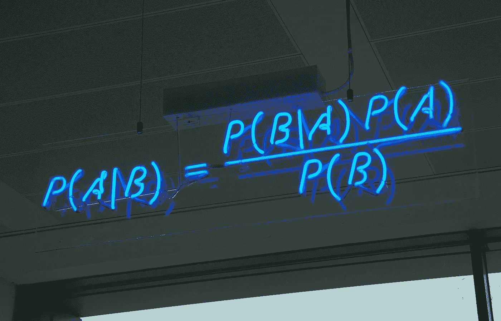

# 什么是贝叶斯法则？

> 原文：<https://towardsdatascience.com/what-is-bayes-rule-bb6598d8a2fd?source=collection_archive---------0----------------------->

贝叶斯法则为我们提供了一种基于新的相关的**证据**来更新我们的**信念**的方法。例如，如果我们试图提供一个给定的人患癌症的概率，我们最初只会说无论人口中有多少百分比的人患癌症。然而，给定额外的证据，例如这个人是吸烟者，我们可以更新我们的概率，因为如果这个人是吸烟者，患癌症的概率更高。这允许我们利用先验知识来改进我们的概率估计。

## 规则

下面的等式是贝叶斯法则:

该规则有一个非常简单的推导，直接来自联合概率和条件概率之间的关系。首先注意 P(A，B) = P(A|B)P(B) = P(B，A) = P(B|A)P(A)。接下来，我们可以将涉及条件概率的两项设置为彼此相等，因此 P(A|B)P(B) = P(B|A)P(A)，最后，将两边除以 P(B)得出贝叶斯法则。

在这个公式中， **A** 是我们想要概率的事件， **B** 是在某种程度上与 A 相关的新证据。

**P(A|B)** 称为**后部**；这就是我们试图估计的。在上面的例子中，这将是“假定一个人是吸烟者，患癌症的概率”。

**P(B|A)** 称为**似然**；这是根据我们最初的假设，观察到新证据的概率。在上面的例子中，这将是“假定某人患有癌症，成为吸烟者的概率”。

**P(A)** 被称为**之前的**；这是我们假设的概率，没有任何额外的先验信息。在上面的例子中，这将是“患癌症的概率”。

**P(B)** 称为**边际可能性**；这是观察到证据的总概率。在上面的例子中，这将是“成为吸烟者的概率”。在贝叶斯规则的许多应用中，这被忽略，因为它主要用作归一化。

## 例子

使用癌症诊断的例子，我们可以表明贝叶斯规则允许我们获得更好的估计。现在，我们将把一些虚构的数字放入示例中，这样我们就可以评估贝叶斯规则带来的差异。假设得癌症的概率是**0.05**——意味着 5%的人得了癌症。现在，假设成为吸烟者的概率是 0.10——意味着 10%的人是吸烟者，20%的癌症患者是吸烟者，那么 P(吸烟者|癌症)= 0.20。最初，我们患癌症的概率只是我们的先验，所以 0.05。然而，使用新的证据，我们可以改为计算 P(癌症|吸烟)，它等于(P(吸烟者|癌症)* P(癌症))/ P(吸烟者)=(0.20 * 0.05)/(0.10)=**0.10**。

通过引入新的证据，我们因此获得了更好的概率估计。最初我们有 0.05 的概率，但是使用吸烟者的证据，我们能够得到更准确的概率，是我们先前的两倍。在给出的例子中(即使有我们编造的数字)，这种影响应该是很符合逻辑的，因为我们知道吸烟会导致癌症。因此，这证明了贝叶斯规则如何允许我们使用相关信息来更新我们的信念。