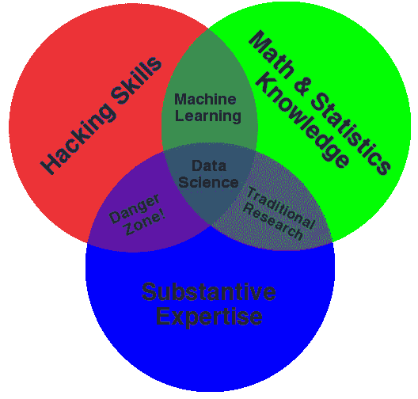

# 什么是数据科学，什么不是？

> 原文：<https://towardsdatascience.com/what-is-data-science-and-what-is-it-not-c6a09d735f02?source=collection_archive---------6----------------------->

**数据科学**，也被称为**数据**驱动的**科学**，是一个关于**科学**方法、过程和系统的交叉学科领域，以结构化或非结构化的各种形式从**数据**中提取知识或见解，类似于**数据**挖掘。

现在，我们准备讨论什么是数据科学。它包含了一些编程技巧、一些统计准备、一些可视化技术，最后但同样重要的是，许多商业意识。我特别关心的商业意识是一种能力和意愿，有时是渴望，将任何商业问题转化为可以利用当前或即将到来的可用数据来回答的问题。事实上，这需要一种特殊的方式来连接充满数据的随机世界中的所有点，其中大多数数据可能不会立即对成为一名工作数据科学家有用。

根据我目前的理解，数据科学家是连接商业世界和数据世界的人。同样，数据科学是数据科学家用来实现这一目标的手艺。

**什么是**

1.  这有点用词不当，是媒体用来描述一切的时髦词。然而，通过这次讨论达成一致是很好的。
2.  这些问题是关于数据科学的。所以我不会谈论数据科学家。转到[什么是数据科学家？](https://www.quora.com/What-is-a-data-scientist-3)感兴趣的话。
3.  我在大多数答案中发现的最大错误是某种“数据科学就是当你处理大数据、大量数据时”。那不是真的，数据科学可以应用到一个有一千行的数据集，这个没有问题。
4.  如果我们要称之为“科学”,我们需要考虑科学和科学方法的定义。据此，数据科学不仅仅是实用的或经验的方法，它需要科学的基础。
5.  没有人谈到数据和信息的区别。
6.  **数据**是一组原始的、无组织的东西，需要处理后才有意义。
7.  **信息**是指数据在给定的环境中被处理、组织、结构化或呈现以使其变得有用
8.  基于此，我们将有数据科学和信息科学。现在，人们有一种偏见，谈论数据科学，包括信息科学。
9.  很明显，在过去的几年里，它被应用于许多领域:
10.  统计/数学
11.  商业分析
12.  市场情报
13.  战略咨询
14.  许多其他人…
15.  最疯狂的是，你会看到这些领域的专业人士更新他们的简历，比如“我从事数据科学工作…”
16.  以简单的方式创造数据科学。两个并不完全相关的方面，但随着新的快节奏和技术世界的到来，将不得不融合在一起:
17.  **统计/数学:**公式化合适的模型，产生洞察。
18.  **计算机科学**:在模型和数据之间架起一座桥梁，在可行的时间内得出结果。
19.  从事数据科学工作时需要了解或掌握一些知识的主题/工具:
20.  线性代数
21.  非线性系统
22.  解析几何
23.  最佳化
24.  结石
25.  统计数字
26.  编程语言(R、Python、SAS)
27.  软件:IBM 的 Excel，SPSS
28.  通用平台:IBM 的 Watson Anlytics，Azure 机器学习，Google Cloud 机器学习，
29.  数据可视化:使用 plotly/ggplot 的 Power BI、Tableau、R/Python
30.  机器学习(监督、非监督和强化学习)
31.  大数据
32.  大数据框架(Hadoop 和 Spark)
33.  硬件(CPU、GPU、TPU、FPGA、ASIC)
34.  一图抵一万字。[绘制了康威的数据科学维恩图](http://drewconway.com/zia/2013/3/26/the-data-science-venn-diagram)。实质性专业知识(或领域专业知识)是您正在应用数据科学的领域的具体知识。要了解更多关于数据科学缺乏实质性专业知识的信息:[数据科学讲座中缺少什么——风险越来越大](http://www.ohadsamet.com/2012/08/26/whats-missing-in-data-science-talks/)

**什么不是**

1.  机器学习不是数据科学的一个分支。机器学习起源于人工智能。数据科学只是把 ML 作为一个工具。原因是它为特定的任务产生惊人的和自主的结果
2.  这并不能拯救那些从来没有衡量过任何东西，现在想要从他们的数据中获得洞察力的公司。“垃圾进，垃圾出”的数据科学将和未来几年产生的数据一样好。
3.  只是使用一些 Excel 图表呈现数据，而没有任何关于数据的见解。