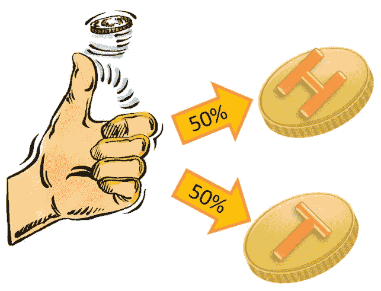

# 什么是期望值？

> 原文：<https://towardsdatascience.com/what-is-expected-value-4815bdbd84de?source=collection_archive---------3----------------------->

## 用简单的游戏例子直观地解释期望值


期望值是大量实验中随机变量的平均值。随机变量将数值映射到实验中每个可能的结果。我们可以通过求和来计算离散随机变量的期望值，在离散随机变量中，潜在结果的数量是可数的，求和的每一项都是随机变量的可能值乘以结果的概率。因此，例如，如果我们的随机变量是通过滚动一个公平的三面骰子获得的数字，期望值将是(1 * 1/3) + (2 * 1/3) + (3 * 1/3) = 2。

如果我们假设实验是一个游戏，随机变量将游戏结果映射到获胜金额，因此它的期望值代表了游戏的预期平均获胜额。因为期望值跨越了实数，所以它通常被分成负值、中性值和正值。具有每种期望值的游戏在现实生活中经常出现，因此期望值提供了一个简单的决策启发。

为了举例说明每种类型的游戏，我将使用 3 个类似的涉及抛硬币的例子，明确地说，每个场景中的随机变量是抛一次硬币的预期赢款。假设在每种情况下，硬币都是公平的，那么正面和反面的概率都是 1/2。



## 中性期望值博弈

```
You flip the fair coin. Every time you get heads, you lose $1, and every time you get tails, you gain $1.
```

这种情况下的期望值是(-1 * 1/2) + (1 * 1/2) = 0。因此，因为硬币是公平的，损失金额等于收益金额，所以随着时间的推移，你既不会获利也不会亏钱。在这样的游戏中，虽然没有理由玩，但也没有理由不玩。因此，这些类型的游戏非常适合简单的娱乐，例如石头剪子布，在这种游戏中，随机选择一步棋是最佳策略，预期收益为 0。

## 正期望值博弈

```
You flip the fair coin. Every time you get heads, you lose $1, and every time you get tails, you gain $2.
```

这种情况下的期望值是(-1 * 1/2) + (2 * 1/2) = 1/2。因为正面和反面的可能性相等，所以反面的收益大于正面的损失。在这样的游戏中，你会随着时间的推移而获得金钱，所以你应该玩这种类型的游戏。这种类型的场景出现在许多现实生活的决策中，例如投资股票市场(随着时间的推移，市场处于总体上升趋势)，学习考试(几个小时的损失时间被更高的 GPA 所抵消)，或准备面试(几周的损失时间被更好的工作所带来的好处所抵消)。

## 负期望值博弈

```
You flip the fair coin. Every time you get heads, you lose $1, and every time you get tails, you gain $1\. Additionally, there is a $0.01 fee for every flip regardless of the outcome.
```

这种情况下的期望值是(-1.01 * 1/2) + (.99 * 1/2) = -0.01。因此，尽管硬币本身是公平的，损失金额等于收益金额，恒定费用导致游戏是一个负价值的游戏。在这样的游戏中，随着时间的推移，你预计会输钱，所以你不应该玩这种类型的游戏。这在许多赌博平台中很常见，在这些平台中，赌场提供最初中立的游戏，但随后收取费用，从而破坏了游戏的中立性(因此有“赌场总是赢家”的说法)。

## 结论

从期望值的角度考虑决策是决定是否有经济原因参与一项活动的简单方法。当然，除了纯粹的经济回报，还有其他方法来衡量效用，因此预期收益并不是一个万无一失的决策工具。此外，请记住，期望值是在大量重复试验的基础上得出的，因此这可能会对某些可能性非常少的事件提供扭曲的观点。比如考虑中彩票。这很可能是一个积极的预期价值机会，但你在有限的生命中真正实现这一价值的机会是如此之低，以至于不值得购买彩票。