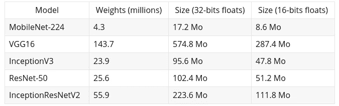
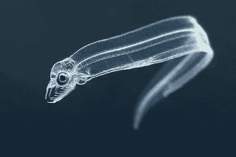
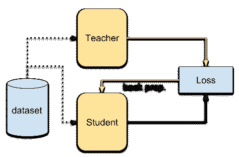

# 什么是知识蒸馏？

> 原文：<https://towardsdatascience.com/what-is-knowledge-distillation-41bb77a3c6d8?source=collection_archive---------15----------------------->

## 知识提炼是一个迷人的概念，我们将简要介绍为什么我们需要它，它是如何工作的。

# 体重很重要

今天的模型可能相当大，以下是 ImageNet 数据集的一些顶级模型:



*The models were instantiated via* `*keras.applications*` *module with top layers, the number of parameters are given by* `*summary()*`*.*

似乎公平地说，简单的计算机视觉模型重量很容易~100Mo。仅仅用一百个 Mo *就能做出一个推论，对于最终产品来说并不是一个可行的解决方案。远程 API 可以做到这一点，但现在你的产品需要添加加密，你需要存储和上传数据，用户需要有一个可靠的互联网连接，以有一个像样的速度。我们可以训练一个更窄的网络，它们可能适合一个小内存。但它们很可能无法很好地提取复杂的特征。*

我们不是在谈论合奏。集成是从训练数据中提取大量知识的好方法。但是在测试时，并行运行 100 个不同的模型代价太高。每个参数的知识比率相当低。

最后，一个模型可以在训练时得到很高的分数，但是我们可能想要:降低它的大小(对于嵌入式系统)，提高推理速度或者简单地降低复杂性。杰弗里·辛顿谈到减少它的“记忆足迹”:



> *许多昆虫的幼虫形态最适合从环境中吸取能量和营养，而完全不同的成虫形态最适合完全不同的旅行和繁殖需求。在大规模机器学习中，我们通常在训练阶段和部署阶段使用非常相似的模型，尽管它们的需求非常不同(……)(*[*)在神经网络中提取知识*](https://arxiv.org/pdf/1503.02531.pdf) *)*

从一个较大的模型训练一个较小的模型被称为知识提炼。

# 蒸馏

作者继续说，我们用权重值来识别知识，这使得“很难看出我们如何改变模型的形式，但保持相同的知识”。并且提醒我们，我们可以把知识看作是从输入到输出的映射。

知识提炼的目标是将知识从一个表现突出的老师那里转移到一个更紧凑的学生那里。



为此，我们查看教师的 softmax 图层，将其放大，然后学生学习如何制作它们。我们需要放大，因为 softmax 层会将最不可能的类粉碎为零，并上升到最可能的类附近(就像一个热矢量)。我们还可以保持类之间的相对概率，其中摩托车和自行车在 softmax 层上比在书上有更多的相似性。我们可以通过提高温度 t 来实现。

为了传递知识，学生被训练由一个更大的老师产生的软化概率(T>>1)。当温度 T 小于 1 时，最期望的类对最终概率的影响最大。类似地，当温度升高时，概率会变得更软/更平——你可以让[在这里](https://www.desmos.com/calculator/gdcy4dvaje)直观地感受到温度对单个`exp()`的影响。

首先，老师的体温升高到某一点。然后学生被训练模仿老师的软概率。

# 利益

对软目标的训练有几个优点:可以从单个样本中提取更多的信息，可以在更少的样本上进行训练，不需要标记数据

多类分类器的 softmax 将为您提供相似图像的更高概率。玫瑰可能与郁金香而不是拉布拉多有相似的软概率。同样，两个不同的类出现在同一个图像中，我们可能会在输出中看到它。所以**从每个训练样本中提取更多的信息**。

这是第一点的结果，模型可以用比老师更少的训练样本来训练。学习也更快，因为对学生有更多的约束。它需要针对多个(软)输出，而不是一个(硬)输出。

由于学生仅从软目标学习，通过类之间的相对相似性，它可以在**未标记的数据集**上训练，仅使用主设备具有运行中的“软标记器”。但实际上，数据集可以和老师一样。

# 失败

蒸馏损失一般有两种形式:匹配函数值、匹配导数或两者都有，对应一个不同阶的回归问题:

*   匹配函数值:试图最小化老师和学生的预测之间的差异。对于分类任务，这是通过使用经典的交叉熵来完成的。
*   匹配导数:尝试匹配导数的值*和*。这是一种比以前更有效的方法，因为在这里我们可以完全接触到老师，并且我们能够测量其输入中的小变化的影响。

我们也可以尝试通过直接增加硬损失来增加预测的影响:

```
alpha ~= 0.1 
KD_loss = alpha * log_loss(y_true, softmax(logits)) + logloss(y_true, softmax(logits/temperature))
```

你可以在这里看到一个很酷的[实现](https://github.com/Ujjwal-9/Knowledge-Distillation/blob/master/knowledge_distillation_for_mobilenet.ipynb)。

# 资源

*   [TTIC·杰佛瑞·希尔顿——黑暗知识](https://www.youtube.com/watch?v=EK61htlw8hY?t=650)——第一篇[知识蒸馏论文的作者所做的报告](https://arxiv.org/pdf/1503.02531v1.pdf)。
*   [IEE 安全研讨会，Papernot](https://www.youtube.com/watch?v=oQr0gODUiZo) :注意，蒸馏作为对抗例子的对策已经被证明不再有效。

*最初发表于*[data-soup.github.io/blog/](https://data-soup.github.io/blog/)。