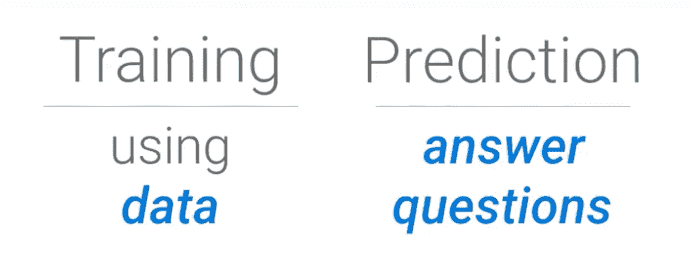
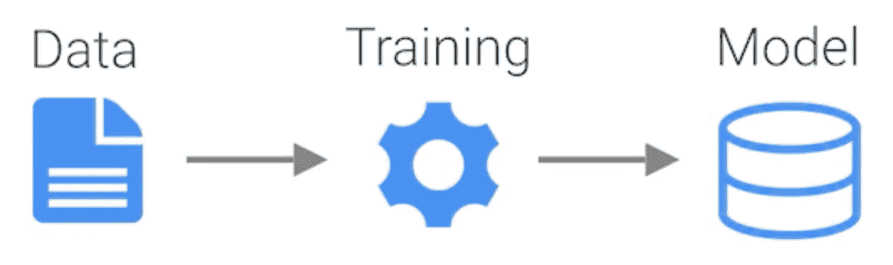

# 什么是机器学习？

> 原文：<https://towardsdatascience.com/what-is-machine-learning-8c6871016736?source=collection_archive---------2----------------------->

这个世界充满了数据。很多很多数据。从图片、音乐、文字、电子表格、视频等等。看起来短期内不会减缓。机器学习带来了从所有这些数据中获取意义的希望。

在这个系列中，我想带你在人工智能的世界中进行一次冒险，探索艺术、科学和机器学习工具。在这个过程中，我们将看到创造惊人的经历和产生有价值的见解是多么容易。我们将从高级概念开始，然后深入技术细节。

The data frontier stretches far into the distance

亚瑟·C·克拉克曾经说过:

> "任何足够先进的技术都和魔法没什么区别。"

乍一看，ML 似乎很神奇，但是一旦你深入了解，你会发现它是一套从数据中获取意义的工具。

# 我们周围的数据

传统上，人类分析数据并使系统适应数据模式的变化。然而，随着数据量超过人类理解数据和手动编写规则的能力，我们将越来越多地转向能够从数据中学习的自动化系统，更重要的是，数据中的*变化*，以适应不断变化的数据格局。

# 机器学习已经无处不在

在我们今天使用的产品中，我们看到机器学习在我们周围，但对我们来说，机器学习并不总是显而易见的。虽然标记图片中的对象和人物显然是机器学习，但你可能没有意识到，像视频推荐系统这样的功能通常也是由机器学习驱动的。

当然，也许最大的例子是谷歌搜索。每次你使用谷歌搜索，你都在使用一个以许多机器学习系统为核心的系统，从理解你的查询文本到根据你的个人兴趣调整结果。当你搜索“Java”时，机器学习决定先显示哪些结果，这取决于它认为你是咖啡专家还是开发者。也许你们两个都是！

今天，机器学习的直接应用已经相当广泛，包括[图像识别](https://cloud.google.com/vision/)、[欺诈检测](https://cloud.google.com/blog/big-data/2017/08/how-wepay-uses-stream-analytics-for-real-time-fraud-detection-using-gcp-and-apache-kafka)、[推荐引擎](https://cloud.google.com/solutions/recommendations-using-machine-learning-on-compute-engine)，以及[文本](https://cloud.google.com/natural-language/)和[语音](https://deepmind.com/blog/wavenet-generative-model-raw-audio/)系统。这些强大的功能可以应用于广泛的领域，从[糖尿病视网膜病变](https://blog.google/topics/machine-learning/detecting-diabetic-eye-disease-machine-learning/)和[皮肤癌检测](http://cs.stanford.edu/people/esteva/nature/)到零售，当然还有运输，形式为自动停车和[自动驾驶车辆](https://waymo.com/)。

# 预期的特征

Don’t get left behind

不久前，当一家公司或产品在其产品中包含机器学习时，它被认为是新颖的。现在，每家公司都在寻求在他们的产品中使用机器学习。它正迅速成为一个预期的功能。正如我们期望公司有一个在我们的移动设备或应用程序上工作的网站一样，我们的技术将被个性化、有洞察力和自我纠正的那一天很快就会到来。

当我们使用 ML 使现有的人工任务比以前更好、更快或更容易时，我们也可以展望未来，那时 ML 可以帮助我们完成我们自己永远无法完成的任务。

谢天谢地，利用机器学习并不难。工具已经变得相当好；你需要的只是数据、开发者和冒险的意愿。

# 用数据回答问题

出于我们的目的，我们可以将机器学习的定义缩短为五个词:

> **《用数据回答问题》**

当然，这是一种过于简单化的做法，但是它仍然可以达到一个有用的目的。

具体来说，我们可以将定义分为两部分:“使用数据”和“回答问题”。这两部分概括了机器学习的两个方面，两者同等重要。

“使用数据”通常被称为“训练”，而“回答问题”被称为“做出预测”，或“推断”。

将这两部分联系在一起的是模型。我们训练模型，使用我们的数据集做出越来越好、越来越有用的预测。然后，可以部署这种预测模型来提供对以前看不到的数据的预测。

# 数据是关键

您可能已经注意到，这个过程的关键部分是数据。数据是开启机器学习的钥匙，就像机器学习是开启隐藏在数据中的洞察力的钥匙一样。

# 下一步是什么？

这只是对机器学习的高度概述，为什么它有用，以及它的一些应用。机器学习是一个广阔的领域，跨越了从数据中推断答案的整个技术家族。在未来，我们的目标是让您更好地了解对于给定的数据集和您想要回答的问题应该使用什么方法，以及提供如何完成它的工具。

这是云人工智能冒险系列文章的第一篇。下一次，我们将更详细地研究 ML 的具体过程，通过一步一步的公式来解决机器学习问题。