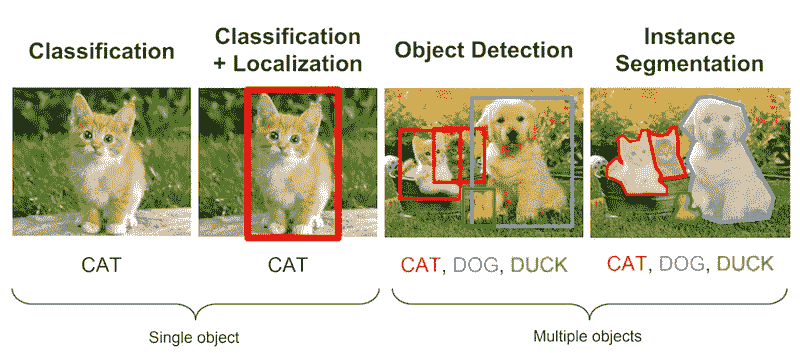
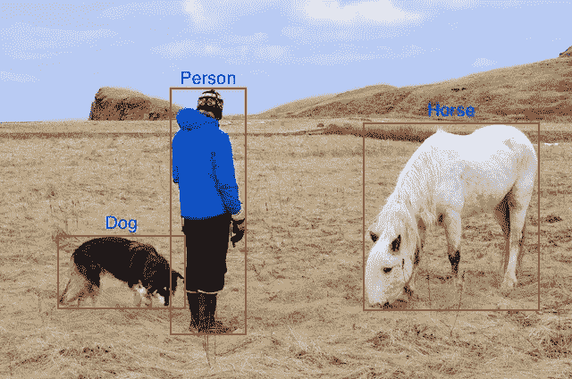
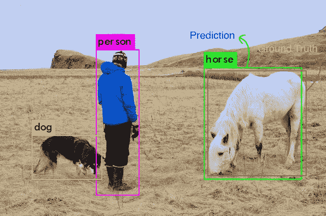
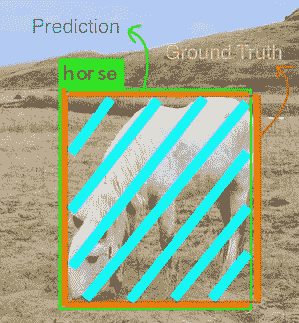
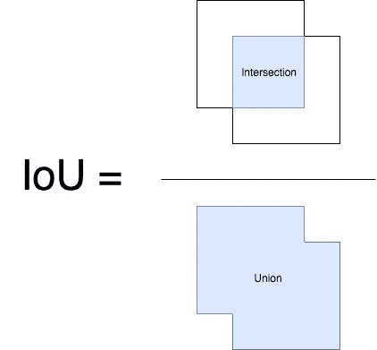

# 测量对象检测模型-地图-什么是平均精度？

> 原文：<https://towardsdatascience.com/what-is-map-understanding-the-statistic-of-choice-for-comparing-object-detection-models-1ea4f67a9dbd?source=collection_archive---------0----------------------->


对于使用机器学习解决的大多数常见问题，通常有多个模型可用。每个人都有自己的怪癖，并会根据各种因素表现不同。

每个模型都根据其在数据集**上的表现来判断，通常称为“验证/测试”数据集**。这种性能是用各种统计数据来衡量的——准确度、精确度、召回率等。选择的统计数据通常特定于您的特定应用程序和用例。对于每个应用程序来说，找到一个可以用来客观比较模型的指标是至关重要的。

在本文中，我们将讨论用于对象检测问题的最常见的度量标准— *平均精度*也就是*图。*

大多数时候，这些指标很容易理解和计算。例如，在二进制分类中，**精度和召回率**是一种简单直观的统计。

另一方面，物体检测是一个相当不同的…有趣的问题。

*即使你的物体检测器在一幅图像中检测到一只猫，如果你在它所在的图像中找不到***的位置，也没有用。**

*由于您预测的是图像中物体的**出现** *和* **位置**，因此我们如何计算这一指标相当有趣。*

*首先，让我们定义对象检测问题，以便我们在同一页上。*

# *目标检测问题*

*这就是我所说的“目标检测问题”,*

> **给定一幅图像，找到其中的物体，定位它们的位置，并进行分类。**

*对象检测模型通常在一组固定的类上训练，因此该模型将仅定位和分类图像中的那些类。*

*此外，对象的位置通常是边界矩形的形式。*

*因此，对象检测涉及图像中对象的**定位**和该对象的**分类**。*

**

**Image 1 — Few prominent Image Processing problems [Image taken from Stanford’s CS231n Course slides(lecture 8)]**

*如下所述，平均精度特别用于预测对象位置和类别的算法。因此，从*图像 1，*我们可以看到，它对于评估定位模型、对象检测模型和分割模型是有用的。*

# *评估对象检测模型*

## ***为什么要地图？***

*对象检测问题中的每个图像可能具有不同类别的不同对象。如前所述，模型的分类和定位都需要评估。因此，在图像分类问题中使用的标准精度度量不能直接应用于此。这就是 mAP(平均精度)发挥作用的地方。我希望在这篇文章结束时，你能够理解它的含义和代表。*

## ***关于地面真相***

*对于任何算法，总是在与真实数据的比较中评估指标。我们只知道训练、验证和测试数据集的基本事实信息。*

*对于对象检测问题，地面真实包括**图像、**图像中对象的**类以及该图像中每个对象 **** 的**真实边界框**。***

***一个例子:***

**

**Human visualisation of the ground truth**

**我们被给予实际的图像(jpg、png 等)和作为文本的其他注释(边界框坐标(x、y、宽度和高度)和类)，红色框和文本标签仅被绘制在该图像上以供我们人类可视化。**

*对于这个特殊的例子，我们的模型在训练中得到的是这个*

**

**The actual image**

*以及定义地面实况的 3 组数字(假设该图像是 1000x800px，所有这些坐标都是像素，*也近似为*)*

**

*现在，让我们把手弄脏，看看地图是如何计算的。*

*我将在另一篇文章中讨论各种对象检测算法、它们的方法和性能。现在，让我们假设我们有一个经过训练的模型，我们正在验证集上评估它的结果。*

# *计算地图*

*让我们说，原始图像和地面真相注释是我们在上面看到的。训练和验证数据以相同的方式对所有图像进行注释。*

*该模型将返回大量预测，但在这些预测中，大多数预测都具有非常低的关联置信度得分，因此我们只考虑高于某个报告置信度得分的预测。*

*我们通过我们的模型运行原始图像，并且这是在置信度阈值化之后对象检测算法返回的，*

*带边框的图像-*

**

**Results from our model**

*现在，由于我们人类是物体检测专家，我们可以说这些检测是正确的。但是我们如何对此进行量化呢？*

**我们首先需要知道这些检测中每一个的正确性有多大*。告诉我们一个给定的边界框的正确性的度量是联合上的— **IoU** — **交集**。这是一个非常简单的视觉量。*

*就单词而言，有些人会说这个名字是不言自明的，但是我们需要一个更好的解释。我简单解释一下欠条，*对于真正想要详细解释的人，* [*阿德里安·罗斯布鲁克*](http://pyimagesearch.com) *有一篇* [*真正的好文章*](https://www.pyimagesearch.com/2016/11/07/intersection-over-union-iou-for-object-detection/) *可以参考一下。**

# *借据*

***交集/并集是预测框和基础事实框的交集和并集之间的比率。**这种统计也被称为 Jaccard 指数，由 Paul Jaccard 在 20 世纪初首次发布。*

*为了获得交集和并集值，我们首先将预测框覆盖在基础真值框上。(见图片)*

*现在，对于每个类，与预测框和地面真实框重叠的区域是*交集*区域，并且跨越的总区域是*联合*。*

**

**We’ll show this example only for the horse**

*上面的 horse 类的交集和并集如下所示，*

**

**In this case the intersection is pretty large**

*交集包括重叠区域(青色区域)，并集包括橙色和青色区域。*

*欠条的计算方法如下*

**

**This Image is inspired by the pyimagesearch article, which was inspired by University of Pittsburg’s CS1699 HW assignment4**

# *识别正确的检测并计算精度*

*对于[计算精度和召回](https://medium.com/@starang/precision-and-recall-a-brief-intro-38589a21a09)，就像所有机器学习问题一样，我们必须识别真阳性、假阳性、真阴性和假阴性。*

*为了得到真阳性和假阳性，我们使用 IoU。使用 IoU，我们现在必须确定检测(阳性)是正确的(真)还是错误的(假)。最常用的阈值是 0.5，即如果 IoU > 0.5，则认为是**真阳性**，否则认为是**假阳性**。COCO 评估指标建议测量各种 IoU 阈值，但为简单起见，我们将坚持 0.5，这是帕斯卡 VOC 指标。*

*为了计算召回率，我们需要否定的计数。由于图像中我们没有预测到物体的每一部分都被认为是负面的，所以测量“真正的”负面效果有点没用。所以我们只测量“假”否定。我们的模型遗漏的对象。*

*此外，另一个要考虑的因素是模型为每次检测报告的*置信度*。通过改变我们的信心阈值，我们可以改变一个预测框是积极的还是消极的。基本上，高于阈值的所有预测(盒+类)被认为是正盒，低于阈值的所有预测是负盒。*

*现在，对于每个图像，我们都有基础数据，它告诉我们该图像中给定类别的实际对象的数量。*

*现在，我们使用模型报告的每个阳性检测框的地面真实值来计算 IoU。使用这个值和我们的 IoU 阈值(比如 0.5)，我们计算图像中每个类别的正确检测的**数量( *A* )** 。这用于计算每个类的精度[TP/(TP+FP)]*

> *精度= TP / (TP+FP)*

*由于我们已经计算了正确预测的**数量( *A* )** (真阳性)和**漏检**(假阴性)，因此我们现在可以使用此公式计算该类模型的**召回( *A* / *B* )** )。*

> *召回= TP / (TP+FN)*

# *计算平均精度*

*平均精度是一个有不同定义的术语。这种度量通常用于信息检索和对象检测领域。这两个域有不同的计算 mAP 的方法。我们将讨论对象检测相关的地图。*

*当前流行的 mAP 的对象检测定义在 2007 年的 PASCAL 视觉对象类(VOC)挑战中首次正式化，该挑战包括各种图像处理任务。关于确切的文件，请参考[和](http://homepages.inf.ed.ac.uk/ckiw/postscript/ijcv_voc09.pdf)。*

*我们使用与上一节提到的相同的方法来计算精度和召回率。*

*但是，如前所述，我们至少有 2 个其他变量决定精确度和召回率的值，它们是 *IOU* 和*置信度*阈值。*

*IOU 是一个简单的几何指标，很容易标准化，例如 PASCAL VOC challange 基于固定的 50% IOU 来评估 mAP。(MSCOCO 挑战赛更进一步，在 5%到 95%的不同阈值范围内评估 mAP。另一方面，置信度因模型而异，对我的模型设计 50%的置信度可能相当于对其他人的模型设计 80%的置信度，这将改变精确回忆曲线的形状。因此，PASCAL VOC 组织者想出了一种方法来解释这种差异。*

*我们现在需要一个度量来以模型不可知的方式评估模型。*

*这篇论文建议我们计算一个叫做 AP ie 的度量。平均精度*

```
*For a given task and class, the precision/recall curve is
computed from a method’s ranked output. Recall is defined
as the proportion of all positive examples ranked above a
given rank. Precision is the proportion of all examples above
that rank which are from the positive class. The AP summarises
the shape of the precision/recall curve, and is de-
fined as the mean precision at a set of eleven equally spaced
recall levels [0,0.1,...,1]:*
```

*这意味着我们选择了 11 个不同的置信度阈值(决定了“等级”)。阈值应该是这样的，在那些置信度值下的**回忆**是 0、0.1、0.2、0.3、…、0.9 和 1.0。AP 现在被定义为在这些选定的 11 个召回值处的**精度**值的平均值。这导致该图是整个精确召回曲线的总体视图。*

*本文还对上述计算中所用的精度进行了详细的计算。*

```
*The precision at each recall level r is interpolated by taking
the maximum precision measured for a method for which
the corresponding recall exceeds r.*
```

*基本上，我们使用给定召回值的最大精度。*

*因此，该图是上面测量的所有类的所有平均精度值的平均值。*

*这实质上是如何为对象检测评估计算平均精度的。有时可能会有一些变化，例如 COCO 评估更加严格，使用各种借据和对象大小强制执行各种指标([更多细节请点击](http://cocodataset.org/#detection-eval))。如果你们中的任何一个人想让我说得更详细，请在评论中告诉我。*

***因此，总结一下，平均精度，从字面上看，是数据集中所有类的平均精度(AP)的平均值。***

**比较地图值时需要记住的一些要点**

1.  *MAP 总是在固定的数据集上进行计算。*
2.  *尽管解释模型输出的绝对量化并不容易，但 MAP 通过提供一个非常好的相对度量来帮助我们。当我们在流行的公共数据集上计算该度量时，该度量可以很容易地用于比较新旧对象检测方法。*
3.  *根据类在训练数据中的分布情况，平均精度值可能会从某些类的非常高(具有良好的训练数据)到非常低(具有较少/较差数据的类)不等。所以你的地图可能是中等的，但是你的模型可能对某些职业真的很好，对某些职业真的很差。因此，在分析模型结果时，查看单个类的平均精度是明智的。这些值也可以作为添加更多训练样本的指标。*

**原载于 2018 年 1 月 27 日 tarangshah.com*[](http://tarangshah.com/blog/2018-01-27/what-is-map-understanding-the-statistic-of-choice-for-comparing-object-detection-models/)**。2018 年 5 月 27 日更新***