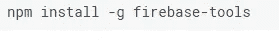
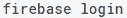
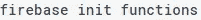

# 什么是“无服务器计算”？

> 原文：<https://towardsdatascience.com/what-is-serverless-computing-a07f4a96759b?source=collection_archive---------5----------------------->

当我第一次听到“**无服务器计算**”这个词时，我惊慌失措地想，这怎么可能。服务器是一种特殊的计算机，用于处理请求并通过网络传送数据。例如，“网络服务器”被用来访问互联网上的网页。当 web 浏览器向 web 服务器发送请求时，它会处理该请求并传送所请求的网页。有许多其他类型的服务器可用于不同种类的服务，

*   Web 服务器
*   电子邮件服务器
*   FTP 服务器

实际上，“**无服务器计算**这个词是用词不当。即使它说无服务器计算，**仍然需要一个服务器**。不同之处在于，我们不需要自己维护物理服务器。服务器在云中维护，我们只需要向云提供所需的指令，以确保服务器按照我们想要的方式运行。通常，这些指令是使用函数发送到云的。

亚马逊在 2014 年推出的“AWS Lambda ”是第一个提供无服务器计算的公共云。最初，它只支持 Node.js。然而，目前它支持其他流行的编程语言，包括 Java 和 Python。

最近， **Google Firebase** 也在[云功能](https://firebase.google.com/docs/functions/)下提供无服务器设施。开发人员可以将他们在函数中的后端代码上传到云，云会根据事件触发器和 HTTP 请求自动执行相应的逻辑。

如果你读到这里，你会认为这是另一种类型的云计算。实际上，无服务器计算是基于 FaaS，即功能即服务。由于云的参与，使用这种架构有很多优势。

*   简化部署流程
*   不需要复杂的基础架构和管理
*   支持微服务架构
*   动态资源分配
*   成本效益(使用收费)
*   可量测性

现在让我们使用 Google Firebase 获得一些关于无服务器计算的实践经验，它可以免费用于学习:)

我们将创建 2 个函数并上传到 firebase。第一个函数触发一个 HTTP 请求，将一个给定的输入保存到数据库中。另一个功能基于 firebase 事件触发器。它将在每次对数据库进行保存调用时自动执行，将输入转换为大写。你可以从[这里](https://firebase.google.com/docs/functions/get-started)阅读更多谷歌文档。

> ***注意:你需要安装 Node.js 才能遵循这个。如果不是从** [**这里**](https://nodejs.org/en/) **下载安装。**

1.  **首先，使用以下命令安装 Firebase CLI。**

**2。认证&初始化**

然后运行以下命令来验证和初始化项目。你需要有一个谷歌帐户进行认证。

执行该命令时，浏览器将弹出，您将被重定向到登录页面。输入凭证，完成所有工作后，转到 firebase 中的控制台，创建一个新项目。启动项目时，本地项目将与此同步。

这里“功能”代表项目名称。当执行这个命令时，您将被要求选择一个默认项目，并且您将得到在 Firebase 中创建的项目。选择适当的项目，并通过安装所有必需的依赖项来继续初始化过程。

**3。导入模块**

设置完成后，导航到项目文件夹，您将看到已经创建了一个 **index.js** 文件。这个文件用于编写需要上传到 Firebase 的函数。

首先，我们需要导入云函数来创建函数和设置触发器。然后 Admin SDK 需要访问 Firebase 实时数据库来保存我们的输入。

**4。添加我们的第一个函数**

现在我们可以开始实现我们的功能了。首先，让我们编写函数，将给定的输入保存在数据库中。

如果你熟悉 Node.js，这里没有太大的区别。基本上，我们从请求中获取输入，并通过/message 路径中的管理模块将其保存在数据库中。我们保存的每个文本都将存储在实时数据库的消息下。当我们执行该功能时，您可以从 Firebase dashboard 中看到这一点。

**5。添加第二个功能**

同样，我们可以添加第二个函数。

由于这是一个事件触发函数，我们可以从事件中获取原始值。然后我们把它转换成大写，保存在“大写”下。当我们在 Firebase 仪表板中执行和查看结果时，这对您来说是有意义的。

6。部署功能

现在我们已经实现了我们的功能，是时候将它们部署到云中了。运行以下命令来部署我们的函数。

您将看到它将逐步部署我们所有的功能，并将给出一个 URL 来触发我们的 HTTP 触发功能。你可以用它来传递一个文本作为一个普通的 URL 参数(xyz.com/saveInput?输入=测试)。完成后，使用 web 浏览器中的 Firebase 仪表板检查实时数据库。您将能够看到一个创建为“消息”的部分，并且您传递的文本作为“原始”保存在那里。此外，它包含大写文本作为“大写”。现在回到代码片段，现在一切对你来说都有意义了。

希望你从这篇文章中得到一个基本的想法。这是一个非常基本的示例，可以为使用谷歌云功能提供一些指导。这个例子摘自官方文档，如果您有任何疑问，请遵循它。

干杯！