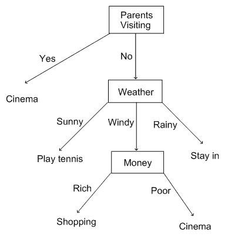
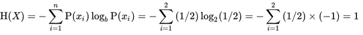
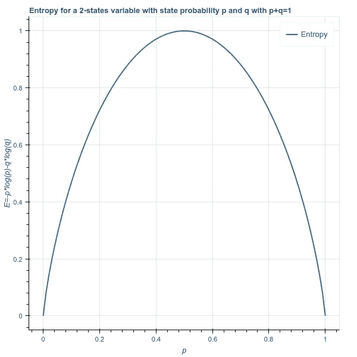

# 什么是 C4.5 算法，它是如何工作的？

> 原文：<https://towardsdatascience.com/what-is-the-c4-5-algorithm-and-how-does-it-work-2b971a9e7db0?source=collection_archive---------0----------------------->

C4.5 算法在数据挖掘中用作决策树分类器，可用于基于特定数据样本(单变量或多变量预测器)生成决策。

所以，在我们直接进入 C4.5 之前，让我们讨论一下**决策树**以及它们如何被用作分类器。

# 决策树

Example of a Decision Tree

决策树看起来有点像这个流程图。假设你想计划今天的活动，但是你被告知一些会影响你决定的情况。

在上图中，我们注意到影响决策的一个主要因素是**父母拜访**。所以，如果这是真的，那么很快就会做出决定，我们选择去**电影院**。如果他们不来访呢？

这带来了一系列其他情况。现在，如果**天气**是**晴天**或**雨天**，我们要么分别去**打网球**或**待在**。但是，如果是刮风的天气，我会检查自己有多少钱。如果我有足够的钱可以花，也就是说，**有钱，我会去购物，否则我会去电影院。**

记住，树的根总是对一个价值函数有最小值的变量。在这个例子中，父母来访的概率各为 50%,如果你仔细想想，会更容易做出决定。但是如果**天气**被选为根呢？那么我们将有 33.33%的几率发生这种情况，这可能会增加我们做出错误决策的几率，因为有更多的测试用例需要考虑。

如果我们过一遍**信息增益和熵**的概念，会更容易理解。

# 信息增益

如果你随着时间的推移获得了有助于你准确预测某件事是否会发生的信息，那么关于你所预测的事件的信息就不是新信息了。但是，如果情况变糟，出现了意想不到的结果，这也是有用和必要的信息。

类似的还有信息增益的概念。

> 你对一个话题了解得越多，你就越不容易获得新的信息。更简洁地说:如果你知道一件事很有可能发生，那么当它发生时就不奇怪了，也就是说，它给你的信息很少是它确实发生了。

从上面的陈述中，我们可以得出，获得的信息量与事件发生的概率成反比。我们也可以说，随着熵的增加，信息增益减少。这是因为熵指的是事件发生的概率。

假设我们正在看掷硬币。期待公平硬币任何一面的概率是 50%。如果硬币是不公平的，获得正面或反面的概率是 T2 1.00，那么我们说熵是最小的，因为不需要任何尝试，我们就可以预测硬币的结果。

在下面的图表中，我们注意到，当每个事件的概率相等时，由于特定事件的最大不确定性而获得的信息量最大。这里，p=q=0.5p=q=0.5

E =系统事件的熵

p =人头作为结果的概率

q =作为结果的尾部概率

在决策树的情况下，重要的是节点被排列成使得熵随着向下分裂而减少。这基本上意味着，越是恰当地分割，做出明确的决定就越容易。

因此，我们针对每种分裂可能性检查每个节点。**信息增益比**是观测值与观测值总数的比值(m/N = p)和(n/N = q)其中 m+n=Nm+n=N，p+q=1p+q=1。在分裂之后，如果下一个节点的熵小于分裂之前的熵，并且如果该值与所有可能的分裂测试用例相比是最小的，则该节点被分裂成其最纯的成分。

在我们的例子中，我们发现**父母访问**与其他选项相比，在更大程度上降低了熵。因此，我们选择了这一方案。

# 修剪

我们最初例子中的决策树非常简单，但是当数据集很大并且需要考虑更多的变量时，情况就不一样了。这就是需要[修剪](https://en.wikipedia.org/wiki/Pruning_(decision_trees))的地方。修剪指的是在我们的决策树中删除那些我们认为对我们的决策过程没有显著贡献的分支。

让我们假设我们的示例数据有一个名为 **Vehicle** 的变量，当它的值为 **Rich** 时，它与条件 **Money** 相关或者是条件**Money**的衍生物。现在，如果**车辆**可用，我们就开车去**购物**，但是如果没有，我们就通过任何其他交通工具去购物。但最终我们还是去了 T21 购物。

这意味着**车辆**变量意义不大，可以在构建决策树时排除。

**修剪**的概念使我们能够避免回归或分类模型的**过度拟合，以便对于小样本数据，在生成模型时不包括测量中的误差。**

# **伪代码**

1.  **检查**为**以上**底座**情况。**
2.  **对于每个属性 a，从 a 上的分裂中找到标准化的信息增益比**。****
3.  **设 a_best 是具有最高归一化信息增益的属性**。****
4.  **创建一个在 a_best 上拆分的决策节点。**
5.  **在通过对 a_best 进行拆分而获得的**子列表上重现，**和**将这些节点**添加为节点的**子节点。****

****c 4.5 相对于其他决策树系统的优势:****

1.  **该算法固有地采用单遍修剪过程来减轻过拟合。**
2.  **它可以处理**离散**和**连续**数据**
3.  **C4.5 可以很好地处理数据不完整的问题**

**我们还应该记住，C4.5 并不是最好的算法，但它在某些情况下确实证明是有用的。**