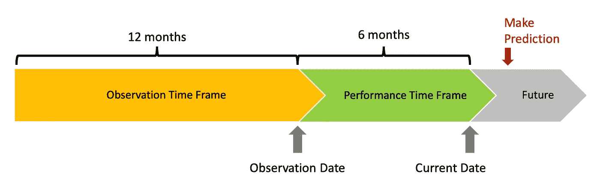
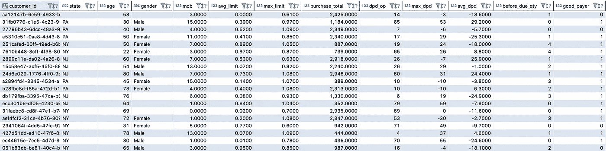

# 最优秀的数据科学家拥有的关键技能是什么？

> 原文：<https://towardsdatascience.com/what-is-the-key-skill-that-the-best-data-scientists-have-655edea228ac?source=collection_archive---------4----------------------->

## **有一项技能可以让你脱颖而出。找出是哪一个，并查看在构建行为评分模型时如何应用它的示例。**

了解如何应用不同的 Python 或 R 算法非常简单:我们都知道，只要修改一两行代码，就有可能从线性回归变成神经网络。或者 SVM，或者任何你喜欢的模特。

定义超参数也没有那么困难:只需创建一个交叉验证和网格搜索来查找将提升您的模型度量的值。部署一个模型可能更棘手，但是，通过一点坚持、大量的教程和无限的试错，你将能够上传一个每分钟可以处理数百万个请求的体面模型(或者你可以使用诸如[马文](https://github.com/marvin-ai)之类的工具，它将为你做大量的工作)。但是，到底是什么让你与众不同呢？最优秀的数据科学家拥有的关键技能是什么？

**简单明了:**知道如何从数据中创建分析视图。

交易数据库——那些存储交易数据的数据库，如订单、支付、访问日志等——是为存储应用程序交易数据而定制的，对数据科学没有直接用处。构建这些数据库的开发人员没有考虑过，也不应该考虑如何使用它们进行分析。他们只是创建了数据模型，可以提高他们当时正在编写的任何应用程序的性能。

试图用交易基础创建机器学习模型根本行不通，除非你想要的是预测交易。数据科学家通常需要分析基础来工作。好吧，但是到底什么是分析基础呢？它与交易基础有何不同？

# **到底什么是分析数据库？**

为特定的研究建立和组织分析数据库。为预测客户流失而创建的基础将不同于购物车产品推荐的基础。然而，两者的来源可能是相同的:事务数据库。客户流失预测必须对每个客户的行为数据进行分组，这样才有可能观察到一段时间内的客户行为。至于产品推荐，必须按会话对数据进行分组，以预测购物车上的相关商品。


Being able to create analytical databases is more important than being versed in multiple algorithms.

知道如何创建分析基础是数据科学家可以培养的最重要的技能之一。同时也是课程、MOOCs、教程里教的比较少的一种。为了将事务数据库转换为分析数据库，有必要真正了解您正在处理的业务。这一点，再加上批判性思维，是正确处理问题的基础。

> 创建目标和分析数据一致性并不那么明显:它需要一个漫长的调查过程，这往往会让你的经理失望。

数据科学家通常需要目标来训练他/她的模型。如果你看一下 [Kaggle](http://kaggle.com) ，你会发现无数的比赛和数据集已经定义了目标，并且在训练和评估基地中可用。然而，事务数据库通常没有现成的目标可供使用。数据科学家必须定义客户何时放弃服务，这样他/她才能创建一个流失模型。将需要定义什么是不良付款行为，因此可以预测违约。创建目标和分析数据一致性并不那么明显:它需要一个漫长的调查过程，这往往会让你的经理们失望([直到现在，他们都相信他们拥有所有的数据，他们所需要的只是一个数据科学家](https://medium.com/@andresionek91/voc%C3%AA-realmente-precisa-de-um-cientista-de-dados-6827534cecd5))。

> 事实是，数据科学远不止是向模型提供数据和评估性能指标的即插即用过程。

## **数据勤奋**

想象一下这样一种情况，您有一个数据库，其中几名销售分析师根据行为特征对销售线索进行分类。为了对客户进行分类，分析师必须判断谈判过程中领导的行为，然后为客户选择合适的资料并填写表格。这里我们有一些潜在的问题:

1.  在同一个谈判中，一个分析师对一个线索的判断不一定与另一个分析师的判断相同。不同的分析师可以在不同的配置文件中对相同的销售线索进行分类。
2.  分析师真的了解每个行为特征代表什么吗？是否有明确的标准将销售线索划分为“X 类”而不是“Y 类”？
3.  在收集期间，流程是否有变化，比如插入新的行为类别/档案？如果是这样的话，你将不得不决定在定义你的目标时如何考虑它们。
4.  数据是如何收集的？在每次与线索的新接触中，行为特征是否会被打乱，以便分析师真正选择最好的一个？
5.  经理们要求准确地进行这种分类吗？如果这只是一个要求分析师回答的“无聊”的过程，那么很有可能一些分类只是“因为他们不得不”而被填充的。当行为特征总是以同样的顺序呈现给分析师时，这个问题变得更加明显:目标可能会偏向第一个选项。

在这个过程之后，你可能会得出结论，到目前为止收集的数据是完全无用的，因为没有标准和过程。而这肯定会让很多人失望(大概连你也会失望)。

# **创建用于信用违约预测(行为评分)的分析数据库**

为了使创建分析数据库的过程更加清晰，让我们看一个正确定义问题和创建分析数据库以执行预测所需的一组过程的示例。


Creating a model to predict customer credit default involves a series of business and technical decisions that have to be made by the data scientist.

假设您从事金融服务，并且面临以下问题:

> 我们需要创建一个模型来识别哪些客户在不久的将来不会支付他们的发票。

为此，您需要创建描述客户付款的变量。然后，有必要创建一个回归模型，能够挑选出好的和坏的付款人。最后，你需要计算客户好坏的概率。

## **1。定义目标是什么**

你在你的数据库中找不到一个分类变量来表明某个客户是好的还是坏的付款人。首先有必要定义什么是好客户，什么是坏客户。对此，我们可以研究逾期付款。例如，您可能会发现，平均延迟时间为 20 天，但 75%的发票在到期日后 17 天内支付。

然后，您可以设计一个按逾期天数进行付款的累积分布。因此，您将能够验证 30 天后，87%的发票已经支付。但是，6 个月后，这个百分比将增加到只有 90%。然后，我们可以使用贝叶斯推断来预测客户在过期 30 天后支付发票的概率。

```
*# h1 = paid
# h0 = didn't pay
# e = observed event - reach 30 days past due
# With 30 days past due, 87% of invoices were already paid.**P(h1) = 90% # probability of paying, regardless the delay
P(h0) = 10% # probability of not paying, regardless the delay* P(e|h1) = 3 / 90 = 3,3% # *probability of reaching 30 days past due given that will pay* P(e|h0) = 10 / 10 = 100% # *probability of reaching 30 days past due given that will not pay*P(e) = P(e|h1) * P(h1) + P(e|h0) * P(h0)P(h1|e) = P(e|h1) * P(h1) / P(e)
P(h1|e) = 23,07% # *probability of paying the invoice given that is already 30 days past due*
```

我们可以得出的结论是，如果客户的付款已经晚了 30 天，他/她在未来结清债务的概率非常低(只有 23%)。要决定什么是好的或坏的付款行为，对业务的深入了解是必要的，因为你需要了解这种概率是否足够低，以将逾期不到 30 天的客户归类为好的付款人，而将逾期超过 30 天的客户归类为坏的付款人。

## **2。创建观察和绩效框架**

我们感兴趣的是，利用客户在过去一段时间内的行为数据，预测客户在未来一段时间内的违约概率。选择这些框架的大小更多的是商业/谈判决策，而不是统计决策，记住它们必须足够大，以包含几个客户的行为观察。太短的窗口会增加观测值的方差，从而使模型失去精度。

**定义:**

> 根据客户在过去 12 个月的行为，我想预测他/她在未来 6 个月成为优秀付款人的可能性。

为了满足这一定义，您需要:

1.  定义当前日期至少 6 个月之前的观察点。
2.  定义一个观察框架，从观察点前 12 个月开始，到观察点结束。
3.  定义一个在观察点之后 6 个月的绩效框架。
4.  定义什么是好的付款人。我们之前做的事情！



Time framing the problem is a very important step in the process of creating an analytical database.

请注意，这个定义带来了一些影响:

*   你需要至少 18 个月的数据
*   你的预测是有时间限制的。每次你运行你的模型，它会计算未来 6 个月内的违约概率。
*   在分析数据库中创建要素时，观察点和时间范围的大小将始终作为您的参考

## **3。创建目标特征**

既然我们已经定义了什么是我们的目标，什么是观察和性能框架，我们最终可以在数据库上创建目标。为此，您将计算每个客户在绩效时间范围内的最大逾期天数，并根据以下规则创建 GOOD_PAYER 变量:

```
*if max(delay) >= 30 days then is bad = 0
If max(delay) < 30 days then is good = 1*
```

因此，如果在绩效时间框架内，客户的付款延迟超过 30 天，他/她将被归类为不良，即使发票是后来支付的。

> *我们输入 0 代表坏，1 代表好，因为我们想定义得分越高，*违约*的概率越低。*

## **4。排除事项**

现在，我们需要广泛的业务结构知识，所以我们可以从我们的基础上执行一些排除。示例:

1.  排除在观察点没有信用限额的每个客户
2.  排除所有在观察点发票过期超过 30 天的客户，因为我们已经知道他们是不良付款人
3.  排除所有从未进行交易的客户

## **5。特征构造**

对于这项研究，基础必须按客户分组。每个变量必须描述客户在观察时间段内的特定行为。以下是一些可以设计的变量示例:



Example of an analytical database created to feed a behaviour score model that predicts customer default.

**州** : *个人信息特征—* 表示客户居住的省/州

**年龄** : *个人信息特征* —表示客户的年龄，在观察点计算

**性别** : *个人信息特征* —表示客户的性别

**MOB:** *账面月数* —自客户签到至观察点的月数

**AVG _ 限额:**12 个月观察期内限额使用的平均百分比

**MAX _ LIMIT:**12 个月观察期内限额使用的最大百分比

**购买 _ 合计:**12 个月观察期内的总购买金额

**DPD_OP:** 观察点逾期天数

**MAX _ DPD:**12 个月观察期内的最大逾期天数。如果所有发票都是预付的，则可能为负。

**DPD AVG:**12 个月观察期内的平均逾期天数。如果所有发票都是预付的，则可能为负。

**BEFORE _ DUE _ QTY:**12 个月观察期内到期前支付的发票数量。

**GOOD _ PAYER:***Target*—表示在 6 个月的业绩窗口内，客户没有超过 30 天未提交发票。

## **6。表演时间到了！**

现在终于说到建模型了！您现在可以应用您在数据科学课程中学到的一切。您的分析基础已经设计好并准备好行动——在这种情况下，数据处理和应用模型。

最简单的解决方案是使用上面创建的变量应用逻辑回归，以便预测 GOOD_PAYER 目标。该模型将为每个客户返回一个介于 0 和 1 之间的值，表明他/她成为优秀付款人的可能性。

**记住始终正确解读结果:**

> 该分数将显示某个客户在未来 6 个月内不会延迟付款超过 30 天的概率。

# 你喜欢吗？

这篇文章对你有用吗？分享！我说了什么蠢话吗？纠正我！想补充点什么？留言评论！