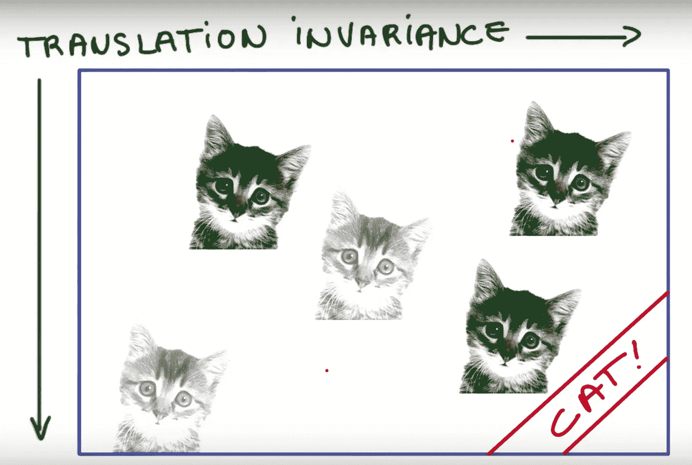

# 卷积神经网络有什么问题？

> 原文：<https://towardsdatascience.com/what-is-wrong-with-convolutional-neural-networks-75c2ba8fbd6f?source=collection_archive---------4----------------------->

# 介绍

当然，卷积神经网络(CNN)是一种迷人而强大的工具，也许这是深度学习这些天如此受欢迎的原因之一，自从 Alex Krizhevsky，Ilya Sutskever 和 Geoffrey Hinton 在 2012 年发表了“用深度卷积网络进行图像网络分类”以来，CNN 一直是计算机视觉中在许多任务中实现超人性能的制胜法宝，但 CNN 是完美无瑕的吗？那是我们能做的最好的吗？我想从标题中你可以看出答案是否定的。

2014 年 12 月 4 日，Geoffrey Hinton 在麻省理工学院做了一个关于他的名为“胶囊网络”的项目的演讲，他讨论了 CNN 的问题，以及为什么合用是非常糟糕的，以及它工作得如此好的事实是一场灾难

> 如果你熟悉 CNN，你可以跳到**怎么了？**

# 卷积层

卷积层具有一组矩阵，这些矩阵在称为卷积的过程中与前一层输出相乘，以检测一些特征。这些特征可以是基本特征(例如边缘、颜色等级或图案)或复杂特征(例如形状、鼻子或嘴)。因此，这些矩阵称为过滤器或内核

[(source)](https://www.cc.gatech.edu/~san37/post/dlhc-cnn/)

# 池层

有多种类型的池层(最大池、平均池……)，目前最常见的是最大池，因为它给出了交易方差，虽然很差，但对某些任务来说已经足够好了，并且它降低了网络的维数，非常便宜(没有参数)
最大池层实际上非常简单，你预定义一个过滤器(一个窗口)并在输入中交换该窗口，取窗口中包含的最大值作为输出

max pooling with filter size 2*2 [(source)](http://cs231n.github.io/convolutional-networks/)

[(source)](https://www.cc.gatech.edu/~san37/post/dlhc-cnn/)

# 怎么了？

## 1- **反向传播**

反向传播算法是一种在对一批数据进行预处理后，寻找每个权重在误差中的贡献的方法，大多数好的优化算法(SGD，ADAM …)都使用反向传播算法来寻找梯度

反向传播在过去几年做得很好，但不是一种有效的学习方式，因为它需要庞大的数据集
我相信我们可以做得更好

## 2-平移不变性

当我们说平移不变性时，我们的意思是，方向或位置稍有变化的同一物体可能不会激发本应识别该物体的神经元

[(source)](https://www.cc.gatech.edu/~san37/post/dlhc-cnn/)

如上图所示，如果我们假设有一个用来检测猫的神经元，它的值会随着猫的位置和旋转的变化而变化，数据增强部分解决了这个问题，但并没有完全解决它

## 3-池层

合并图层是一个很大的错误，因为它丢失了很多有价值的信息，而且它忽略了部分和整体之间的关系，如果我们谈论的是人脸检测器，那么我们必须结合一些特征(嘴、两只眼睛、椭圆形脸和鼻子)来说这是一张脸
CNN 会说如果这 5 个特征以很高的概率出现，这将是一张脸

[(source)](https://medium.com/ai%C2%B3-theory-practice-business/understanding-hintons-capsule-networks-part-i-intuition-b4b559d1159b)

所以两个图像的输出可能是相似的，这并不好

# 结论

CNN 很棒，但它有两个非常危险的缺陷:平移不变性和池层，幸运的是，我们可以通过数据增强来减少危险，但有些事情正在发生(胶囊网络),我们必须准备好迎接变化

## 来源

 [## 用于视觉识别的 CS231n 卷积神经网络

### 斯坦福 CS231n 课程材料和笔记:视觉识别的卷积神经网络。

cs231n.github.io](http://cs231n.github.io/)  [## 理解辛顿的胶囊网络。第一部分:直觉。

### 理解 Hinton 的胶囊网络系列的一部分:

medium.com](https://medium.com/ai%C2%B3-theory-practice-business/understanding-hintons-capsule-networks-part-i-intuition-b4b559d1159b)  [## 卷积神经网络

### 这是 CSE6250 大数据分析中医疗保健深度学习实验室系列的初步版本…

www.cc.gatech.edu](https://www.cc.gatech.edu/~san37/post/dlhc-cnn/)