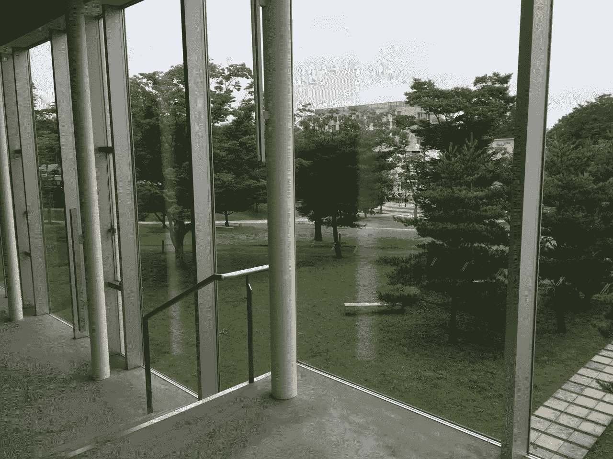
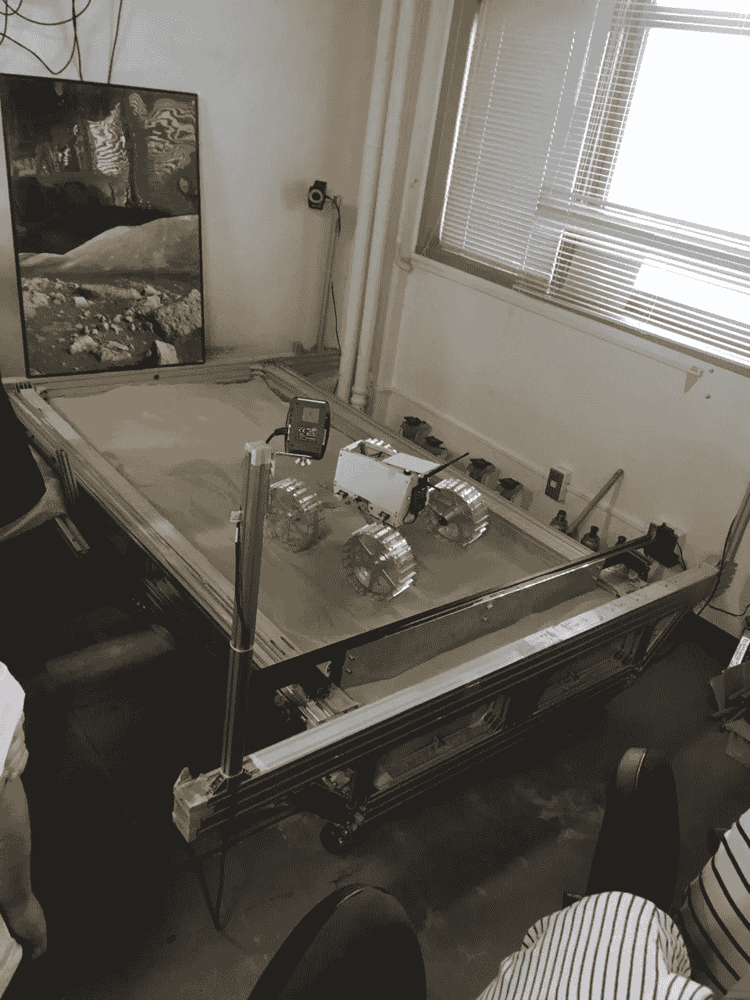
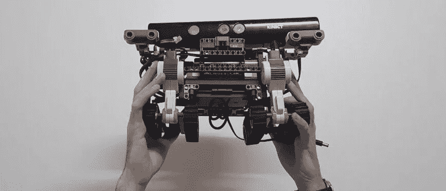
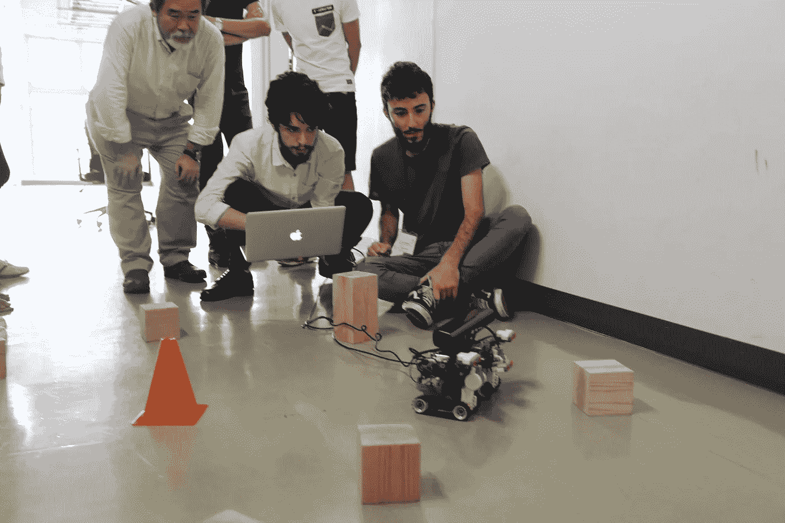
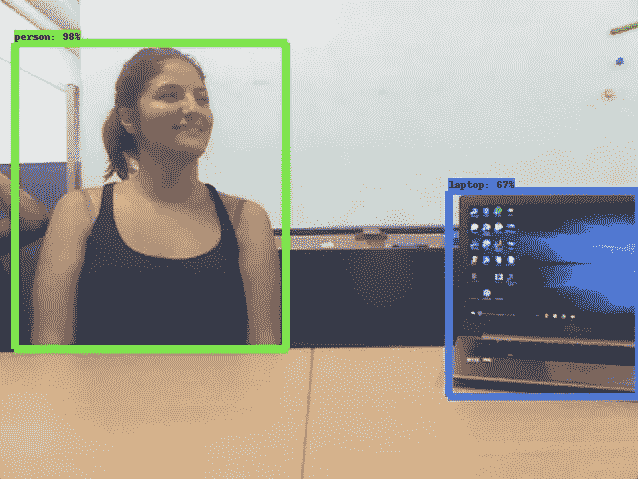

# 我在日本学习机器人两周所学到的

> 原文：<https://towardsdatascience.com/what-ive-learned-from-studying-robotics-in-japan-for-two-weeks-bd252961853f?source=collection_archive---------1----------------------->

## 或者，如何在一周内喝大量清酒并制作一个 AI 机器人。

我从小就一直渴望去日本。我一直很欣赏这种文化，从他们的传统到尖端科技。此外，现在我的主要兴趣之一是机器人技术。你可以想象当我被**东北工程暑期项目**录取去日本**东北**T4 仙台**大学**学习机器人技术时我的反应。

Sendai.

我和我的一些同事，以及来自世界各地的其他 50 名学生，有机会参加了来自许多不同机器人领域的各种教授的早课，从**分子**到**空间**机器人**机器人**。下午，我们做不同的项目。我与**太空** **机器人****实验室合作，我团队的任务是开发和制造一个移动机器人。**

****

**A picture of the campus.**

**东北大学的主工科校区真的很厉害。一个美丽的混合现代，精心设计和简约的建筑在一个绿色的环境中，充满了树木和植物。我真的很喜欢外部和内部建筑，这往往给人一种开放空间的感觉，玻璃墙和高天花板，大型公共空间，白色和闪亮的内部。前一段时间，我读了一些关于大学建筑和学生整体表现之间关系的研究，我不禁注意到这些领域中有多少给人一种和平和放松的自然感觉。**

**日本人非常好和有礼貌。他们的组织非常出色，我喜欢和他们一起生活。从自助餐厅到图书馆，整个校园都被精心管理。我们有机会以非常友好和非正式的方式与教授们聊天，这是我非常喜欢的事情。他们向我们解释了他们的系统如何更多地基于实践而不是纯理论。一位教授在我们吃午饭的时候告诉我们:“我们让学生尽快完成一个项目，并要求他们把它做好。”。这种方法可以产生非常好的结果，就像我们所经历的那样。面对一个现实世界的问题，并试图用实际的硬件和软件来解决它，会让你以许多不同的方式来思考它，突出问题，但会激励你找到有效的解决方案。引用费曼的话，“我不能创造的东西，我不理解”。**

****

**Detail of the Space Robotics Lab.**

**我最喜欢的课是吉田教授上的关于太空、T2 和机器人的课。机器人太空探索的想法在某种程度上对我来说是浪漫的，因为探索的欲望在人类灵魂中燃烧。我有机会与空间机器人实验室的 6 名学生(3 名像我一样来自罗马 Sapienza 大学，2 名来自香港大学，1 名来自佐治亚大学)一起工作，建造一个移动机器人，它可以通过机器人看到的视频流进行远程控制，还可以自主避障和导航，以及其他由我们决定的功能。我们只有不到一周的时间来研究它，整个下午都呆在实验室里，但我相信我们做得很好。**

****

**Our robot in all its beauty.**

**我们与**乐高** **Mindstorm** 合作，这是乐高的一个套件，允许使用传感器、电机和微控制器来控制机器人。作为一台相机，我们使用了 **Kinect** ，并在一台**树莓** **Pi** **3** 和一台 MacBook 上进行处理。制造真正的机器人比我们想象的要困难。我们设计了一个简单的差动驱动机器人，但用乐高积木建造它，试图分配重量和平衡它，但也使它足够稳定，以承受 **Kinect** 摄像头、**树莓** **Pi 3** 和一个电源库并不简单。**

**Kinect 和 MacBook 之间的实际通信是使用**处理、**一种专门为交互式计算机图形设计的语言来完成的，从这种语言中我知道使用 Kinect 非常容易。有了 RGB 和深度流，实现远程控制就变得轻而易举了:操作员看到了机器人所看到的，并简单地命令它。我们进行了几次有障碍的演示，结果令人满意。**

****

**A demo of the robot in action. From left to right: prof. Kazuya Yoshida, Norman Di Palo (myself), Matteo Colajanni.**

**实现**自主导航、避障和地标探测以及跟随**要困难得多。我注意到 Kinect 深度相机(或者至少是我们的 Kinect)有一个很大的缺陷:它在一米的距离内完全失明(毕竟，它不是为这些应用设计的)。该范围内的所有障碍物都消失了，因此机器人认为该路径是自由的。为了解决这个问题，我们在机器人上增加了超声波传感器，可以在该范围内以较高的精度检测到障碍物的距离。基于这些传感器信息，我实现了一个避障算法，在有障碍物的情况下执行规避动作，但在此之前，机器人无论如何都会随机漫游。我添加了一个**计算机** **视觉**算法，该算法根据颜色识别并检测所需地标(红色圆锥体)的坐标(在图像中)。然后，机器人能够每走几步就转向地标，同时避开障碍物。**

**[这里有一个自主导航和地标跟随的短片。](https://vimeo.com/228887235)**

**然后，移动机器人行为的基本目标就实现了(并非没有麻烦)。但是，由于我的专业既专注于机器人技术，也专注于人工智能，我决定通过集成更先进的深度学习视觉模型和自然语言处理来扩展软件架构。**

**我使用了 [**Tensorflow** **物体检测**](https://github.com/tensorflow/models) 模型，在著名的 **COCO** 数据集上进行训练。该模型为它能够识别的常见对象生成边界框。我将这一输出添加到之前的地标检测算法中，这样机器人就能够识别并跟随常见的物体，如笔记本电脑、椅子和人。**

****

**Example of object detection.**

**然后，通过简单地使用**文本** **消息**在**电报***一个著名的信息平台上发送，整体行为被控制。我开发了一个**聊天机器人**，它可以使用 Python 库 **telepot** 和 **api** 接收文本消息。 **ai** API 我增加了语言理解，所以用户可以简单地给机器人发短信*请走向桌子*，机器人就会理解请求，寻找桌子并走向它，同时避开路上的障碍。***

***尽管组成整体架构的软件部分不同，但结果是一个易于使用的机器人，它以智能的方式响应简单的命令，结合了机器人技术和人工智能技术。***

***[这里有一个关于物体识别和语言理解能力的短片。](https://vimeo.com/228864703)***

***我做了一个 [GitHub 库](https://github.com/normandipalo/ai-mobile-robot-SRL)与我的同事分享代码。你可以在这里查看，现在它仍在进行中，可能在不久的将来我会添加一些东西，特别是一个更详细的自述文件。***