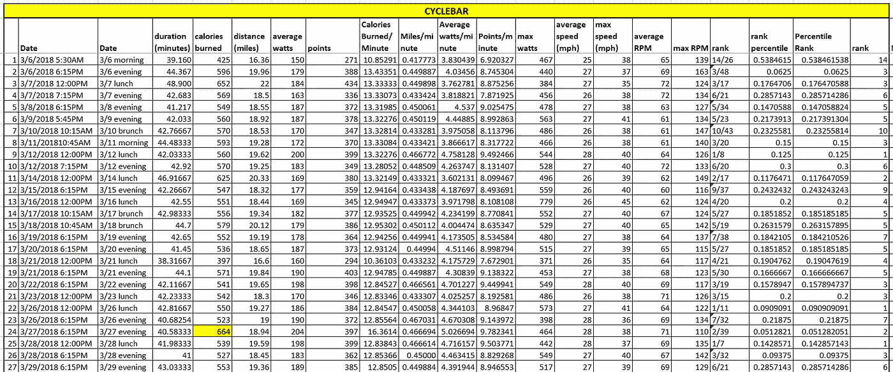
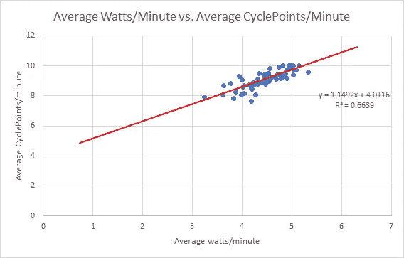
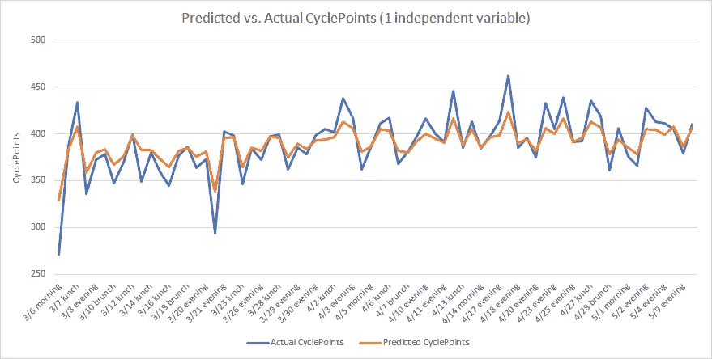
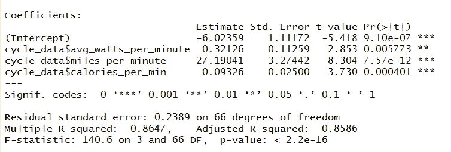
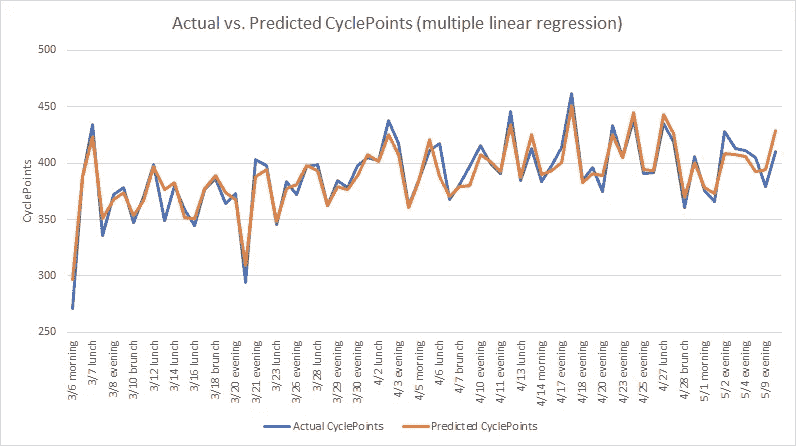
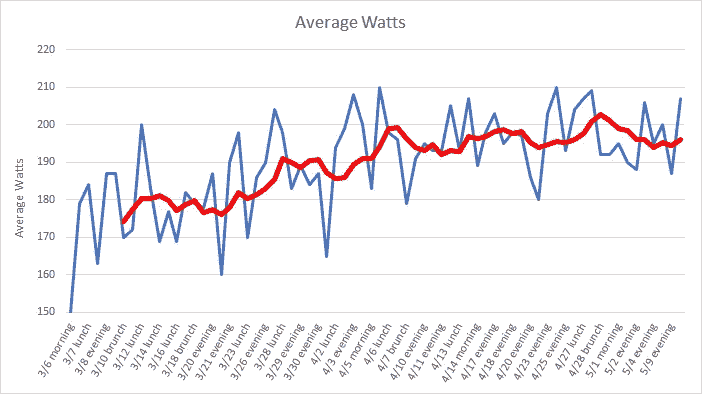
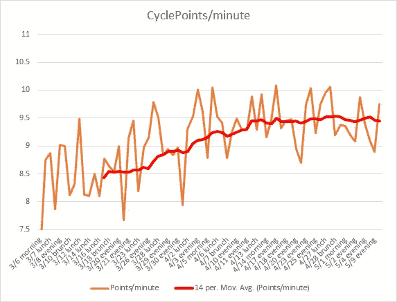
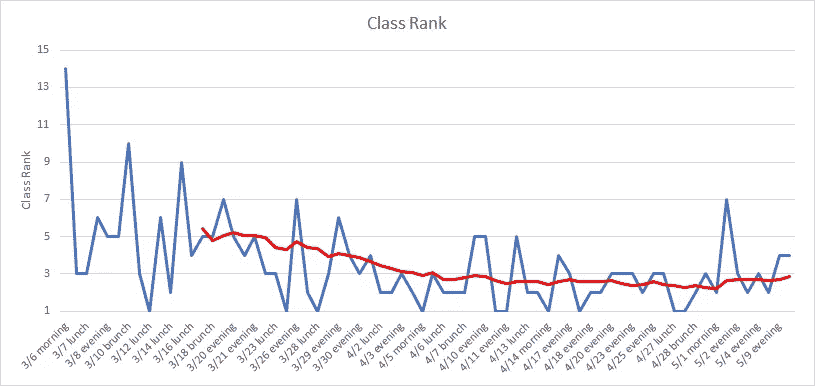
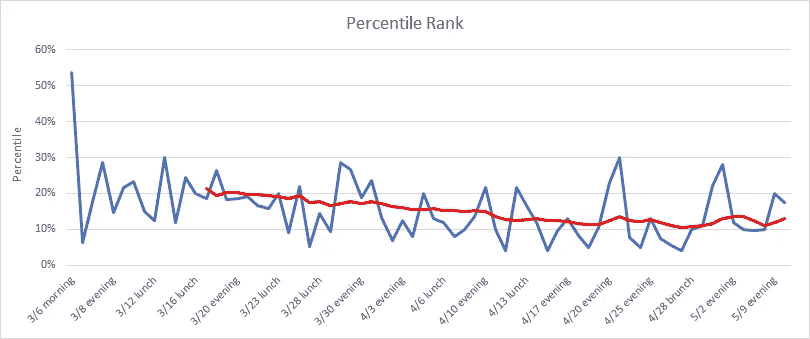
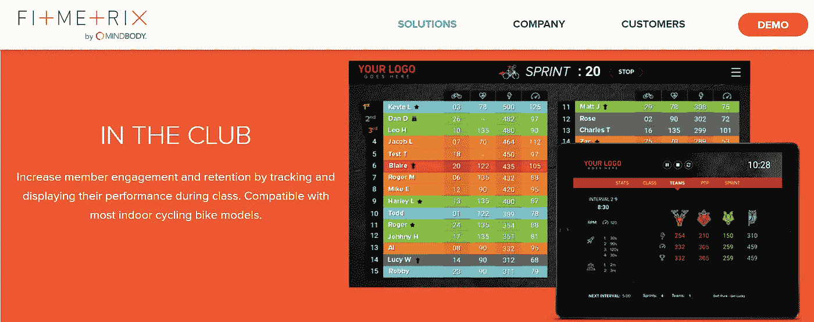

# 在 CycleBar 的两个月里我学到了什么

> 原文：<https://towardsdatascience.com/what-ive-learned-from-two-months-at-cyclebar-54e9681e9bbd?source=collection_archive---------1----------------------->

The long road. [Photography by Eugene Buchko](http://eugenebuchkophotography.com).

2018 年 3 月初，我决定要混合一下我的锻炼日程。我收到了一份来自 CycleBar 的传单，广告上说他们的位置在我住的 Buckhead 附近，并介绍了他们为新骑手提供的一次免费训练。出于好奇，我登录了网站，看到他们提供了另一种选择:25 美元一周不限次数的乘坐。我最终选择了后者。在那一周内，我参加了十次 CycleBar 会议，然后我就上瘾了。在我的试用期结束后，我注册了每月无限套餐。

CycleBar 课程的吸引力很大一部分是精力充沛的讲师，他们在管理有趣的播放列表以适应某个主题方面做得很好。我去过一些健身班，那里的播放列表很少更新，这可能会很无聊。然而，对我来说更大的吸引力是能够在骑行过程中看到你的自行车状态，并在课程结束后立即通过电子邮件收到你的结果的漂亮总结。循环状态包括以下内容:

1.  您的骑行持续时间(MM:SS 格式)
2.  您在骑行期间的平均功率(瓦特)
3.  您在骑行期间的最大功率(瓦特；瞬时度量)
4.  您在骑行过程中的平均速度(英里/小时)
5.  您在骑行期间的最高速度(以英里/小时为单位；瞬时度量)
6.  您的平均每分钟转数(RPM)
7.  您在骑行过程中的最高转速(另一个瞬时指标)
8.  骑自行车行驶的距离(英里)
9.  骑行过程中燃烧的卡路里
10.  周期点**
11.  你在班级中的排名，基于循环积分***

其中，CyclePoints 的广告会考虑您的年龄、性别、体重、身高以及您在骑行过程中输出的功率和转速，从而有效地将您与其他骑手进行排名。循环积分旨在使各种能力和个人特征标准化，以便循环积分可用于比较骑手之间的表现。例如，一名 25 岁的健康男性在骑行中平均推动 200 瓦，可能比一名 37 岁的三个孩子的母亲在骑行中平均推动 150 瓦得到的自行车积分少。

我试图获得更多关于周期点是如何数学计算的信息；然而，我没有从 CycleBar 那里得到足够的信息来进行正式的归纳。然而，要点是骑行过程中，周期积分取决于针对骑手体重、身高、性别和年龄标准化的*平均*指标(瓦特和 RPM)以及*瞬时*指标(瓦特和 RPM)。我不知道所有车友的归一化算法。然而，我跟踪了我所有骑行的循环积分和其他统计数据，并在下面列出。

# 在 Excel 中跟踪循环统计数据

如上所述，每次骑行后，您都会收到一封包含骑行积分的电子邮件。我把所有这些统计数据放在一个 Excel 电子表格中，如下所示。仅仅骑了几次之后，我意识到骑行的持续时间取决于播放列表的长度等等。因此，虽然一次骑行总共是 45 分钟(通常是 41 到 43 分钟的实际骑行时间，加上最后 2 到 4 分钟的拉伸时间)，但 30 秒或更少的差异会对你最终的总表现产生影响，包括消耗的总卡路里、消耗的瓦特数或行驶的距离。因此，我创建了额外的列来跟踪每分钟消耗的卡路里，每分钟消耗的英里数，以及每分钟的平均瓦特数和每分钟达到的循环点数。

在我参加 CycleBar 的两个月里，我参加了 72 个 CycleBar 课程。然而，为了下面的分析，我从数据集中删除了两个班级，因为有一些小故障(一次，发送给我的结果是空白的，另一次，教师忘记结束班级跟踪)。因此，我在下面的分析中使用了 70 个数据点。

A selection of CycleStats in Excel. The highlighted cell refers to an outlier in the system’s calculation of calories burned during the ride.

# 预测周期点

我很好奇，如果给定我锻炼的强度(平均消耗的总瓦特数、骑行的英里数、消耗的卡路里数等)，我是否可以很容易地预测我在一个给定的课程中能够达到的骑行积分数。)

首先，对我来说很清楚的是，平均消耗的瓦特数和骑行结束时获得的总循环点数之间存在直接的正相关关系。然而，正如我提到的，我想以每分钟为基础跟踪关系。我在 Excel 中创建了一个简单的图表，显示平均瓦特/分钟与平均周期点数/分钟(周期点数/分钟是因变量)，如下所示。红线是显示两个变量之间线性关系的最佳拟合回归线。66.39%的 r 平方表示相当合适。

为了得到在单个课程中达到的预测周期点，只需乘以该课程持续的时间:

CyclePoints =(课程持续时间，以分钟为单位)* [1.1492 *平均瓦特/分钟)+ 4.0116]

The relationship between average watts/minute and average CyclePoints/minute.

对于一个独立变量，预测周期点与实际周期点的转换如下所示。请注意，单个独立变量很大程度上显示了周期点的变化，但一些波峰和波谷没有在样品内拟合中捕捉到。

Linear regression with a single independent variable. Note: transformation from CyclePoints/minute to CyclePoints per ride is made here.

# 在 R 中构建简单的多元回归模型

我把 cycle stats 电子表格放入了 R 软件包中，并建立了一个非常简单的多元线性回归模型。我选择了三个独立变量:平均瓦特/分钟(如上)，骑行里程/分钟，消耗卡路里/分钟。因变量是循环点数/分钟。

由此产生的系数估计显示在下面的截图中。

这一次，为了得到每个类的预测周期点，等式与之前相似，但是加入了两个额外的变量:

CyclePoints =(课程持续时间，以分钟为单位)* [-6.02359 + (0.32126 *平均瓦特/分钟)+ (27.19041 *英里骑行/分钟)+(0.09326 *消耗的卡路里/分钟)]

多元线性回归包含 66 个自由度(70 个数据点减去 3 个独立变量减去 1 个截距项)。r 平方从大约 66%提高到大约 86%。将因变量(循环点数/分钟)转换为每类循环点数，我们得到下图:

A multiple regression fit of actual vs. predicted CyclePoints. Note: transformation from CyclePoints/minute to CyclePoints per ride is made here.

如上所示，预测周期点的样本内拟合能够更好地捕捉所获得的周期点的波峰和波谷。

# 健身进度

在我参加 CycleBar 课程的两个月时间里，我注意到我的健康和耐力在逐渐提高。例如，如下图所示，在我开始去 CycleBar(红色粗体线表示两周移动平均值)后的两到三周，我平均每节课大约 180 瓦，在两个月的时间框架结束时，我能够将每节课的平均功率提高到大约 195 到 200 瓦。虽然平均瓦特数的增加看似微不足道，但在我看来，10%左右的提高是相当显著的。

Progression of average watts per class. The red line indicates a two week moving average.

我还跟踪了平均每分钟循环点数的改进。图表如下所示。在这两个月里，我能够将我的平均周期点数/分钟从 8.5 提高到 9.5。我在 CycleBar 期间与一些骑手交谈过，我观察到如果你在骑行期间能超过 10 cycle points/分钟，你就做得非常好，很可能会将自己推向极限****。

Progression of average CyclePoints/minute.

最后，我跟踪了班级排名。在我开始上课的两个星期后，我在 CycleBar 排行榜上名列前五，在我两个月的经历结束时，我平均在排行榜上名列前三。

因为班级的大小取决于班级的日期和时间，所以排名本身(1、2 或 3)可能不是相对表现的最佳指标。我想我会把这个排名转换成一个百分位数，基于某个特定级别的车手人数。一个班的最小人数是 5 人(这是一个午餐时间班)，最大人数是 48 人(巴克黑德自行车室最多有 49 辆自行车)。例如，从这个角度来看，在数学上，在 48 名车手中获得第 9 名(18.75 百分位)比在 5 名车手中获得第 1 名(20 百分位)更好。我的百分位排名如下所示，这表明尽管我在开始上课两周后处于前 20 个百分位，但我能够在两个月结束时将其提高到前 12 个百分位。

# 其他健身趋势

除了能够在自行车课上逐渐表现得更好之外，我注意到在以下两个方面有了显著的改善:减肥和耐力。在 CycleBar 的两个月里，我减掉了大约 10 磅的体重，这是我在跑步和其他日常锻炼中没能做到的。

我还注意到，在其他锻炼项目中，我的耐力和速度都有所提高。在户外跑步时，我能够将我的常规英里/分钟配速减少 15 到 20 秒(从大约 7:30/分钟减少到 7:10 或 7:15/分钟)。

# 未来项目

我希望将周期点的分析扩展到我个人的统计数据之外。特别是，如果 CycleBar 的任何人正在阅读这篇文章，并可以向我提供如何根据一个人的体重、身高、年龄、性别和个人表现指标(瓦特/rpm)调整/计算 CyclePoints 的详细信息，我将非常感谢。

最后，非常感谢所有出色的导师([萨拉](https://www.instagram.com/cyclebarsara/)、[塔拉 M.](https://www.instagram.com/taramcdev/) 、[安妮](https://www.instagram.com/920annie/)、[凯蒂](https://www.instagram.com/katiepostlethwait)、[塔拉 R.](https://instagram.com/tara_rama) 、[贾斯汀 M.](https://instagram.com/justinndavisss) 、[贾斯汀 L.](https://instagram.com/jloatl) 、[普尔维](https://instagram.com/cycle.purvi)、[山特尔](http://instagram.com/shantelwestcoast)、[多林](https://instagram.com/decycle88)、[海莉](https://instagram.com/_hjb_)、

###

*注意事项*:

*无限制的意思是，你可以在一个月内参加任意多的 CycleBar 课程。一般来说，每天有三到六节课。
** CycleBar 已与 [FitMetrix](http://www.fitmetrix.io/Solutions/Indoor-Cycling) 合作，展示平均瓦特数、每分钟转数和循环点数等循环统计数据。

* * *您基于 CyclePoints 的等级可能与您在骑行期间在板上看到的实况有所不同，因为有些骑行者希望争夺 CyclePoints，但选择不在板上。当然，你的排名不可能比你在自行车板上看到的更好；要么一样，要么更糟。
* * * *有一些非凡的骑手能够在一个级别获得大约 550 到 575 个循环积分，平均每分钟 13 到 14 个循环积分。