# 是什么让一个国家繁荣昌盛？

> 原文：<https://towardsdatascience.com/what-makes-a-country-prosperous-7cc213974bac?source=collection_archive---------0----------------------->

今年在立陶宛，有很多关于是否有必要引入累进税以使收入不平等不至于如此严重的讨论(不要问我什么是严重——政治家们又一次没有给出定义)。

但是世界各地都在发生同样的事情——每个人都对收入不平等和税收感到兴奋，并且有很多关于改善每个人而不是少数人生活的讨论正在进行。

虽然收入不平等是一个有点争议的话题(见 1990 年的视频)，但我对一个对每个人都很重要的更实际的问题感兴趣——是什么让一个国家繁荣？实际上，它应该读起来更像“是什么让一个国家的公民生活得更好”，这样我们就清楚了，它是关于生活在那里的人们。

真正酷的是，这些天我们有很多数据和很多方法可以随时用来分析它(谢谢熊猫和 Matplotlib！).在数据的帮助下，有可能做出更明智的决策。

让我们开始吃吧。

# 数据

所以我做了什么？我收集了这个国家各个方面的所有有用的指数，并对它们之间的关系进行了一些数据分析。

我发现有很多有用的索引:

生活质量:

*   [世界幸福报告](https://en.wikipedia.org/wiki/World_Happiness_Report) —通过结合多项调查和社会因素来衡量幸福(doh)。
*   [人类发展指数](https://en.wikipedia.org/wiki/Human_Development_Index)——包括预期寿命、教育和人均收入。
*   [社会进步指数](https://en.wikipedia.org/wiki/Social_Progress_Index)——衡量国家满足其公民社会和环境需求的程度。
*   Legatum 繁荣指数(lega tum Prosperity Index)——该排名基于多种因素，包括财富、经济增长、教育、健康、个人幸福和生活质量。
*   [教育指数](https://en.wikipedia.org/wiki/Education_Index)

这些将有助于确定这个国家的生活质量。最终，这些事情对于一个普通的美国公民来说至关重要。

经济:

*   [做生意](http://www.doingbusiness.org/rankings)——结合多项标准来衡量创业的难易程度。
*   [全球竞争力指数](https://en.wikipedia.org/wiki/Global_Competitiveness_Report) —通过衡量一系列制度、政策和其他因素，评估国家为其公民提供高水平[繁荣](https://en.wikipedia.org/wiki/Prosperity)的能力。
*   [腐败感知指数](https://en.wikipedia.org/wiki/Corruption_Perceptions_Index) —衡量感知的腐败程度，由专家评估和意见调查确定。请注意，较高的值意味着较低的损坏。
*   [基尼系数](https://en.wikipedia.org/wiki/Gini_coefficient) —评估收入最高者和收入最低者之间的差距。
*   影子经济规模——显示实体经济中没有被政府征税或监控的比例。
*   [政府效率](http://databank.worldbank.org/data/Views/Metadata/MetadataWidget.aspx?Name=Government%20Effectiveness:%20Estimate&Code=GE.EST&Type=S&ReqType=Metadata&ddlSelectedValue=DZA&ReportID=30316&ReportType=Table) —获取对公共服务质量的看法。更多[此处](https://www.mcc.gov/who-we-fund/indicator/government-effectiveness-indicator)。
*   研发支出

以上大部分定义了国家的经济环境。创业容易吗？经济有多有效？

此外，还有其他一些或多或少为人所知的指标，例如:

*   人均国内生产总值
*   人均国民总收入
*   税收-GDP 比率——税收占经济的百分比是多少
*   [商业收入税率](https://data.worldbank.org/indicator/IC.TAX.TOTL.CP.ZS?view=chart)(商业税率)——这里的解释是但基本上，它是对商业收入的综合税
*   [教育支出(占 GDP 的百分比)](http://databank.worldbank.org/data/Views/Metadata/MetadataWidget.aspx?Name=Government%20expenditure%20on%20education%20as%20%%20of%20GDP%20(%)&Code=SE.XPD.TOTL.GD.ZS&Type=S&ReqType=Metadata&ddlSelectedValue=BFA&ReportID=56272&ReportType=Table)——教育支出占 GDP 的比例是多少
*   [按部门划分的 GDP(农业、工业、服务业)](https://en.wikipedia.org/wiki/List_of_countries_by_GDP_sector_composition) —比较不同 GDP 构成的国家之间的数据很有意思
*   [商品和服务税](http://databank.worldbank.org/data/Views/Metadata/MetadataWidget.aspx?Name=Taxes%20on%20goods%20and%20services%20(%%20of%20revenue)&Code=GC.TAX.GSRV.RV.ZS&Type=S&ReqType=Metadata&ddlSelectedValue=&ReportID=52633&ReportType=Table) —基本上是欧洲的增值税和美国的销售税
*   [所得税和资本税](http://databank.worldbank.org/data/Views/Metadata/MetadataWidget.aspx?Name=Taxes%20on%20income,%20profits%20and%20capital%20gains%20(%%20of%20revenue)&Code=GC.TAX.YPKG.RV.ZS&Type=S&ReqType=Metadata&ddlSelectedValue=&ReportID=52633&ReportType=Table)
*   出生率
*   预期寿命
*   生活在农村地区的人口比例

我选择忽略像个人税率和公司税率这样的东西，因为它们在法律中被报道，因为它通常是一个累进税率，只报道其最高税率。世界银行报告的收入、商品和服务的实际税收看起来更好地代表了税收水平。

接下来，我将所有国家放入电子表格中，并不断缩减列表，直到剩下 75 个国家拥有上述所有指数的数据。

这引入了某种偏见，只预先过滤了那些能够跟踪他们生活许多不同方面的国家，但它也有助于消除某些离群值，如专制政权、极度不发达的国家等。

我使用的所有数据都可以在 GDrive 上的这个[电子表格中找到。](https://docs.google.com/spreadsheets/d/1N_aB8Kh7e1Lry2Navh0dxYTKkB4AsFl76qPSktYB5fw/edit)

# 调查的结果

做好准备面对大量的数字。我认为有必要探索数据的各个方面，以更好地了解不同组件如何相互作用。例如，如果经济以创新产品为基础，可以预期它也是有竞争力的，反之亦然。

分析部分将由 5 部分组成:

*   税收对经济和繁荣的影响
*   商业环境对繁荣的影响
*   政府效率及其影响
*   对收入不平等的影响
*   繁荣国家的特征

所有的数字都将是散点图(因为它们很容易理解数据之间的关系)，它将包括一个线性回归拟合，以帮助我们更好地衡量这种关系。

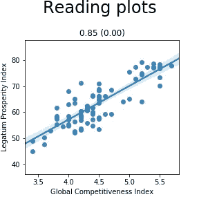

例如，在上图中，每个点将代表一个国家的 Legatum 繁荣指数值及其对应的全球竞争力指数值。

有时这些回归拟合线可能会产生误导，因此这些数字会在它们上面包含一个数字，即括号中的[皮尔逊相关系数](https://en.wikipedia.org/wiki/Pearson_correlation_coefficient)及其 [P 值](https://en.wikipedia.org/wiki/P-value)(随机结果的可能性)——这与线拟合一起将更好地表示数据之间的关系。

还有一个关于皮尔逊系数的小提示:

*   0 和 0.3 表示弱线性关系
*   0.3 和 0.7 表示中度线性关系
*   0.7 和 1.0 表示强线性关系

# 赋税

首先，我们将从**所得税和资本税**说起。

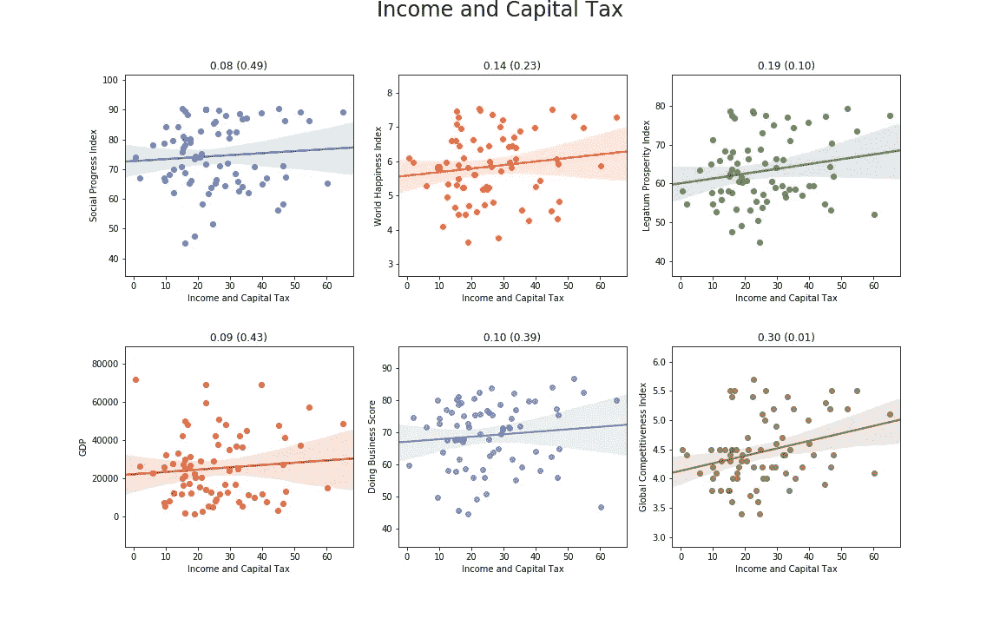

从上面可以看出，对社会和经济因素(如经商和社会进步指数)的影响很小(或者说影响的证据很少)。有趣的是，与全球竞争力指数之间存在微弱的正相关性，因此增税会损害企业的说法不一定正确。

**企业管理费**怎么样？

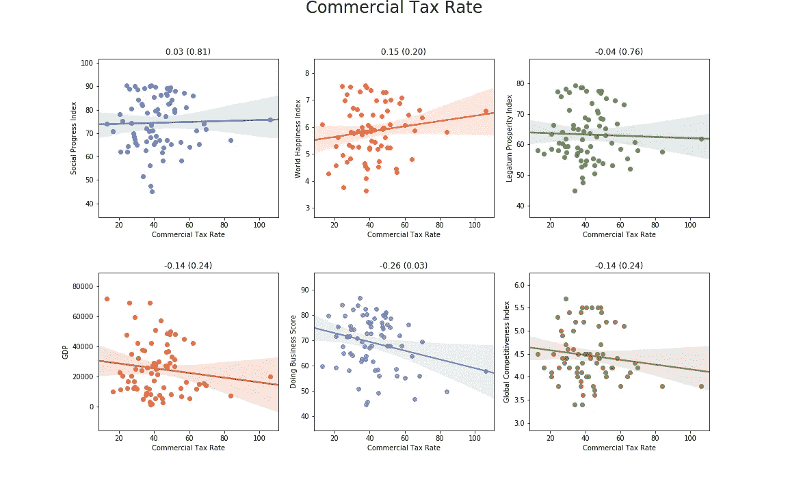

生活质量和商业税率基本没有关系。经济也是如此，尽管这种相关性是负的，而且在《营商环境报告》得分上具有统计学意义。然而，从散点图中我们可以看到，这是非常随机的。

**商品及服务税**:

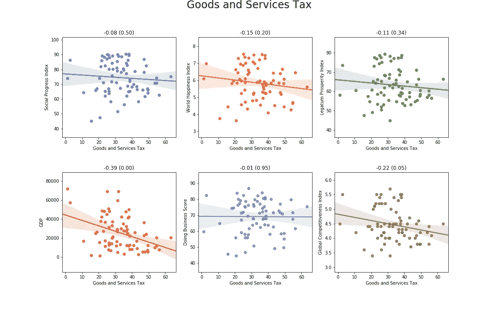

如果有什么不同的话，似乎消费税对经济有负面影响(GDP 和 GCI ),但对生活质量没有正面影响。

这变得有点奇怪——它可能开始看起来像我们根本不需要税收就能拥有一个繁荣的国家。但是让我们来看看税收占 GDP 的比例:

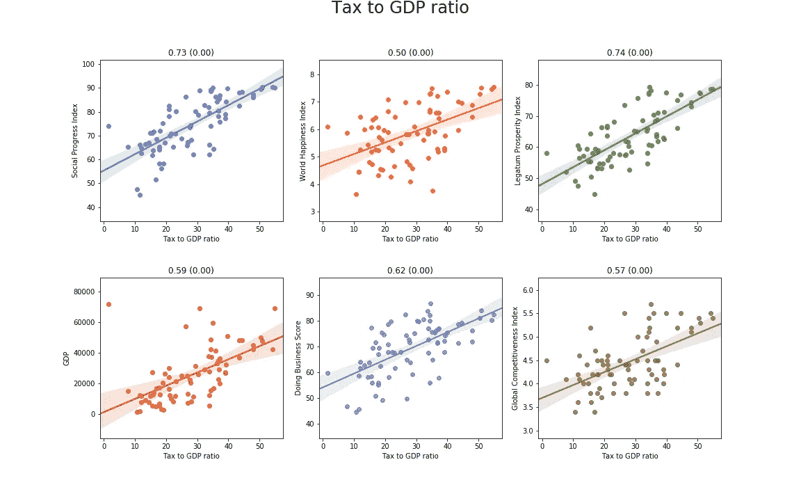

最后，我们有所进展。这将强烈地表明，征收足够的税收来支持基础设施和公民的生活质量，对于一个繁荣和运转良好的国家来说是非常重要的。正如我们将在后面看到的腐败一样，事实可能确实如此，因为更有效地收税比提高税率更重要。

老实说，如果我们从世界银行获取税率数据，它不会显示出如此强的相关性，但它似乎缺少一大块税收，如社会保险。此外，对几个国家的快速复查显示，这里[的可用数据看起来比世界银行的数据更真实。](https://en.wikipedia.org/wiki/List_of_countries_by_tax_revenue_to_GDP_ratio)

让我们把它提高一个档次，反复强调:

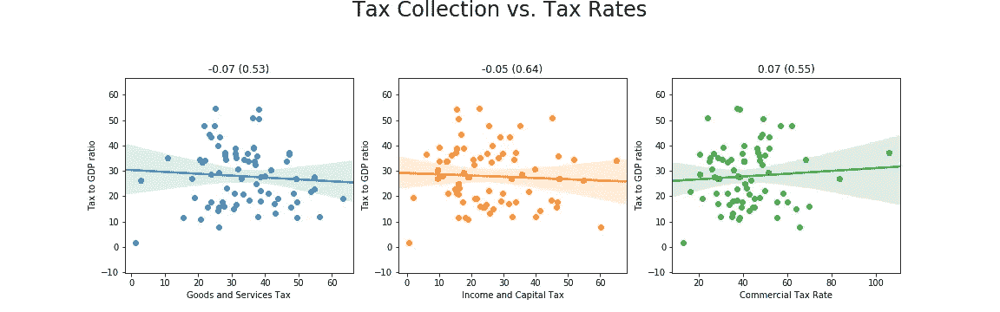

没有**的证据表明任何更高的上述税率将允许征收更大的预算。显然，不同的机制决定税收收入。**

# 商业环境

让我们来看看**全球竞争力指数**如何描述该国的生活质量:

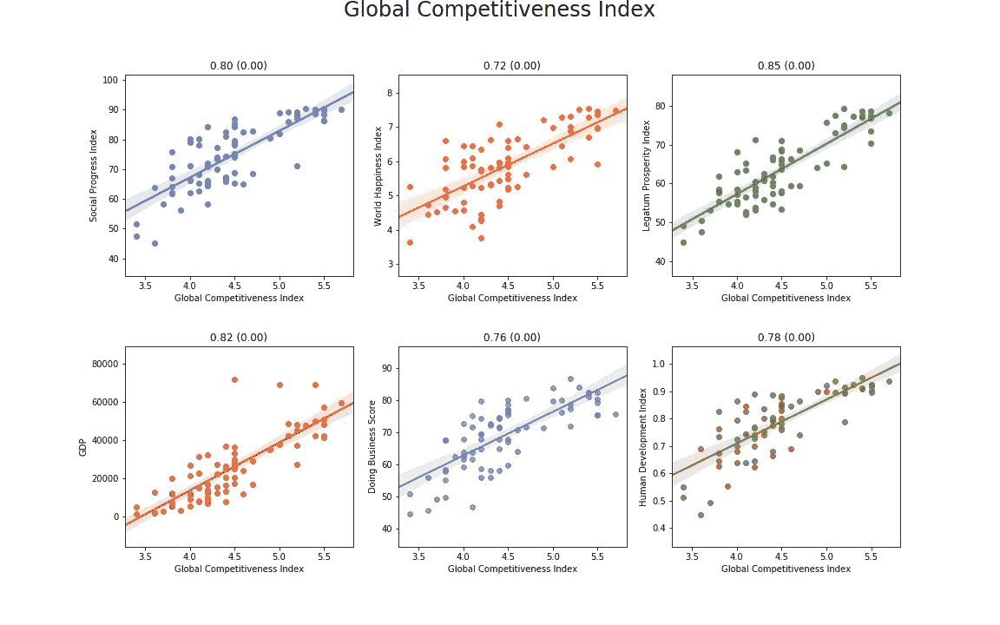

这是一幅完全不同的画面。我们可以清楚地看到，拥有一个有竞争力且运转良好的经济将在所有指标上带来高质量的生活:

*   人均国内生产总值
*   人类发展指数
*   幸福指数
*   Legatum 繁荣指数
*   社会进步指数

同样的道理也适用于**创新**:

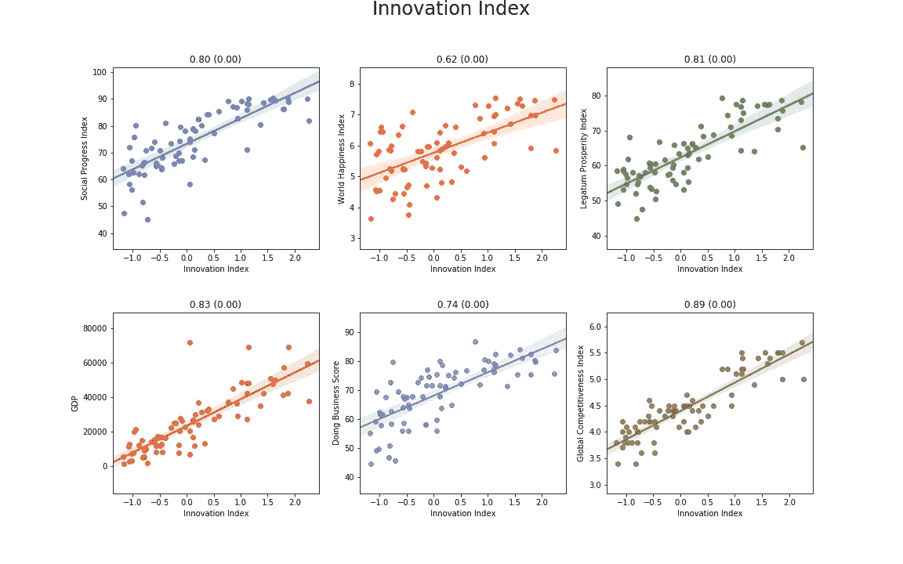

基于创新的经济比不基于创新的经济有明显的优势。那“做生意”的轻松呢？

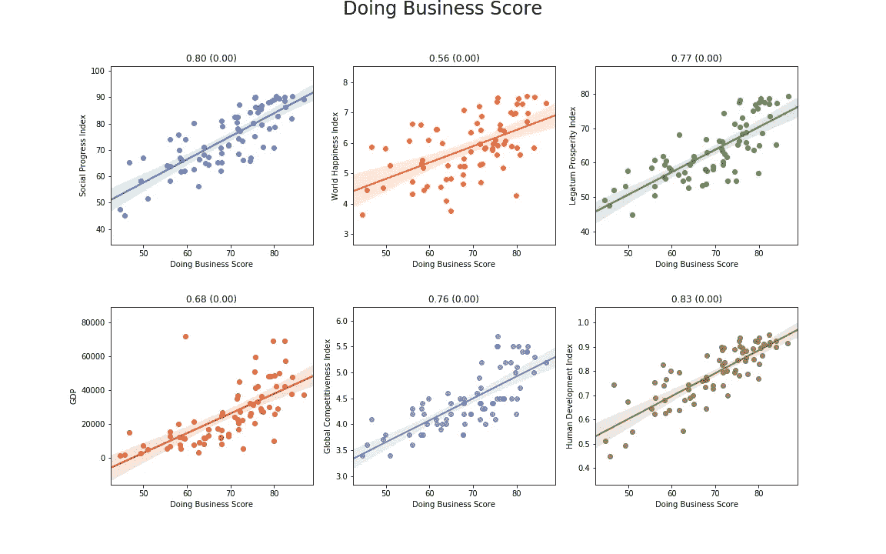

它讲述了同样的故事——让经营企业变得更容易，人们将会有更高的生活质量。

我们可以看到研发支出的类似效应:

在研发上投入更多的国家有望变得更加繁荣，但从散点图来看，这种关系似乎在 3%处趋于平缓。

然而，政府在教育上的支出却不是这样。

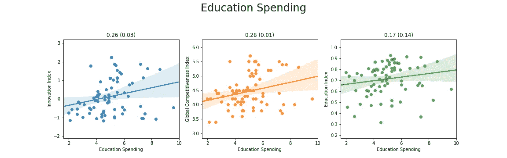

看到这个我很惊讶。对经济的影响相当轻微。甚至教育指数本身也几乎与支出没有任何关联。

显而易见，政府应该在教育上花费至少 4%的 GDP，但是这个部门似乎效率很低，因为它不能产生更强的关系。

然而，令人欣慰的是，R&D 教和社会进步之间至少存在某种关联:

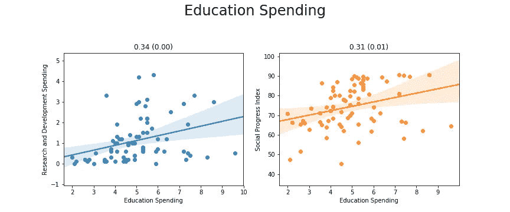

# 政府效能

政府官员不会喜欢这个:

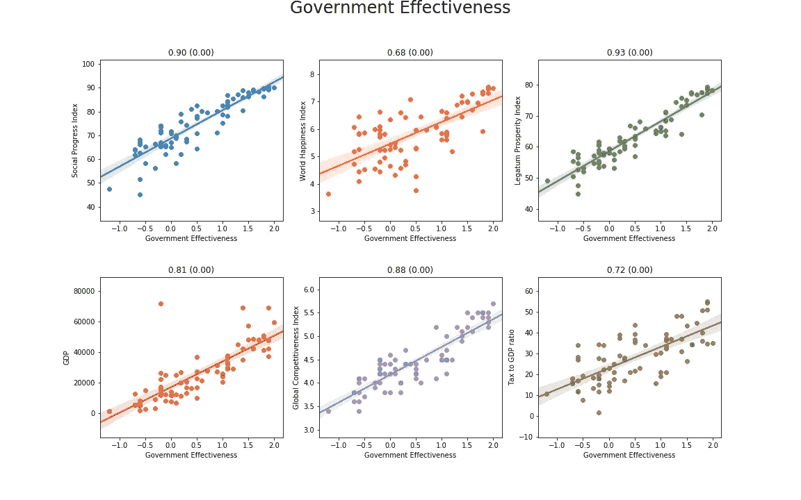

多么令人惊讶——一个运转良好、减少官僚主义的政府将为人民和企业带来更美好的生活。

但这还不是全部。让我们来看看**腐败**如何影响这个国家:

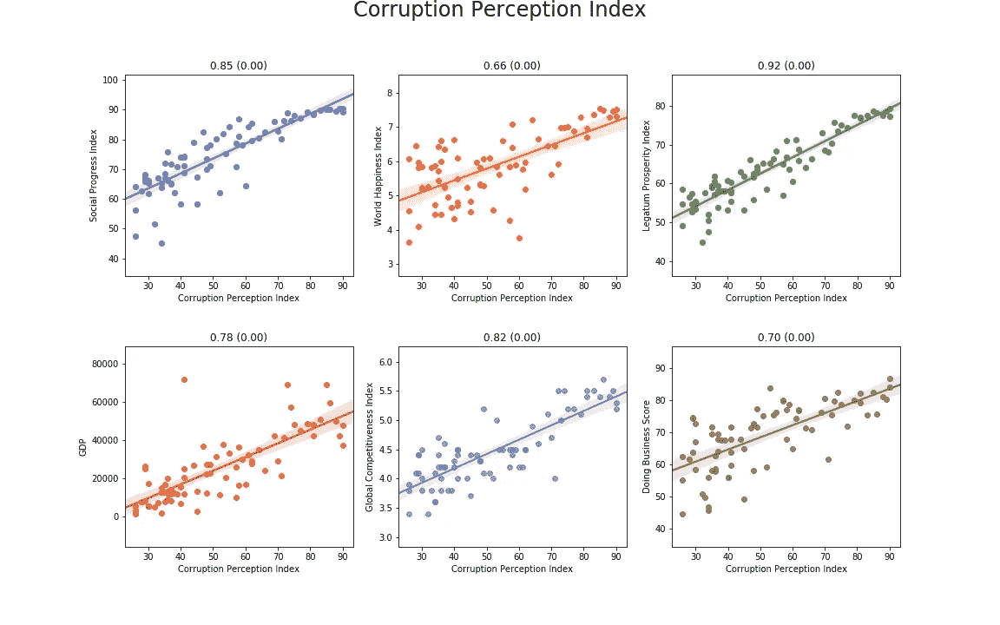

请记住，**腐败感知指数**的值越高，腐败越少。上面的数字告诉我们，如果这个国家腐败猖獗，这个国家基本上不可能繁荣昌盛，人民也不可能过上好日子。

与**影子经济**非常相似的故事是:

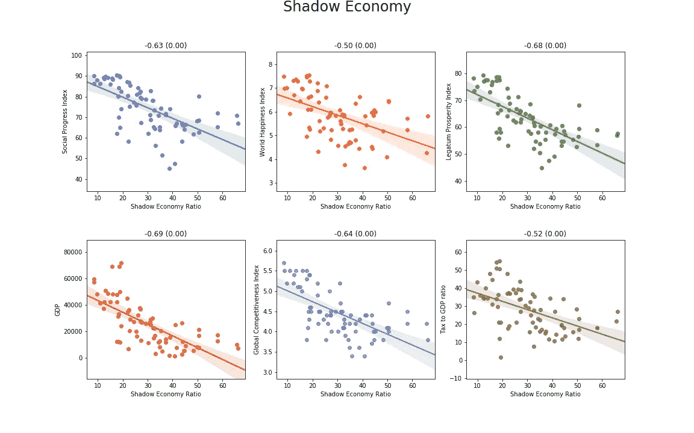

这一点和腐败将扼杀任何人均 GDP 高的机会和征收足够税收的希望。人们的生活将会变得更糟，企业将很难经营。从上面我们看到的数据来看，这是毫无疑问的。

# 不平等

既然这是一个热门话题，让我们来看看基尼系数，以及它是如何受到我们之前分析的方面的影响的。

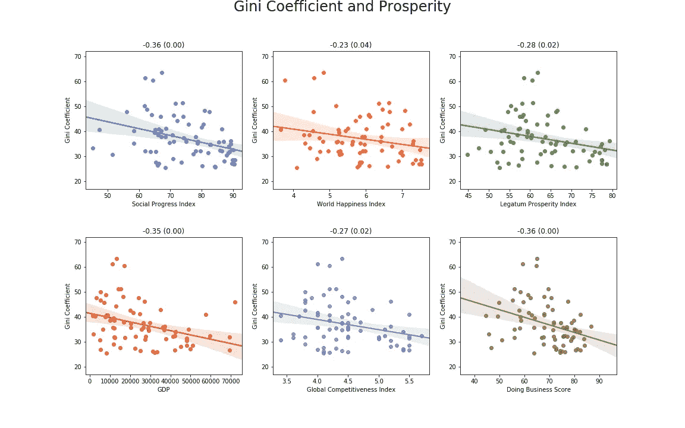

更高的幸福、社会进步和繁荣并不意味着不平等会减少(反之亦然)。令人惊讶的是，更强大的经济与更小的收入不平等相关(人们可能会认为富裕国家的不平等更高)。

税收似乎对收入不平等没有任何影响:

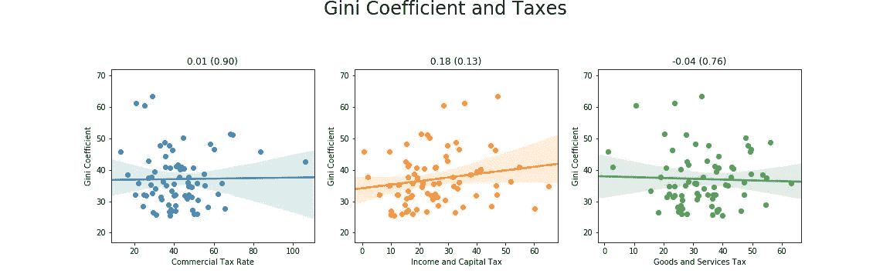

这再次强烈表明(记住我们之前从数据中看到的东西)收入不平等与税率无关。

那么是什么影响了不平等呢？

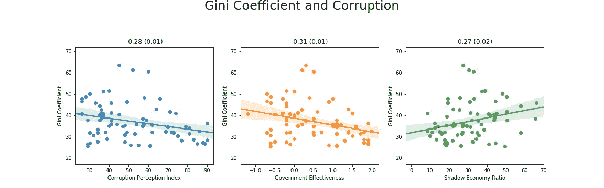

这是我们的老朋友:腐败、官僚主义和影子经济。

# 繁荣国家的其他特征

在挖掘数据时，我注意到了一些其他有趣的事情。我们来看看下图:

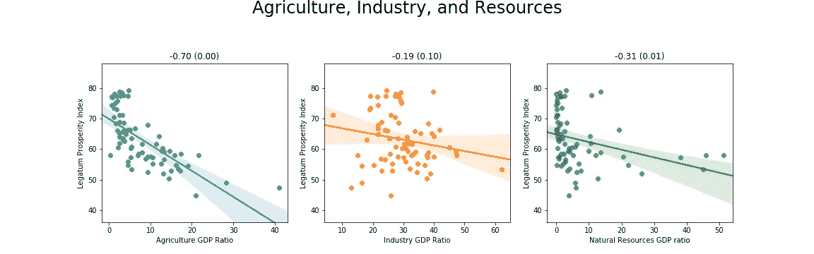

繁荣的国家不一定勤劳，也不需要任何自然资源。此外，那些仍然停留在农业经济的国家，注定是贫穷的。

现代经济是以服务业为基础的，预计生活在农村地区的人会少得多。

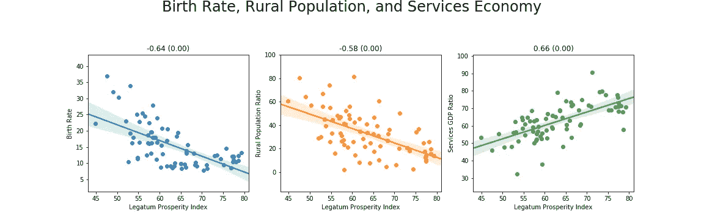

此外，富裕国家的出生率远低于贫穷国家。

最后，具有高容忍度和包容性的国家(作为社会进步指数的子指数)比那些不具有高容忍度和包容性的国家做得好得多:

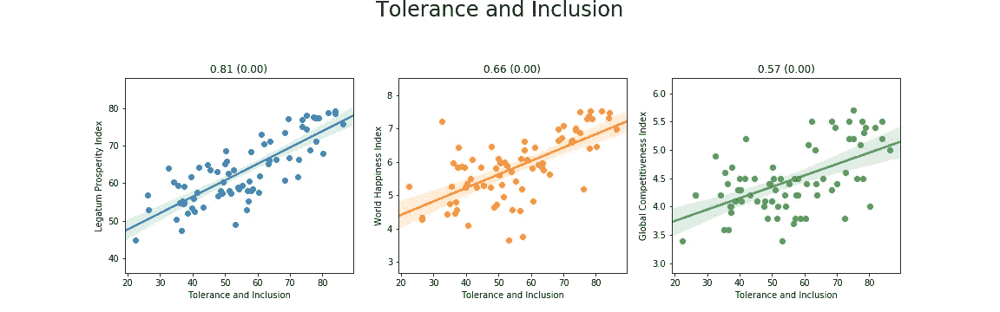

# 结论

显然，在我们得出结论之前，使用一些常识性的思维是很重要的。如果预期寿命与《营商环境报告》的排名呈正相关，这并不意味着寿命越长，营商环境就越好，但很可能恰恰相反——良好的营商环境会支持延长寿命的政策，比如更好的医疗保健。

此外，像竞争性的经济环境和生活质量这样的东西是相互加强的——更好的经济可以带来更高的生活质量，从而可以带来更好的经济效率。

考虑到这一点，一个繁荣国家的主要因素似乎是:

*   **基于创新的经济**
*   **高效收税**
*   **高效政府**
*   **社会进步环境**
*   **竞争激烈的商业环境**

此外，令人惊讶的是，税率似乎对生活的繁荣影响很小，而对 GDP 征收的税收却有明显的关系。这可能意味着税收政策更多的是关于有效的税收征收和支出方式，而不是税率本身。

此外，合理实施的税收与繁荣相关是有道理的，因为它使政府能够为教育和医疗保健等项目提供资金。

因此，每当有人要说我们需要增加(或减少)税收时，让他们知道这听起来像是一个廉价的把戏。相反，重点应该放在以下方面:

*   让创业变得更加容易
*   提高税收的效率和透明度
*   减少官僚作风
*   将亲信绳之以法

最后，如果你认为有错误(当然有可能)，请提供你的数据和结果。

## 我感谢:

*   Tautvydas Misiū nas 和 Andrius Zaveckas 对此进行了审查
*   马克·亚当·哈罗德与撒切尔的精彩视频