# 是什么让数据科学家变得有价值？

> 原文：<https://towardsdatascience.com/what-makes-a-data-scientist-valuable-b723e6e814aa?source=collection_archive---------15----------------------->

## 学习如何增加自己的薪酬。从 2018 年 Kaggle ML & DS 调查中摘录的 124 条注意事项。

有没有想过应该做些什么来增加你的数据科学简历的份量？我们中的许多人已经很好地理解了什么是建立强大的数据科学职业生涯和增加薪酬的重要因素。就我个人而言，我从未见过系统的、基于数据的方法来解决这个问题。这就是建立一个模型来解释数据科学家对市场的价值的动机。有些结果是显而易见的，但其他许多结果可能真的会帮助你增加收入。

[点击此处，计算您年收入超过 10 万美元的概率](http://www.data-scientist-value.com)

# 根据数据估算薪酬

我们只能进行这种研究，因为 [Kaggle](https://kaggle.com) 发布了来自[第二次年度机器学习和数据科学调查](https://www.kaggle.com/kaggle/kaggle-survey-2018)的数据。该调查于 2018 年 10 月进行了为期一周的直播，共收到 23859 份回复。结果包括谁在处理数据的原始数据，不同行业的机器学习情况，以及新数据科学家进入该领域的最佳方式。

有了这些数据，我们想了解是什么影响了 Kaggler 的薪酬*(我们称 Kaggler 为回答调查的任何人)*。我们的想法是让你准确了解什么对市场更有价值，这样你就可以停止在没有良好投资回报(ROI)的事情上花费时间，并加快实现更高的薪酬。根据这些从数据中提取的见解，我希望有一天你会发现自己像 Babineaux 先生一样躺在一堆钱上。


Huel Babineaux, character from Breaking Bad/Better Call Saul. Credits: AMC

> [点击此处访问完整的研究报告，代码可复制](https://www.kaggle.com/andresionek/what-makes-a-kaggler-valuable)

在进入模型本身之前，我们先做一些基本的探索性数据分析。首先让我们看看每个回答者的收入。

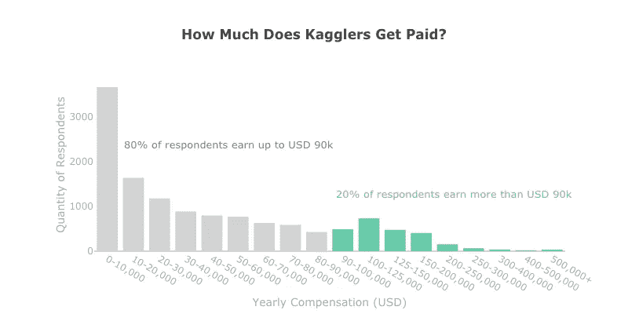

Data: [Second Annual Machine Learning and Data Science Survey](https://www.kaggle.com/kaggle/kaggle-survey-2018) by Kaggle. Chart: Author

工资在较低的范围内累积(每年高达 1 万美元),在 10 万美元左右出现另一个高峰。有很多学生回答了这个调查，让我们看看他们挣多少钱？

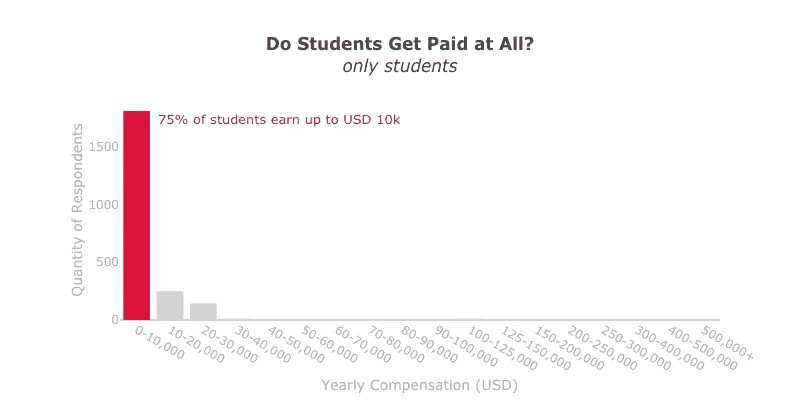

Data: [Second Annual Machine Learning and Data Science Survey](https://www.kaggle.com/kaggle/kaggle-survey-2018) by Kaggle. Chart: Author

不出所料，学生挣得没那么多，因为他们还没有工作。有了这些信息，我们可以从我们的数据中剔除学生，并定义收入最高的 20%的 Kagglers 挣多少钱。

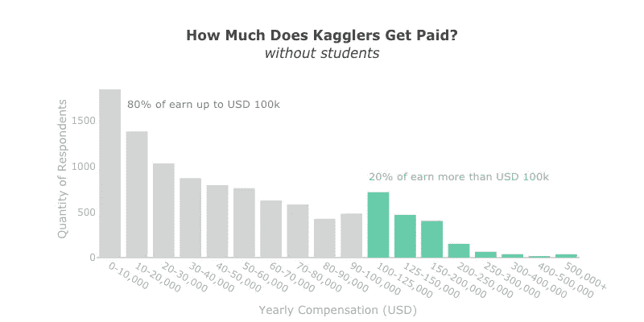

Data: [Second Annual Machine Learning and Data Science Survey](https://www.kaggle.com/kaggle/kaggle-survey-2018) by Kaggle. Chart: Author

根据这些数据，我们将建模的目标变量定义如下:

> 我们将计算卡格勒年收入超过 10 万美元的概率。

## 数据科学中的性别失衡

在继续讨论模型本身之前，我只想让你知道，收入最高的 20%的人的工资存在性别失衡，但收入最低的 80%的人的工资几乎相同。这意味着担任领导职务的男性比女性的工资高。见下表:

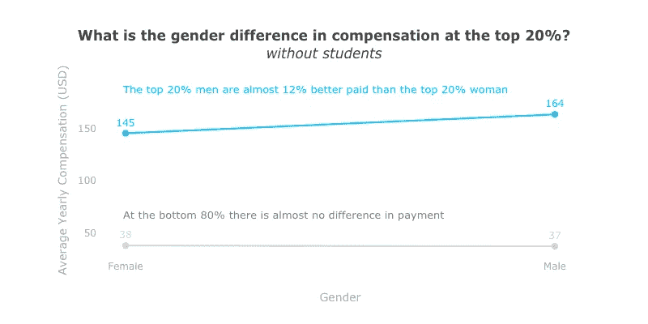

Data: [Second Annual Machine Learning and Data Science Survey](https://www.kaggle.com/kaggle/kaggle-survey-2018) by Kaggle. Chart: Author

你可以在这里看到完整的 EDA。

# 预测模型

为了建立这个模型，我们从 50 个问题中的 29 个问题中提取了可以解释高工资的特征。这些问题总共产生了 138 个特征。在一些数据清理之后，我们运行了逻辑回归和随机森林模型。

评估后，逻辑回归表现更好。该模型还具有提取特征系数的优点。这有助于了解每个功能如何影响最终结果(收入最高的前 20%)。我们做了欠采样、交叉验证和网格搜索，所有代码都可供检查[在这里](https://www.kaggle.com/andresionek/what-makes-a-kaggler-valuable)。

下面我们展示了模型在测试数据上的表现以及前 20%和后 80%组的分数分布。

```
### -- ### -- LogisticRegression -- ### -- ###
**MODEL PERFORMANCE ON TEST DATA****Accuracy:**  0.8167438271604939
**AUC: ** 0.8963917030007695**Confusion Matrix: ** 
[[1817  411]
 [  64  300]]**Type 1 error:**  0.18447037701974867
**Type 2 error:**  0.17582417582417584
```

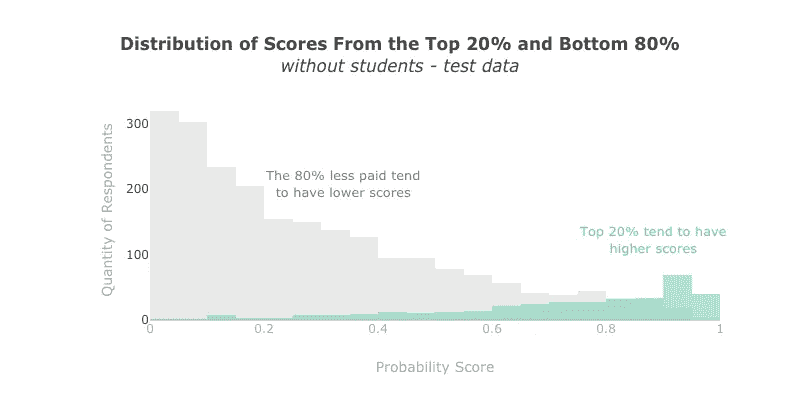

Model performance: prediction scores for Top 20% most paid and to Bottom 80%. Data: [Second Annual Machine Learning and Data Science Survey](https://www.kaggle.com/kaggle/kaggle-survey-2018) by Kaggle. Chart: Author

# 增加收入的方法

在特征选择之后，我们的模型总共有 124 个特征。从它们的系数中，我们可以得出一些想法，可能会帮助你找到你的钱堆。

我们模型的截距是 0。这意味着每个人都从 0 分开始。然后，根据你对每个问题的回答，你可以在你的分数上加减“分”。

*   **正系数:**如果系数为正，意味着一个肯定的答案增加了属于前 20%的机会。
*   **负系数:**如果系数为负，那么正答案会降低属于前 20%的概率。

**要点:**要有积极向上的态度。不要做消极的事情。

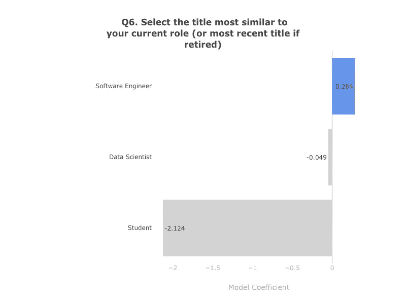

Model coefficients. Data: [Second Annual Machine Learning and Data Science Survey](https://www.kaggle.com/kaggle/kaggle-survey-2018) by Kaggle. Chart: Author

成为一名学生可能会带来挫败感和较低的薪水。出去找份工作！成为一名数据科学家是一个伟大的想法，但软件工程师赚得更多。为什么不成为一名 B 型数据科学家，并将模型部署到生产中呢？

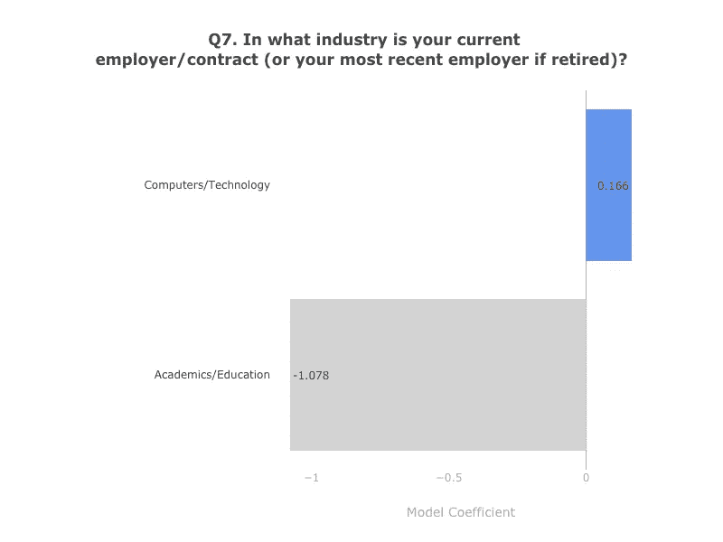

Model coefficients. Data: [Second Annual Machine Learning and Data Science Survey](https://www.kaggle.com/kaggle/kaggle-survey-2018) by Kaggle. Chart: Author

如果你想发财，就从学术/教育上跑。在 EDA 的[完整研究中，你会看到与其他行业相比，学术/教育行业的平均薪酬最低，这一点得到了模型系数的证实。数据科学未来最重要的领域之一是工资最低的领域，这让我很难过。如果你想挣得更多，那么在计算机/技术行业工作会增加你成为收入最高的前 20%的可能性。](https://www.kaggle.com/andresionek/what-makes-a-kaggler-valuable)

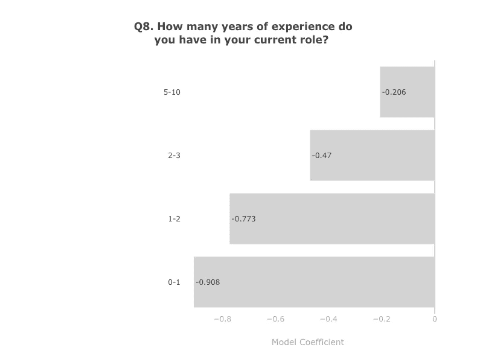

Model coefficients. Data: [Second Annual Machine Learning and Data Science Survey](https://www.kaggle.com/kaggle/kaggle-survey-2018) by Kaggle. Chart: Author

显然，随着你越来越有经验，预计你会挣得更多。现实一点，仅仅有 2 年的经验，你是不可能进入前 20%的。


Model coefficients. Data: [Second Annual Machine Learning and Data Science Survey](https://www.kaggle.com/kaggle/kaggle-survey-2018) by Kaggle. Chart: Author

当涉及到活动时，尝试构建原型或机器学习服务。探索 ML 在新领域的应用，并利用它来改进您的产品或工作流程，是接近年收入超过 10 万美元的方法。

另一方面，如果你工作的一个重要部分是做商业智能，分析和理解数据，以影响产品或商业决策，那么你应该期待赚得更少。如果您运行数据基础架构，情况也是如此。

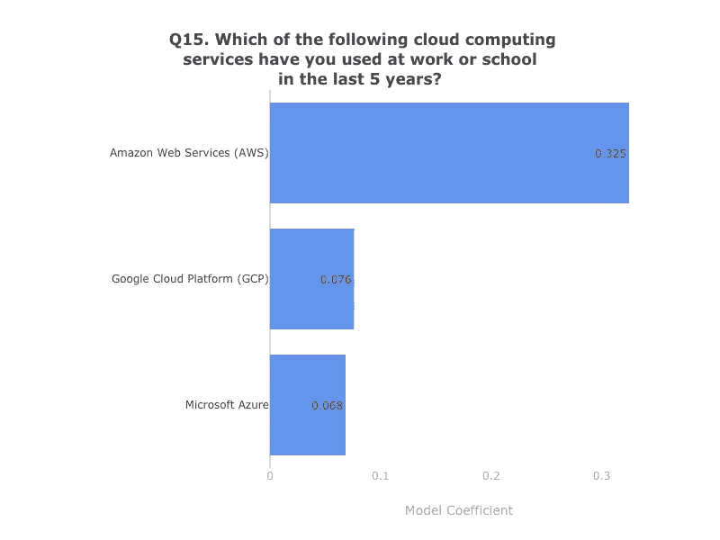

使用云计算服务！习惯 AWS，或其他领先的云提供商，如谷歌或微软。

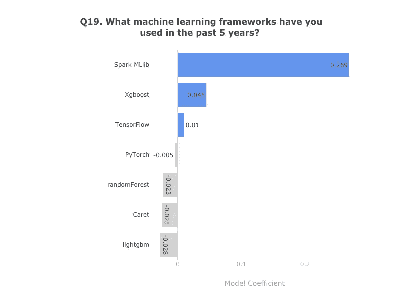

Model coefficients. Data: [Second Annual Machine Learning and Data Science Survey](https://www.kaggle.com/kaggle/kaggle-survey-2018) by Kaggle. Chart: Author

有一些机器学习框架可能会增加你的市场价值。学习和使用 SparkMLlib、Xgboost 和 TensorFlow 会为你的简历增色不少。

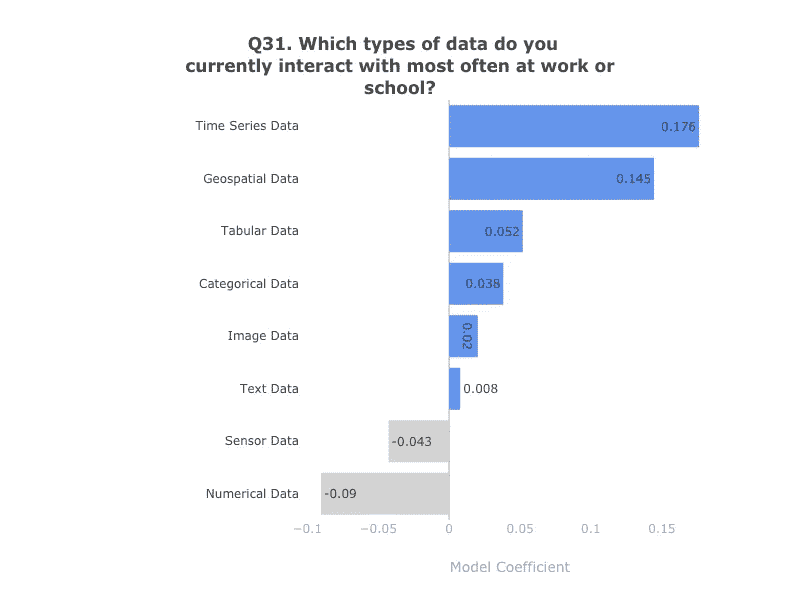

Model coefficients. Data: [Second Annual Machine Learning and Data Science Survey](https://www.kaggle.com/kaggle/kaggle-survey-2018) by Kaggle. Chart: Author

当谈到可能会增加你的薪酬的数据类型时，尝试学习时间序列和地理空间数据并从中获得经验。每个人都与数字数据打交道，所以学习基础知识，然后学习更高级的数据类型，如果你想在工资支票上有好消息的话。


Model coefficients. Data: [Second Annual Machine Learning and Data Science Survey](https://www.kaggle.com/kaggle/kaggle-survey-2018) by Kaggle. Chart: Author

你知道如何做扰动重要性或情绪分析吗？如果你没有，那么是时候学习了。*我希望这篇文章能给你一些关于模范生考试的提示。*

要查看更多的结果和想法[请查看 Kaggle 上的公共内核](https://www.kaggle.com/andresionek/what-makes-a-kaggler-valuable)。在这里，我们给出了 124 个提示，帮助你在数据科学工作中找到你的钱。


也许有一天我们会发现自己躺在一堆钱上。但不像巴比诺先生，这将是我们的钱。这将是合法的。

## 对这篇文章有什么想法吗？

如果你有任何批评或建议来改进这个分析，请告诉我！