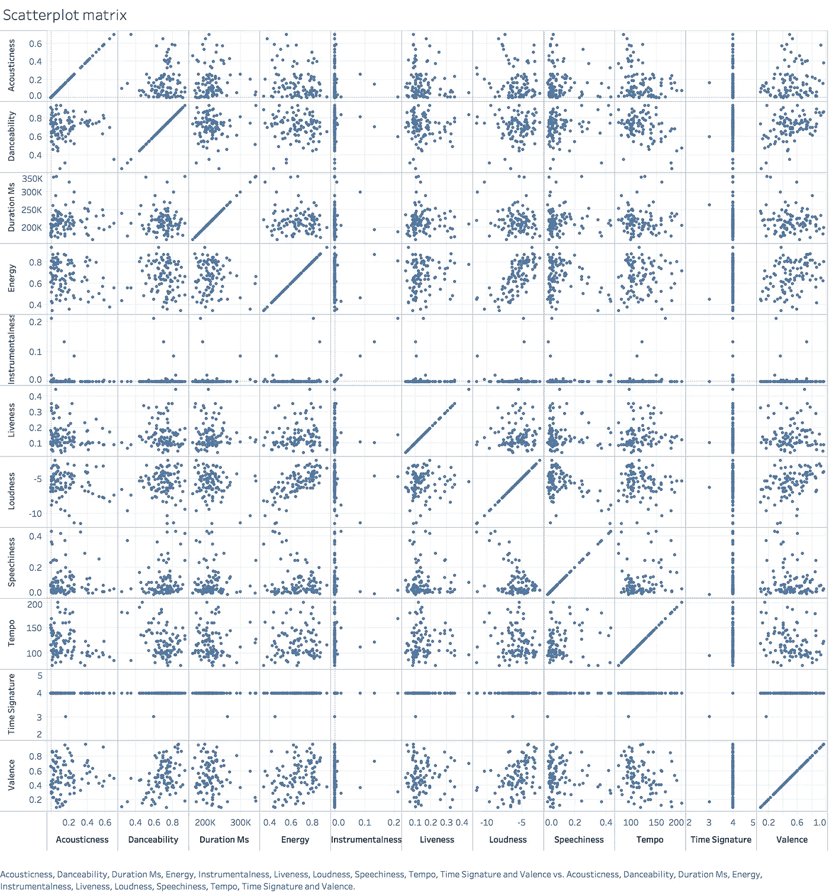
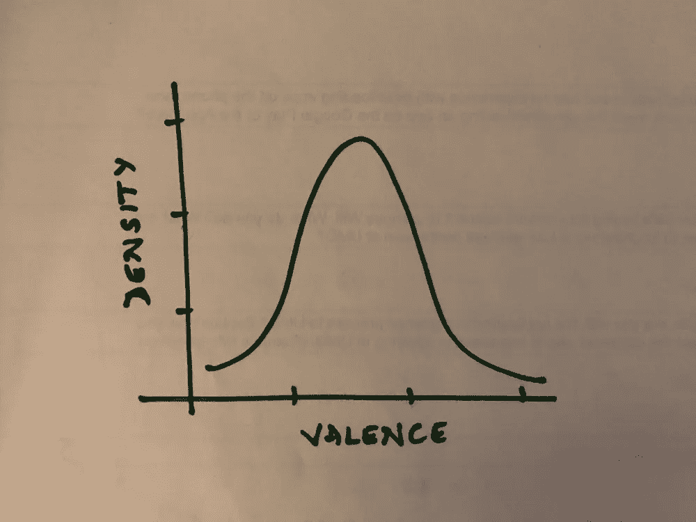
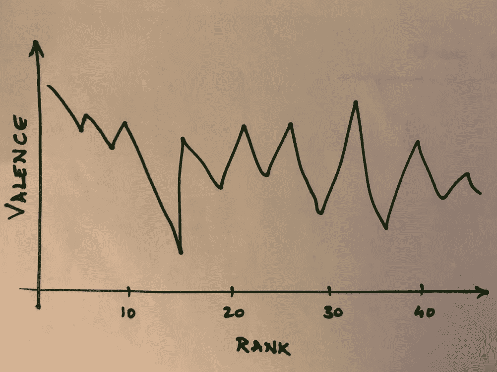
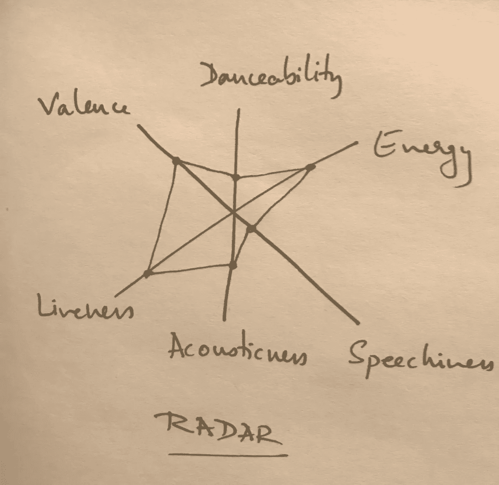
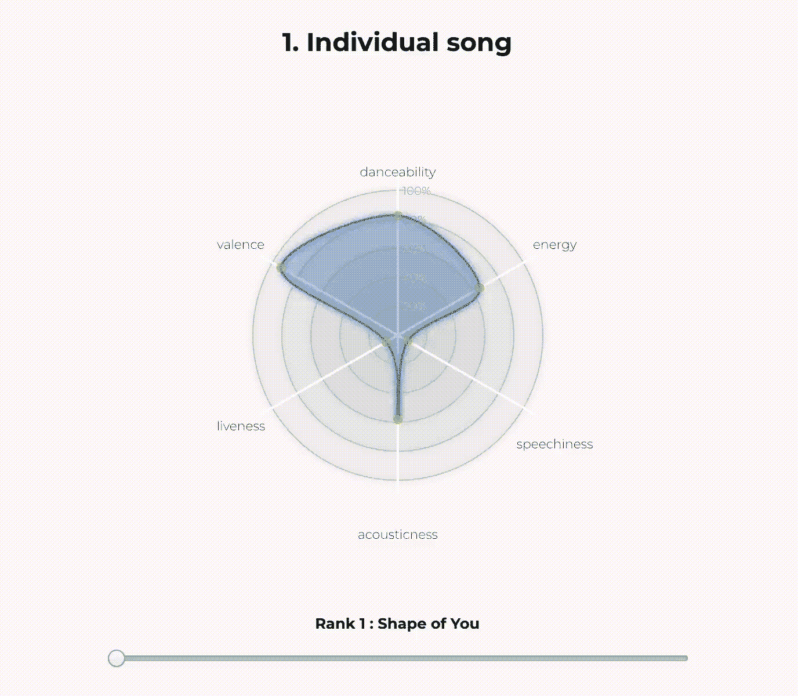
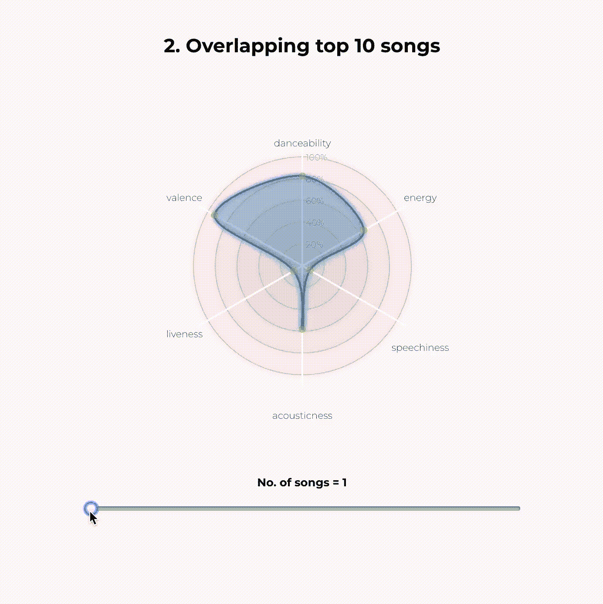
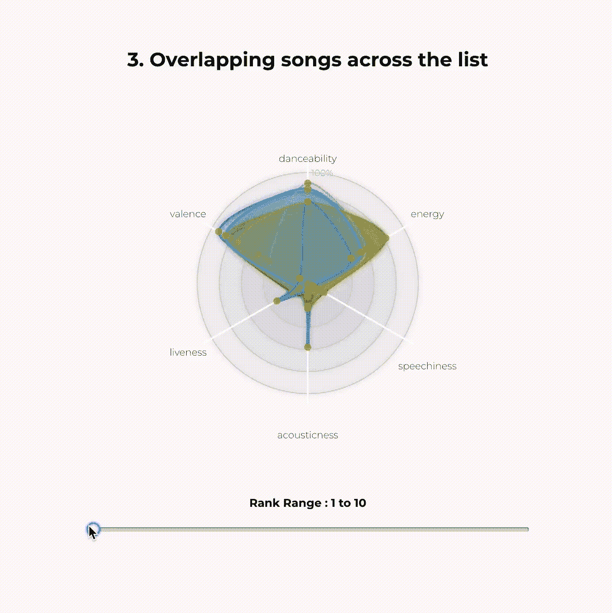

# 是什么让一首歌变得可爱？

> 原文：<https://towardsdatascience.com/what-makes-a-song-likeable-dbfdb7abe404?source=collection_archive---------8----------------------->

## 使用数据可视化分析 Spotify 的 2017 年热门曲目

Photo by [Heidi Sandstrom.](https://unsplash.com/@bravelyventure?utm_source=medium&utm_medium=referral) on [Unsplash](https://unsplash.com?utm_source=medium&utm_medium=referral)

关于音乐选择是主观还是客观的争论由来已久。有些人，像杰克·弗莱明在他的[观点专栏](https://www.themaneater.com/stories/opinion/objectivity-vs-subjectivity-music)中，站在了客观的一方，说“在音乐分析中使用主观性会使其变得不重要。”他接着说，像其他艺术形式一样，我们也需要对音乐有一个判断的基础。在文章 [*音乐中的客观性与主观性:最终指南和解决方案*](https://rateyourmusic.com/list/Carcinogeneticist/objectivity-vs-subjectivity-in-music-the-ultimate-guide-and-solution/) 中，作者“致癌论者”试图给出一个平衡的观点，认为两种观点都有其优点和缺点。他提出了一个理论，“事实是，客观性和主观性是相互关联的，可能存在于一个光谱上”。主观性几乎不可能分析。但是如果从等式中去掉主观性，所有的艺术价值都可以被理性地剖析。

但是我想分析一首歌的另一个方面——流行度。不管歌曲的质量如何，也不管作曲和演奏的天赋如何，几乎不可能知道是什么让一首歌流行起来。作为一个音乐人，我一直很好奇到底是什么让一首歌受到大众的喜爱。为了找到答案，我决定使用数据可视化来寻找 Spotify 策划的 2017 年热门曲目*列表中的模式和趋势。*

Spotify 是当今领先的音乐流媒体应用程序之一，截至 2018 年 6 月，拥有超过 8300 万付费订户。他们根据用户播放歌曲的次数编制了一份年度排行榜。

## **Spotify 音频功能**

对于他们平台上的每首歌曲，Spotify 都提供了十三个*音频功能*的数据。[*Spotify**Web API 开发者指南*](https://developer.spotify.com) 对它们的定义如下:

*   **可跳舞性:**根据音乐元素的组合，包括速度、节奏稳定性、节拍强度和整体规律性，描述一首曲目是否适合跳舞。
*   **价:**描述一首曲目所传达的音乐积极性。高价曲目听起来更积极(例如，快乐、愉快、欣快)，而低价曲目听起来更消极(例如，悲伤、沮丧、愤怒)。
*   **能量:**代表强度和活动的感知度量。通常，高能轨道感觉起来很快，很响，很嘈杂。例如，死亡金属具有高能量，而巴赫前奏曲在音阶上得分较低。
*   **速度:**轨道的整体估计速度，单位为每分钟节拍数(BPM)。在音乐术语中，速度是给定作品的速度或节奏，直接来源于平均节拍持续时间。
*   **响度:**一个音轨的整体响度，单位为分贝(dB)。响度值是整个轨道的平均值，可用于比较轨道的相对响度。
*   **语音:**检测音轨中是否存在语音。越是类似语音的录音(例如脱口秀、有声读物、诗歌)，属性值就越接近 1.0。
*   **乐器性:**预测音轨是否不包含人声。“Ooh”和“aah”在这种情况下被视为乐器。Rap 或口语词轨道明显是“有声的”。
*   **活跃度:**检测录像中是否有观众。较高的活跃度值表示音轨被现场执行的概率增加。
*   **声学:**从 0.0 到 1.0 的音轨是否声学的置信度度量。
*   **Key:** 估计的音轨整体 Key。整数映射到使用标准[音高等级符号](https://en.wikipedia.org/wiki/Pitch_class)的音高。例如，0 = C，1 = C♯/D♭，2 = D，等等。
*   **调式:**表示音轨的调式(大调或小调)，音阶的类型，其旋律内容来源于此。大调用 1 表示，小调用 0 表示。
*   **持续时间:**以毫秒为单位的音轨持续时间。
*   **拍号:**一个音轨的估计整体拍号。拍号(拍子)是一种符号约定，用于指定每个小节(或小节)中有多少拍。

## **数据集**

我发现，我需要从 Spotify 获得的数据已经可以在 Kaggle 上作为数据集获得，由 *Nadin Tamer* 撰写的“[2017](https://www.kaggle.com/nadintamer/top-tracks-of-2017)顶级 Spotify 曲目”。我检查了数据，发现它已经被清理，没有验证错误。它缺少一个用于歌曲排名的字段，这是我添加的。

## **初始探索**

在上述参数中，Mode 是二进制值 1 或 0，表示音轨的模态(大调或小调)，Key 是绝对整数值，表示歌曲的音阶(C =0，C# = 1，等等)。)因此，我保留了这 2 个参数，并用剩余的 11 个参数创建了散点图矩阵。

我创建散点图矩阵有两个主要目的:

1.  看看参数之间有没有关系。
2.  找到明显的趋势和模式，以便更好地确定重点领域。

**Scatterplot matrix of the *Audio Feature* parameters**

散点图中的一些观察结果如下:

*   拍号——几乎所有的歌曲似乎都有一个共同的 4/4 拍号。因此，我不再考虑这个参数。
*   乐器性—大多数歌曲的值似乎接近或等于 0。再次删除参数。
*   能量和响度似乎成正比。
*   价似乎与可跳性、能量和响度成正比。

根据 API 指南中的参数定义，速度和响度似乎是低级参数，用于计算其他高级参数，如价、能量和可跳舞性。因此，为了减少类似的参数，我将在接下来的步骤中忽略速度和响度。我也放弃了持续时间参数，因为大多数曲目似乎都在 200 秒或 3:20 分钟左右。

**初始草图**

现在我只剩下六个参数，我勾画了一些探索如何理解数据的方法，如密度图或绘制每个参数相对于等级的变化。但是这些都不能产生吸引人的视觉效果，以吸引人的方式向观众传达信息。

当我在寻找表示多个参数的方法时，我想起了**雷达图**！

它们简单易懂，一眼就能看出所有六个参数。这正是我所需要的！

## **实现**

我最初在 Tableau 上实现它，但它看起来很无聊。视觉吸引力是我的项目的一个重要方面。因此，当我在网上搜索不仅实现雷达图，而且以一种漂亮的方式实现它的方法时，我偶然发现了 [Nadieh Bremer](https://medium.com/u/2c47aca9abda?source=post_page-----dbfdb7abe404--------------------------------) 的博客 ***Visual Cinnamon*** 和她的关于她[重新设计 D3 的雷达图](https://www.visualcinnamon.com/2015/10/different-look-d3-radar-chart.html)的文章，我知道就是它了！在麻省理工学院的许可下，她的重新设计的实施细节可以在 http://bl.ocks.org/nbremer/21746a9668ffdf6d8242 找到。

这篇博文是 2015 年的，因此代码是针对更老版本的 D3.js(v3)的。我以前涉猎过 Javascript，但对 D3 完全陌生，所以更新 API 和让代码在 v5 上工作需要一些争论。我还不得不花一些时间格式化数据。

我把它设置成从排名 1 到 100 一次显示一首歌。第一眼的时间到了..

既然图表完全按照我想要的方式工作，是时候用它来引出一些见解了。为了做到这一点，我决定看看如果我重叠多首歌曲来寻找参数的趋势会发生什么。为了防止过度拥挤，我从排名前 10 的歌曲开始。

## **见解**

你已经可以开始看到前 10 首歌曲中出现的模式:

*   前 10 名歌曲的可舞性都很高(60%以上)！
*   除了排名第一的歌曲(Shape of You)，其他所有歌曲的音质都很低。
*   所有前 10 名的歌曲都缺乏活力和语音，也就是说，所有的歌曲都是录音版本，只有很少的部分是语音多音乐少。
*   所有的歌曲都是相当中高能量的(40-80%)
*   化合价相当分散。

> P.S. Medium 仅支持图像，因此是 gif。请[点击此处](https://ashrithshetty.com/datavis)查看实际的互动可视化效果。

为了对此进行扩展，我还创建了一种方法来查看从排名 1 到 100 的 10 人组:

## **最终见解**

*   除了少数例外，总体而言，可跳舞性似乎仍有很高的价值。
*   现在我们可以看到更多音质更好的歌曲。但仍不超过 60–70%左右。
*   活跃度和语速仍然一致很低。
*   能量似乎仍处于中高水平。
*   化合价仍然相当分散，但总体上看起来在中高级区域更为普遍。

## **结论**

想做一首热门歌曲？为了增加你的机会，让它成为一个高能量，电子，舞蹈号码！保持一个简单的 4/4 拍号，不需要把事情复杂化。尝试将歌曲的持续时间保持在最佳的 3:20 分钟左右。确保它是在录音室录制的，而不是现场的，在你的歌曲中有声音，但不要太“言语化”，并且不会伤害到它的高价，即快乐，愉快，和/或欣快。

你可以在这里 查看最终的交互可视化 [**。**](https://ashrithshetty.com/datavis)

***非常，非常感谢***[***Karthik Badam***](https://medium.com/u/2de4641aaa71?source=post_page-----dbfdb7abe404--------------------------------)***给予的所有指导和支持，并感谢***[***Nadieh Bremer***](https://medium.com/u/2c47aca9abda?source=post_page-----dbfdb7abe404--------------------------------)***为她与 D3.js.*** ***的精彩而富有洞察力和鼓舞人心的工作，没有他们就不可能有这个项目！***