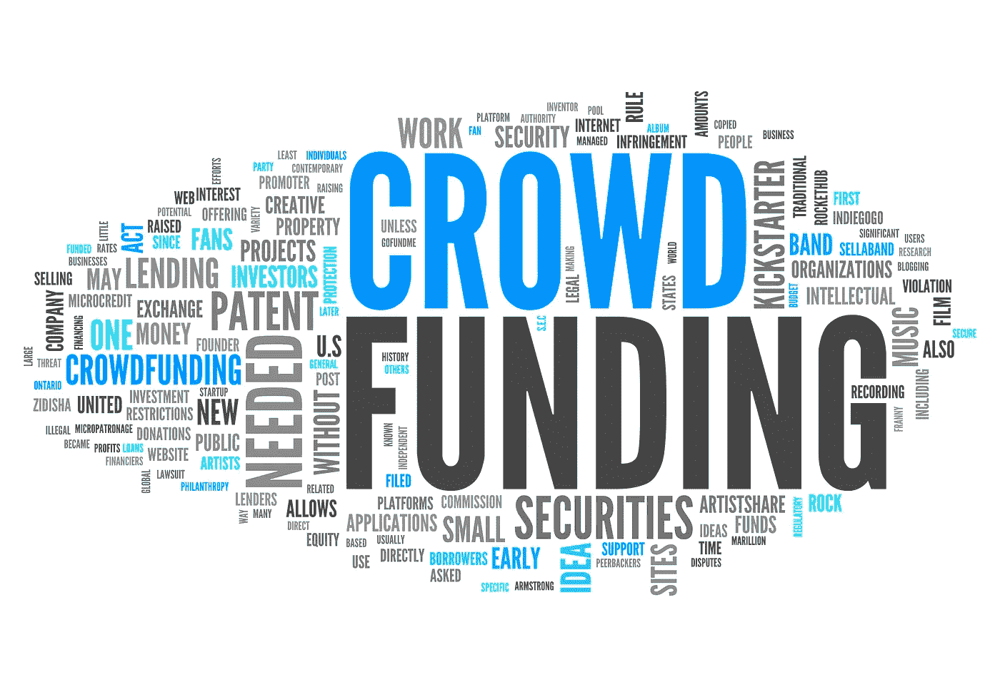
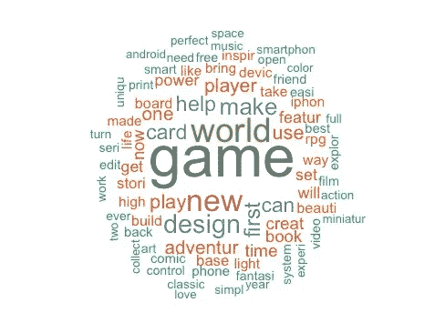
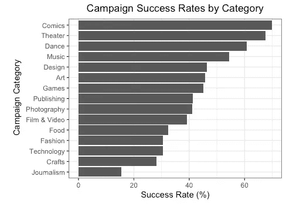

# 是什么成就了一次成功的 Kickstarter 活动？

> 原文：<https://towardsdatascience.com/what-makes-a-successful-kickstarter-campaign-ad36fb3eaf69?source=collection_archive---------2----------------------->

## 分析 2000 多个众筹项目的主要发现

Image from [DepositPhotos](https://www.google.com/url?sa=i&url=https%3A%2F%2Fdepositphotos.com%2F46042645%2Fstock-photo-word-cloud-crowd-funding.html&psig=AOvVaw2cABIe7LMNKi5AOHpxBwQd&ust=1625447527627000&source=images&cd=vfe&ved=0CAoQjRxqFwoTCICY-YaeyPECFQAAAAAdAAAAABAD)

自 2009 年以来，众筹一直是企业家和个人测试他们的想法、提高意识和为他们的项目获得初始资金的热门选择。紧随大萧条之后，像 Kickstarter 和 Indiegogo 这样的公司已经进行了国际扩张，并实现了数亿美元的估值。

仅 Kickstarter 就支持了超过 130，000 个项目，捐款总额超过 1，000，000 美元 3B。

我很想知道最成功的活动有哪些特征，并希望应用我在学校学到的一些数据科学技术，所以今年夏天我分析了 2000 多个 Kickstarter 活动，并建立了一个模型来预测特定活动是否会成功。

我从 [Kaggle 的 Kickstarter 数据集](https://www.kaggle.com/socathie/kickstarter-project-statistics)开始，添加了一些额外的功能，将一个活动的标题/广告词与 4000 个最成功的活动的标题/广告词进行比较。

以下是我在分析中发现的一些有趣的事情:

## 最受支持的活动

Most common words used in the descriptions of the 4000 Most Backed Campaigns

在最受支持的活动中，最常用的词是游戏、世界、新、设计和制造。然而，事实证明，成功和失败的竞选活动都频繁使用这些词，所以竞选活动描述的内容并不能很好地预测竞选活动的成功。

**类别对比**

成功率最高的 5 个类别是漫画、戏剧、舞蹈、音乐和设计。食品、时尚、技术、工艺和新闻是最不成功的类别。我注意到，比较成功的类别通常是容易与他人分享的东西(如舞蹈或音乐)，而不太成功的类别通常更难分享。

**预测竞选成功**

我构建的最准确的模型，在 75%的情况下正确预测了营销活动的成功，使用了以下功能(按重要性排序):

1.  项目负责人之前支持的活动数量(与活动成功正相关)
2.  活动简介中的图片数量(与活动成功正相关)
3.  资金目标(与活动成功负相关)
4.  类别(相关性取决于特定的类别)
5.  活动持续时间(与活动成功负相关)
6.  项目负责人之前创建的活动数量(与活动成功正相关)
7.  项目合作者数量(与活动成功正相关)
8.  活动标题的长度(与活动成功负相关)
9.  标题中与 4000 个最受支持的活动匹配的字数(与活动成功负相关)

这些结果确实加强了 Kickstarter 的社区方面，因为活动成功的最佳预测因素是用户捐赠的活动数量。不出所料，如果你过去发起过 Kickstarter 活动，你更有可能成功。

除了这个模型，我还开发了一个 web 应用程序，让人们可以输入关于他们竞选活动的信息，并获得关于竞选是否会成功的预测，以及提高他们胜算的建议。你可以去 https://nbenavides.shinyapps.io/kickstarter/的看看。