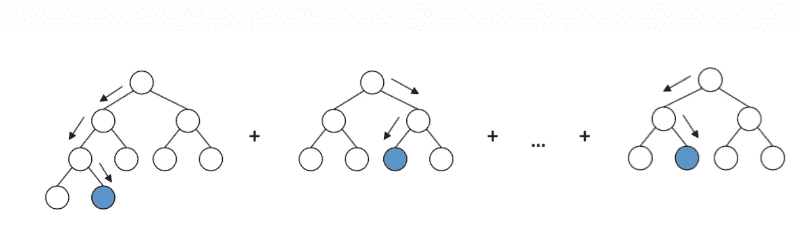
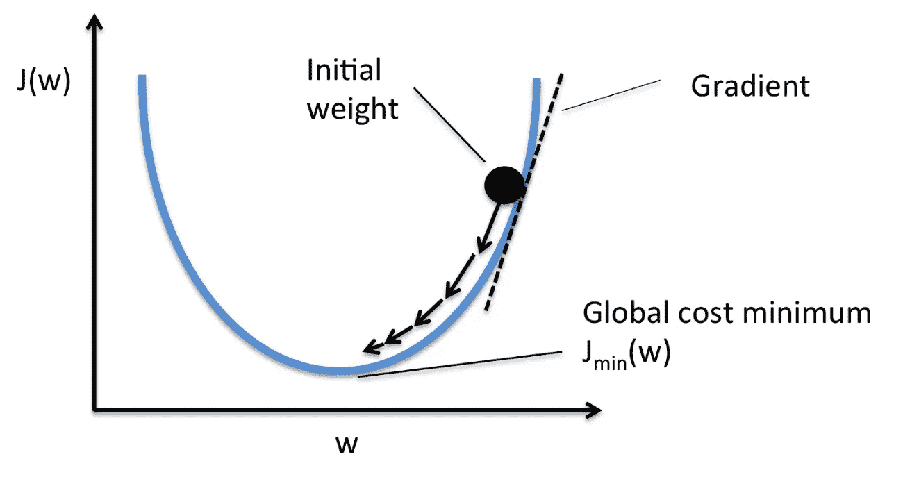
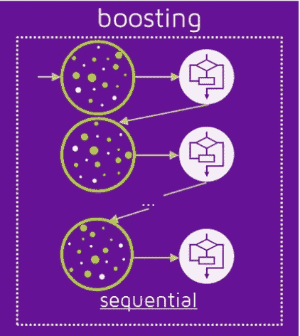
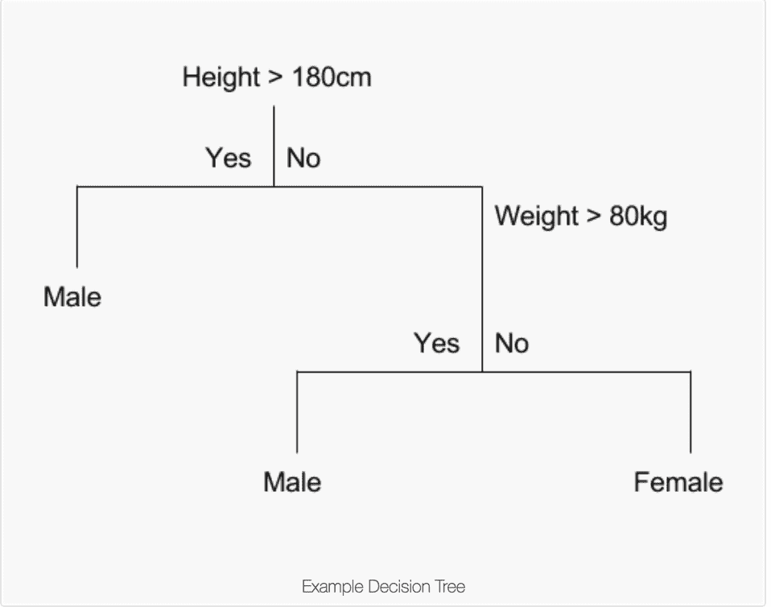
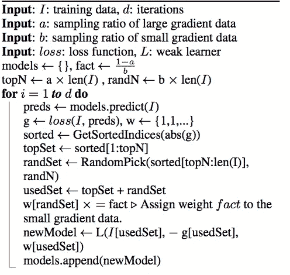
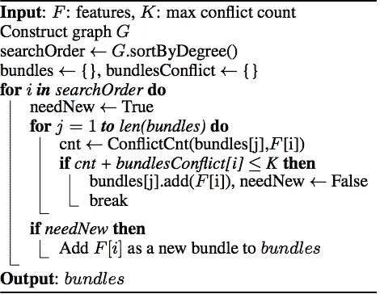
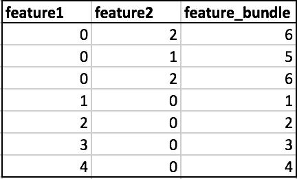
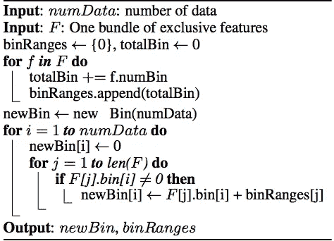

# 是什么让 LightGBM 快如闪电？

> 原文：<https://towardsdatascience.com/what-makes-lightgbm-lightning-fast-a27cf0d9785e?source=collection_archive---------4----------------------->

## 理解戈斯和 EFB:light GBM 的核心支柱

Source : [http://arogozhnikov.github.io/2016/06/24/gradient_boosting_explained.html](http://arogozhnikov.github.io/2016/06/24/gradient_boosting_explained.html)

该员额的结构如下:

1.GBM 基础。

2.GBM 的计算瓶颈。

3.LightGBM 对这些瓶颈的优化

## **GBM 基础——梯度下降、升压和 GBDT。**

> **什么是梯度下降？**

**Gradient descent graph :** Example of working with the gradient descent method

这是一种优化技术，通过以固定步长跟随斜率来降低损失函数。

> **什么是助推？**

Boosting 是一种顺序集成技术，其中难以分类的实例被赋予更多的权重。这实质上意味着后续的学习者将更加重视学习错误分类的数据实例。最终模型将是 n 个弱学习者的加权平均值。

[https://quantdare.com/what-is-the-difference-between-bagging-and-boosting/](https://quantdare.com/what-is-the-difference-between-bagging-and-boosting/)

随后的学习者更加重视训练不足/错误分类的样本。点大小的变化代表了赋予该实例的权重。点的大小越大，分配给它的权重就越大。请注意，所有模型都是连续的。

> 什么是 GBDT？

GBDT(Gradient Boosting Decision Tree)是一种顺序训练的决策树的集成模型(即 Boosting 的集成模型)。在每次迭代中，GBDT 通过拟合残差(到当前迭代为止的误差)来学习决策树。这意味着每个随后的学习者试图学习实际输出和预测的加权和之间的差异，直到迭代之前。使用梯度法可以使误差最小化。

这就把我们带到了文章的第二部分。GBDT 最昂贵的操作是训练决策树，最耗时的任务是寻找最佳分裂点。

**什么是拆分点？**

*Source :* [*https://machinelearningmastery.com/classification-and-regression-trees-for-machine-learning/*](https://machinelearningmastery.com/classification-and-regression-trees-for-machine-learning/)

分割点是特征值，取决于在树节点上分割的数据。在上面的例子中，数据分割发生在节点 1 的高度(180)和节点 2 的重量(80)。基于信息增益从候选分裂池中选择最佳分裂。换句话说，选择具有最大信息增益的分裂点。

> **最佳分割点是如何产生的？**

分裂查找算法用于查找候选分裂。
最流行的分裂查找算法之一是 ***预排序算法*** ，它列举了预排序值上所有可能的分裂点。这种方法很简单，但是在计算能力和内存方面效率很低。
第二种方法是基于 ***直方图的算法*** ，该算法在训练期间将连续的特征桶入离散的箱中以构建特征直方图。直方图构建的开销为 O(#data * #feature)，分裂点查找的开销为 O(#bin * #feature)。由于 bin < <数据直方图的建立将支配计算的复杂性。

*Binning example : Binning has greatly reduced the number of candidate splits*

与使用 GBM 的 sklearn 相比，LightGBM 和 xgboost 都使用基于直方图的分裂查找(这是它速度慢的原因之一)。让我们从这篇文章的症结开始

> ***是什么让 LightGBM 与众不同？***

LightGBM 旨在通过使用 ***【高斯】*** 和 ***EFB 对数据和特征进行下采样来降低直方图构建的复杂度。*** 这将降低 **(O(data2 * bundles))** 的复杂度，其中 **data2 <数据和 bundles < <特性**。

> **高斯是什么？**

GOSS(Gradient Based One Side Sampling)是一种基于梯度对样本进行下采样的新型采样方法。正如我们所知，梯度小的实例训练良好(训练误差小)，梯度大的实例训练不足。一种简单的下采样方法是通过只关注具有大梯度的实例来丢弃具有小梯度的实例，但是这将改变数据分布。简而言之，GOSS 保留具有大梯度的实例，同时对具有小梯度的实例执行随机采样。

1.  **高斯计算的直观步骤
    1**。**根据绝对梯度以降序对实例进行排序
    2。选择前 a * 100%个实例。【欠训练/大梯度】
    3。从其余数据中随机抽取 b * 100%的实例。这将通过因子 b ( b < 1 )
    4 减少训练有素的例子的贡献。没有点 3，具有小梯度的样本计数将是 1-a(目前是 b)。为了保持原始分布光，GBM 通过常数(1-a)/b 放大具有小梯度的样本的贡献，以将更多焦点放在训练不足的实例上。这将更多的注意力放在训练不足的实例上，而不会改变太多的数据分布。**

*2。* ***形式算法为戈斯***

Algorithm 2 from the original paper

> **什么是 EFB(独家功能捆绑)？**

记住直方图构建需要 O(#data * #feature)。如果我们能够向下采样#特性，我们将加快树学习。LightGBM 通过将特性捆绑在一起来实现这一点。我们通常处理高维数据。这种数据有许多相互排斥的特征，即它们从不同时取零值。LightGBM 安全地识别这样的特征，并将它们捆绑成单个特征，以将复杂度降低到 ***O(#data * #bundle)*** 其中#bundle < < #feature。

**EFB 的第 1 部分:识别可以捆绑在一起的特性**

创建功能包的直观说明

1.  构建一个带加权边(衡量要素间冲突的标准)的图。冲突是具有重叠非零值的排他性特征的比例的度量。
2.  按非零实例数降序对要素进行排序。
3.  遍历特征的有序列表，并将该特征分配给现有束(如果冲突< threshold) or create a new bundle (if conflict >阈值)。

***捆绑特性的形式化算法***

Algorithm 3 from the official paper

**EFB 第二部分:特征合并算法**

我们将通过一个例子来理解合并特征背后的直觉。但在此之前，让我们先回答以下问题:

> EFB 在实现什么？

EFB 正在合并这些功能，以降低训练的复杂性。为了保持合并的可逆性，我们将把独有的特征保存在不同的容器中。

> **合并的例子**

在下面的示例中，您可以看到功能 1 和功能 2 是互斥的。为了实现不重叠的桶，我们增加了特征 1 到特征 2 的包大小。这确保了捆绑特征(特征 1 和特征 2)的非零数据点位于不同的桶中。在 feature_bundle 中，存储桶 1 到 4 包含 feature1 的非零实例，存储桶 5、6 包含 feature2 的非零实例。

**合并特征的直观说明**

1.  计算要添加到特征包中每个特征的偏移量。
2.  迭代每个数据实例和特征。
3.  对于所有特性都为零的情况，将新桶初始化为零。
4.  通过将各自的偏移量添加到该特征的原始桶中，为特征的每个非零实例计算新桶。

**特征合并的形式算法**

Algorithm 4 from the official paper

至此，我们已经涵盖了原始论文中提出的大多数优化。我希望这篇文章能让你对 LightGBM 库的核心概念有所了解。至此，我完成了写博客的第一次尝试。请在下面分享您的想法、反馈或建议。

***参考文献***

1.  [https://papers . nips . cc/paper/6907-light GBM-a-high-efficient-gradient-boosting-decision-tree . pdf](https://papers.nips.cc/paper/6907-lightgbm-a-highly-efficient-gradient-boosting-decision-tree.pdf)
2.  [https://quant dare . com/bagging-and-boosting 的区别是什么/](https://quantdare.com/what-is-the-difference-between-bagging-and-boosting/)
3.  [http://ml explained . com/2018/01/05/light GBM-and-xgboost-explained/](http://mlexplained.com/2018/01/05/lightgbm-and-xgboost-explained/)
4.  [https://github.com/Microsoft/LightGBM](https://github.com/Microsoft/LightGBM)