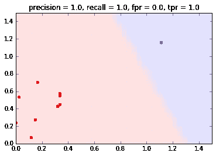
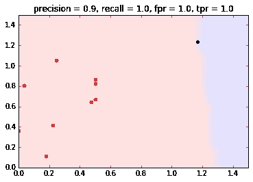
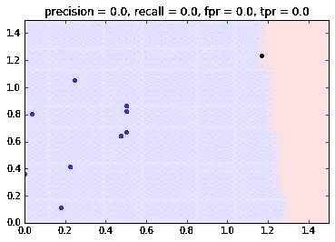
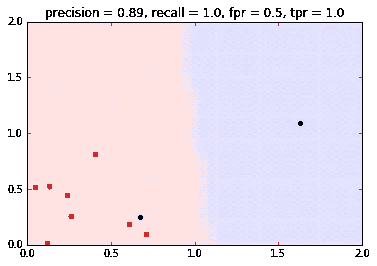
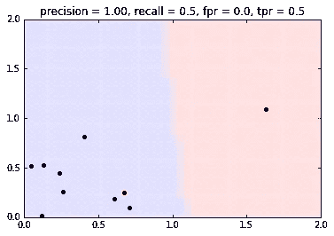
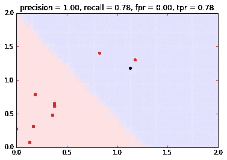
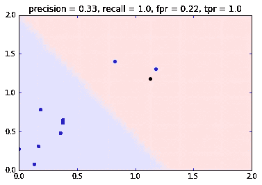

# 在不平衡数据集上评估模型应该使用什么指标？(精确度+召回率或 ROC=TPR+FPR)

> 原文：<https://towardsdatascience.com/what-metrics-should-we-use-on-imbalanced-data-set-precision-recall-roc-e2e79252aeba?source=collection_archive---------0----------------------->

我一直认为度量的主题有点令人困惑，特别是当数据集不平衡时(这在我们的常见问题中经常发生)。为了澄清一些事情，我决定用不同类型的指标测试几个简单的不平衡数据集的例子，看看哪个更正确地反映了模型性能——ROC 曲线指标——TPR 和 FPR 或精度或召回。

# 定义

所以让我们从提醒自己这些定义开始。

在 [ROC 曲线](https://en.wikipedia.org/wiki/Receiver_operating_characteristic)中我们看:
**TPR(真阳性率)= #真阳性/ #阳性=召回= TP / (TP+FN)
FPR(假阳性率)= #假阳性/ #阴性= FP / (FP+TN)**

这里我们将关注单点的 TPR(真阳性率)和 FPR(假阳性率)(这将表明由 TPR 和 FPR 通过各种概率阈值组成的 [ROC 曲线](https://en.wikipedia.org/wiki/Receiver_operating_characteristic)的总体表现)。

[精度和召回率](https://en.wikipedia.org/wiki/Precision_and_recall)分别是:
**精度=#真阳性/ #预测阳性= TP/(TP+FP)
召回= #真阳性/ #阳性= TP / (TP+FN)**

# 有什么区别？

召回率和真阳性率(TPR)是完全一样的。所以区别在于精度和假阳性率。

这两种度量的主要区别在于，精度分母包含假阳性，而假阳性率分母包含真阴性。【precision 衡量分类为阳性的样本实际为阳性的概率，而假阳性率衡量阴性样本中假阳性的比率。

# 如果有大量阴性样本，精确度可能会更高

如果阴性样本的数量非常大(也称为不平衡数据集)，假阳性率增加得更慢。因为真正的负值(在 fpr 分母中— (FP+TN))可能会非常高，使这个度量变小。
但是，Precision 不受大量阴性样本的影响，因为它测量预测为阳性的样本中真正阳性的样本数(TP+FP)。

精度在正类中比在负类中更受关注，它实际上测量**正确检测正值的概率**，而 FPR 和 TPR (ROC 度量)测量**区分类的能力**。

# 例子

这些例子只是用直观的图像来说明这些指标的一种方式。

为了可视化的目的，这里有一个简单的函数，它画出了一个给定模型的决策区域。

```
**def plot_model_boundaries**(model, xmin=0, xmax=1.5, ymin=0, ymax=1.5, npoints=40):
    xx = np.linspace(xmin, xmax, npoints)
    yy = np.linspace(ymin, ymax, npoints)
    xv, yv = np.meshgrid(xx, yy)
    xv, yv = xv.flatten(), yv.flatten()
    labels = model.predict(np.c_[xv,yv])
    plt.scatter(xv[labels==1],yv[labels==1],color='r', alpha=0.02, marker='o', s=300)
    plt.scatter(xv[labels==0],yv[labels==0],color='b', alpha=0.02, marker='o', s=300)
    plt.ylim([xmin, xmax])
    plt.xlim([ymin, ymax])
```

我创建了一个非常简单的数据集(10 个点)，并训练了一个线性 SVM 模型。下图是数据集和模型的完美决策区域。

```
**from** matplotlib **import** pyplot **as** plt
**from** sklearn.svm **import** LinearSVC
**from** sklearn.metrics **import** precision_score, recall_score, roc_curvenp.random.seed(1)
x = np.concatenate([np.zeros((8, 2)), np.zeros((1,2)), np.zeros((1,2))]) + 0.8*np.random.rand(10,2)
x[-1,0]+=1
x[-1,-1]+=1
y = np.concatenate([np.ones(9), np.zeros(1)])
model = LinearSVC()
model.fit(x,y)
predicted_labels = model.predict(x)
plot_model_boundaries(model, xmin=0, xmax=1.5, ymin=0, ymax=1.5)
plt.scatter(x[y==0,0],x[y==0,1], color='b')
plt.scatter(x[y==1,0],x[y==1,1], color='r');
fpr, tpr, thresholds = roc_curve(y, predicted_labels)
plt.title("precision = {}, recall = {}, fpr = {}, tpr = {}".format(
    precision_score(y, predicted_labels), recall_score(y, predicted_labels), fpr[0], tpr[0]));
```



My simple data set and the model decision region

# 示例#1 —大多数阳性样本和—所有阳性样本都被检测到，但也有假阳性— ROC 是更好的度量

我们在测试数据集中有 10 个样本。9 个样本为阳性，1 个为阴性。

正如我们之前看到的——在完美模型的情况下，所有指标都是完美的，但现在我们来看一个天真的模型，它预测**一切都是积极的。**

在这种情况下我们的基本度量是: **TP = 9，FP = 1，TN = 0，FN = 0。**然后我们可以计算高级指标:

**精度** = TP/(TP+FP) = 0.9，**召回** = TP/(TP+FN)= 1.0。在这种情况下，准确率和召回率都很高，但是我们有一个很差的分类器。

**TPR** = TP/(TP+FN) = 1.0， **FPR** = FP/(FP+TN) = 1.0。
**因为 FPR 很高，我们可以识别出这不是一个好的分类器。**

```
np.random.seed(1)
x = np.concatenate([np.zeros((8, 2)), np.zeros((1,2)), np.zeros((1,2))]) + 1.2*np.random.rand(10,2)
x[-1,0]+=1
x[-1,-1]+=1
y = np.concatenate([np.ones(9), np.zeros(1)])
model = LinearSVC()
model.fit(x,y)
predicted_labels = model.predict(x)
plot_model_boundaries(model, xmin=0, xmax=1.5, ymin=0, ymax=1.5)
plt.scatter(x[y==0,0],x[y==0,1], color='b')
plt.scatter(x[y==1,0],x[y==1,1], color='r');
fpr, tpr, thresholds = roc_curve(y, predicted_labels)
plt.title("precision = {}, recall = {}, fpr = {}, tpr = {}".format(
    precision_score(y, predicted_labels), recall_score(y, predicted_labels), fpr[1], tpr[1])); 
```



The classifier predicts all the labels as positive

# 示例# 1—具有相反标签的相同数据集—两个指标都为 0，因为没有“检测”

现在，我们交换标签——9 个样本是阴性，1 个是阳性。我们有一个预测一切负面的模型。我们现在的基本度量是: **TP = 0，FP = 0，TN = 9，FN = 1。因为没有真阳性和假阳性，所以高级指标都是零。**

```
np.random.seed(1)
x = np.concatenate([np.zeros((8, 2)), np.zeros((1,2)), np.zeros((1,2))]) + 1.2*np.random.rand(10,2)
x[-1,0]+=1
x[-1,-1]+=1
y = np.concatenate([np.zeros(9), np.ones(1)])
model = LinearSVC()
model.fit(x,y)
predicted_labels = model.predict(x)
plot_model_boundaries(model, xmin=0, xmax=1.5, ymin=0, ymax=1.5)
plt.scatter(x[y==0,0],x[y==0,1], color='b')
plt.scatter(x[y==1,0],x[y==1,1], color='r');
fpr, tpr, thresholds = roc_curve(y, predicted_labels)
plt.title("precision = {}, recall = {}, fpr = {}, tpr = {}".format(
    precision_score(y, predicted_labels), recall_score(y, predicted_labels), fpr[0], tpr[0]));
```



The classifier predicts all the labels as negatives so all the metrics are zeros

# 示例 2 —大多数阳性样本—所有阳性样本都被检测到，但也有假阳性— ROC 是一个更好的指标

该示例类似于示例#1，并且显示了基本相同的内容。
在这种情况下，8 个样本为阳性，2 个为阴性。
该模型预测 9 个样品为阳性(8 个真阳性和 1 个阴性)，1 个为阴性。
基本度量是: **TP = 8，FP = 1，TN = 1，FN = 0。**

高级指标包括:

**精度= TP/(TP+FP) = 8/9 = 0.89，召回率= TP/(TP+FN)= 1。** 准确率和召回率都很高，因为在正类上表现不错。

**TPR = TP/(TP+FN) = 1，FPR = FP/(FP+TN) = 1/2 = 0.5。** 假阳性率是 0.5，这是相当高的，因为我们在两个阴性中有 1 个假阳性——这是很多的！请注意，高 FPR 实际上与负面类别的低回忆是一回事。

```
x = np.concatenate([np.zeros((8, 2)), np.zeros((1,2)), np.zeros((1,2))]) + 0.9*np.random.rand(10,2)
x[-1,0]+=1
x[-1,-1]+=1
y = np.concatenate([np.zeros(1), np.ones(8), np.zeros(1)])
model = LinearSVC()
model.fit(x,y)
predicted_labels = model.predict(x)
plot_model_boundaries(model, xmin=0, xmax=2, ymin=0, ymax=2)
plt.scatter(x[y==0,0],x[y==0,1], color='b')
plt.scatter(x[y==1,0],x[y==1,1], color='r');
fpr, tpr, thresholds = roc_curve(y, predicted_labels)
plt.title("precision = {:.2f}, recall = {}, fpr = {}, tpr = {}".format(
    precision_score(y, predicted_labels), recall_score(y, predicted_labels), fpr[1], tpr[1]));
```



One negative sample is classified correctly as negative and the other is classified as positive — this caused a small decrease in precision and a relatively high value in FPR

# 示例 2 —相反的标签—在这种情况下，两个指标是相同的

现在 8 个样本为阴性，2 个为阳性。我们有一个模型，除了一个阳性样本(实际上是阳性的)之外，它预测了所有的阴性样本。
基本度量是:TP = 1，FP = 0，TN = 8，FN = 1。

高级指标包括:

**精度= TP/(TP+FP) = 1，召回率= TP/(TP+FN)= 1/(1+1) = 0.5。
TPR = TP/(TP+FN) = 1/2 = 0.5，FPR = FP/(FP+TN) = 0。**

在这种情况下，两个指标给出了相同的信息。

```
x = np.concatenate([np.zeros((8, 2)), np.zeros((1,2)), np.zeros((1,2))]) + 0.9*np.random.rand(10,2)
x[-1,0]+=1
x[-1,-1]+=1
y = np.concatenate([np.ones(1), np.zeros(8), np.ones(1)])
model = LinearSVC()
model.fit(x,y)
predicted_labels = model.predict(x)
plot_model_boundaries(model, xmin=0, xmax=2, ymin=0, ymax=2)
plt.scatter(x[y==0,0],x[y==0,1], color=’b’)
plt.scatter(x[y==1,0],x[y==1,1], color=’r’);
fpr, tpr, thresholds = roc_curve(y, predicted_labels)
plt.title(“precision = {:.2f}, recall = {}, fpr = {}, tpr = {}”.format(
 precision_score(y, predicted_labels), recall_score(y, predicted_labels), fpr[0], tpr[0]));
```



One positive sample is detected correctly and the other is not

# 示例#3 —检测到大多数阳性样本，而不是所有阳性样本—在这种情况下，两个指标相同

现在，9 个样本呈阳性，1 个呈阴性。该模型预测 7 个样本为阳性(全部为阳性)，3 个为阴性。
基本度量有: **TP = 7，FP = 0，TN = 1，FN = 2。**

**高级指标包括:**

**精度= TP/(TP+FP) = 1，召回率= TP/(TP+FN)= 7/9 = 0.78** 精度和召回率都很高，因为在正类上表现不错。
**TPR = TP/(TP+FN)= 7/9 = 0.78，FPR = FP/(FP+TN) = 0。**

在这种情况下，两个指标给出了相似的结果。

```
np.random.seed(1)
x = np.concatenate([np.zeros((8, 2)), np.zeros((1,2)), np.zeros((1,2))]) + 0.9*np.random.rand(10,2)
x[-1,0]+=1
x[-1,-1]+=1
x[-2,0]+=0.8
x[-2,-1]+=0.8
x[-3,0]+=0.8
x[-3,-1]+=0.8
y = np.concatenate([np.zeros(7), np.ones(3)])
y = 1-y
model = LinearSVC()
model.fit(x,y)
y = np.concatenate([np.zeros(9), np.ones(1)])
y = 1-y
predicted_labels = model.predict(x)
plot_model_boundaries(model, xmin=0, xmax=2, ymin=0, ymax=2)
plt.scatter(x[y==0,0],x[y==0,1], color='b')
plt.scatter(x[y==1,0],x[y==1,1], color='r');
fpr, tpr, thresholds = roc_curve(y, predicted_labels)
plt.title("precision = {:.2f}, recall = {:.2f}, fpr = {:.2f}, tpr = {:.2f}".format(
    precision_score(y, predicted_labels), recall_score(y, predicted_labels), fpr[0], tpr[0]));
```



Both metrics are the same in this case

# 示例 3 —相反的标签—检测到大部分阴性样本，而不是所有阳性样本—精确度和召回率更高

现在我们交换标签——9 个样本为阴性，1 个为阳性。
模型预测 3 个样本为阳性(实际上只有一个为阳性)，7 个为阴性。
基本度量是: **TP = 1，FP = 2，TN = 7，FN = 0。**

高级指标包括:

**精度= TP/(TP+FP) = 0.33，召回率= TP/(TP+FN)= 1。**

**TPR = TP/(TP+FN) = 1，FPR = FP/(FP+TN) = 2/9 = 0.22。**

在这种情况下，精度很低，FPR 也没有我们希望的那么高。由于不平衡的数据集，FPR 不高，因为我们有很多真正的否定。在这种情况下，较差的检测能力最好地反映在精度上。

```
np.random.seed(1)
x = np.concatenate([np.zeros((8, 2)), np.zeros((1,2)), np.zeros((1,2))]) + 0.9*np.random.rand(10,2)
x[-1,0]+=1
x[-1,-1]+=1
x[-2,0]+=0.8
x[-2,-1]+=0.8
x[-3,0]+=0.8
x[-3,-1]+=0.8
y = np.concatenate([np.zeros(7), np.ones(3)])
model = LinearSVC()
model.fit(x,y)
y = np.concatenate([np.zeros(9), np.ones(1)])
predicted_labels = model.predict(x)
plot_model_boundaries(model, xmin=0, xmax=2, ymin=0, ymax=2)
plt.scatter(x[y==0,0],x[y==0,1], color='b')
plt.scatter(x[y==1,0],x[y==1,1], color='r');
fpr, tpr, thresholds = roc_curve(y, predicted_labels)
plt.title("precision = {:.2f}, recall = {}, fpr = {:.2f}, tpr = {}".format(
    precision_score(y, predicted_labels), recall_score(y, predicted_labels), fpr[1], tpr[1]));
```



In this case the poor detection ability is reflected best in the precision while the FPR is relatively not that high because of the large amount of negative samples

# 度量选择的最终直觉

1.  **使用精度和召回率关注小阳性类别—** 当阳性类别较小时，正确检测阳性样本的能力是我们的主要关注点(正确检测阴性样本对问题不太重要)时，我们应该使用精度和召回率。
2.  **当两个类别的检测同等重要时使用 ROC—**当我们想要对两个类别的预测能力给予同等的权重时，我们应该查看 ROC 曲线。
3.  **当阳性类别占多数时使用 ROC，或者交换标签并使用精度和召回率—** 当阳性类别较大时，我们可能应该使用 ROC 指标，因为精度和召回率将主要反映阳性类别的预测能力，而不是阴性类别的预测能力，后者由于样本数量较少自然更难检测。如果负面类别(在这种情况下是少数)更重要，我们可以交换标签并使用 precision 和 recall(正如我们在上面的例子中看到的那样——交换标签可以改变一切)。