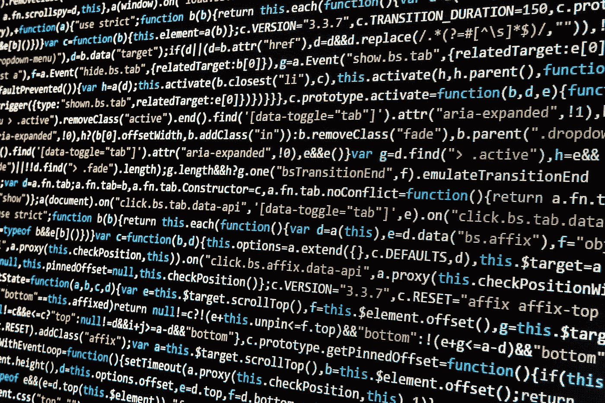
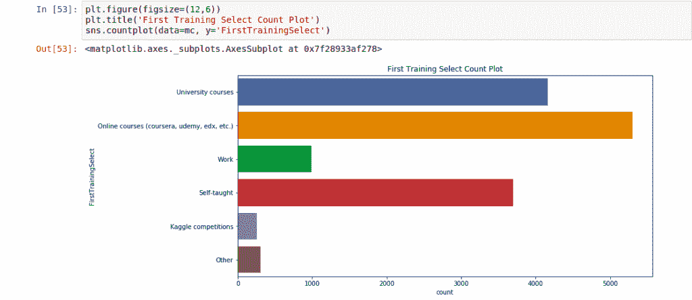
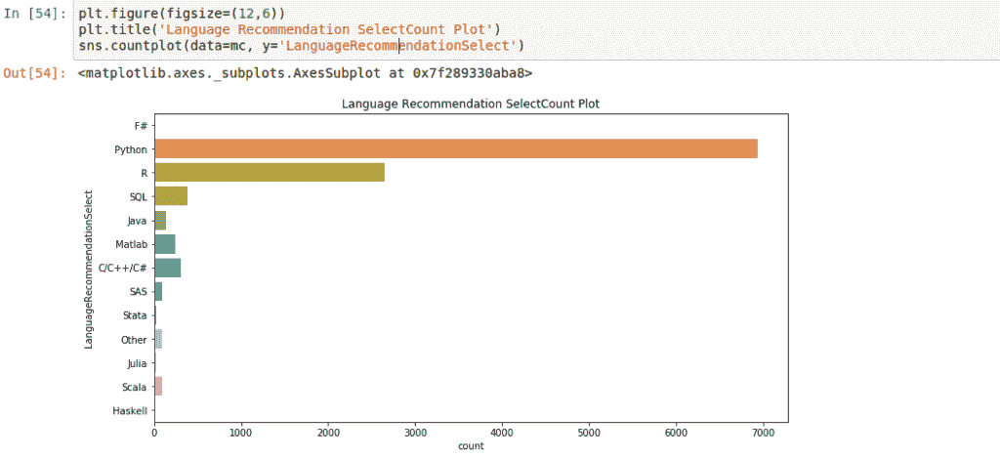
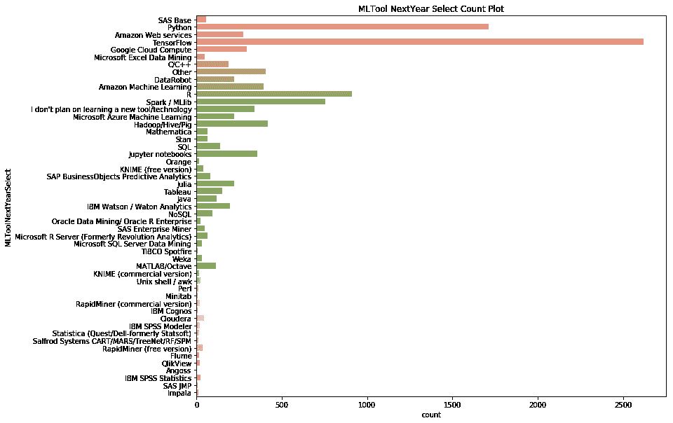
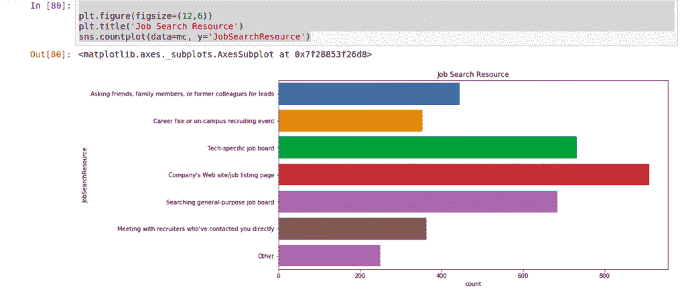

# 有抱负的数据科学家应该学习什么编程语言？

> 原文：<https://towardsdatascience.com/what-programming-language-should-aspiring-data-scientists-learn-875017ad27e0?source=collection_archive---------4----------------------->

不可否认的是，数据科学是当今世界发展最快的领域之一，并且没有放缓的迹象。正因为如此，研究和理解构成这个领域的专业人士，以及他们驾驭这个领域的方式变得越来越重要。

这篇文章是今年早些时候的一篇文章的延续，当时我们研究了数据科学专业人士的人口统计和教育背景。在第 2 部分中，我们将进一步挖掘 Kaggle 对数据专业人员的大规模调查，以了解这些专业人员如何开始他们的研究，他们对行业新人的建议，他们对未来趋势的预测等等。让我们开始吧！

## 你最初是如何开始你的机器学习/数据科学培训的？

该领域的大多数专业人士都是从**在线课程开始他们的数据科学之旅的。第二个最受欢迎的途径是大学课程，然后是完全自学。这表明，作为初学者，从网上开始学习并不是一个坏主意！**

## 你会推荐一个新的数据科学家先学什么编程语言？

根据受访者的说法，该领域的新人应该从 **Python 开始了解编程语言。**第二大推荐语言是 **R.** SQL 紧随其后，位居第三。

## 在接下来的一年里，你最想学习的工具或技术是什么？

Google 的深度学习算法 **Tensorflow** 领先；今天的数据科学家似乎很兴奋地投入到这项新兴技术中。紧随其后的是 **Python** 然后是 **R.**

## 在接下来的一年里，你最期待学习哪种 ML/DS 方法？

Python 和 Tensorflow 再次领先。

## 你写代码分析数据有多久了？

大多数调查对象写代码的时间只有 1-2 年。在关于该数据的早期帖子中，我们还发现大多数受访者年龄在 25-35 岁之间，并且大多数人都是全职员工，这表明在数据科学领域的职业道路可能很快！

## 我应该去哪里找工作？

据调查受访者称，公司网站/职位列表页面是最受欢迎的求职地点。排在第二位的是专门针对科技行业的求职网站，从朋友、前同事和家人那里寻求推荐也很受欢迎。

## 外卖食品

如果你想加入数据科学领域，在线学习 Python 和 R 是一个很好的开始；大多数受访者在那里开始了他们的数据科学之旅，大多数人表示他们是全职的数据科学家。如果你已经有了 Python 和 R 的背景，通过更高级的在线学习来提升你的职业和收入潜力吧！

 [## Python 中的数据科学训练营

### 学习 Python 的数据科学，NumPy，Pandas，Matplotlib，Seaborn，Scikit-learn，Dask，LightGBM，XGBoost，CatBoost 等等…

www.udemy.com](https://www.udemy.com/course/data-science-bootcamp-in-python/?referralCode=9F6DFBC3F92C44E8C7F4)