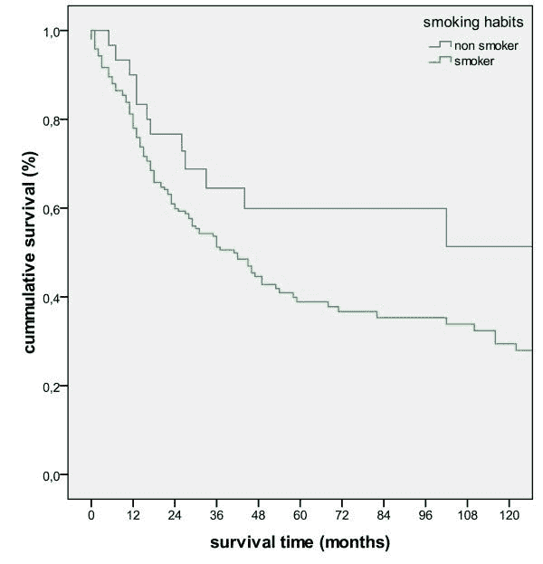
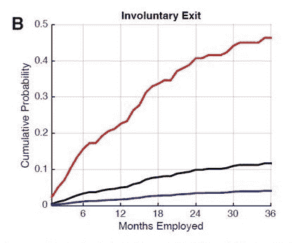

# 吸烟对人们分析的影响

> 原文：<https://towardsdatascience.com/what-smoking-did-for-people-analytics-8d580ba4db8?source=collection_archive---------7----------------------->

像我一样是美剧《广告狂人》(Mad Men)粉丝的任何人都会记得，这部杰出的时代剧的情节和历史背景的一条重要线索都围绕着吸烟。20 世纪 60 年代，美国医疗机构倾向于吸烟是一种致癌习惯的观点——这是他们很难面对的事情，因为他们几乎都是自己吸烟。

今天，习惯性吸烟或根本不吸烟的人大大减少了。我们当然没有脱离险境，但 50 年来已经发生了实质性的变化。然而，50 年是一段很长的时间——人们很自然会问为什么需要这么长时间来创造变化。

当然，一个答案是，吸烟是一种非常容易上瘾的行为——而上瘾的行为是最难改变的。然而，另一个原因是，需要很长时间来建立吸烟与消极生存结果相关的证据，甚至需要更长时间来证明吸烟导致癌症。

然而，我们这些从事人群分析工作的人，会从围绕吸烟及其健康后果的研究中有所收获。正是这项研究将流行病学分析方法推向了前沿，为我们今天研究人和组织提供了难以置信的价值。在 20 世纪 60 年代至 80 年代，当医疗机构在一场旷日持久的争论中与烟草巨头较量时，*生存分析*站出来给予了致命一击。

# 生存分析

生存是医学科学中最重要的结果，因此毫不奇怪，统计学领域的建立是为了更好地理解生存的驱动因素。然而，在 20 世纪中叶之前，许多生存研究都集中在急性疾病上——细菌或病毒感染似乎会在几天或几周内杀死一些人，但其他人会很快康复或毫发无损地存活下来。1918 年至 1920 年致命的西班牙流感疫情在全球范围内导致 5000 万至 1 亿人死亡，是早期流行病学研究的一大推动力。

到了 20 世纪 50 年代，抗生素出现了，急性病突然变得不那么危险了。注意力转向了另一种流行病。一个普遍但不严重的问题。它杀死了一些人，但没有杀死其他人，而是在生命的不同阶段，通常是多年或几十年后。癌症给流行病学家的生存研究带来了新的挑战。*纵*生存追踪变得必要了。

因此，医学研究机构开始加速跟踪几十年的人，而不是几周或几个月。不仅仅是那些生病的人，健康的人也必须被追踪，以了解哪些生活方式因素会导致癌症等威胁生存的疾病的发生率更高。它预示着方法、系统和过程的突破，导致了我们今天在媒体上看到报道的一些巨大的纵向研究。

但它也带来了分析和描述生存的新方法——所有这些在今天更广泛的人类研究中都极其有用。

# 生存曲线和风险比

想象一下，你有一个假设，个人在一个团体或组织中的经历的某个元素是他们在一段时间内继续成为该团体或组织成员的可能性的指标。例如，你可能认为在某个部门工作的人有如此积极的经历，以至于他们对公司产生了长期的依恋。反之亦然，这种体验太差了，以至于他们开始重新审视就业市场。

假设的经历可以被认为是一种“生活方式因素”,你可以像分析癌症等疾病研究中的存活率一样，分析一段时间内损耗的可能性。做到这一点的一种方法可以是对人群进行时间点采样，以及他们是否已经接触到感兴趣的体验，然后在接下来的几个月或几年中跟踪他们，以查看该体验和损耗之间是否存在因果关系。

卡普兰-迈耶生存曲线是一种非常直观的图形表达方式。回到我们吸烟的例子，上面的图表显示了在[的一项特殊医学研究](https://www.researchgate.net/publication/43130223_Lactate-Dehydrogenase_5_is_overexpressed_in_non-small_cell_lung_cancer_and_correlates_with_the_expression_of_the_transketolase-like_protein_1?_sg=LJDbjDZ3TLRq_0dDoxK9AyLHrQKNDtCWqPHKXiabKimIOzeG_gCk5LKcml_0Ia2B8YwLCM1zaw)中，吸烟者与非吸烟者的生存曲线。x 轴表示在某个测量起点之后的几个月，此时个体根据他们的吸烟状态被分类，y 轴表示在每个时间点仍然存活的个体的比例。请注意，每个人的起点不必相同。假设时差中没有固有的偏差，人们可以在任何时间 *t* 加入研究，曲线跟踪他们到 *t + 120* 。

一个类似的有用的衡量标准是*风险比*，特别是对执行摘要的结论或摘要而言，它计算特定人群在特定时间段内的平均生存可能性，作为基线人群的一部分。例如，你可以计算出与一般人群相比，女性在 2 年内的存活可能性。或者在工作场所，您可以计算出与普通员工相比，员工流失的可能性或高绩效员工。对风险比率的精确计算使你有能力有效地陈述结论，如“高绩效员工在两年内离开我们的可能性增加了 20%”。

# 人员分析应用

我想你们中的许多人在这里看到了相似之处，但这里有一些生存分析可以应用于人力资本环境的方法:

*   调查验证:生存分析可以用来表明调查结果应该被认真对待。例如，如果对某些调查项目给出非中性评级的人被证明有更高或更低的流失可能性，这可以帮助管理层在未来关注这些调查响应。
*   预测分析:生存分析可以在预测减员或其他感兴趣的结果时建立特定措施的有效性，或者单独使用，或者作为更广泛的预测模型中的有效特征。例如，[斯坦福大学 GSB 分校](https://www.gsb.stanford.edu/faculty-research/publications/enculturation-trajectories-language-cultural-adaptation-individual)的研究表明，使用上面的(反向)生存曲线，电子邮件中的语言是员工与组织文化契合度的有效指标。在麦肯锡，我们使用生存曲线来表明，在任何给定的时间点，某人在组织中拥有的有意义的联系的数量可以预测他们留下的可能性。
*   促进多样性或多样化的体验:生存分析不仅适用于自然减员，还可以应用于任何感兴趣的结果。例如，如果你想说明一个组织越来越倾向于利用某些“类型”的个人来完成某些任务或工作，卡普兰-迈耶曲线或风险比可以很好地说明这一点，并确定假设的影响在统计上是否站得住脚。

生存分析是研究人的结果的一个非常强大的工具，它通常需要非常简单的数据(通常不超过一些调查响应或参与记录和一些离开日期)。更多的组织应该使用生存分析来让他们诚实地了解是什么真正推动了他们的人员成果。

最初我是一名纯粹的数学家，后来我成为了一名心理计量学家和数据科学家。我热衷于将所有这些学科的严谨性应用到复杂的人的问题上。我也是一个编码极客和日本 RPG 的超级粉丝。在 [*LinkedIn*](https://www.linkedin.com/in/keith-mcnulty/) *或*[*Twitter*](https://twitter.com/dr_keithmcnulty)*上找我。*

Courtesy of *Mad Men* (AMC TV)