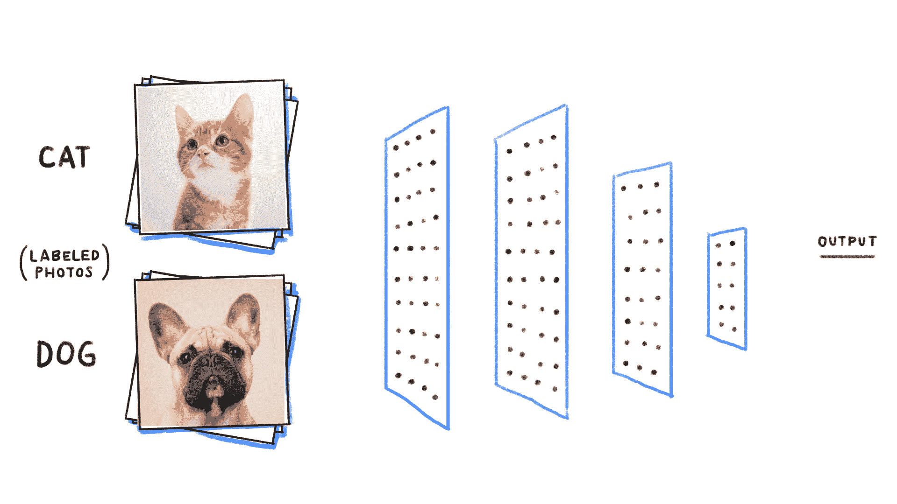
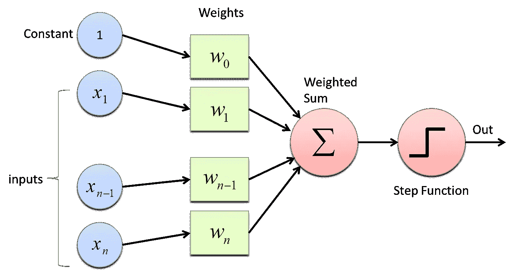
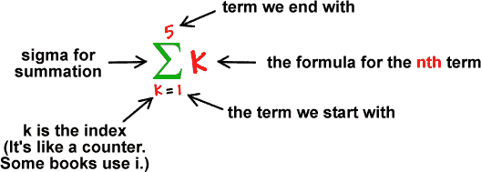
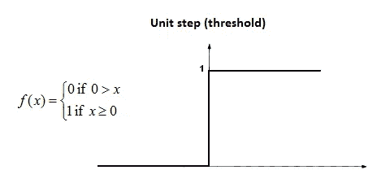
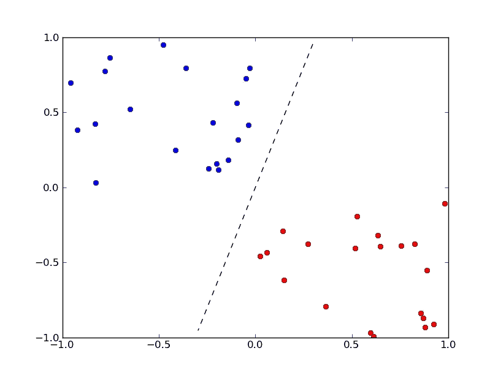

# 感知器是什么鬼？

> 原文：<https://towardsdatascience.com/what-the-hell-is-perceptron-626217814f53?source=collection_archive---------0----------------------->

## 神经网络的基础

> **感知器是单层神经网络**，多层感知器称为神经网络。

感知器是一个线性分类器(二进制)。此外，它还用于监督学习。它有助于对给定的输入数据进行分类。但是它究竟是如何工作的呢？

众所周知，正常的神经网络是这样的

得到这本书👇

[**Python 机器学习简介:数据科学家指南**](https://amzn.to/2AXjHRZ)

这对我帮助很大。🙌 👍

正如你所看到的，它有多层。

感知器由 4 部分组成。

1.  输入值或一个输入图层
2.  权重和偏差
3.  净和
4.  [激活功能](https://medium.com/towards-data-science/activation-functions-neural-networks-1cbd9f8d91d6)

> 仅供参考:神经网络的工作方式与感知器相同。所以，如果你想知道神经网络是如何工作的，那就学习一下感知器是如何工作的。

**Fig : Perceptron**

## 但是它是如何工作的呢？

感知器工作在这些简单的步骤上

a.所有输入 ***x*** 乘以其权重 ***w*** 。姑且称之为 ***k.***

**Fig: Multiplying inputs with weights for 5 inputs**

b. ***将*** 所有相乘后的值相加，称之为 ***加权和。***

***Fig: Adding with Summation***

c. ***将*** 加权和应用于正确的 [***激活函数*** 。](https://medium.com/towards-data-science/activation-functions-neural-networks-1cbd9f8d91d6)

例如:单位步长激活功能。

**Fig: Unit Step Activation Function**

## 为什么我们需要权重和偏差？

> **权重**显示特定节点的强度。
> 
> ***一个*** 偏置值允许你向上或向下移动激活函数曲线。

## 为什么我们需要激活功能？

> 简而言之，**激活函数用于映射所需值之间的输入，如(0，1)或(-1，1)** 。

为了更好的解释，去我以前的故事[激活功能:神经网络](https://medium.com/towards-data-science/activation-functions-neural-networks-1cbd9f8d91d6)。

## 我们用感知器。

> 感知器通常用于将数据分为两部分。因此，它也被称为[线性二元分类器](https://medium.com/towards-data-science/linear-regression-the-easier-way-6f941aa471ea)。

> 如果你想离线更好地理解机器学习。

我将每周发布 2 个帖子，所以不要错过教程。

所以，跟着我上[中](https://medium.com/@sagarsharma4244)、[脸书](https://www.facebook.com/profile.php?id=100003188718299)、[推特](https://twitter.com/SagarSharma4244)、 [LinkedIn](https://www.linkedin.com/in/sagar-sharma-232a06148/) 、 [Google+](https://plus.google.com/u/0/+SAGARSHARMA4244) 、 [Quora](https://www.quora.com/profile/Sagar-Sharma-71) 看看类似的帖子。

如果你有任何意见或问题，请写在评论里。

**鼓掌吧！分享一下！跟我来。**

乐意帮忙。荣誉……..

# 你会喜欢的以前的故事:

1.  [交叉验证代码可视化:有点意思](https://medium.com/towards-data-science/cross-validation-code-visualization-kind-of-fun-b9741baea1f8)

2.[线性回归:更简单的方法](https://medium.com/towards-data-science/linear-regression-the-easier-way-6f941aa471ea)

3. [DIY Arduino 无线键盘](https://medium.com/towards-data-science/linear-regression-the-easier-way-6f941aa471ea)

4. [**神经网络的激活函数及其类型**](https://theffork.com/activation-functions-in-neural-networks/)

 [## 神经网络中的激活函数及其类型

### 它是一条曲线(sigmoid，tanH，ReLU ),用于映射有界值之间的网络值。这就完成了…

theffork.com](https://theffork.com/activation-functions-in-neural-networks/) 

5.[Tensor flow 中的“张量”是什么鬼？](https://hackernoon.com/what-the-hell-is-tensor-in-tensorflow-e40dbf0253ee)