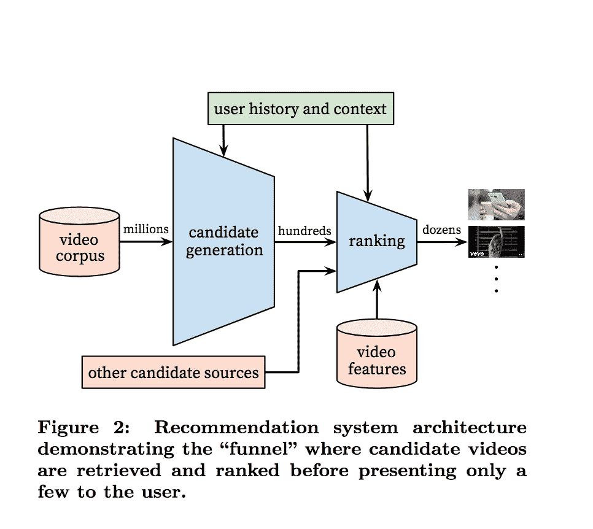

# 过去在 2017 年花费数百万美元的事情，现在可以用机器学习解决，每月 499 美元

> 原文：<https://towardsdatascience.com/what-used-to-cost-millions-in-2017-can-now-be-solved-with-machine-learning-for-499-month-10b5b4bb1173?source=collection_archive---------11----------------------->

Photo by [Marina Vitale](https://unsplash.com/photos/t809JJ6r9KA?utm_source=unsplash&utm_medium=referral&utm_content=creditCopyText) on [Unsplash](https://unsplash.com/search/photos/personalization?utm_source=unsplash&utm_medium=referral&utm_content=creditCopyText)

各公司每年都花费数千万美元，试图通过动态锁定客户来提高他们的客户参与某事或购买某物的可能性。从网飞推荐到挑选最近的 Lyft 司机，内容个性化、排名和推荐对数字经济的许多方面都至关重要。

根据 Evergage 公司进行的一项调查(T1 ):

> 受访者继续报告他们的实时个性化工作有了实质性的改进或“提升”，88%的人表示他们看到了个性化带来的可衡量的改进，23%的人报告改进超过 20%。这一成功导致投资增加，因为 46%的受访者预计他们的个性化预算在未来一年将会增加。

此外，根据 McKinsey.com 的[:](https://www.mckinsey.com/business-functions/digital-mckinsey/our-insights/marketings-holy-grail-digital-personalization-at-scale)

> 个性化可以降低高达 50%的采购成本，提高 5%到 15%的收入，并提高 10%到 30%的营销支出效率。

这实际上是一个很难解决的问题，因为它涉及到理解顾客，从潜在的数百万件商品中挑选，到按照*最有可能吸引*的方式对商品进行排序，有着多层次的复杂性。

此图展示了这些概念背后的架构的基本轮廓。

Recommending videos to customers: [https://research.google.com/pubs/pub45530.html](https://research.google.com/pubs/pub45530.html)

## 你怎么知道先给客户看哪个视频、哪个产品、哪个广告、哪个新闻帖子？

部分答案来自于对你的客户的了解。但是这个问题已经很好的解决了。大多数电子商务、视频流和其他类型的网站都很好地掌握了给定用户是谁，他们来自哪里，以及他们过去从事过什么。

但是，公司花了很多钱来交叉参考这些数据，与过去的行为，并使用它来以某种方式生成用户更有可能参与的事情的排名。

> 事实证明，机器学习是解决这个问题的好方法。

学习客户的行为，然后将这种学习应用到一些预测中，这相当于机器学习 101。

这就是为什么[机箱](https://goo.gl/2F11De)要做建议箱。我们希望公司能够访问这些强大的、支持机器学习的功能，运行在他们自己的环境中，基于他们自己的数据，而不必花费通常的费用和时间来自己解决所有这些问题。

你可以在这篇博文中阅读更多关于 Suggestionbox 是什么以及它是如何工作的信息:

 [## 介绍 suggestion box:Docker 中的个性化和推荐机器学习…

### 今天我们非常自豪地宣布 Suggestionbox 的开发者预览版，这是最新的 ML-in-a-Docker-container…

blog.machinebox.io](https://blog.machinebox.io/introducing-suggestionbox-personalization-and-recommendation-machine-learning-in-a-docker-b9d69f937716) 

但对于任何试图为数百万用户解决这一问题的企业或初创公司来说，关键的一点是，你现在可以通过巨大的因素增加用户参与度，只需每月支付区区 499 美元。

这是应用机器学习 ROI 机制的一个巨大转变，因为它不再通过按 API 调用收费或限制请求数量来限制使用。

公司可以在他们自己的基础设施中，在防火墙之后，在他们自己的数据上运行这项技术。最重要的是，他们可以创新、实验和尝试新事物，而不会产生巨大的云账单。

这将会改变游戏规则。

# 什么是机器盒子？

[Machine Box](https://goo.gl/2F11De) 将最先进的**机器学习**功能放入 **Docker 容器**中，这样像您这样的开发人员可以轻松地将自然语言处理、面部检测、对象识别等功能融入其中。到您自己的应用程序中。

这些盒子是为了扩展而建造的，所以当你的应用真正起飞的时候，只需要水平地添加更多的盒子，直到无限甚至更远。哦，它比任何云服务都便宜**([而且可能更好](https://hackernoon.com/which-face-recognition-technology-performs-best-c2c839eb04e7))……而且**你的数据不会离开你的基础设施**。**

**[有戏](https://machinebox.io/docs/facebox/teaching-facebox)让我们知道你的想法。**