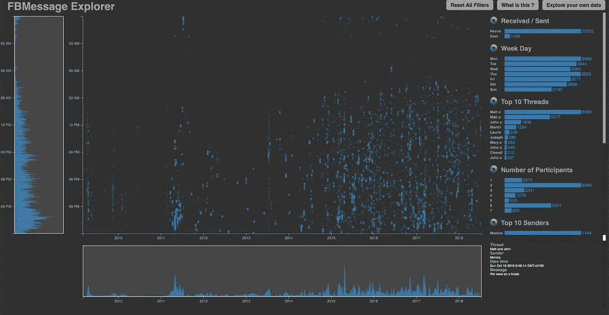
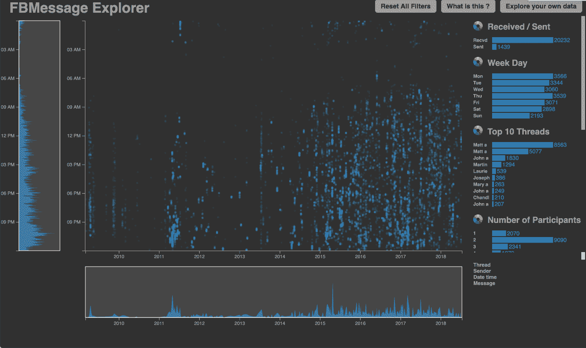
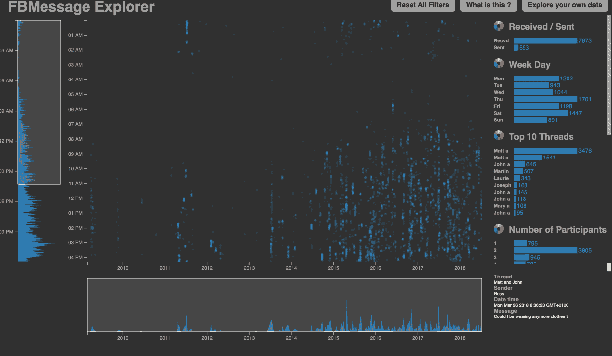
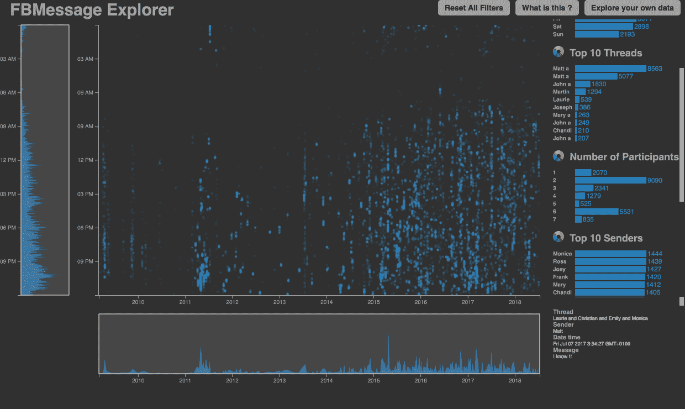
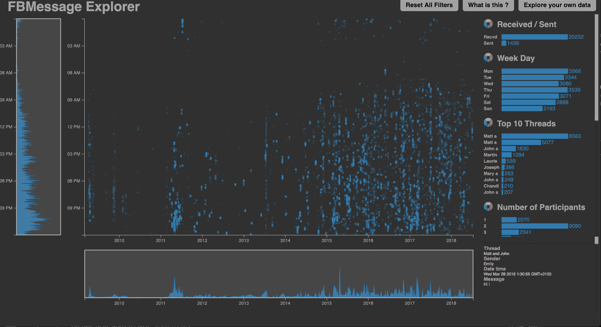
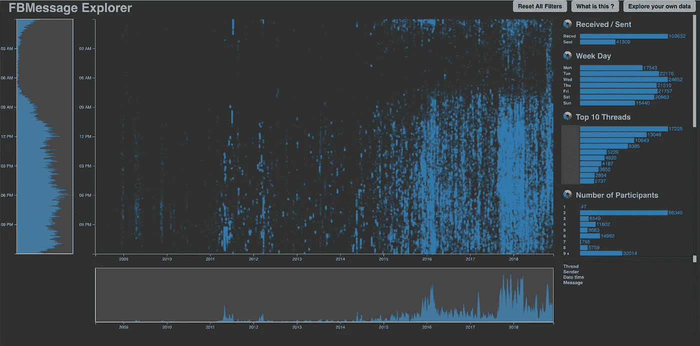
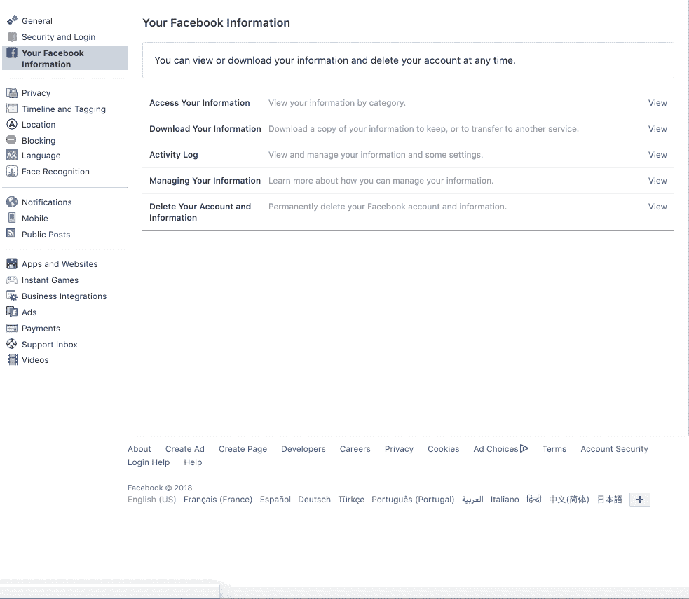
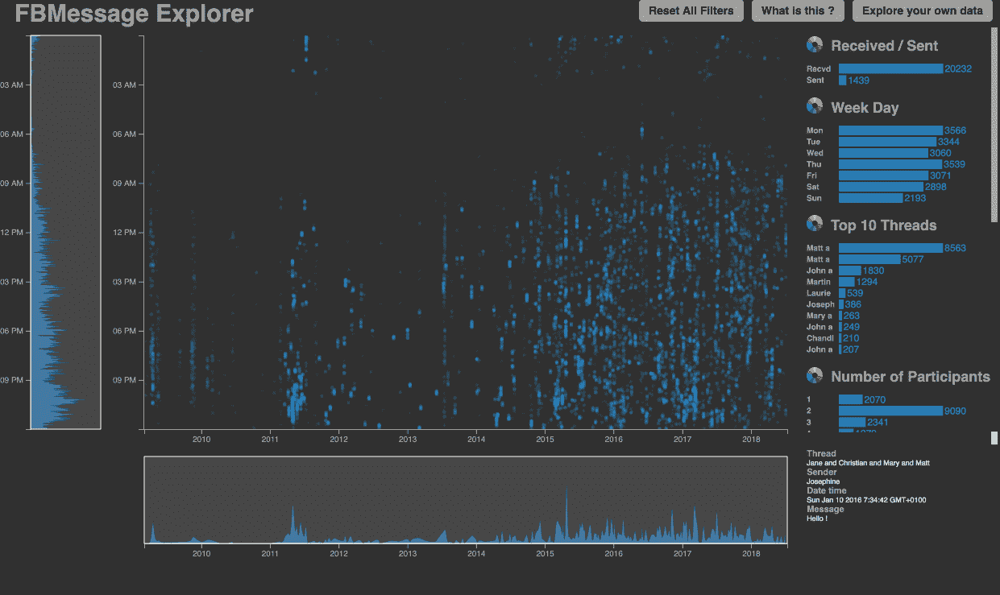

# 得益于数据可视化，您可以从您的 Facebook Messenger 历史记录中了解到什么

> 原文：<https://towardsdatascience.com/what-you-can-learn-from-your-facebook-messenger-history-9ac63e962885?source=collection_archive---------13----------------------->

## 为什么不充分利用脸书掌握的关于我们的所有数据呢？

> 我一生交换了多少条短信？我和谁聊得最多？我会发送或接收更多的消息吗？我什么时候发短信最多？

**TL；博士:如果你想回答这些关于你的 Facebook Messenger 历史的问题，请查看**[***FBMessage Explorer***](https://adurivault.github.io/FBMessage/)

自从我小时候有了手机，开始大量发短信，我就一直对这个活动的统计数据很好奇，很长一段时间，我都无法回答这些问题。然而，我的短信习惯逐渐从短信转向了 Facebook Messenger，以至于我现在几乎只使用 Facebook Messenger 发短信。一个伟大的事情是，它可以下载你所有的短信历史，并对数据做任何你想做的分析。

因此，当我在工程学院的最后一年不得不为 Dataviz 项目选择任何主题时，我抓住了这个机会:我和我的合作伙伴一起开发了一个工具，它可以让我了解我想要的关于我的短信习惯的一切，甚至更多。我们称它为 *FBMessage Explorer* ，好消息是，[任何人都可以使用这个工具](https://adurivault.github.io/FBMessage/)。我们试图让它尽可能地易于访问:不需要写一行代码，只需点击！

本文的第一部分粗略地解释了不同的特性，以及如何阅读结果，然后我深入自己的消息，概述了我可以为自己提取的一些见解。然而，我的想法并不是向世界展示我的短信生活，而是做一个这个工具的演示，看看你能从中得到什么，这样你就可以用它来处理你自己的数据了。最后一部分是如何下载和使用您的数据的详细说明，所以请继续下去，并尝试自己！

# 让我们看看这一切代表了什么

当你第一次打开网站时，你首先看到的是这个奇怪的屏幕，到处都是点，底部和左侧窗格是曲线，右侧是条形图。

Overview of FBMessage Explorer

这对应的是什么？让我们一个一个地看每一部分。

*   **散点图:**工具的主要部分是带有所有圆点的中心部分。每个点对应一条信息，发送或接收，根据发送的时间来放置:横轴对应日期，纵轴对应一天中的时间。
*   **曲线:**作为补充，在左手边，你可以找到你一天的轮廓:在一天中的任何时间发送了多少条消息，沿着你的消息的整个历史。它帮助你确定一天中你最活跃或最不活跃的时间。下面的曲线也是如此:你可以看到一年中你最活跃或最不活跃的日子和时期。
*   **条形图:**在右手边，你可以找到一串条形图。每个条形图根据给定的标准给出消息的重新划分。这样，你可以看到发送/接收了多少条信息，或者在每次对话中交换了多少条信息等等…
*   **消息:**最后，如果你想知道“我在周二凌晨 4 点发的这条消息到底是什么？”只需将鼠标悬停在该点上，并阅读右下角的消息。

## **可以过滤！**

为了让用户能够深入了解他们历史中非常具体的方面，我们可以根据多种标准过滤数据。如果您单击右侧条形图中的任何一条，将只留下与该标准相对应的消息，您将看到一切都发生了变化:点将消失，条形图和曲线将更新以反映所做的选择。例如，这样你可以只分析你发送的信息，回到你和你喜欢的人之间的单条线索，或者排除所有的群组线索，专注于一对一的对话。

Filtering

但不是这样，你还可以过滤日期和时间:只要抓住灰色窗口的手柄，拖动它，使它适合你想研究的时期。您将看到所有中心疼痛放大到所需的区域，并且不同的条形图会根据选择进行更新。一天中的时间也是如此！

Filtering on time and date

但是真正的真正力量在于可以做交叉过滤！这让你可以只分析你在 2017 年 5 月的晚上在一个特定线程中发送的*消息的模式——或者真正的任何过滤器组合！*

Cross filtering with multiple criterion

## 颜色；色彩；色调

最后，如果你点击不同条形图旁边的色轮，每个点会呈现不同的颜色，与对应的条形图相匹配。通过这种方式，你可以识别出你没有注意到的模式。

Using colors

# 我从自己的历史中学到了什么

在这个关于工具如何工作的长篇大论之后，让我们来看看酷的东西:我从这个工具中获得了什么启示？这将引导我们**从这个工具中*你能*获得什么样的见解？**

我将仅仅展示我从自己的数据中学到的一些见解。我试图尽可能地保持这篇文章的私密性，我觉得我真的不能突出你能深入到什么程度以及你能找到什么有趣的东西。

My personal Facebook Messenger History

## **一些见解的列表，排名不分先后**

*   在我使用 Facebook Messenger 的整个过程中，我发送了 102 632 条消息，收到了 41 309 条消息。这相当于平均每天交换大约 40 条消息。
*   我最积极的对话是和我的前女友，我和她在一起三年半了。我们大部分时间通过短信，但她仍然在比赛中名列第一。第二个最活跃的话题是与大约 50 个朋友的小组对话，他们会变得非常健谈。
*   现在，如果你看看在我所有的对话中发信息最多的人，我最好的朋友超过了我的前女友。这是因为我们与不同的朋友群体有很多共同话题，所以他发送的所有信息都被这些对话冲淡了。而我和我的前女友大部分时间都是通过我们的一次谈话来交流。
*   你可以清楚地看到，我大多在凌晨 1 点至 7 点半睡觉。至于白天，我整天或多或少都会发短信，中午 12 点左右的午休时间会有一个高峰，下午 6 点左右离开大学时也会有一个高峰。
*   从这些年的趋势来看，很明显，随着时间的推移，我越来越多地使用脸书。
*   一个非常明显的模式是从 2017 年 9 月到 2018 年 3 月的这段时间，在这段时间里，我比平时发了很多短信。这实际上是我学习的最后一年，在此期间，我与朋友、室友、小组项目等进行了很多非常活跃的对话…
*   你可以看到我做了一次 7 周的旅行，由于时差的原因:看起来我在 2018 年 10 月和 11 月期间没有睡觉，但实际上我从下午 6 点到凌晨 1 点(欧洲时间)一直在睡觉。

> “我的想法不是向世界展示我的短信生活，而是做一个这个工具的演示，这样你就可以用你自己的数据来使用它”

# 你如何用你自己的数据来尝试这个？

正如我所说的，我试图让这个工具尽可能容易地用于您自己的数据。你所要做的就是通过他们特定的工具下载你的脸书数据，解压文件，并从你的浏览器窗口中选择正确的文件夹。让我们一步一步来。

## 从脸书下载您的数据

*   打开您的脸书帐户，进入设置->您的脸书信息->下载您的信息。
*   在这里，你必须选择你想在你要下载的文件中出现的内容。至少选择“消息”(如果您想知道会出现什么，可以选择其他元素)。
*   选择日期范围“我的所有数据”，以及文件格式 JSON，然后点击“创建文件”。

Asking you data to Facebook

脸书会在他们的服务器上创建一个 zip 文件，准备好了会给你发邮件。通常很快，但有时可能需要几天时间。当你收到邮件时，登录脸书，下载文件，解压。如果你浏览这些文件，你应该会看到不同的文件夹:当你创建你的文件时，每一个文件夹对应一个类别。我们将使用的是“消息”文件夹。

在 Chrome 或 Firefox 中打开[*FBMessage Explorer*](https://adurivault.github.io/FBMessage/)，点击“探索自己的数据”，然后“使用自己的文件”，选择刚刚下载的文件夹“Messages”。等待工具处理您的数据(根据要处理的消息数量，可能需要一分钟)，然后开始探索！

Using your own data

## 我们不是国家安全局，你的数据是安全的

> “他疯了吗？我永远不会把我的脸书历史给这个网站！”

你可能担心把你所有的私人信息交给一个你没有任何理由信任的工具。你应该这么做！一些浏览器，如 Chrome，甚至发出可怕的警告，说你要上传你所有的信息，你应该三思而后行。但是这个警告并不是真正合法的，这里有几点可以告诉你它是安全的:

> 浏览器将数据装入内存，并在本地进行所有的处理:没有一个数据离开你的计算机

首先，你没有上传你的数据，你只是向你的浏览器显示数据在你的电脑上的位置，并授予它对数据做任何事情的权利(这就是你得到警告的原因)。然而 *FBMessage Explorer* 不会使用这种授权:浏览器将数据加载到内存中，并在本地完成所有处理。没有一个数据离开你的电脑。

> “我为什么要相信这篇文章写的是什么？这可能是一个谎言，我不会知道！”

这个项目是开源的，所有人都可以看到全部源代码[。如果你熟悉编程，可以去看看。如果你不是，事实上这是开源的，这意味着书呆子们可以浏览代码，看到发生在幕后的一切。如果我在撒谎，一些数据被发送给某人，他们会知道，他们会以某种方式举报我(可能在评论区)。](https://github.com/adurivault/FBMessage)

最后，如果你仍然不确定你的数据是安全的，你可以在使用 *FBMessage Explorer* 之前关闭互联网。

> “他傻吗？这是一个基于互联网的工具，它不会工作……”

会的。如果你先登录网站，然后等待它加载，你的电脑现在已经有了所有必要的内存。然后你可以关闭互联网，并选择如上所述的文件在你的电脑上。因为所有的处理和计算都是在本地完成的，所以一切都会很好，而且你可以绝对肯定你的数据是安全的，没有离开你的计算机。

玩得开心！

如果您在使用该工具时有任何问题，任何反馈、问题、建议等，请告诉我