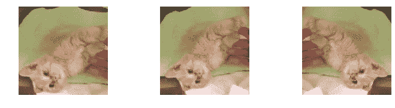
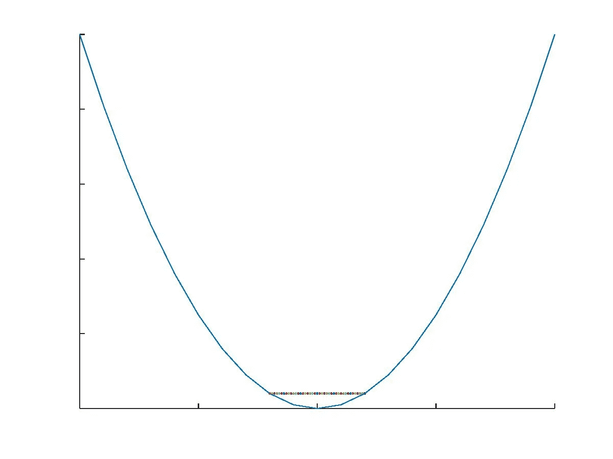
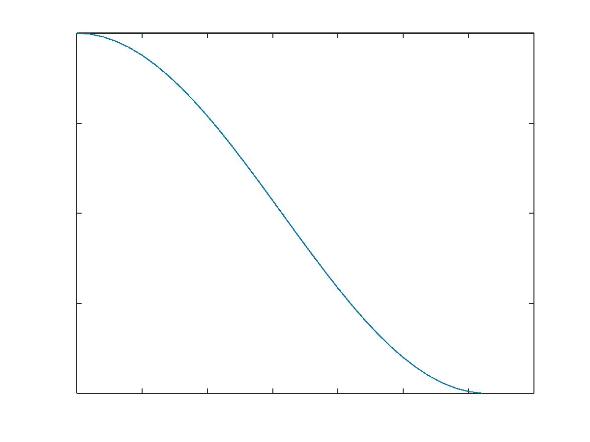
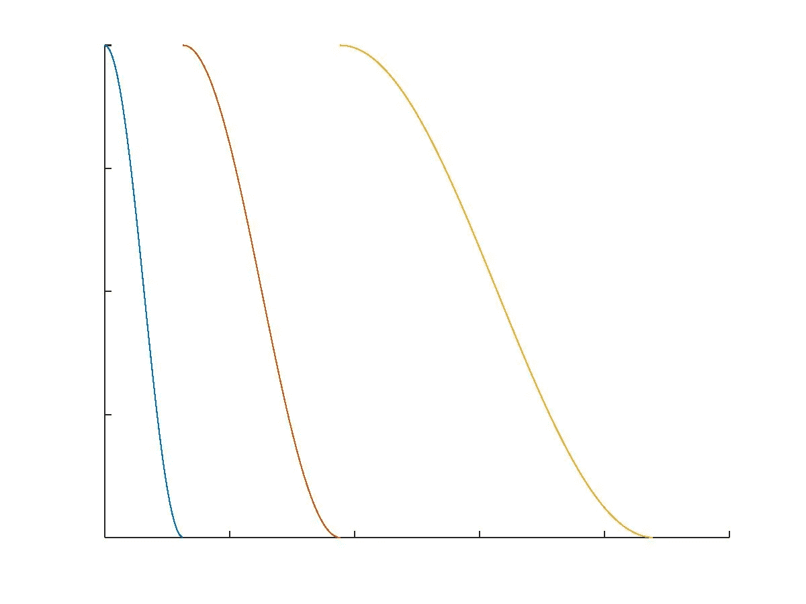
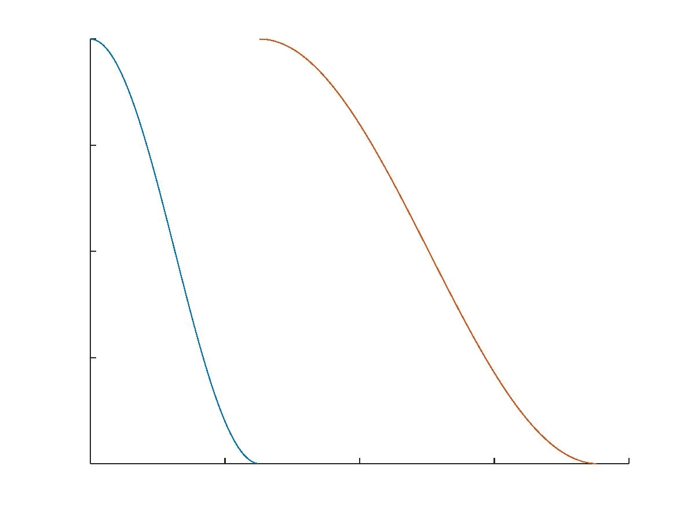

# 您将从 fast.ai (v2)中学到什么第 2 课

> 原文：<https://towardsdatascience.com/what-youll-learn-from-fast-ai-v2-lesson-2-6e700ab24b2c?source=collection_archive---------4----------------------->

在[之前的博客](https://medium.com/@srinandaka.yashaswi/fast-ai-v2-lesson1-synopsis-tl-dr-4985bba9eea2)中，我们已经讨论了什么是 [fast.ai](http://course.fast.ai/) 以及 fastai 的第一课包含了什么。我们还讨论了“参数是什么”、“损失函数和梯度下降有什么作用”以及“为什么学习速率很重要”。如果你还没有看过那个博客，我建议你在继续之前先看看。因为这个博客有很多关于 fastai 第一课的参考资料。如果你已经读过了，那么通过这篇博客让我们继续第二课，学习由[杰瑞米·霍华德](https://medium.com/u/34ab754f8c5e?source=post_page-----6e700ab24b2c--------------------------------)和[瑞秋·托马斯](https://medium.com/u/ee56d0bac1b7?source=post_page-----6e700ab24b2c--------------------------------)在他们的 fastai 库中开发的各种技术。

我不得不阐述许多事情，并举例说明几个概念，以清楚地解释它们背后的逻辑。在这个过程中，博客变得非常冗长。不要担心那个。

在开始上课之前，有几件事情是数据科学新手必须知道的。如果你已经熟悉深度学习的行话，可以直接跳到**第二课**部分。

**随机梯度下降**或**小批量梯度下降**与我们在之前的博客中讨论过的梯度下降概念没有什么不同。唯一的区别是数据集的大小。传统上，人们在更新权重时会考虑整个训练集。这很好，只是每次更新都要占用大量空间。

因此，人们将整个集合分成小的子集，称为**小批量**，并利用这些小集合来更新参数。然而，在所有这些小批量更新结束时构建的模型将不会像通过整个集合那样通用。为了掩盖准确性，我们在整个数据集上训练模型，分成小批量，多次。这些被称为**时代**。因此，在几个时期内对模型进行小批量训练将会得到一个更一般化的模型，同时确保不存在任何内存使用问题。

# 第二课:

第 2 课主要讲述如何使用 fastai 库中的各种技术，以提高分类器的准确性。可以列举如下:

*   数据增强如何帮助提高准确性？
*   哪里使用，哪里不使用‘预计算’？
*   什么是带重启的随机梯度下降？还有什么是 *cycle_length* 和 *cycle_mult* ？
*   *unfreeze()* 函数会做什么，微分学习率如何细化模型？
*   训练时如何处理图像大小和批量大小，这些会如何影响训练？

# 数据扩充:

粗略定义的数据扩充是一种用于创建更多数据的方法。这种“方法”包括一组应用于输入图像的变换，以给出它的多个副本，每个副本有一个小的变化。例如，请看下图。

这些是 fastai 第 2 课中使用的一些转换。在第一和第二图像之间存在垂直平移，并且第三图像是第一图像的镜像。您可以根据需要添加任意多的不同转换，并增加训练集的大小。只要确保转换是合乎逻辑的。例如，如果原始对象没有因为图像的过度放大而变形，则放大图像可以被认为是变换。

# 预计算:

当我们导入特定架构时，如 VGG16 或 Resnet34 等。，我们可以选择加载所有预训练的砝码。在 fastai 库中，在构建模型时，可以通过设置“precompute = True”来加载权重。

这些架构中的大多数是为 ImageNet 大规模视觉识别挑战(ILSVRC)而设计的。ILSVRC 是计算机视觉领域一个非常著名的挑战。它包含各种挑战，包括图像分类，模型优化，图像分割等。该数据集包含 1000 个类，其中包括几个狗的品种，猫的品种，鸟类等。来自世界各地的人们竞相展示他们的知识。

如果您正在处理的数据与 ImageNet 数据集的数据相似，则设置“precompute = True”将缩短训练时间。如果数据完全不同，建议不要使用预先计算的权重。简而言之，预计算模型更偏向于与 ILSVRC 数据集相似的数据集。

# 重启随机梯度下降(SGDR):

SGDR 解决了我们在培训过程中面临的两个主要问题。

1.  它将通过调整学习速率来确保模型得到改进。
2.  它将确保这个模型更具普适性，把它从任何尖锐的井中提取出来。

对于每个小批量迭代，权重的更新取决于斜率/梯度和学习速率。当在每一步之后更新权重时，在某一点，我们将到达 dW 在最小损耗点附近振荡的位置，如图所示。

当这种情况发生时，模型停止学习，因为权重没有提高。在这种情况下，由于我们不能改变斜率，降低学习率将确保正确更新权重。每当他们观察到损失没有进一步改善时，使用阶跃衰减，将学习速率降低一个因子，比如 10，是这个问题的解决方案之一。

阶跃函数的替代方法是余弦退火，它改变学习速率，如下所示。

Cosine Annealing

余弦退火用于将损耗降低到尽可能小。这有助于增强模型。为了进一步推广该模型，我们以如下方式在几个时期后重置学习率。

这被称为带重启的随机梯度下降。让我们假设我们从 1e-2 的学习率开始。在第一个时期结束时，学习率降低到 1e-3。我们再次将学习速率重置为 1e-2，这一次我们在将其降低到 1e-3 之前运行 2 个时期。并且重复这个过程。

这种方法的优点是，即使模型停留在任何局部最小值，SGDR 也会将其推出，并确保模型达到更普遍的全局最小值。

*周期长度*给出第一个周期的长度。在我们的例子中，这是 1，因为我们在 1 个时期内将学习率从 1e-2 降低到 1e-3。 *cycle_mult* 决定了我们重复这个过程的次数。在上图中， *cycle_mult* 为 3。

如果 *cycle_length = 2，cycle_mult = 2，*那么它看起来像这样。

# *Unfreeze():*

*unfreeze()* 功能顾名思义就是解冻模型。当运行梯度下降时，在几个时期之后，损失达到平稳状态。即使我们使用梯度下降重启，情况也不会改善。发生这种情况是因为在几次迭代之后，外层的更新成为主导，而内层被冻结。 *unfreeze()* 函数将在所有层之间平均分配权重更新。

在分配权重时，我们需要非常谨慎地选择正确的学习率。众所周知，最内层更关注边缘，中间层更关注曲线或圆形结构，最外层处理特征识别。

对于最内层，更好的权重意味着更锐利的边缘。所以这些层对权重更新非常敏感。这是模型冻结的主要原因。但是如果我们对这样的层使用小的学习率，那么我们可以微调它们来锐化边缘。fastai library 通过使用他们定义为“差异学习率”的东西来做同样的事情。其中我们可以为不同的层选择不同的学习速率。

一旦我们在 *lr_find()* 的帮助下找到了最佳学习速率，我们就可以降低中间层和内层的学习速率。例如，在使用 *lr_find()* 之后，假设我们得到 1e-2 作为我们模型的最佳学习速率。使用 *lr = [1e-4，1e-3，1e-2]* 将内层的学习速率设置为 1e-4，中间层为 1e-3，外层为 1e-2。使用 *unfreeze()* 然后使用不同的学习率，可以将精确度提高 1-2%左右。

# 批量大小和图像大小:

最后，杰里米的一个非常有趣的观察是:一旦模型被训练，增加输入的图像大小有助于模型避免过度拟合。

我们很容易理解为什么会出现这种情况。通过扩大输入，您基本上向模型展示了模型以前可能没有遇到过的附加特性。

例如，假设最初您已经在 224x224 图像输入上训练了模型。因此，我们从原始图像中提取 224x224 的裁剪，并将其用于训练。现在，如果我们将输入大小增加到 229x229，那么感受野会增加，这个更宽的输入包含了比之前更多的图像信息。

但是，如果我们增加图像大小，由于内存限制，批处理大小应该会减少。并且具有非常小的批量会在训练时增加很多噪音。无限增加图像大小会迫使算法采用较小的批量，不建议这样做。

图像大小和批量大小是两个超参数，应该根据自己的记忆容量仔细选择。

这些是我从 fastai 的第二课中发现的要点。如果我错过了什么，或者你想知道更多关于某个特定主题的信息，请在下面的评论中提出。我总是乐于接受讨论和积极的批评。如果你喜欢这个博客，觉得它内容丰富，那么别忘了鼓掌。

快乐学习！干杯！