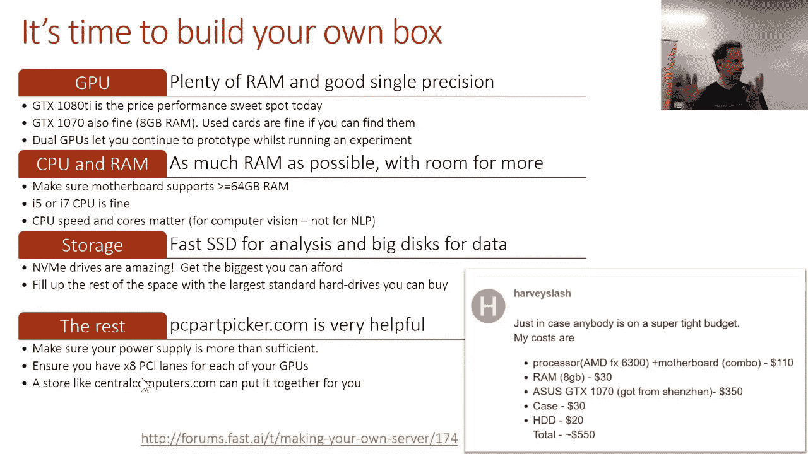
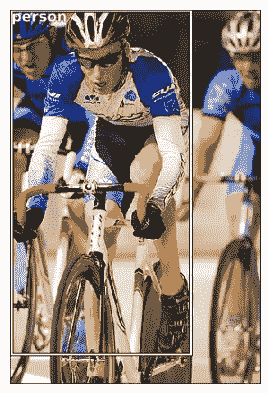
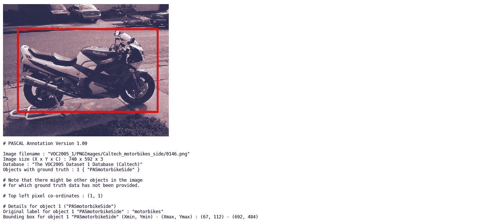
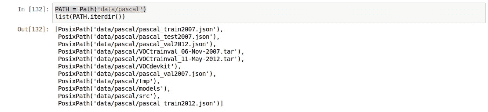
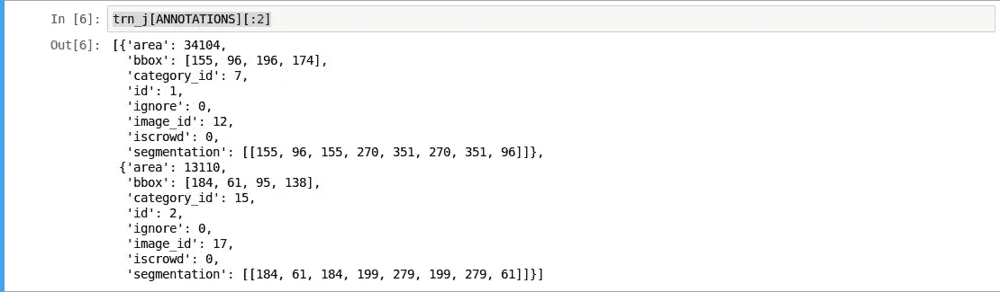
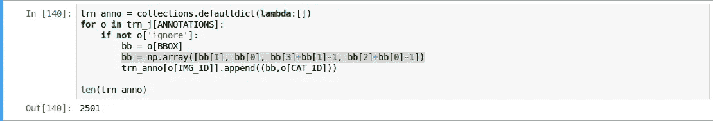
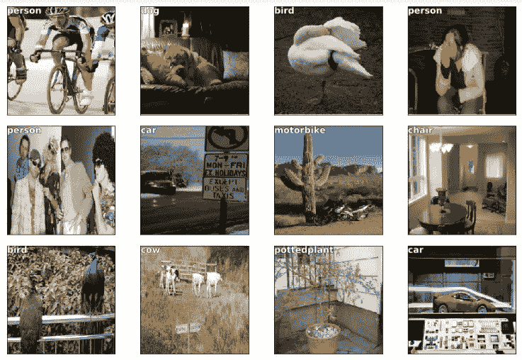

# 你将从快速人工智能(v2 第 2 部分)第 8 课中学到什么

> 原文：<https://towardsdatascience.com/what-youll-learn-from-fast-ai-v2-part-2-lesson-8-86c950f7b359?source=collection_archive---------13----------------------->

fast.ai 是最好的 MOOC 之一，它向具有血统编程背景和一点数学背景的学生教授深度学习。fastai 有 14 节课，分为两部分，每部分 7 节课。这 14 个视频完全涵盖了卷积网络(ConvNets)、自然语言处理(NLP)、结构化数据分析、推荐系统等主题。

fastai 的第 1 部分首先介绍世界各地的人们实践的现代技术，然后讨论这些技术的基本概念。在第二部分中，fast.ai 课程的创建者[杰瑞米·霍华德](https://medium.com/u/34ab754f8c5e?source=post_page-----86c950f7b359--------------------------------)和[雷切尔·托马斯](https://medium.com/u/ee56d0bac1b7?source=post_page-----86c950f7b359--------------------------------)采用了一种略有不同的方法，教授如何阅读、理解和实施研究论文。

快速总结我们在第 1 部分学到的内容:

**迁移学习**允许你使用已经在数据集上训练过的模型，该数据集类似于你正在用于你自己的问题陈述的数据集。这是通过用新的随机初始化的 FC 层替换最后一个完全连接的(FC)层来实现的。现在训练模型只是学习最后一个 FC 层中的参数。因此，迁移学习将会派上用场，因为它可以将训练时间缩短到通常学习所有重量所需时间的一小部分。

**克服过拟合:**认为对更多的历元数进行训练会使模型工作得更好，这是人的天性。这确实是真的，但是在训练集上效果更好。不在测试集上。这就是我们所说的模型过度适合训练数据的时候。为了概括这个模型，我们在第 1 部分中遇到了数据扩充、删除、批处理和其他类似的技术。这些技术将让你使用一个更广更深的网络，这是通用的。

**嵌入:**当涉及分类特征时，仅仅使用一次性编码很难捕捉到细节。例如，在第 1 部分中，我们考虑了位于不同城市的商店的销售预测。对于诸如星期几或商店位置之类的特征，我们可以通过使用一种叫做嵌入矩阵的东西来包含不同城市每天的相关性。在第 1 部分中，我们已经了解了使用嵌入的重要性。

**架构设计:**架构偏好完全取决于数据。对于有序和固定大小的数据，我们使用 CNN，对于序列，我们使用 NLP 技术，对于多标签分类，我们使用 Softmax。我们已经在 fastai 的第 1 部分中详细讨论了这些。

在第 2 部分中，我们将会遇到:

fastai lesson 8 live video snapshot

在第二部分，正如我前面所说，我们将学习阅读和实施那些有价值的研究论文，如果不是每一篇研究论文的话。在第 1 部分中，我们更加关注图像分类、预测分析和情感分析。在第 2 部分中，我们将讨论对象检测、语言翻译、大数据分析和其他相关主题。在 fastai 的版本 1 中，我们也讨论了时间序列。但是我们可以在机器学习课程中找到那些题目。

那些对 python 几乎没有经验的人现在将是学习和练习 python 和 PyTorch 编码的好时机(我们将使用后者从头构建深度学习模型)。在线阅读代码示例时要小心。几乎所有的都会有瑕疵。

而有一点数学背景的，尽量多读研究论文。这将在两个方面帮助你。第一，你将熟悉希腊字母，它们在所有的文章中几乎有相似的意思。第二，你将不再害怕方程式。碰巧的是，院士们用庞大的方程来表达简单的想法。理解这个概念很重要。

如果你对编码和面对理解方程式的问题感到舒服，或者相反，试着活跃在[论坛](http://forums.fast.ai/)上，写下你的经历。他们会成为你学习过程的催化剂。

博客上的一个小提示。不要犹豫，写下你心中的任何想法。每个人都有不同的理解方式，你的博客可能会帮助其他正在学习的人。

到目前为止，我们一直在借助虚拟机和各种库来构建分类器或推荐系统或其他类似的模型。但从现在开始，我们将从头开始构建这些模型。所以拥有一个配有像样 GPU 的系统会有很大的帮助。购买自己系统的指南:

Another snapshot of live fastai lesson 8

# 物体检测:

对象检测有两个部分。多个分类和围绕每个对象绘制边界框。在第 8 课中，我们将尝试创建对象检测器的第一阶段，在给定的图像中，我们尝试找到最大的对象，检测该对象是什么，在该对象周围绘制一个边界框并标记它。这仅适用于一个对象。在后面的课程中，我们尝试多重分类。

为此，我们使用 PASCAl VOC 数据集，它包含带有相应注释的图像。每个图像的注释具有关于图像中所有对象的信息、框的起点坐标、框的高度和宽度。

Image from [http://host.robots.ox.ac.uk/pascal/VOC/databases.html#VOC2005_1](http://host.robots.ox.ac.uk/pascal/VOC/databases.html#VOC2005_1)

这是 2005 年 PASCAL VOC 数据集的一个例子，其中盒子的细节包括左上坐标和右下坐标。我们使用 2007 数据集，其中盒子细节包括左上角坐标及其高度和宽度。我们会将该格式转换为左上/右下格式。

## 编码细节:

*   我们使用`pathlib`库作为文件路径的生成器。`PATH`为文件路径创建对象。像`cv2`这样的库中不允许有对象，所以我们需要将文件路径转换成字符串。

*   我们导入了`json`库，它直接从给定的文件路径中提取图像、注释和类别。

*   注释包含边界框信息。

*   `bbox`我们在注释中的是[x _ 坐标，y _ 坐标，高度，宽度] x，y 坐标表示盒子开始的地方，也就是左上角，然后是盒子的尺寸(高度，宽度)。
*   我们需要将这些信息转换成左上/右下的格式。

`bb`在这段代码中也有 4 个元素。前两个给出了位置坐标。它们可以互换，因为在 VOC 数据集中，一个点被表示为[列，行]，但在我们的 ConvNet 模型中，我们将一个点视为[行，列]。而`bb`的下两个元素给出了盒子的右下角(左上角行号+宽度给出了右上角。右上角列号+长度给出右下角。)

对于编程新手来说，Jeremy 就如何使用 Visual Studio，如何调试你的代码，如何使用 Matplotlib 的面向对象的 API 用它们对应的 bbox 打印图像做了一个小小的介绍。你可以从 [fastai 资源库下载笔记本阅读理解。](https://github.com/fastai/fastai)

## 训练模型:

我们面临两个挑战。第一，对最大的物体进行分类。并绘制边界框。在第一部分中，我们遇到了许多对图像进行分类的技术。我们可以看到下面每张图片的预测标签。

所以第一部分已经部分解决了。为了预测多个物体，我们需要对代码做一点调整，我们会在后面的课上看到。但是为了创建边界，我们可以使用`bb`作为每个图像的标签。也就是说，我们预测了 4 个不同的数字。我们可以把这看作一个有 L1 损失的回归问题，并预测这 4 个数字。如果我们使用我们在第 1 部分中学到的技术进行训练，比如`lr_find(), cycle_len, cycle_mult,`，我们会得到一个模型，它可以完成我们在下面看到的合理工作。

如果你仔细观察，这些盒子并不完美。如果图像中有多个对象，则在对象之间的中间位置绘制方框。我们可以在后面的课程中进一步完善这个模型。

fastai v2 的第 8 课到此结束。fastai v2 的第二部分目前只对已经申请并被接受为国际研究员的人开放，以及在旧金山大学亲自上课的人。但是如果你不在团契里，没什么好担心的。您可以直接提取 fastai 课程的 [git 存储库，](https://github.com/fastai/fastai)并且在“课程”文件夹中，您可以找到包含本课程的 jupyter 笔记本的“dl2”/“deep learning 2”文件夹。我会尽我所能涵盖课程中教授的所有主题，这样你就可以很容易地跟随笔记本并理解正在发生的事情。

重要提示:无论你是不是国际研究员，你都必须能够在不查看的情况下重建整个笔记本。笔记本必须充当资源。一旦你理解了这个概念，试着编码并复制这个笔记本。如果你被困在某个地方，那么参考笔记本。

我欢迎所有的国际研究员来评论你的想法。让我们一起享受学习深度学习概念的乐趣，在各个领域工作，从而解决世界上最受关注的问题。让我们把‘国际联谊 2018’打造成 fastai 最好的一批。

如果你喜欢这个博客，别忘了鼓掌！