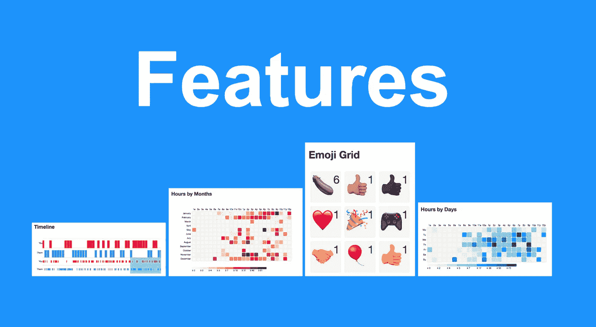
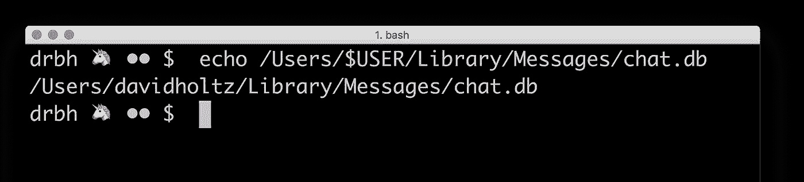
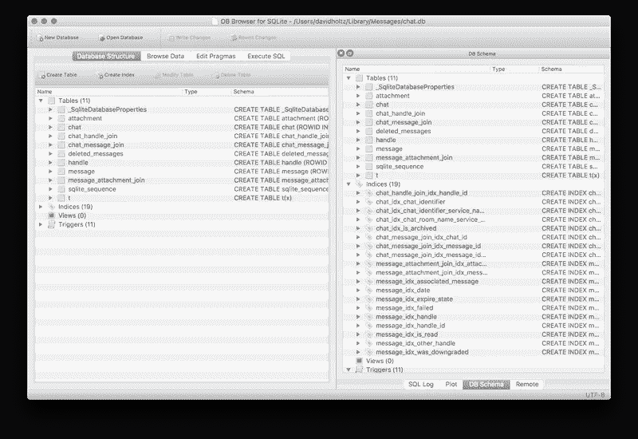
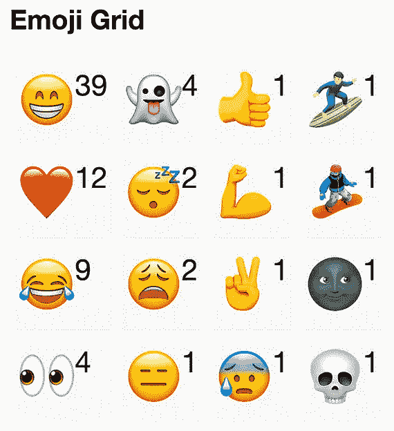
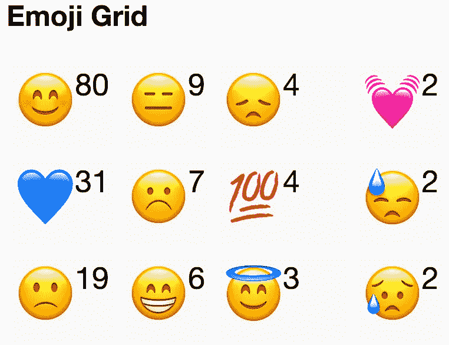
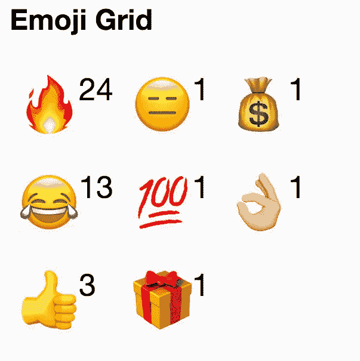
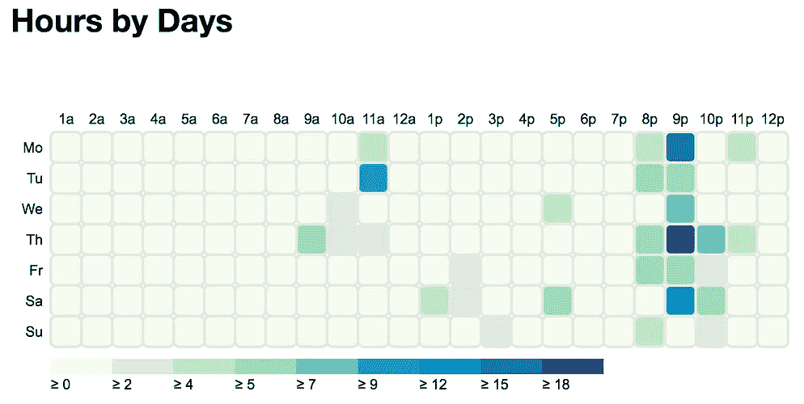
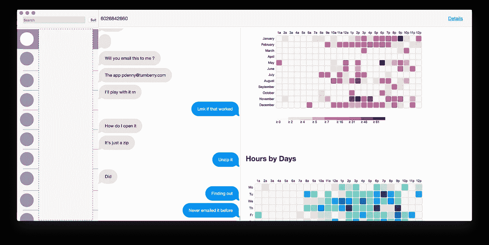

# 您的 iMessage 数据显示了您的哪些信息

> 原文：<https://towardsdatascience.com/what-your-imessage-data-says-about-you-daa186db16d?source=collection_archive---------12----------------------->

如今，我们几乎只通过短信交流。甚至我 96 岁的祖母也懂表情符号，知道表情符号的真正含义🍆和🔥。

对这些信息的分析会是什么样的呢？我们能从关系中学到什么？

在本文中，我们将找出并研究如何围绕这些消息可视化构建一个应用程序！



> 你有没有在写私人短信的时候把手机倾斜开了？
> 
> 你会让一个陌生人浏览你的对话吗？

想想我们的信息历史是多么的暴露和亲密，这几乎让人不舒服。它直接记录了我们与那些我们认为值得回短信的人的关系。

iMessage 在在线信息领域占据主导地位，因为它本质上与苹果设备是锁定的。

任何拥有 MacBook 和 iPhone 的开发者或重度电脑用户都知道 iMessages 自动同步带来的难以置信的便利。

好吧，酷——很好的推测。数据怎么说？

# 锁定数据

这些数据不容易获取并不奇怪。iOS 完全锁定了消息——无法通过其 SDK 以任何方式访问。

此外，在 iPhones 锁定的环境下，我们没有太多的选择来定位和分析设备上的信息。

要是有一种方法可以让我们实时导出这些消息就好了…

```
💡AH HA! - The desktop app!
```

# 我们的后门

经过对苹果文档的研究，我们在 MacBook 上找到了 iMessage DB。

如果我们在终端中运行这个简单的命令，我们将获得数据库的路径。

```
echo /Users/$USER/Library/Messages/chat.db
```



Finding the path to our messages database

# 探索/理解这种混乱

我们打开数据库，但好的数据在哪里仍然让人有些困惑。我们仍然需要对这些数据库字段进行逆向工程——或者翻遍苹果文档。

让 SQL 与 DB Browser for SQLite 一起使用一段时间，这是一个处理 SQLite 数据库的简单应用程序。



chat.db loaded into DB Browser for SQLite

 [## SQLite 的数据库浏览器

### 2017-09-28 -新增 portable app 3 . 10 . 1 版本。谢谢约翰。:)2017-09-20 - DB 浏览器 for SQLite 3.10.1 已…

sqlitebrowser.org](http://sqlitebrowser.org/) 

几个小时后，我从 Apple docs 中拼凑了足够的工作 SQL 和线索来提取所需的信息。

这项工作被封装在一个 Python 类中，这样我就可以在 Jupyter 笔记本上做一些分析。

下面是提取数据的片段

现在我们可以用 Python 做一些真正的分析，然后将一些工作转化为有用的可视化。

# 🤷🏽‍表情符号也很重要！

即使在我们的分析中不包括文本，我们也可以做一些表情指纹识别。

我们可以很好地了解一段关系，只需显示我和另一个人之间发送的每个表情符号的数量。

如果分解成发送-接收，这可能更具描述性。

> 这是我和朋友们的三个不同的表情网格



# 模式发现

太好了，我们有漂亮的图片，还对表情符号做了一些汇总。

然而，我们希望确保这些东西在现实世界中是有意义的，并做一些理智检查。

在这里，我们将进行更深入的分析，并尝试将我们提取的几个数据点联系在一起。

下面是一个和我一起生活的家庭成员的一小时一天的图表。顶部的表情符号也显示在右边。

我们立即注意到晚上 9 点左右的深色方块，以及大量的狗表情符号……对我来说，这种模式再清楚不过了。

我的狗内斯；大约在晚上 9-10 点最后一次散步。如果我不在家或者离家很远，我的家人经常会带他去散步。

这些文字是在问 Ness 是否需要遛，有时还附带一个狗表情符号。

太好了——事情正在有序进行。

> “这是你必须做的🐕esta noche？”
> 
> —家庭成员



这一切都是为了这个人


Ness being dramatic on FT

# 让我们再做一次——制作一个应用程序

现在我们有了这个很酷的工具，但是我们想让它可重复使用。我们将使用 NodeJS 进行 SQLite 连接，使用 Express 来提供服务，使用 Electron 来打包。

**我们需要:**

1.  构建 UI——让我们从实际的 iMessage 应用程序中获得灵感！
2.  对 DB 连接器脚本进行分类——让我们使用 NodeJS
3.  构建一个小型服务器来连接 UI 和 DB
4.  制作一个小型电子应用程序包装器



General App Layout

# 构建应用程序

我们使用之前编写的 python 脚本作为节点版本的起点。我们做这种语言转换是因为我们最终想把这整个东西打包成一个 AppStore Mac 应用程序。Electron 使这个过程变得更容易，我们希望所有的代码都使用同一种语言。

首先，让我们创建一个电子应用程序 shell——一个 main.js 文件，它将打开一个窗口，监听本地主机和我们的 UI 将在 dev 中运行的端口。

接下来，我们使用 express 来设置一个小型服务器。这个服务器应该返回应用程序的 html 页面，并且有两个端点——一个获取消息，一个获取最后的消息；iMessage 中的侧边栏。

您会注意到，这个服务器正在实例化我们尚未构建的 DataGrabber 类，这将是翻译后的 python 类。

当我们构建它时，有一些变化，因为现在我们使用承诺来确保数据被返回，而不是依赖 python 的同步执行流。

这些基本上是构建应用程序所需的所有部分，我们仍然需要大量的 CSS，JS 和 HTML 来制作 UI。如果读者感兴趣，我将把这个问题留给他们。

# ❓Questions 致读者

1.  你认为我们能从谈话中提取出什么样的信息？
2.  我们如何做到这一点？
3.  这样做的危险或好处是什么？
4.  这些信息是人们想了解自己的吗？

```
Thanks for getting through this adventure with me. Please show support and 👏 (clap) for this article.Remember you can clap up to 50 times, and clapping for this article would be really helpful in the Medium algorithm. Any support is greatly appreciated ❤️ Also, please answer the questions and add to the discussion below
```