# 客户价值几何？用 Python 为非合同业务建立客户终身价值模型

> 原文：<https://towardsdatascience.com/whats-a-customer-worth-8daf183f8a4f?source=collection_archive---------0----------------------->


Photo credit: Pexels

在电子商务或零售业务中，企业和客户之间的关系是非契约关系。在非契约的世界里，顾客确实会走开，但他们是默默地走开的；他们没有必要告诉我们他们要离开。这使得 CLV 的计算更加复杂。我们必须查看自客户上次交易以来的时间，并提出一个问题:客户是活着但处于休眠状态，还是客户“死亡”(“活着”意味着客户与我们互动，“死亡”意味着他们作为客户变得不活跃)？

因此，我们在这里:为非合同业务的客户终身价值建模。

该分析由沃顿商学院的彼得·法德尔博士提供。在这个分析中，我们不会深究 CLV 的数学。不过，如果你有兴趣，这里有[的论文](http://mktg.uni-svishtov.bg/ivm/resources/Counting_Your_Customers.pdf)。

# 数据

我们将使用的数据与我们进行[购物篮分析](https://medium.com/towards-data-science/a-gentle-introduction-on-market-basket-analysis-association-rules-fa4b986a40ce)和[客户细分](/find-your-best-customers-with-customer-segmentation-in-python-61d602f9eee6) — [在线零售数据集](http://archive.ics.uci.edu/ml/datasets/online+retail)时的数据相同，这些数据可以从 [UCI 机器学习库](http://archive.ics.uci.edu/ml/datasets/online+retail)下载。

```
import pandas as pd
import warnings
warnings.filterwarnings('ignore')
df = pd.read_excel("Online_Retail.xlsx")
df.head()
```

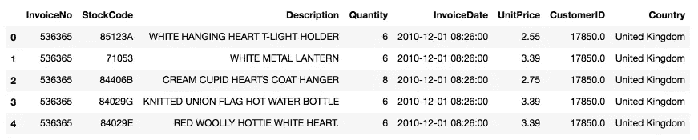

Figure 1

像往常一样，我们要做一些清理工作，然后创建一个只包含 CustomerID、InvoiceDate(删除时间)的新数据框架，并添加一个新列— sales:

```
import datetime as dt
df['InvoiceDate'] = pd.to_datetime(df['InvoiceDate']).dt.datedf = df[pd.notnull(df['CustomerID'])]
df = df[(df['Quantity']>0)]
df['Sales'] = df['Quantity'] * df['UnitPrice']
cols_of_interest = ['CustomerID', 'InvoiceDate', 'Sales']
df = df[cols_of_interest]
print(df.head())
print(df.head())
print(df['CustomerID'].nunique())
```

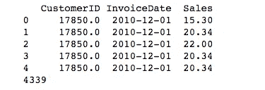

Figure 2

# CLV 模型定义

对于 CLV 型号，使用以下术语:

*   频率代表客户重复购买的次数。这意味着它比总购买次数少 1。
*   t 代表客户在任何时间单位内的年龄(在我们的数据集中是每天)。这等于客户第一次购买和研究期末之间的持续时间。
*   新近性代表顾客最近一次购买的年龄。这等于客户第一次购买和最后一次购买之间的持续时间。(因此，如果他们只进行了 1 次购买，则新近度为 0。)

下面的分析是使用由 Shopify 的数据科学家 [Cameron Davidson-Pilon](https://github.com/CamDavidsonPilon) 开发的[寿命包](https://github.com/CamDavidsonPilon/lifetimes)在 Python 中进行的，代码很大程度上借用了[寿命文档](https://lifetimes.readthedocs.io/en/latest/)。

# 数据浏览

```
from lifetimes.plotting import *
from lifetimes.utils import *
from lifetimes.estimation import *data = summary_data_from_transaction_data(df, 'CustomerID', 'InvoiceDate', monetary_value_col='Sales', observation_period_end='2011-12-9')
data.head()
```

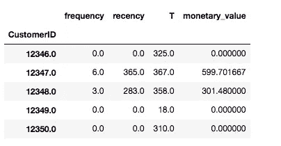

Figure 3

我们分析的客户有 4339 个。

CustomerID 12346 只购买了 1 次(没有重复)，因此他的频率和最近次数为 0，年龄为 325 天(例如，在分析中，他第一次购买和周期结束之间的持续时间)。

```
data['frequency'].plot(kind='hist', bins=50)
print(data['frequency'].describe())
print(sum(data['frequency'] == 0)/float(len(data)))
```

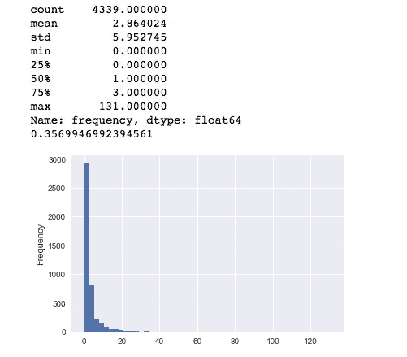

Figure 4

在我们的数据中，超过 35%的顾客只购买过一次(没有重复购买)。

# 使用 BG/NBD 模型进行频率/新近度分析

```
from lifetimes import BetaGeoFitterbgf = BetaGeoFitter(penalizer_coef=0.0)
bgf.fit(data['frequency'], data['recency'], data['T'])
print(bgf)
```

<lifetimes.betageofitter: fitted="" with="" subjects="" a:="" alpha:="" b:="" r:=""></lifetimes.betageofitter:>

**可视化我们的频率/最近矩阵**

假设:一位客户连续四周每天都购物，然后我们几个月都没有他的消息了。他还“活着”的几率有多大？很小，对吧？另一方面，历史上每个季度购买一次，上个季度又购买一次的客户很可能还活着。我们可以使用频率/最近矩阵来可视化这种关系，该矩阵计算一个模拟客户在下一个时间段将要进行的交易的预期数量，给定他的最近(最后一次购买的年龄)和频率(他已经进行的重复交易的数量)。

```
from lifetimes.plotting import plot_frequency_recency_matrix
import matplotlib.pyplot as plt
fig = plt.figure(figsize=(12,8))
plot_frequency_recency_matrix(bgf)
```

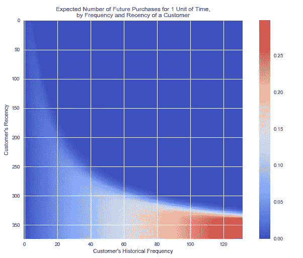

Figure 5

如果客户购买了 120 次，并且他最近一次购买是在他大约 350 天大的时候(即最近:她第一次交易和最近一次交易之间的持续时间是 350 天)，那么他是我们的最佳客户(右下角)。

大量购买和最近购买的客户很可能是未来的最佳客户。我们永远都不会满足。

购买了很多但不是最近购买的客户(右上角)，可能已经走了。

(40，300)附近还有另一种类型的客户，代表不经常购买的客户，我们最近没有见过他，所以他可能会再次购买。然而，我们不确定他是已经走了还是只是在购物之间。

我们可以预测哪些客户肯定还活着:

```
from lifetimes.plotting import plot_probability_alive_matrix
fig = plt.figure(figsize=(12,8))
plot_probability_alive_matrix(bgf)
```

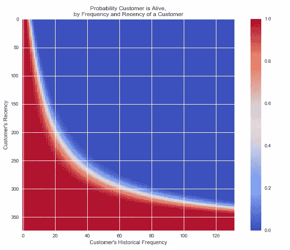

Figure 6

最近购买的客户几乎肯定是“活着”的。

那些大量购买但不是最近购买的顾客，很可能已经退出。他们过去买的越多，就越有可能辍学。它们被显示在右上方。

我们将客户从“下一阶段最高预期购买量”到最低预期购买量进行排名。模型揭示了一种方法，该方法将使用客户的历史记录来预测客户在下一时期的预期购买量。

```
t = 1
data['predicted_purchases'] = bgf.conditional_expected_number_of_purchases_up_to_time(t, data['frequency'], data['recency'], data['T'])
data.sort_values(by='predicted_purchases').tail(5)
```

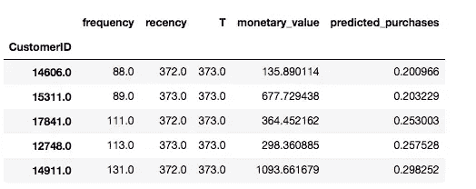

Figure 7

上面列出的是我们的前 5 名客户，模型预计他们将在第二天进行购买。predicted_purchases 列表示他们的预期购买数量，而其他三列表示他们当前的 RF 指标。BG/NBD 模型认为这些人在不久的将来会购买更多东西，因为他们是我们目前最好的客户。

**评估模型拟合度**

```
from lifetimes.plotting import plot_period_transactions
plot_period_transactions(bgf)
```

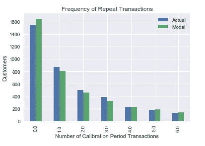

Figure 8

不错，我们的模型不差。所以，我们可以继续我们的分析。

我们现在将数据集划分为校准周期数据集和维持数据集。这很重要，因为我们想要测试我们的模型在尚未看到的数据上的表现(就像机器学习实践中的交叉验证)。

```
from lifetimes.utils import calibration_and_holdout_datasummary_cal_holdout = calibration_and_holdout_data(df, 'CustomerID', 'InvoiceDate',
                                        calibration_period_end='2011-06-08',
                                        observation_period_end='2011-12-9' )   
print(summary_cal_holdout.head())
```


Figure 9

```
from lifetimes.plotting import plot_calibration_purchases_vs_holdout_purchasesbgf.fit(summary_cal_holdout['frequency_cal'], summary_cal_holdout['recency_cal'], summary_cal_holdout['T_cal'])
plot_calibration_purchases_vs_holdout_purchases(bgf, summary_cal_holdout)
```

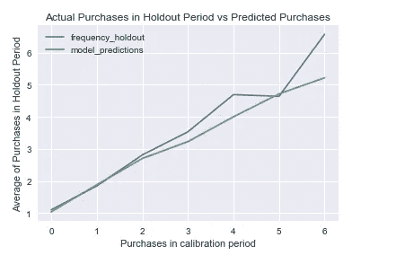

Figure 10

在该图中，我们将数据分为采样(校准)和验证(维持)两个阶段。样本期从年初至 2011 年 6 月 8 日；验证期从 2011 年 6 月 9 日到 2011 年 12 月 9 日。该图根据重复购买的次数(x 轴)对校准期内的所有客户进行分组，然后对维持期内的重复购买进行平均(y 轴)。绿色和蓝色线分别表示 y 轴的模型预测和实际结果。正如我们所看到的，我们的模型能够非常准确地预测样本中客户群的行为，该模型低估了 4 次购买和 5 次购买后的行为。

# **客户交易预测**

根据客户历史，我们现在可以预测个人未来的购买情况:

```
t = 10
individual = data.loc[12347]
bgf.predict(t, individual['frequency'], individual['recency'], individual['T'])
```

0.1572775101289126

我们的模型预测客户 12347 的未来交易是 10 天后的 0.157。

# **客户概率历史**

根据我们训练好的模型，给定客户交易历史，我们可以计算他们存活的历史概率。例如，我们希望查看我们最佳客户的交易历史，并了解其存活的概率:

```
from lifetimes.plotting import plot_history_alive
import matplotlib.pyplot as pltfig = plt.figure(figsize=(12,8))
id = 14606
days_since_birth = 365
sp_trans = df.loc[df['CustomerID'] == id]
plot_history_alive(bgf, days_since_birth, sp_trans, 'InvoiceDate')
```

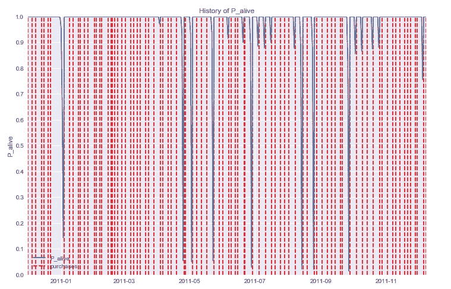

Figure 11

我们最好的客户肯定还活着，但是，他在 2011 年下半年中断了几次。

```
fig = plt.figure(figsize=(12,8))
id = 14729
days_since_birth = 365
sp_trans = df.loc[df['CustomerID'] == id]
plot_history_alive(bgf, days_since_birth, sp_trans, 'InvoiceDate')
```

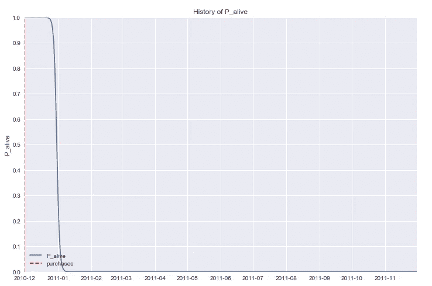

Figure 12

另一方面，这位顾客只购买过一次，已经离开很长时间了，他有 100%的可能已经死了。

# **使用货币价值的伽玛-伽玛模型估算客户终身价值**

我们现在考虑每笔交易的经济价值。为了估计这一点，我们使用沃顿商学院的 Peter Fader 博士和 Bruce Hardie 博士提出的 [Gamma-Gamma 子模型来预测未来客户层面的每笔交易的可能支出。](http://www.brucehardie.com/notes/025/gamma_gamma.pdf)

我们只估计了至少有一次重复购买的客户。因此，我们估计有 2，790 名客户。

```
returning_customers_summary = data[data['frequency']>0]print(returning_customers_summary.head())
print(len(returning_customers_summary))
```

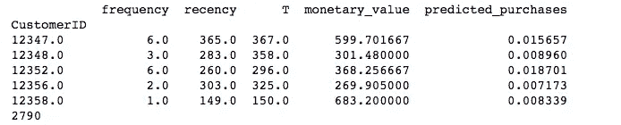

Figure 13

```
from lifetimes import GammaGammaFitterggf = GammaGammaFitter(penalizer_coef = 0)
ggf.fit(returning_customers_summary['frequency'],
        returning_customers_summary['monetary_value'])
print(ggf)
```

<lifetimes.gammagammafitter: fitted="" with="" subjects="" p:="" q:="" v:=""></lifetimes.gammagammafitter:>

应用 Gamma-Gamma 模型后，现在我们可以估计每个客户的平均交易值。唷！

```
print(ggf.conditional_expected_average_profit(
        data['frequency'],
        data['monetary_value']
    ).head(10))
```

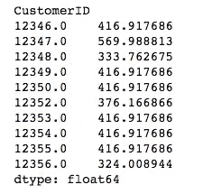

Figure 14

[Jupyter 笔记本](https://github.com/susanli2016/Machine-Learning-with-Python/blob/master/CLV_Non_Contractual.ipynb)可以在 [Github](https://github.com/susanli2016) 找到。周末快乐！