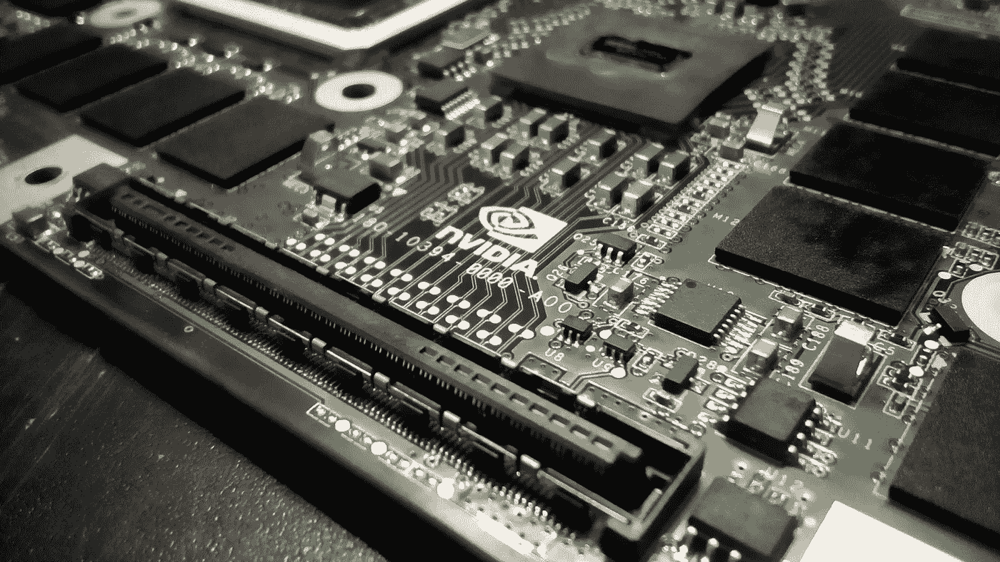
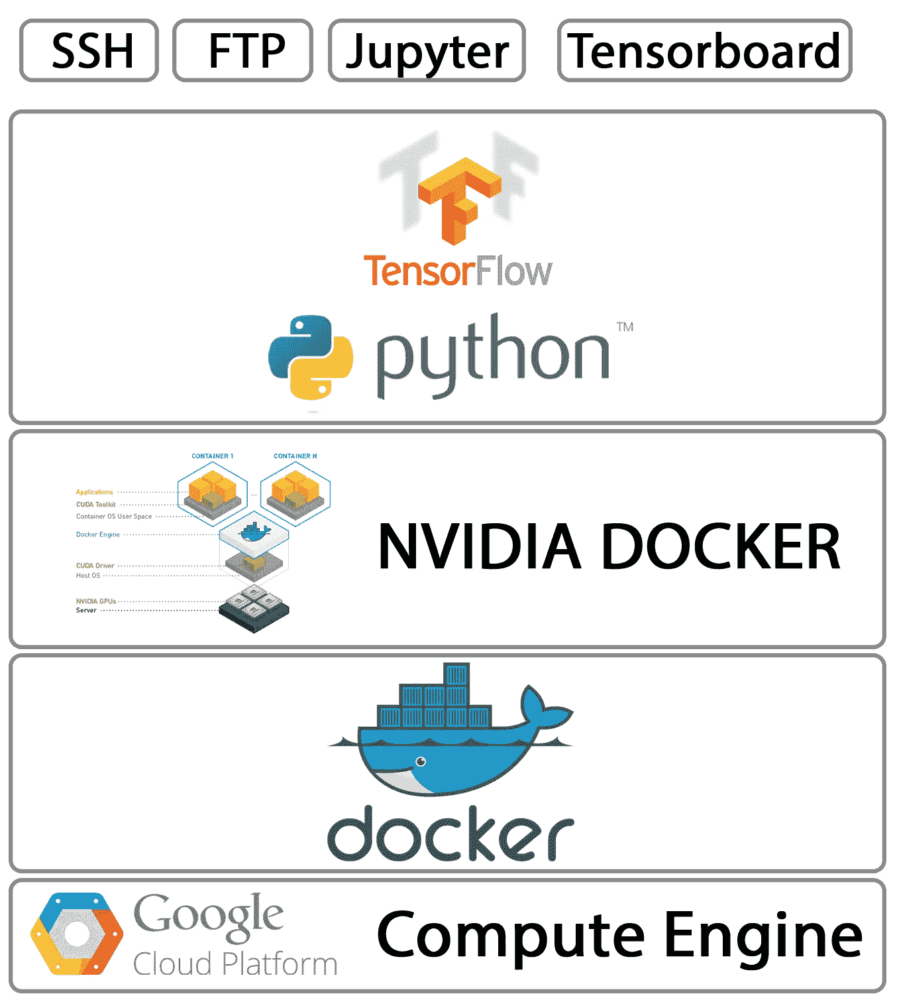

# 设置 GCP 计算实例后会发生什么？使用 Tensorflow 运行自定义 Docker 容器

> 原文：<https://towardsdatascience.com/whats-after-setting-up-a-gcp-computing-instance-running-a-custom-docker-container-with-tensorflow-eb0f077983c6?source=collection_archive---------7----------------------->



pixabay.com



What we should see after setting up

# 介绍

随着深度学习的出现和“模型越深，性能越好”的实现，谷歌云平台(GCP)等基于云的计算平台获得了相当多的关注(我在这里不是为了争论这个概念的真实性，而只是陈述一个被广泛接受的信念)。以及“模型越深，计算资源应该越好”。

无论何时发布最新的 GPU 卡，购买并安装它们都不是经济可行的策略(尤其是对于中小型技术机构)。如果一个人采用这种策略，他应该为下面的挑战做好准备。

*   做出巨大的金钱牺牲来购买最新的 GPU 卡和必要的基础设施
*   维护基础设施以确保不间断服务
*   为多个用户开发资源分配方案

然而，GCP 提供了这种服务，只收取很少的费用(当然从长远来看会增加)。但重要的是，您不必担心维护或初始设置(例如安装操作系统(OS))，并提供多种定制选项供您选择(例如操作系统、磁盘存储、GPU 类型、GPU 数量等)。).例如，你可以选择一个使用 Ubuntu 16.04、50GB 存储、2 特斯拉 P100 图形处理器等的实例。

在这篇文章中，我将讨论如何设置一个自定义的 docker 映像，创建一个包含该映像的容器，并在其中运行 python + Tensorflow 脚本。

# 初始设置

我不打算进行设置，有很多很好的资源解释了如何在 GCP 上创建和设置一个计算实例。我最喜欢的一个是，

[](https://medium.com/google-cloud/jupyter-tensorflow-nvidia-gpu-docker-google-compute-engine-4a146f085f17) [## jupyter+tensor flow+Nvidia GPU+Docker+Google 计算引擎

### TL；DR:按照下面的方法使用 Tensorflow、Jupyter、Docker 和 Nvidia GPUs，可以节省时间，减少麻烦…

medium.com](https://medium.com/google-cloud/jupyter-tensorflow-nvidia-gpu-docker-google-compute-engine-4a146f085f17) 

我会用简单的英语总结一下里面的内容，

*   首先定义防火墙规则，允许 TCP 通过几个端口进行通信(tensorboard:6006，ftp:21-22，jupyter:8888)
*   使用防火墙规则在 GCP 上设置一个计算实例
*   在实例上安装 CUDA
*   在实例上安装 Docker 和 Nvidia-Docker

# 那么初始设置之后会发生什么呢？

在这里我们要讨论从这里向何处去。首先让我说明我将使用的库和版本。

*   Python: 3.4
*   张量流:1.3

我现在简要总结一下我们要做的事情。我们将首先下载一个支持 **python 3.x Tensorflow** 的图片。然后我们将用下载的图像创建一个容器。最后，我们将运行一些命令，以确保它的工作。

PS: 你想用哪个 python 版本取决于你想解决的问题。python 3.x 和 python 2.x 之间存在[差异](https://wiki.python.org/moin/Python2orPython3)，然而，python 2.x 将在不久的将来[退役](https://pythonclock.org/)，python 3.x 将取而代之。所以最好从 python 2.x 迁移到 python 3.x

# SSH 到实例中

要 ssh 到 GCP 实例，您可以使用

*   [gcloud Shell](https://cloud.google.com/shell/docs/)
*   [第三方外壳](https://cloud.google.com/compute/docs/instances/adding-removing-ssh-keys)(例如 Windows 上的 Ubuntu 外壳或 Putty)

# 下载兼容的 Docker 映像

遗憾的是，gcr.io 并没有为我们提供一张 python 3.x 兼容的 Tensorflow 图片，而只是 python 2.x 兼容的 Tensorflow 图片。所以我们必须从 [DockerHub](https://hub.docker.com) 下载一个兼容 python 3.x 的 Tensorflow 图像。并且可以在 DockerHub 中看到所有的 [Tensorflow 图片。](https://hub.docker.com/r/tensorflow/tensorflow/tags/)

我将使用 **1.3.0-gpu-py3** 图像(如果您向下滚动 DockerHub 中的 [Tensorflow 图像，您会看到这一点)](https://hub.docker.com/r/tensorflow/tensorflow/tags/)

使用 gcloud shell 或终端将第一个 ssh 下载到您的实例中。一旦有了访问类型，

```
sudo docker pull tensorflow/tensorflow:1.3.0-gpu-py3
```

当您键入这个内容时，Docker 将自动查找带有在双冒号后指定的标记名的图像(当然是在 DockerHub 中)。然后，您应该在 shell 中看到正在下载和提取的图像。要确保图像已下载，请尝试

```
sudo docker images
```

您应该会看到列出的图像

```
REPOSITORY            TAG             IMAGE ID       CREATED   SIZE
nvidia/cuda           latest          af786b192aa5   10 days ago   2.16GB
tensorflow/tensorflow 1.3.0-gpu-py3   ae2207c21bc1   5 months ago 3.29GB
```

# 用图像创建并运行 Docker 容器

这个操作完成后，我们可以用图像创建一个 docker 容器。但在此之前，先创建一个名为**docker _ tensor flow _ example**的文件夹。这将保存我们在容器内运行时创建的数据，稍后我们将讨论如何进行映射。然后将该文件夹的权限更改为:

```
​ sudo chmod 755 ~/docker_tensorflow_example/
```

所以主人有完全的权限。然后我们创建 docker 容器，

```
nvidia-docker run -it -v ~/docker_tensorflow_example/:/root/docker_tensorflow_example — name docker-py3-tensorflow tensorflow/tensorflow:1.3.0-gpu-py3 bash
​
```

那是一口不是吗？那我们就把这个宝贝拆成碎片吧，

*   [**NVIDIA-docker**](https://github.com/NVIDIA/nvidia-docker)——是一个在 NVIDIA GPU 上运行 Docker 容器的 Docker 引擎实用程序。docker 顶部的包装
*   [](https://docs.docker.com/engine/reference/run/)****—意思是运行 docker 容器****
*   ******-it**-表示即使没有连接任何东西，也要保持容器打开(这样我们就可以运行东西，脱离遥控器，在我们这边，关闭本地计算机。****
*   ******-v src_dir:target_dir** —将本地目录映射到容器中的一个目录。请记住，当您停止容器时，容器以及其中保存的所有数据都会消失。因此，该选项将在容器文件夹(target_dir)中创建的所有数据映射到存储上的实际目录(source_dir)。****
*   ******-name docker-py3-tensor flow**-这是我们正在创建的容器的名称。使用一个特定的名字也将阻止我们盲目地创建容器(因为如果你不指定一个名字，docker 会用一个随机的名字创建容器。如果你指定了一个名字，docker 将会抱怨同名的容器已经存在)****
*   ******tensor flow/tensor flow:1 . 3 . 0-GPU-py3**—告诉 docker 使用哪个图像来创建容器。****

# ****关于 nvidia-docker 要记住的事情****

****如果您看到错误，****

```
**nvidia-docker: command not found**
```

****那么您可能必须首先以 root 用户身份登录，****

```
**sudo -s**
```

****并重试该命令。****

# ****正在启动 Jupyter 笔记本服务器****

****如果您需要运行 Jupyter 笔记本服务器，请使用上面的命令，不要使用 bash。****

```
**nvidia-docker run -it -v ~/docker_tensorflow_example/:/root/docker_tensorflow_example — name docker-py3-tensorflow tensorflow/tensorflow:1.3.0-gpu-py3
​**
```

# ****测试容器****

****现在，您应该已经运行了 docker 容器，并且您的 shell 应该在容器中，终端应该有提示，****

```
**root@8301xxxxxxxx: ~/**
```

****其中 8301xxxxxxxx 是容器 ID。现在试试，****

```
**python3**
```

****试着，****

```
**import tensorflow as tf
print(tf.__version__)**
```

****这应该可以正常工作，您应该得到 1.3.0 作为输出。如果出现这种情况，恭喜你！您已经安装了库。如果没有，请确保您遵循了当前初始设置和设置 docker 容器的步骤。****

****干杯！****