# 上个月世界发生了什么:世界新闻分析第二部分

> 原文：<https://towardsdatascience.com/whats-happened-in-a-world-last-month-world-news-analysis-part-ii-1c8c284a6691?source=collection_archive---------17----------------------->

你好！那些没有看到我的第一部分的人，我强烈推荐他们去做一个基本的了解。

第一部分——上个月世界发生了什么:世界新闻分析

所以，我们仍然在收集最新的新闻，现在我们有来自 24 个国家的 53.115 条新闻摘要。我们可以看到大部分是在星期三:

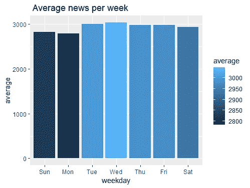

在我们分析的第一部分，我们应用了单词检测功能和可视化来快速获得这样的结果(我在之前的帖子中没有画出这个图，但我认为值得在这里看一看):

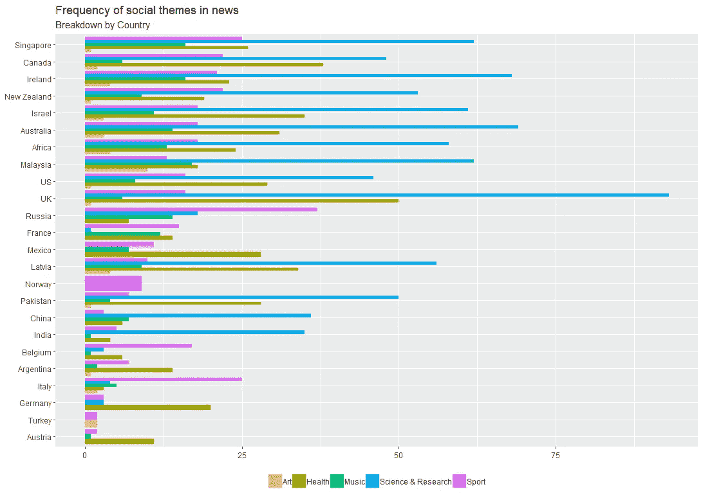

我们可能会看到一些国家(意大利和俄罗斯)严重依赖体育新闻，对科学、健康和艺术话题关注不够。但是有一些国家，如英国、新加坡、澳大利亚和马来西亚，拥有最多的科学报道。真正让我吃惊的是:德国和奥地利比其他国家拥有更多的关于健康的新闻。

比较体育和科学话题，我们可以画出这两者之间的总差异。

```
Science <- test %>%
  filter(
    str_detect(
      text,
      "science|research|scientific|scientist|科学|wissenschaft|Gelehrte|wissenschaftlich| наука | ученые "
    )
  ) %>%
  count(Date)
Science$id <- "science"Sport <- test %>%
  filter(str_detect(text, "sport|спорт|运动|deporte")) %>%
  count(Date)
Sport$id <- "sport" popularity <- merge(x = Science,
                    y = Sport,
                    by = "Date",
                    all.x = TRUE)

colnames(popularity)[which(names(popularity) == "n.x")] <- "science"
colnames(popularity)[which(names(popularity) == "n.y")] <- "sport"

popularity[is.na(popularity)] <- 0

drops <- c("id.x", "id.y")
popularity <- popularity[,!(names(popularity) %in% drops)]ggplot(popularity, aes(x = Date)) +
  geom_area(aes(y = science + sport, fill = "science")) +
  geom_area(aes(y = sport, fill = "sport")) +
  labs(
    title = "Area chart on selected topics",
    subtitle = "Total news",
    caption = "",
    x = "",
    y = ""
  )
```

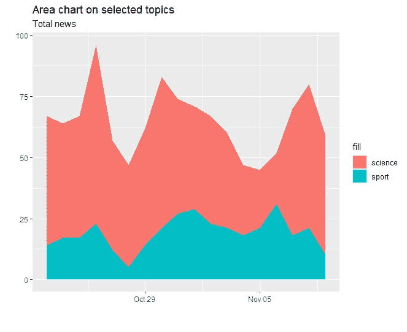

看起来体育新闻有时会登上榜首。我们将使用一些定量文本分析工具来找出为什么会发生这种情况。我们从搭配分析开始。为此，我们将使用 quanteda R 包进行定量文本分析。它帮助我们**识别在我们的数据集**中频繁出现的多词表达。经过一些基本操作，如构建语料库、按日期排列变量和创建令牌，我们得到了这个:

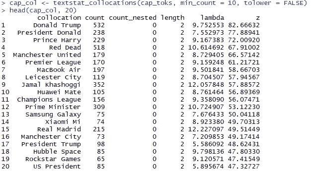

这就是我们之前关于体育新闻问题的答案。我们清楚地看到在我们的数据中出现的主要表达:从游戏和产品到重要的名字、行动和英超联赛。以下是完整的代码:

```
news_corp <- test
news_corp$text <- as.character(news_corp$text)
news_corp <- corpus(news_corp)
ndoc(news_corp)range(docvars(news_corp, 'Date'))news_toks <- tokens(news_corp) %>%
  tokens_remove(stopwords('english'), padding = TRUE) %>%
  tokens_remove('[\\p{P}\\p{S}]', valuetype = 'regex', padding = TRUE)cap_toks <-
  tokens_select(
    news_toks,
    '^[A-Z]',
    valuetype = 'regex',
    case_insensitive = FALSE,
    padding = TRUE
  )
head(cap_toks[[1]], 50)cap_col <-
  textstat_collocations(cap_toks, min_count = 10, tolower = FALSE)
head(cap_col, 20) %>%
  View()cap_col %>%
  arrange(desc(count)) %>%
  head(30) %>%
  ggplot(aes(collocation, count, color = collocation, size = count)) +
  geom_point() +
  coord_flip() +
  expand_limits(y = 0) +
  theme(legend.position = "none") +
  labs(
    title = "Most frequent multi-word expressions",
    subtitle = "",
    x = "",
    y = ""
  )
```

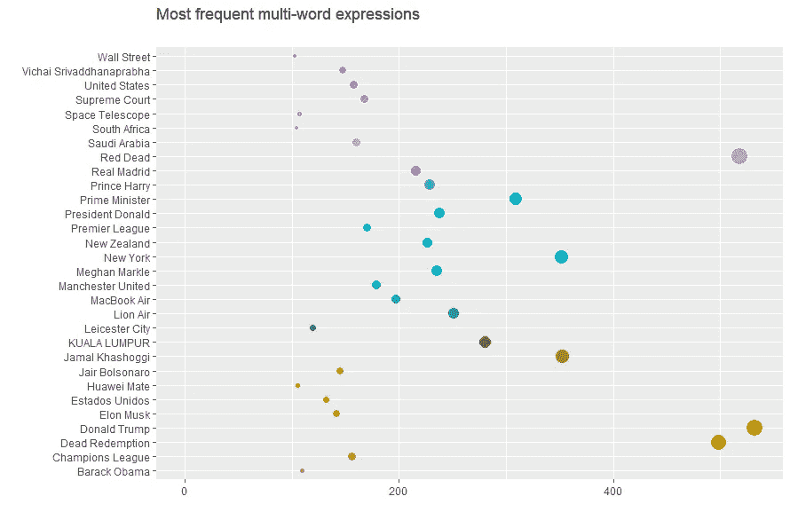

为了改进我们的结果，我们应该只选择强关联的多词表达式。

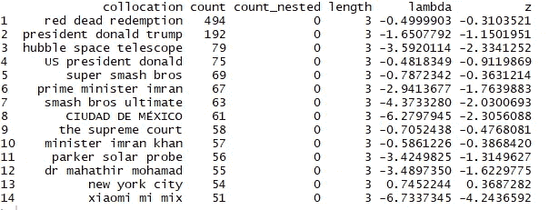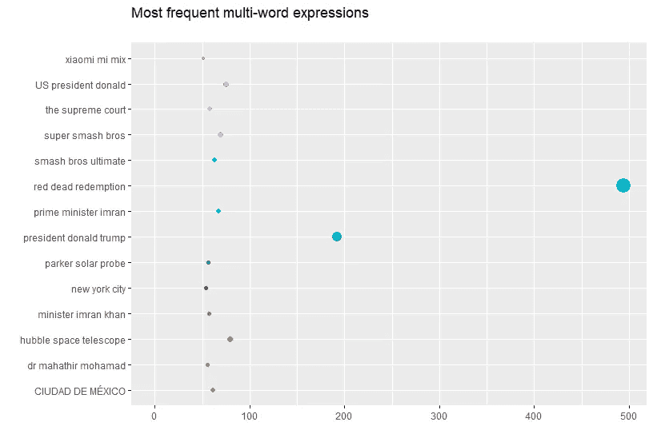

正如我们所见，Rockstar Games 的新游戏“红色死亡救赎”在我们的数据集中为每个国家都赢得了不错的分数。但是如果我们不知道这到底是一个游戏还是别的什么呢？有针对性的词语搭配帮助我们发现:

```
rdr <- c('Red Dead Redemption')
rdr_dfm <-
  tokens_keep(news_toks, phrase(rdr), window = 10) %>% dfm()
not_rdr_dfm <-
  tokens_remove(news_toks, phrase(rdr), window = 10) %>% dfm()
rdr_key <-
  textstat_keyness(rbind(rdr_dfm, not_rdr_dfm), seq_len(ndoc(rdr_dfm)))rdr_key <- rdr_key[rdr_key$n_target > 10, ]
head(rdr_key, 50)rdr_key %>%
  mutate(feature = fct_reorder(feature, chi2)) %>%
  head(30) %>%
  ggplot(aes(feature, chi2, fill = feature)) +
  geom_col() +
  coord_flip() +
  expand_limits(y = 0) +
  theme(legend.position = "none") +
  labs(
    title = "Targeted frequency analysis on 'Red Dead Redemption'",
    subtitle = "",
    x = "",
    y = ""
  )
```

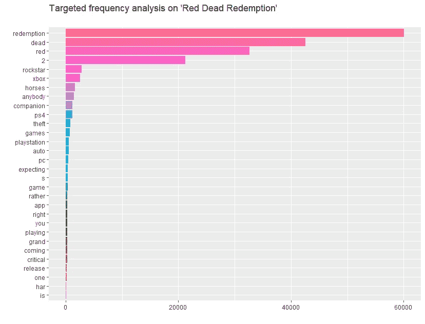

应用主题建模算法，我们将得到 100 个主题([见我之前的帖子](/whats-happened-in-a-world-last-month-world-news-analysis-b7e540d45d64)):

```
gamma_terms %>%
  top_n(20, gamma) %>%
  ggplot(aes(topic, gamma, label = terms, fill = topic)) +
  geom_col(show.legend = FALSE) +
  geom_text(
    hjust = 0,
    nudge_y = 0.0005,
    size = 3
  ) +
  coord_flip() +
  scale_y_continuous(expand = c(0, 0),
                     limits = c(0, 0.09),
                     labels = percent_format()) +
  labs(
    x = NULL,
    y = expression(gamma),
    title = "Top 20 topics by prevalence in the our dataset",
    subtitle = "With the top words that contribute to each topic"
  )
```

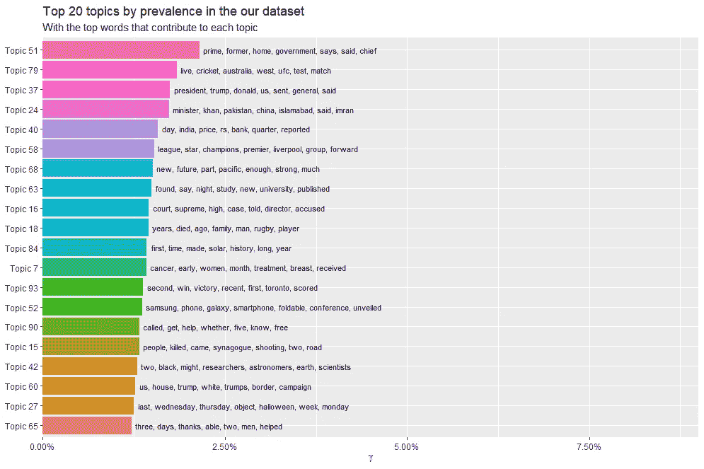

在顶部，我们有与总统和政府、体育和一些研究相关的新闻。太好了！接下来，我们将应用相对频率分析。在我的上一篇文章中，我们做了一个“新闻中精选品牌的引用”图表。现在我们比较他们两个的得分。

> textstat_keyness 函数计算“keyness”，这是不同类别中不同出现的特征的得分。这里，通过参考 dfm 中的“目标”文档索引来定义类别，参考组由所有其他文档组成。
> 
> 参考文献
> 邦迪、玛丽娜和迈克·斯科特合编。2010.文本中的基调。阿姆斯特丹，费城:约翰·本杰明，2010 年。
> 
> 斯塔布斯，迈克尔。2010.“关键词的三个概念”。文本中的基调，玛丽娜邦迪和迈克·斯科特编辑。pp21 42。阿姆斯特丹，费城:约翰·本杰明。
> 
> 斯科特，m .和特里布尔，2006 年。语言教育中的关键词和语料库分析。阿姆斯特丹:本雅明，第 55 页。
> 
> 邓宁泰德。1993.“统计意外和巧合的精确方法”，《计算语言学》，第 19 卷，第 1 期，第 61-74 页。

让我们看看作为目标值的“Apple”和预期的“Samsung”之间的相对频率。谁知道也许我们会看到一些关系？结果，我们得到了这个具有卡方值的图(如果目标中的观察值超过其预期值，则符号为正)

```
Apple <- test %>%
  filter(str_detect(text, " Apple "))
Apple$id <- "Apple"Samsung <- test %>%
  filter(str_detect(text, " Samsung "))
Samsung$id <- "Samsung"popularity <- rbind(Samsung, Apple)
popularity$text <- as.character(popularity$text)my_corpus <- corpus(popularity)# Create a dfm 
pres_dfm <-
  dfm(
    my_corpus,
    groups = "id",
    remove = stopwords("english"),
    remove_punct = TRUE
  )# Calculate keyness 
result_keyness <- textstat_keyness(pres_dfm, target = "Apple")
```

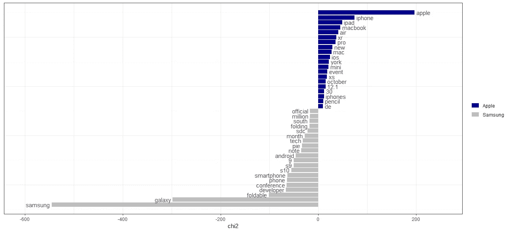

我们看到目标变量和预期之间的巨大差异:比如三星的可折叠智能手机和苹果的新 macbook。接下来，我们将构建一个 wordfish。Wordfish 是一种缩放技术，它不需要任何锚定文档来执行分析。相反，它依赖于字数的统计模型。这是它寻找“机器人”的方式。

```
test <- test %>%
  filter(str_detect(text, "Android")) 
test$text<-as.character(test$text)
my_corpus <- corpus(test)wf <- textmodel_wordfish(dfm(my_corpus), dir = c(6,5))# Plot estimated word positions
textplot_scale1d(wf, margin = "features", 
                 highlighted = c("foldable", "android", 
                                 "performance", "samsung"), 
                 highlighted_color = "red")
```

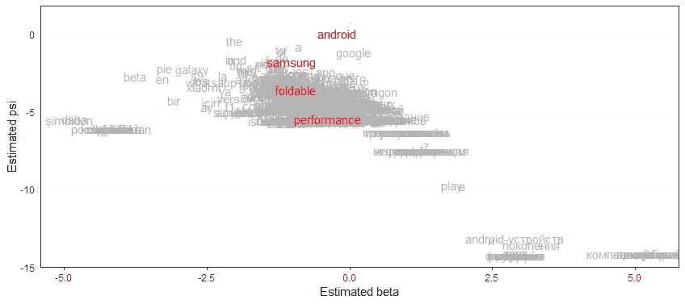

我最不想尝试的是新闻地图功能。它基于对数据中关联最强的国家的预测。我们已经看了新闻中对选定国家的引用，比如这个图:

```
US <- test %>%
  filter(str_detect(text, " United States | US | USA | Stati Uniti | Etats-Unis| США | 美国")) %>%
  count(name, Date)
US$id <- "United States"Germany <- test %>%
  filter(str_detect(
    text,
    " Germany | Deutschland | Alemania | Germania | Allemagne | Германия |德国"
  )) %>%
  count(name, Date)
Germany$id <- "Germany"China <- test %>%
  filter(str_detect(text, " China | Chine | Cina |Китай| 中国")) %>%
  count(name, Date)
China$id <- "China"Russia <- test %>%
  filter(str_detect(text, " Russia | Russland| Rusia | Russie |Россия|俄罗斯")) %>%
  count(name, Date)
Russia$id <- "Russia"popularity <- rbind(US, Germany, China, Russia)popularity %>%
  group_by(id) %>%
  ggplot(aes(Date, n, color = id)) +
  geom_line(size = 0.9) +
  facet_wrap( ~ name, scales = 'free_y') +
  labs(
    title = "Citations on selected countries in a news",
    subtitle = "Breakdown by Country",
    x = "",
    y = ""
  )
```

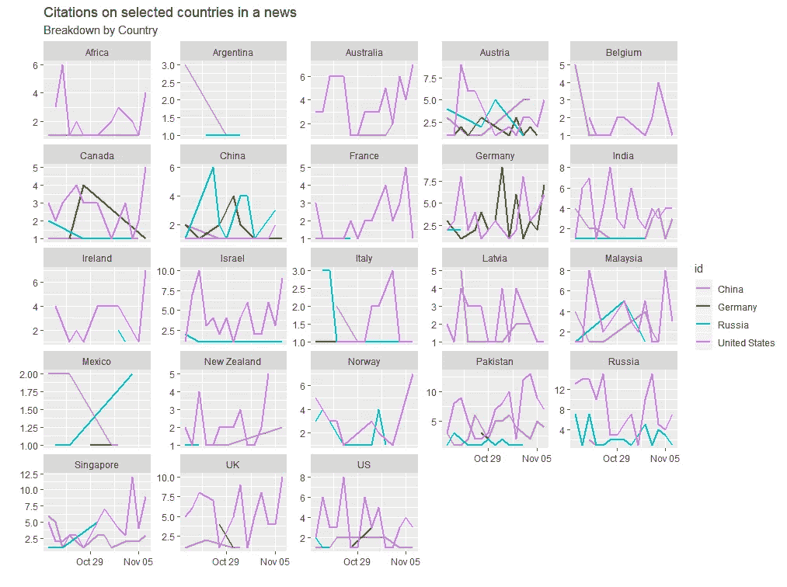

但现在我们将尝试预测国家引用并在地图上绘制出来。

> Newsmap 是用于地理文档分类的半监督模型。虽然(完全)监督模型是在人工分类的数据上训练的，但这种半监督模型是从字典中的“种子词”学习的。

```
test$text <- as.character(test$text)
test<- corpus(test)ndoc(test)range(docvars(test, 'Date'))month <- c(
  'January',
  'February',
  'March',
  'April',
  'May',
  'June',
  'July',
  'August',
  'September',
  'October',
  'November',
  'December'
)
day <-
  c('Sunday',
    'Monday',
    'Tuesday',
    'Wednesday',
    'Thursday',
    'Friday',
    'Saturday')
agency <- c('AP', 'AFP', 'Reuters', 'CNN', 'BBC')toks <- tokens(test)
toks <-
  tokens_remove(toks,
                stopwords('english'),
                valuetype = 'fixed',
                padding = TRUE)
toks <-
  tokens_remove(toks,
                c(month, day, agency),
                valuetype = 'fixed',
                padding = TRUE)label_toks <-
  tokens_lookup(toks, data_dictionary_newsmap_en, levels = 3) # level 3 is countries
label_dfm <- dfm(label_toks, tolower = FALSE)feat_dfm <- dfm(toks, tolower = FALSE)
feat_dfm <-
  dfm_select(feat_dfm,
             "^[A-Z][A-Za-z1-2]+",
             valuetype = 'regex',
             case_insensitive = FALSE)
feat_dfm <- dfm_trim(feat_dfm, min_termfreq = 10)model <- textmodel_newsmap(feat_dfm, label_dfm)coefficients <-
  coef(model, n = 10)[c("US", "GB", "FR", "BR", "JP", "RU")]
coefficients <- as.tibble(coefficients)pred <- predict(model)
head(pred, 20)count <-
  sort(table(factor(pred, levels = colnames(label_dfm))), decreasing = TRUE)
head(count, 20)data_country <- as.data.frame(count, stringsAsFactors = FALSE)
colnames(data_country) <- c("id", "frequency")
data_country <- data_country %>%
  filter(id != "ET")world_map <- map_data(map = "world")
world_map$region <-
  iso.alpha(world_map$region) # convert contry name to ISO codeggplot(data_country, aes(map_id = id)) +
  geom_map(aes(fill = frequency), map = world_map) +
  expand_limits(x = world_map$long, y = world_map$lat) +
  scale_fill_continuous(name = "Frequency") +
  theme_void() +
  coord_fixed()
```

在我们用与国家/地区相关联的附加摘录构建模型之后，我们可以检查它们:

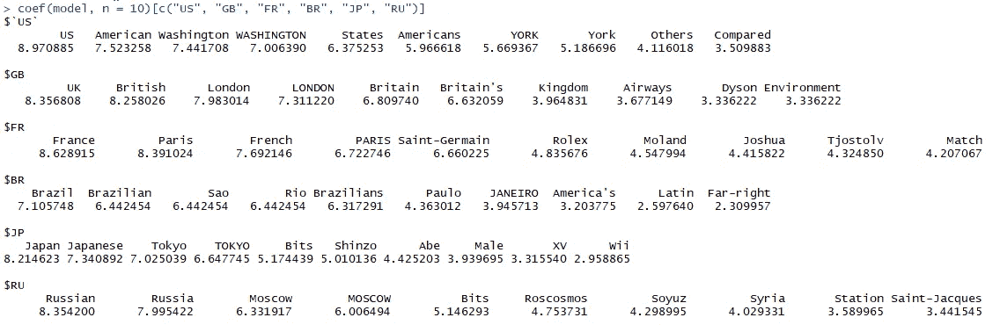

一切都很好，但有些特征很奇怪。俄罗斯的“圣雅克”？让我们看看新闻来源:

> 加拿大宇航员大卫·圣·雅克说，他对俄罗斯联盟号火箭助推器比以往任何时候都更有信心

好吧，这是可以接受的，现在我们可以做一个预测，并创建一个地图:

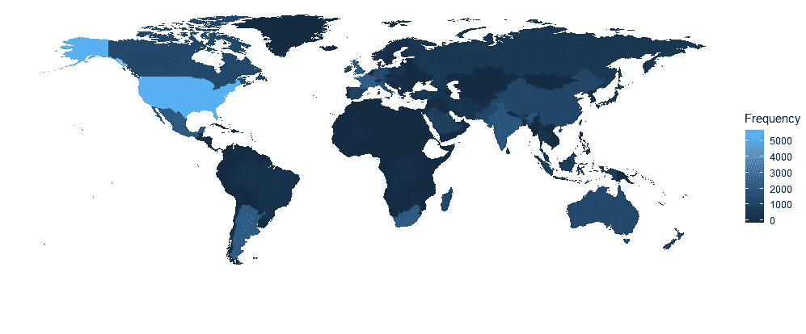

它看起来非常类似于以前的地图，但有一些例外。我们之前的地图是基于每个国家的新闻总数，而这张地图是基于对新闻中国家引用的预测。较亮的颜色显示一个国家的最大引用排名，我们对美国的排名很突出，对欧洲、中国、澳大利亚和拉丁美洲的排名略低。

看起来很有趣？以下是更多信息:

## [第一部分——上个月世界发生了什么:世界新闻分析](/whats-happened-in-a-world-last-month-world-news-analysis-b7e540d45d64)

## [**Youtube 频道分析:识别影响者和憎恨者**](/youtube-channel-analysis-identifying-influencers-and-haters-8d7a4c0790c7)