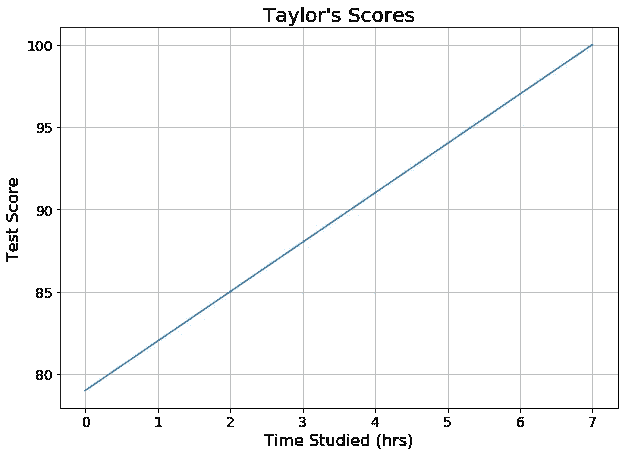
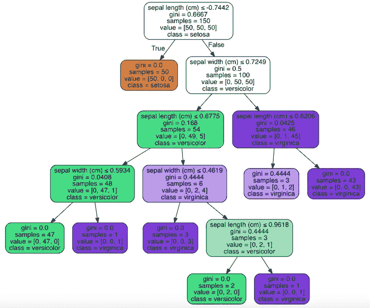
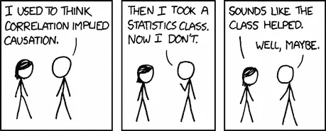

# 盒子里有什么？！——第三产业区 Chipy Mentorship。3

> 原文：<https://towardsdatascience.com/whats-in-the-box-2754f498be86?source=collection_archive---------11----------------------->

## 理解预测建模和“黑盒”模型的含义


How Brad Pitt feels about Neural Nets

自从开始研究数据科学以来，我收到的最常见的问题是:“什么是数据科学？”毫无疑问，这是一个合理的问题，也是一个我非常乐意回答的问题，涉及到一个我非常热爱的领域。这个答案最清晰的提炼是这样的:

> 数据科学是使用机器学习来建立预测模型的过程。

作为自然的后续，我们敏锐的听众可能会询问术语的定义:

1.  什么是机器学习？
2.  你说的模型是什么意思？

本帖重点回答后者。这种情况下的答案——同样是最简单的形式——是模型是一个函数；它接受输入并生成输出。首先，我们来看看最透明的预测模型之一，线性回归。

## 线性回归


The Linear Regression of Game Boy models

假设我们试图预测一个学生，泰勒，在一次考试中会得多少分。我们知道泰勒在过去的测试中得了多少分，*和*我们知道她学习了多少小时。当她根本不学习时，她得到 79/100，每学习一小时，她就多做三分。因此，我们对这种关系的等式是:

```
Taylor's_Test_Score = 3 * Hours_Studied + 79
```

这个例子是一个尽可能透明的模型。为什么？因为我们不仅知道*学习的*小时会影响泰勒的分数，我们还知道*学习的*小时会如何影响泰勒的分数。也就是说，能够看到系数 3 和常数 79，告诉我们学习和分数之间的确切关系。这是一个简单的函数:投入两个小时，得到 85 分。投入 6 个小时，得到 97 分。



Our very own predictive model represented graphically

当然，现实世界更加复杂，所以我们可能开始向我们的模型添加更多的输入。也许我们还会利用睡眠时间、看电视时间和缺课时间。如果我们更新我们的等式，这些新特征中的每一个都将有它自己的系数来描述输入与输出的关系。所有这些输入在数据科学术语中被称为我们模型的*特征*，我们用这些数据来进行预测。这种线性回归现在是*多维*的，意味着有多个输入，我们可以更容易地在 2d 平面中将其可视化。不过，这些系数很能说明问题。如果我们想要的结果是尽可能高的测试分数，那么我们想要最大化我们大的正系数(可能花费在睡觉和学习上的时间)的输入，最小化我们的负系数(电视和缺席)的输入。

我们甚至可以在线性回归中使用二元和分类数据。在我的数据集中，啤酒要么是由大型啤酒厂生产的，要么不是(例如 Anheuser Busch、Coors 等)。如果是，is_macrobrew 特性的值被设置为 1，并且在线性回归中，我们对啤酒的预测评级下降。

如果线性回归如此透明，可以处理不同的数据类型，难道不是比黑盒模型更好吗？不幸的是，答案是否定的。随着我们引入更多的功能，这些功能可能会发生变化。回想一下泰勒，更多的学习时间可能意味着更少的睡眠时间，为了建立一个更有效的模型，我们需要通过引入一个新的功能来解释这两个功能的相互作用。我们还需要考虑到，并非所有的关系都是线性的。额外的一个小时的睡眠可能会均匀地提高分数，最多 9 或 10 个小时，但超过这一时间对分数的影响可能很小或有负面影响。

## 基于树的集成建模

为了克服线性建模的缺点，我们可以尝试基于树的方法。决策树可以很容易地可视化，并像流程图一样遵循。以使用[虹膜数据集](http://scikit-learn.org/stable/auto_examples/datasets/plot_iris_dataset.html)为例:



[Source](http://scikit-learn.org/stable/auto_examples/datasets/plot_iris_dataset.html): If this were a Game Boy, it’d probably be the clear purple one. You can peek inside, but the relationships aren’t quite as transparent.

iris 数据集是一个分类问题，而不是回归问题。该模型查看三种类型虹膜中每一种的 50 个样本，并试图对每个样本进行分类。每个框中的第一行显示模型在哪个特征上分割。对于最上面的盒子，如果萼片长度小于约 0.75 cm，则模型将样本分类为 Setosa 类，如果不是，则模型将样本传递到下一次分裂。对于任何给定的样本，我们可以很容易地遵循模型从一个分割到下一个分割的逻辑。我们还考虑了困扰线性模型的协方差和非线性问题。

随机森林是这种模型的更强大的版本。顾名思义，在随机森林中，我们有多个决策树。每棵树看到一个随机选择的替换数据子集(这个过程被称为[引导](https://en.wikipedia.org/wiki/Bootstrapping_(statistics)))，以及看到一个随机的特征样本。在我们的森林里，我们可能有 10、100、1000 或更多的树。透明度已经开始严重下降。我不知道特征与目标之间的关系，也无法跟踪单个样本的结果。我现在能做的最好的事情就是打开模型，看看每个特征执行分割的百分比。

## 简单说说神经网络

随着我们继续扩大不透明度，我们最终得到了神经网络。为了简洁起见，我将在这里简化各种类型。神经网络的基本功能是这样的:

1.  每个特征都被单独输入到一层“神经元”中
2.  这些神经元中的每一个都是一个独立的函数(就像我们为预测泰勒测试而构建的函数)，并将输出提供给下一层
3.  最终层的输出被合成以产生预测

用户在建立模型时确定层数和每层中神经元的数量。可以想象，一个特性可能会经历成千上万次操作。我们无法知道模型的输入和输出之间的关系。这就引出了最后一个问题…

# 我们需要看看盒子里面吗？

任何从事统计学的人，也许特别是在社会科学领域，都被灌输了相关性和因果性之间的区别。回到我们最早的例子，我们知道学习时间和考试成绩*强烈*相关，但是我们不能确定因果关系。



As usual, there’s an XKCD for that

最终对于数据科学家来说，我们需要问自己的问题是，*我们关心因果关系吗？答案往往是否定的。如果模型有效，如果我们输入到机器中的东西能给我们提供准确的预测，那就可能满足我们成功的条件。然而，有时我们可能需要理解精确的关系。建立模型可能更多的是找出这些关系，而不是预测将会发生什么，即使我们的模型的准确性受到影响。*

这些是数据科学家在建立模型时问自己的问题，以及他们如何决定使用哪种方法。在我自己的项目中，我最关心的是我的预测的准确性，而不是理解为什么啤酒会有高或低的评级，特别是因为这在很大程度上是口味和公众意见的问题。

我也许不能告诉你黑盒里发生了什么，但我可以告诉你它是有效的。这通常就足够了。