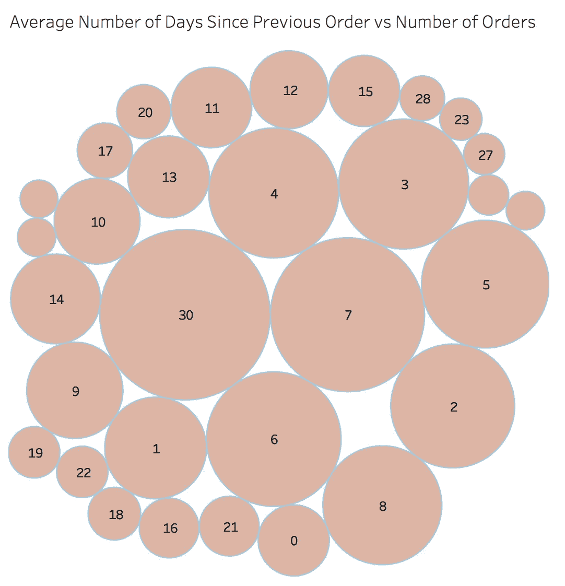
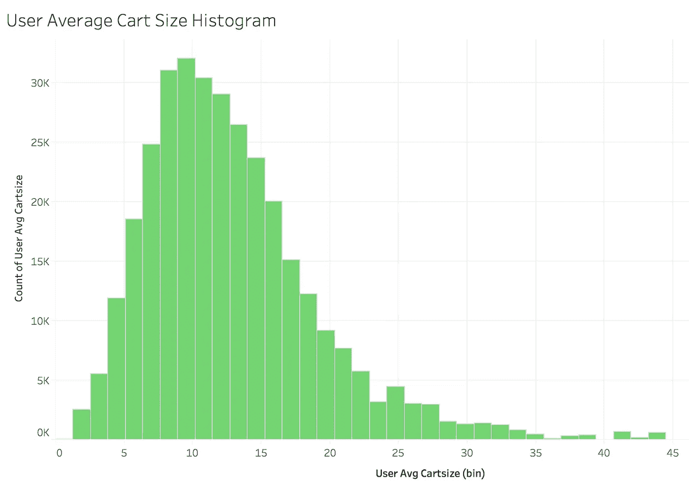
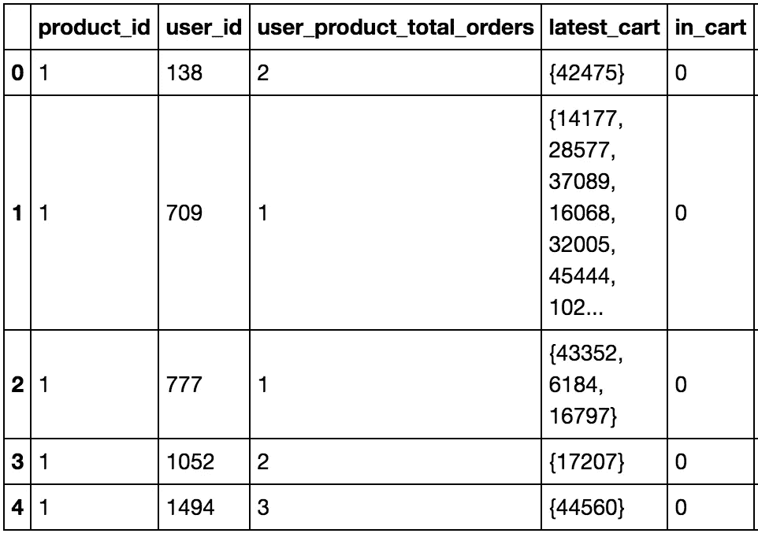
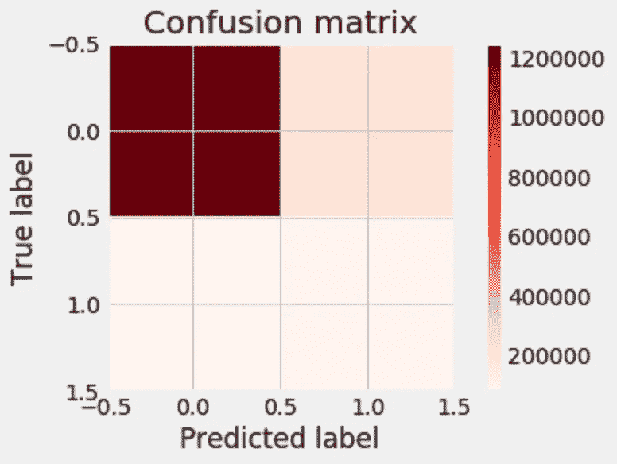

# 客户的下一个购物车里有什么？

> 原文：<https://towardsdatascience.com/whats-in-your-customer-s-next-shopping-cart-73d64287ec53?source=collection_archive---------4----------------------->

[Instacart 市场篮子分析](https://www.kaggle.com/c/instacart-market-basket-analysis)ka ggle 上的竞争是机器学习如何应用于商业问题的一个很好的例子，也是功能工程的一个有用的练习。基本上，问题归结为预测用户会再次购买哪些产品，第一次尝试，或者在会话期间添加到他们的购物车中。背后的动机很简单:作为一家杂货配送公司，你会希望优化你的供应链，尽量减少浪费，并避免延期交货。机器学习部分是我将在这篇博客中讨论的内容。

如果您查看了本文开头的链接，您会知道有相当多的人尝试过这个问题，并且用不同的方法提交了几十次他们的模型。虽然摆弄随机森林和增强树可能很有趣，但对于这个项目，我们将坚持使用传统的逻辑回归，并研究通过特征工程和基本模型调整可以提高多少。

# 这一切都始于数据

通常，接近任何机器学习模型的第一步都是查看数据。在这里，我在 Tableau 中绘制了几个基本的可视化图形，仅仅从这些图形中，我们就可以了解用户的行为模式。

例如，这个图显示了一个月内有多少相对大小的商品被重新订购。我们已经可以看到，大多数人会在一周内重新订购产品，或者再也不会订购(30 代表自上次订购以来的 30 天或更长时间)。



在这里，我们可以看到客户的平均订单规模是 10 件商品。



虽然这种探索性的数据分析本身提供了有用的见解，但这个项目的目标是进行机器学习，并将这些见解转化为预测建模。

# 和机器学习

在这一点上，我与卡格尔有些分歧。为了训练一个逻辑回归模型，我将构建一个新的特性来表示给定用户的最后一个购物车:

```
train_carts = (order_products_train_df.groupby('user_id',as_index=**False**)
                                      .agg({'product_id':(**lambda** x: set(x))})
                                      .rename(columns={'product_id':'latest_cart'}))df_X = df_X.merge(train_carts, on='user_id')
df_X['in_cart'] = (df_X.apply(**lambda** row: row['product_id'] **in** row['latest_cart'], axis=1).astype(int))
```

这个新特性是查看用户和产品 id 并重新创建他们以前的购物车的结果。因此，我们以他们的最新订单结束，用一组产品 id 表示。在这里，我们可以创建一个列，指示某个商品以前是否被订购过，并根据包含以前购物车中的产品 id 的列填充值。显示时，新的特征空间将如下所示:



因为 id 为 1 的产品之前没有被订购，所以它在 *in_cart* 列中的值是 0。因此，该 *in_cart* 列将成为分类的目标。如果用户更有可能重新订购某个商品，我们将得到预测值 1，否则为 0。

在这个特征空间上运行基线逻辑回归产生了非常差的结果，所以这是我们可以求助于特征工程魔法的地方。我在我的特征工程中采用了迭代的方法，并测试了每一组新的特征(用户特征、产品特征和用户-产品特征)在每一步是如何影响我的模型的。

具体来说，在处理平均值时，我检查了天数和小时数的原始平均值相对于其四舍五入值的表现。这里的理由是，考虑自上次购买以来的 12.33 天是没有意义的，因为数据集本身只提供整数值，离散变量的小数值不是很有见地。令我惊讶的是，未舍入的原始平均值总体表现更好，从长远来看，给了我的模型更多的信号。

我设计的大多数功能都围绕着订单频率和一些平均指标，来比较整个客户群的一般订购趋势和特定的客户行为。我还将部门名称转换成分类变量，因为我希望它们可以为我的模型提供额外的信号(它们没有)。

我在开始时没有提到的一件事是，我的预测类相当不平衡。设计的 *in_cart* 功能显示，商品大约十分之一会被重新排序。为了补偿这种等级不平衡，我使用了 sklearn 默认的重量平衡:

```
lr_balanced = LogisticRegression(class_weight='balanced', C=1000000)
```

然而，我更进了一步，测试了自定义权重，以便进一步微调。事实证明，手动平衡模式整体表现更好。

# 结论

最后，这个简单的逻辑回归和新设计的特性以及手工的类平衡产生了非常好的结果。在 F1 = 0.381 的情况下，我并不落后于 Kaggle 的领导者，他们在 F1 = 0.41 附近徘徊，有许多提交物和更花哨的模型。



如果我们看看混淆矩阵，我们可以更好地分析我的 F1 分数到底代表了什么。在精度为 0.3 的情况下，我的模型可以正确预测所有重新排序项目的 30%，0.52 的召回率决定了我的模型可以预测多少真阳性和假阳性。至少，顾客可以确信他们不需要延期交货。

这种次优结果可以用类别不平衡来解释——当项目没有被重新排序时，我的模型预测得更好——或者这可能不是一个适合机器学习的问题。

除了这些有点抽象的分数，我们可以看看模型的系数。您可以在我的代码中找到所有的系数值，但是为了突出最重要的发现，我要说的是，客户订单频率是迄今为止客户再次订购某个产品可能性的最大预测因素。用户和产品总订单也起作用:一般来说，用户订购产品越频繁、越多，这些产品再次被订购的机会就越高。

然而，添加到购物车中的商品的计数顺序在商品被重新订购的几率中起着负面作用，这非常有意义:我们在开始时看到，用户的平均购物车大小约为 10 件商品。如果一个商品一直被放在购物车的第 15 位，那么它很可能不会出现在普通的购物车中。

# 结束了

今天到此为止。你可以在这里找到我非常有趣的演讲。所有的代码都可以在这个存储库中访问。

我还使用了 AWS EC2 (Amazon Web Services，Elastic Cloud 2)进行建模，我强烈推荐 [Chris Albon 的指南](https://chrisalbon.com/software_engineering/cloud_computing/run_project_jupyter_on_amazon_ec2/)来设置虚拟机和 Jupyter 笔记本以在其上运行。