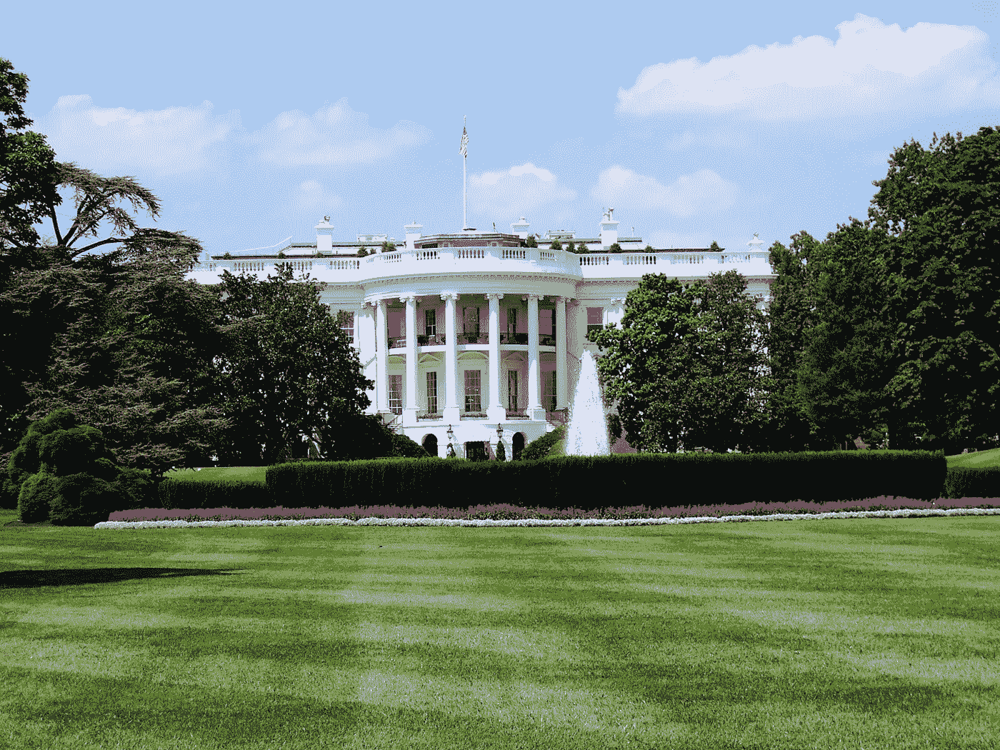
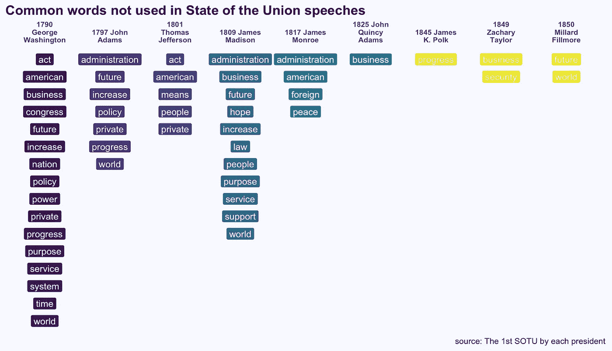
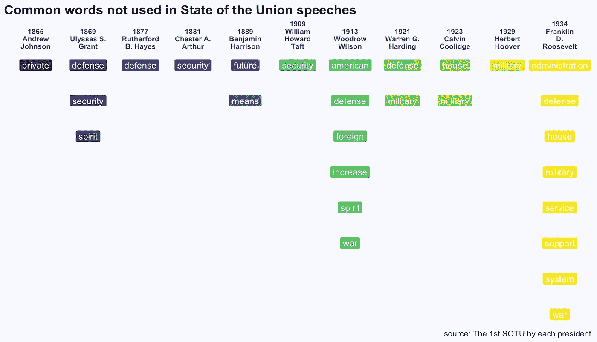
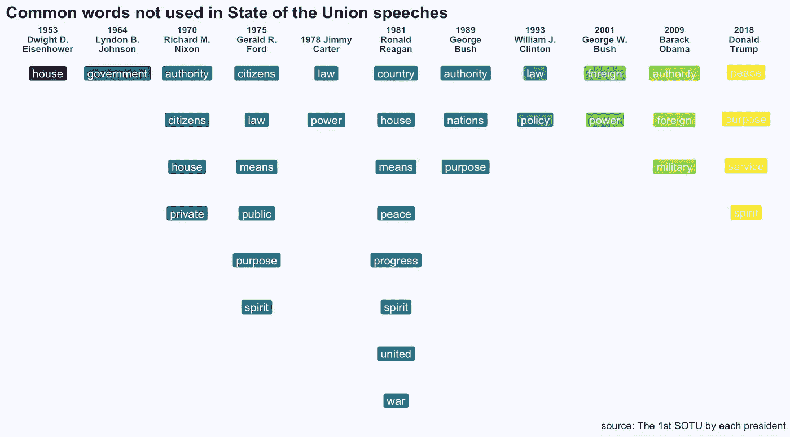

# 国情咨文演讲中的潜台词

> 原文：<https://towardsdatascience.com/whats-not-said-in-the-state-of-the-union-7ff5f95d8bef?source=collection_archive---------12----------------------->

今天我看了一下几乎每一次国情咨文演讲中使用的词汇，看看谁在他们任期的第一次演讲中没有提到这些词汇。

像*希望、团结、支持、和平、人民、权力、权威、外交、安全、未来*这样的词几乎每个人都在用，还有*国家*、*国会*、*国家*、*政府*这样的词。然而，有些人选择不使用这些词。

1–15th SOTU

我们可以看到乔治·华盛顿的用词与众不同，这在他发表第一个演讲时是有意义的。此后，有趣的是看到一些总统不谈论权威或安全。

16th-30th SOTU

31st onwards

这是我关于数据科学和视觉故事的[# 100 日项目](https://medium.com/@yanhann10)的第 76 天。数据来源是 [SOTU 资料包](https://www.rdocumentation.org/packages/sotu/versions/1.0.2/topics/sotu-package)，其中主要包括国情咨文演讲，在极少数情况下，如 1993 年*，2001 年*和 2009 年这些演讲不是正式的国情咨文，而是对国会联席会议的演讲。

作为一个对政治或历史不太感兴趣的人，我只是好奇数据能揭示多少东西，也想探索可视化文本的不同方法，这可能与可视化数字非常不同。代码在我的 [github](https://github.com/yanhann10/opendata_viz) 上。感谢阅读。如果喜欢，请分享。欢迎新主题的建议和反馈。