# 正规化有什么好大惊小怪的？

> 原文：<https://towardsdatascience.com/whats-the-fuss-about-regularization-24a4a1eadb1?source=collection_archive---------17----------------------->

作为机器学习的新手，当他们的训练错误开始减少时，大多数人都会感到兴奋。他们进一步努力，开始进一步减少，他们的兴奋没有止境。他们向乌龟大师展示了他们的结果，乌龟大师平静地说，这不是一个好模型，你需要调整模型，并检查验证集的性能。如果你想了解什么是“正规化”以及它如何有所帮助，那么请继续阅读。

让我先打个比方，机器学习模型就像父母一样，他们对自己的孩子有一种亲和力，他们与孩子相处的时间越多，这种亲和力就越强，孩子就成了他们的世界。ML 模型也是如此，一旦你开始用数据训练它们，它们就开始对训练数据产生兴趣。你越是调整你的模型，它们就越符合训练数据，从而减少误差。然而，我们需要记住的是，训练数据只是总体的样本，因此它代表总体的一些趋势，而不是所有趋势。如果我们将模型与样本数据紧密拟合，那么就不能保证与测试数据拟合得那么好。这意味着测试数据中的趋势不会精确地复制训练数据，但是会是训练数据的概括。因此，我们的模型也需要很好地概括，任何完全适合训练数据的模型都不会很好地概括。这就是正则化有所帮助的地方，它就像一个明智的大师，帮助降低我们的模型与训练数据的亲和力，并帮助它进行归纳。

唷！很多理论让我们用一个例子来理解它。只是提醒一下，你会在文章前面遇到很多术语，但是不要担心，我会试着解释这些术语。

一个简单的例子是，考虑一个样本训练数据，其中 Y 与 x 呈现多项式关系。

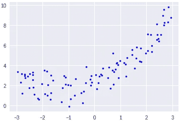

Training Data

你拟合一个简单的线性回归模型，它看起来像这样，带有一些训练误差。

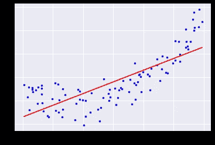

Fig 1-Linear Regression Fit

您对此不太满意，并希望进一步减少训练误差，因此您将二次多项式项添加到线性回归(X 平方)中，结果如下所示。

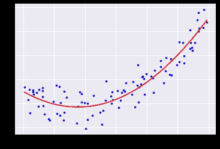

Fig 2-Second degree polynomial fit

现在，看到训练误差已经减少，你忘乎所以，你用 50 次多项式拟合模型，它看起来像这样。

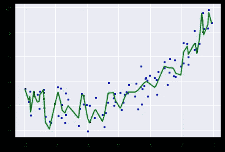

Fig 3–50 Degree polynomial fit

看看这个模型有多完美，它现在开始紧密地拟合每个点。这就是事情开始变得模糊的地方，这个模型仅仅对于训练数据来说是一个优秀的模型。然而，对于测试数据或该训练样本之外的任何数据来说，这都是废话。在机器学习的说法中，这被称为“高方差”模型。高方差意味着模型是过度拟合的，而过度拟合的模型对于预测来说是不好的。而图 1 中的模型被称为“高偏差”模型或欠拟合模型。我们需要一个平衡偏差和方差的模型。

在具有多个维度的真实世界中，在对模型进行参数调整之后，您真的不能一直查看图表。这就是你需要依靠正则化来减少方差的地方。但请记住，我们还需要衡量我们的模型在列车数据以外的数据上的表现，这是交叉验证有所帮助的地方。简而言之，从训练数据中保留模型在训练时看不到的一些数据，并根据这些数据(验证数据)评估模型性能。

那么正则化到底是如何降低模型的方差的呢？

为此，我们需要举一个最小二乘回归的例子。最小二乘回归成本函数为:

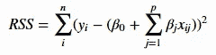

Fig -4 Cost function for Linear Regression

正则化的工作方式是在成本函数中增加惩罚

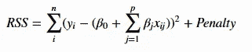

Fig -5 Regularized Cost function

记住这个惩罚是针对除了θ0(截距)之外的所有θ的。这如何有助于减少模型的过度拟合？我们来了解一下。

为了减少模型的方差，重要的是我们有一个简约的模型，这意味着我们有一个简单的模型，它可以很好地概括。为了有一个简洁的模型，我们需要减少模型中的特征或者减少除截距之外的特征的 thetas 的权重。对这两种方法有一点了解。

1.  **减少特征的数量(模型选择/子集选择)**

这是通过模型选择或子集选择技术实现的。这是一个统计过程，其中使用特征组合构建各种模型，并使用 AIC (Akaike 信息标准)、SBC( Shwarz 贝叶斯标准)或 Mallows (Cp)或任何其他标准选择最佳模型(具有特征子集)。然而，我们不打算在本文中讨论这一点。

**2。** **降低特征的权重(正则化/收缩法)**

在正则化中，我们保留所有特征，但是减少特征的θ或权重的大小。该技术减少并消除了不重要特征的 thetas(权重)。因此，我们得到了一个简约的模型。

有多种方法可以正则化一个模型。对于线性回归，您可能听说过以下内容:

*   山脊(减少特征的权重)

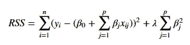

Fig 6.2 — Ridge Regression

*   套索(消除一些特征)

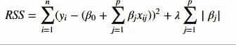

Fig 6.1 — Lasso Regression

*   ElasticNet(混合方法)

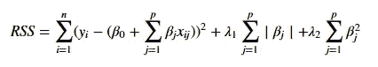

Fig 6.3 Elastic Net Regression

*其中:*

*λ=正则化的惩罚参数*

## 山脉

在脊正则化的情况下，罚值被称为 *l2 范数。*那么为什么岭回归会减少过拟合呢？随着λ的增加，岭的灵活性开始降低，当*λ= 0*时，岭回归与 OLS 相同。然而，特征权重可以非常接近于零，但是在脊的情况下很难得到零权重。

## 套索

在套索的情况下，惩罚被称为 *l1 范数*。山脊和套索的区别在于，在套索的情况下，随着 lambda 的增加，灵活性开始迅速降低，很快一些特征被关闭，这意味着一些特征的特征权重降低到零。因此，套索在减少特征和具有更简洁的模型方面非常有用。

让我们用一个例子来理解这一点。我正在使用一个名为 Credit 的数据集，它可以从著名的 ISLR 图书网站上获得。

问题是使用一组特征来预测“平衡”

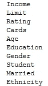

这个问题不是很大，但它将帮助我们了解山脊和套索在同一组要素上的表现。

为简单起见，我们只取四个特征收入、评级、限制和学生。如果λ从 0.001 到 1000，我们将取 50 个值，然后检查收入、评级、限制和学生的权重。这将有助于深入了解山脊和套索的行为。

在使用四个特征和 50 个不同的λ值运行脊之后，这里是这四个特征的系数如何变化。

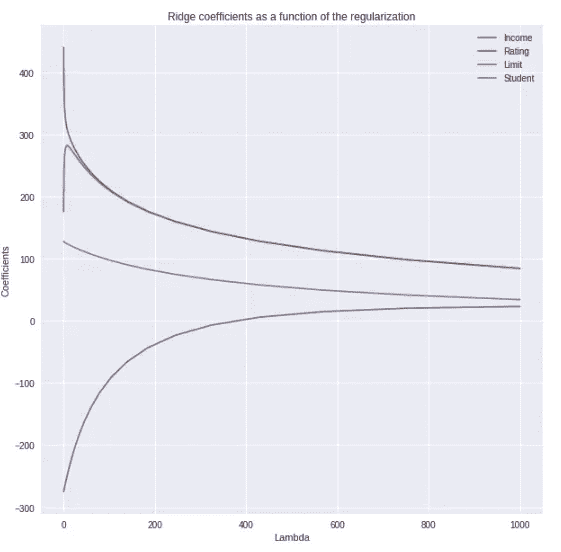

Fig 7 — Ridge coefficients as a function of regularization

请注意，当λ为零时，所有四个特征的权重都很高，并且对应于 OLS。随着λ开始增加，权重值开始下降。对于λ= 1000，收入和学生的权重接近于零但不等于零，其他两个特征的权重也显著降低。

对这些的解释超出了本文的范围。这篇文章只是想给出一个正规化的概述，但是我会在下一篇文章中用一个具体的例子来解释套索和山脊。观察正则化如何工作以及它如何影响模型将是非常有趣的。

当我们对套索重复同样的过程时，我们看到的是:

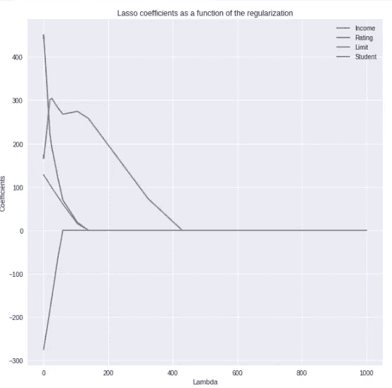

Fig 8- Lasso Coefficients as function of regularization

你能看出区别吗？对于大约 150 的λ，三个特征的权重下降到零。因此对于一个小的正则化套索完全消除了特征。因此，Lasso 在特征选择中是有用的，其中它通过将不必要的特征的权重减少到零来消除不必要的特征，并且实现更简约的模型。

现在让我们来看看 RSS(MSE)如何随着训练数据的这两个正则化而变化。

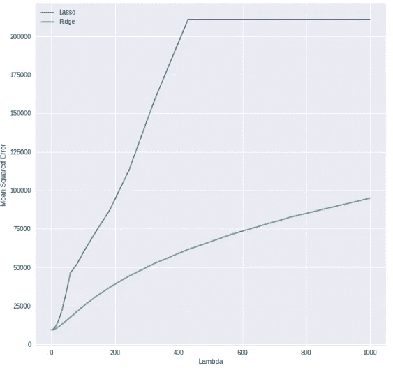

Fig 9- MSE(train) for Lasso & Ridge as function of regularization

看看 Lasso 的给定 lambdas 在训练数据上的 MSE 是如何高于 Ridge 的。这是因为套索比山脊更能规范模型。

值得一提的是，在三重交叉验证的情况下，MSE 是如何随交叉验证数据而变化的。

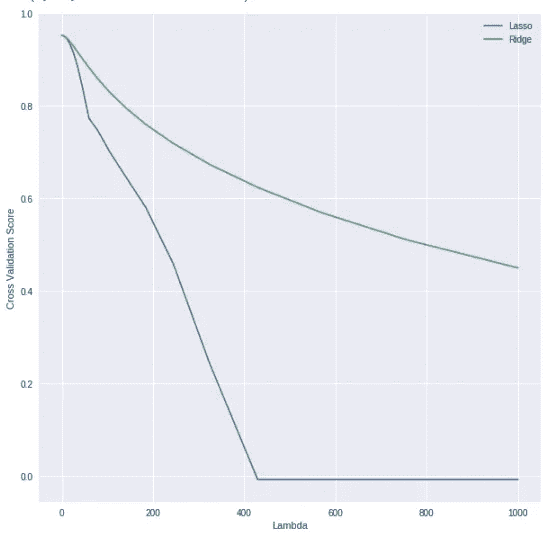

Fig 10- Cross Validation score for Lasso & Ridge as function of regularization

看看 Lasso 的交叉验证分数如何比 Ridge 下降得更快，表明 Lasso 更适合验证数据。

最后，我们需要记住正则化的一个重要方面，即数据必须标准化。

与 ridge 类似，lasso 也将系数估计缩小到零，但是在 lasso 的情况下，当 lambda 较大时，l1 罚分具有将一些系数强制为零的效果。因此，套索导致可变选择，套索模型有时也被称为稀疏模型。然而，当响应是所有预测值的函数时，岭是有效的，因为它不消除特征。

正则化不仅用于回归，还用于决策树，在决策树中称为修剪，在神经网络中称为丢弃。但是关于这些的讨论超出了本文的范围。

我希望上面的文章能帮助你理解正规化。

如果你想看一个正在运行的例子，请在 google colab 上查看[这里](https://colab.research.google.com/drive/1GxU2XyQtKxbklQrZVhS1M_M1eoKgHK5H)

 [## 谷歌联合实验室

### 编辑描述

colab.research.google.com](https://colab.research.google.com/drive/1GxU2XyQtKxbklQrZVhS1M_M1eoKgHK5H) 

github 代码可以从[这里](https://gist.github.com/sagarmainkar/1159c818c5555fae189882118245d44e.js)拉出来