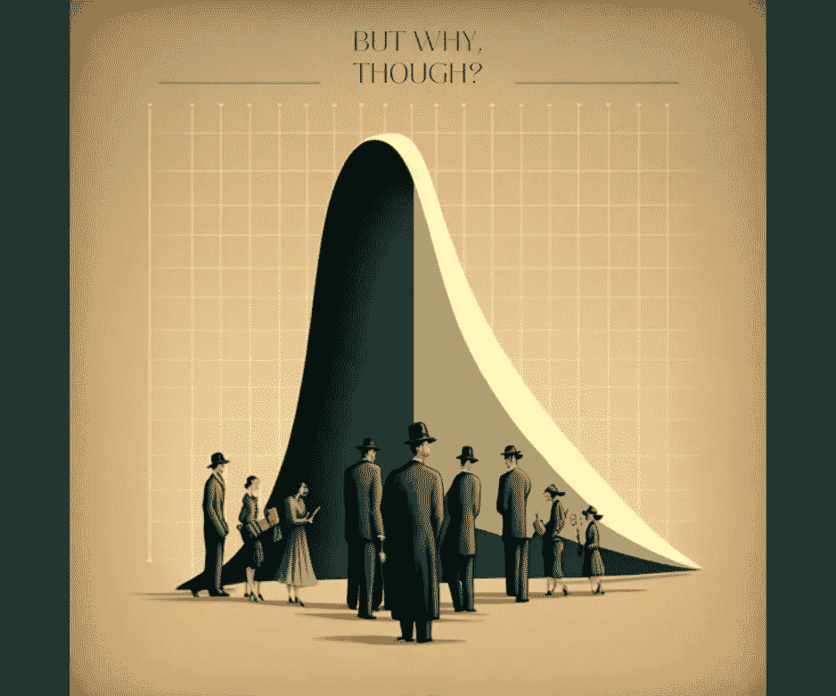
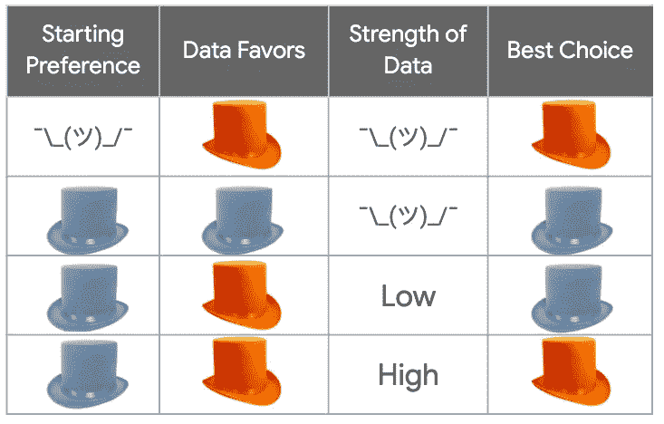

# 不要把你的时间浪费在统计上

> 原文：<https://towardsdatascience.com/whats-the-point-of-statistics-8163635da56c?source=collection_archive---------4----------------------->

Here’s the audio version of the article, read for you by the author.

我最近发现，我的一个好朋友成功地获得了统计学博士学位，却从来没有问过自己这样一个问题:*统计学到底有什么意义？哦，天哪。如果你不知道它是为了什么，你也不知道它什么时候不适合你。原来教授们不会让这一点显而易见，所以让我看看我是否能帮上忙。*

Image by the author.

[***统计学*** 是在不确定的情况下改变自己想法的科学](http://bit.ly/quaesita_statistics)。你的想法是什么？一个 [***默认动作***](http://bit.ly/quaesita_damnedlies) 或者一个 ***先验信念*** 。但是如果你的想法没有定下来，你该怎么办呢？如果你没有任何意见呢？

按照你的估计去做就行了(这只是“根据你所知的最佳猜测”的一种花哨说法)。你如何得到一个？只要看看数据，报告有什么。这被称为[分析](http://bit.ly/quaesita_datasci)(又名数据挖掘)，如果你曾经使用过电子表格，你已经做过了。好消息是，你的直觉实际上很擅长给你正确的估计。不需要复杂的数学。

“但也可能是错的！”当然它可能是错的，这就是不确定的含义。世界上没有数学魔法能把不确定性变成确定性。你的最佳猜测可能是错误的，但这是你的最佳猜测，这使得任何其他猜测都是更糟糕的猜测，甚至更有可能是错误的。

所以跟着你的直觉走，不管你有多少数据！

“等等，但是我需要知道我是否有足够的数据！”Mmmm？什么够了？

暂停一会儿，想象你正在蓝色和橙色的帽子之间选择。如果你真的对它们漠不关心，并且数据堆积起来偏向橙色，那么你最终选择蓝色就是疯了。即使你总共只有 3 个数据点。哪怕只有 0.0000000000001%赞成橘子。你因为什么疯狂而变得忧郁？！用橙色，不需要数学。

If you’re indifferent between these hats to begin with and you get more votes for orange than blue, there’s no math in the world that should tell you to pick blue. Math isn’t magic and it doesn’t violate common sense. Image by the author.

最终选择蓝色的唯一合理的方法是，如果你一开始就偏爱蓝色的帽子。那么你是在问支持橙色的证据是否足够有力。换句话说，是否有足够的数据来改变你的想法。好吧，那你怎么知道？欢迎来到[统计](http://bit.ly/quaesita_statistics)。

In the top half of the table, the evidence doesn’t contradict your starting preference, there’s no need for statistical calculations. You can make your decision immediately. If your evidence is out of line with your preference, you can use statistical calculations to find out whether the evidence should make you want to change your mind.

> 统计学是改变你想法的科学。

因此，如果你在处理不确定性(例如，“这个机器学习系统能处理明天的数据吗？”)而且这些选项的重要性也不尽相同(例如，“除非它有效，否则我们可能不应该启动它。”)那么你来对地方了:统计学就是给你准备的。[在这里放大浏览它的主要思想](http://bit.ly/quaesita_statistics)。其他人，在你最终小心翼翼地、无用地计算一堆数字之前，赶快逃离吧。[分析](http://bit.ly/quaesita_hero)对你来说是更好的选择。

# 感谢阅读！YouTube 课程怎么样？

如果你在这里玩得开心，并且渴望了解更多，请前往我的[统计思维播放列表](http://bit.ly/statthinking):

如果你正在寻找一门为初学者和专家设计的有趣的应用人工智能课程，这里有一个我为你制作的娱乐课程:

Enjoy the entire course playlist here: [bit.ly/machinefriend](http://bit.ly/machinefriend)

# 喜欢作者？与凯西·科兹尔科夫联系

让我们做朋友吧！你可以在 [Twitter](https://twitter.com/quaesita) 、 [YouTube](https://www.youtube.com/channel/UCbOX--VOebPe-MMRkatFRxw) 、 [Substack](http://decision.substack.com) 和 [LinkedIn](https://www.linkedin.com/in/kozyrkov/) 上找到我。有兴趣让我在你的活动上发言吗？使用[表格](http://bit.ly/makecassietalk)取得联系。