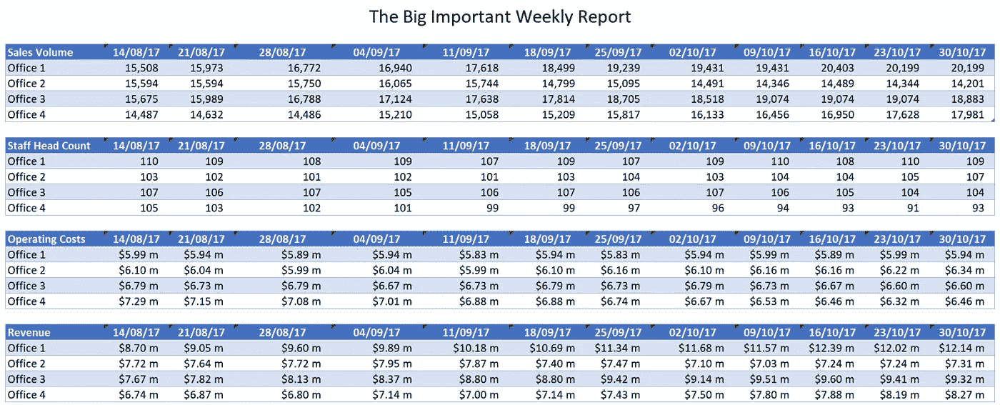
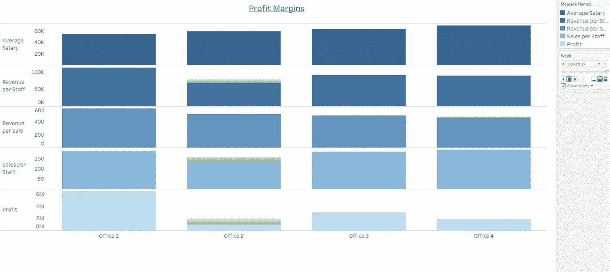
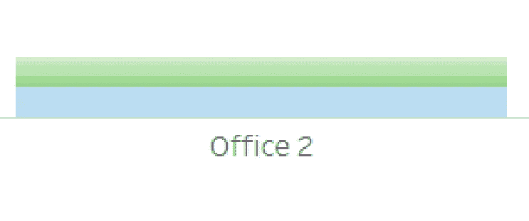

# 有什么意义？视觉数据报告

> 原文：<https://towardsdatascience.com/whats-the-point-visual-data-reporting-e05c0f4f4479?source=collection_archive---------3----------------------->

你们中的许多人可能都经历过和我一样的情况，当你收到一份报告时会想“我在看什么？”“这有什么意义？”。包里都是桌子，真是只见树木不见森林！作为数据专家，您如何向您的业务合作伙伴展示您对他们的业务有清晰而全面的了解，而不会让他们沉浸在数据中？

传达信息和讲述“数据故事”是任何数据专家都不应忽视的技能。通常在商业中，你认为的能力和你的实际能力一样重要。如果你想推进你的职业生涯，向非技术观众展示你的技能是至关重要的。提供清晰易懂的报告也意味着您的建议更有可能被考虑！如果你担任建议/商业智能的角色，你需要迅速展示“燃烧的平台”或需要改变的原因，否则利益相关者不太可能采取任何行动。这就是你如何让自己变得有价值，并最终成为你的商业伙伴不可或缺的一部分。

为了突出这个问题，我准备了一个小型数据集，其中包括一个虚构企业的销售和收入业绩。包括四个不同办事处 12 周的销售量、人数、运营成本和收入。假设该企业有四个办公室执行相同的任务并独立运营。运营成本纯粹是员工工资。该报告的目的是让每个办公室的领导与公司的负责人一起评估和比较他们的绩效。

Example of a typical data report for a business stakeholder.

如您所见，样本数据集是分布在任何大型组织中的许多报告的典型。它包含企业要求的信息，并且不包含任何数据错误。那么，除了在数学上站得住脚之外，这是一份好报告吗？我希望这个行业的高层领导能做些什么？数字看起来都没问题？

尽管这份报告没有什么“错误”,但仍有许多改进的机会。众所周知，高层领导缺乏时间，关注大局。出于这些原因，我们希望快速清晰地向他们展示要点，尽可能不分散他们的注意力。

从管理角度来看，一些挑战是“收入”等数据点。这个指标(在示例中)由销售数量和每次销售的收入金额组成。由于它实际上是两个较小指标的总和，采取行动提高收入是一个挑战？我应该专注于增加销售额还是增加利润？同样，如前所述，运营成本纯粹由员工工资构成。我是应该专注于减少员工数量，还是应该减少他们的薪酬？我们确实在报告中统计了人数，但是经理需要自己计算平均工资来回答这个不是最佳结果的问题。

如何呈现这份报告？

Visual alternative to the original report.

原始报告可以可视化地呈现，上面的例子是使用 Tableau 准备的，Tableau 是一个非常有效的工具，只需要有限的培训就可以开始。LinkedIn learning 有一些免费课程[在这里](https://www.linkedin.com/learning/topics/tableau)然而网上有很多很多免费和负担得起的课程。

该图显示了原始数据中最后一周的结果，但是显示 12 周的合计可以以相同的格式呈现。或者，如果企业更关注一段时间内的变化而不是某个时间点的绩效，我们可以使用折线图来显示一段时间内的结果。蓝色区域代表当前信息，绿色区域突出显示上周的结果。绿色阴影越暗，表示该区域越新。这只是一个例子，说明如何将最近的业绩纳入一个单一的视觉效果，但对于“办公室 2”，我们可以看到利润在最近几周一再下降。

高层领导可能会把利润作为他们的总体目标。他们可能会有一些额外的质量和客户满意度指标，但是让我们考虑这些超出了我们的项目范围。数据已经过重新计算，以显示“平均工资”、“员工人均收入”、“销售收入”、“员工人均销售额”等指标，最后是“利润”。提供了这些指标的顺序，因此利润排在最后，因为上述指标将合计影响总利润。每个办公室都有自己的专栏，我们可以快速有效地比较每个网站的表现。

那么，我们能从这份新报告中学到什么呢？最初的表格没有引起我的任何警觉，但是，新的报告强调了:

*   四个工厂之间平均工资的显著差异
*   员工人均收入和销售收入数字不一致
*   办公室 1 的利润明显高于所有其他办公室。

有许多方法来显示这些信息，每种方法都有优点和缺点。在准备视频时，我考虑了以下几点:

**清除:**排除不必要的数据点、网格线、轴值等。

配色方案:所有的列都是不同的蓝色阴影，这使它们保持连接(一个公司)，但允许读者区分行。颜色也更柔和(更灰)，因此不那么强烈，更容易长时间聚焦。

**利润最后:**由于上述指标都对利润有所贡献，因此在底部显示为“汇总”指标。

正如我所提到的，有许多方式来展示这份报告，这份报告中有我喜欢和不喜欢的方面，但一份报告很少是完全完美的。试着找到最适合你报告目的的折中方案，但是我希望这篇短文能激发你对这个话题的思考！

感谢阅读，如果你喜欢这篇文章，请记得“鼓掌”并关注我未来的文章！

我以前的博客也可以在[这里](/machine-learning-what-it-is-and-why-it-should-interest-you-97fcf3f68d04)找到。