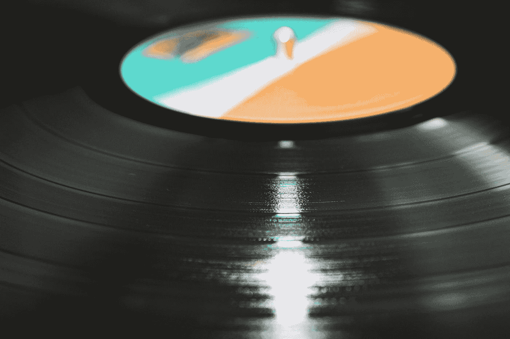
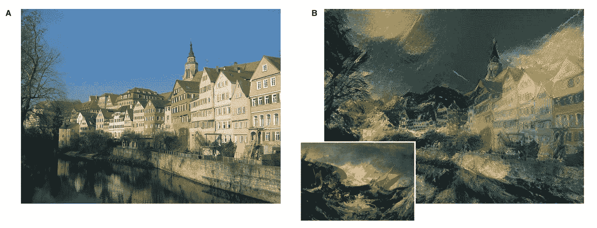
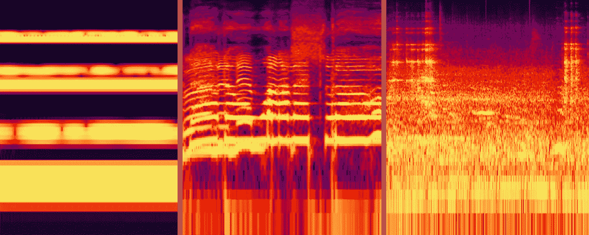
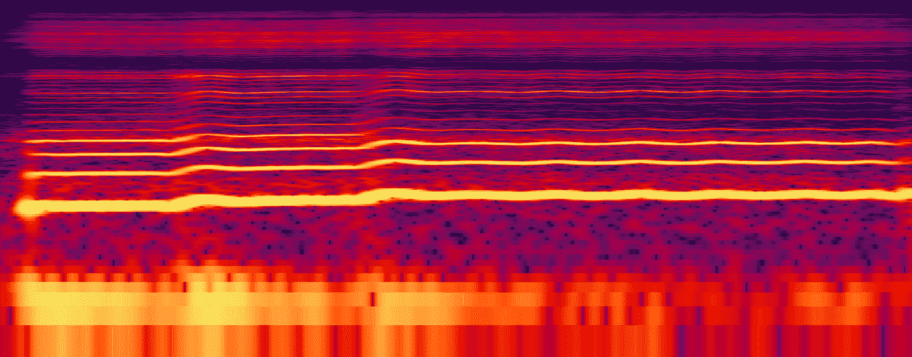
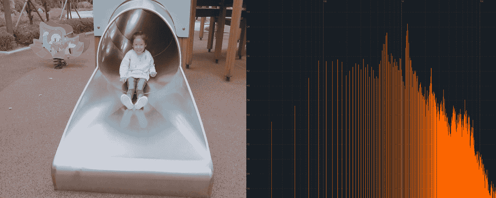

# CNN 和 spectrograms 做音频处理有什么问题？

> 原文：<https://towardsdatascience.com/whats-wrong-with-spectrograms-and-cnns-for-audio-processing-311377d7ccd?source=collection_archive---------3----------------------->

(Photo credit: [Jack Hamilton](https://unsplash.com/@jacc?utm_source=medium&utm_medium=referral))

近年来，用神经网络生成和处理图像已经取得了很大的成果。这可以部分归功于深度 CNN 捕捉和转换图像中高级信息的巨大性能。一个显著的例子是 L. Gatys 等人提出的使用 CNN 的图像风格转移过程。艾尔。它可以以不同的风格呈现图像的语义内容[1]。

Y. Li 等人很好地解释了神经风格转移的过程。al: *“这种方法使用 CNN 不同层的神经激活的 Gram 矩阵来表示图像的艺术风格。然后，它使用迭代优化方法，通过将神经激活与内容图像匹配以及将 Gram 矩阵与风格图像匹配，从白噪声中生成新图像。*

更简单地说，这些结果可以被认为是通过根据来自源内容和不同抽象级别的样式图像的特征组合来生成图像而实现的。例如，这可以是保持内容图像的高级结构和轮廓，同时结合样式图像的颜色和低级纹理特征。

*An example of the transfer of style features (“B”) onto a content image (“A”) by L. Gatys et. al.*

风格转换在视觉处理领域的表现已经相当令人印象深刻，并且如果能够实现类似的结果，它有助于乐观地看待“更智能”的音频处理算法。因为频谱图是音频频谱随时间的二维表示，所以已经尝试用 CNN 来分析和处理它们。已经表明，可以将光谱图作为图像进行处理，并使用 CNN 进行神经类型转移[3]，但是，到目前为止，结果并不像视觉图像那样令人信服[4]。

为了克服这一挑战，并在神经音频处理中产生更好的结果，我们可能需要考虑为什么 CNN 的风格转换在频谱图上表现不佳。**本质上，这些技术应用机器视觉来做机器听觉。**我认为这提出了一个基本问题，可能会阻碍人工智能辅助技术在音频处理方面的进步。虽然这个问题无疑可以从许多角度来探讨，但探索图像和光谱图之间的差异，以及由此产生的视觉和听觉之间的一些差异，可能是值得的。

# 声音是“透明的”

在视觉图像和光谱图之间的比较中提出的一个挑战是，视觉对象和声音事件不会以相同的方式累积。用一个视觉类比，可以说声音总是“透明的”[4]，而大多数视觉对象是不透明的。

当在图像中遇到某种颜色的像素时，通常可以认为它属于单个对象。离散的声音事件不会在声谱图上分成不同的层次:相反，它们会叠加在一起成为一个独特的整体。这意味着声谱图中的特定观察频率不能被假定为属于单个声音，因为该频率的幅度可能是由任何数量的累积声音产生的，甚至是由声波之间的复杂相互作用(如相位抵消)产生的。这使得很难在声谱图表示中分离同时发生的声音。

*Three examples of difficult scenarios of spectrogram analysis. (Left): Two similar tones cause uneven phase cancellations across frequencies. (Middle): Two simultaneous voices with similar pitch are difficult to tell apart. (Right): Noisy and complex auditory scenes make it particularly difficult to distinguish sound events.*

# 光谱图的轴不具有相同的意义

用于图像的 CNN 使用二维过滤器，其在 x 和 y 维度上共享权重[4]。如前所述，这建立在这样的假设上，即无论图像的位置如何，其特征都具有相同的含义。要做到这一点，您还应该假设数据的 x 轴和 y 轴对内容的含义具有相同的含义。例如，无论在图像中是水平移动还是垂直移动，人脸仍然是人脸。

在频谱图中，两个维度代表了根本不同的单位，一个是频率强度，另一个是时间。水平移动声音事件会在时间上偏移其位置，并且可以认为声音事件无论何时发生都意味着相同的事情。然而，垂直移动声音可能会影响它的意思:例如，向上移动男性声音的频率可能会将它的意思从男人变成孩子或妖精。对声音事件进行频移也可以改变其空间范围[4]。因此，2D CNN 提供的空间不变性可能不适用于这种形式的数据。

# 声音的频谱特性是非局部的

在图像中，相似的相邻像素通常可以被认为属于同一个视觉对象，但是在声音中，频率通常在声谱图上是非局部分布的[4]。周期性声音通常由基频和多个谐波组成，这些谐波由声源决定的关系分隔开。正是这些谐波的混合决定了声音的音色。

在女性声音的例子中，某一时刻的基频可能是 200 赫兹，而第一谐波是 400 赫兹，接下来是 600 赫兹等等。**这些频率不是局部分组的，而是根据一个共同的关系一起移动。**这使得使用 2D 卷积在光谱图中寻找局部特征的任务变得更加复杂，因为即使它们按照相同的因子移动，它们也经常不均匀地间隔开。

*An illustration of the non-local distribution of frequencies in a female voice*

# 声音本质上是连续的

在评估视觉环境时，我们可以多次“扫描”我们的周围环境，以定位场景中的每个视觉对象。由于大多数物体都是不动的，光线会以一种可预测的方式从它们身上反射，人们可以在脑海中绘制出它们在物理场景中的位置。从感知的角度来看，视觉对象被假定继续存在于它们被观察的位置，即使你看向别处。

对于声音来说，情况并非如此。声音采用压力波的物理形式，从听者的角度来看，这种波只在某一时刻以其当前状态存在。一旦这个时刻过去了，波也就过去了，远离了观察者。这就是为什么称这些现象为声音*事件*而不是*物体*是有意义的。从物理的角度来看，这意味着听众一次只能感受到一瞬间的声音。当图像被认为包含大量的静态并行信息时，声音则是高度串行的。

更恰当的比较是音频和视频之间的比较。这两种媒体都可以被概念化为描绘随时间的运动，其中跨时间的依赖性对于内容的经验意义是必不可少的。由于视频是由图像集合(*帧*)构成的，它包含了更多的并行信息。

说明这一点的一个方法是在两种媒体中“*”*冻结一段时间。查看视频的单个帧(通常描绘大约 1/25 秒的曝光时间),通常仍然可以收集关于视频的上下文、动作和场景的大量含义:可以识别单个对象，有时可以评估动作和移动。然而，当*“冻结”*单个音频瞬间(例如大约 1/25 秒的相应集合)与频谱分析一起使用时，评估几乎不可能是全面的。可以收集关于信号的整体色调平衡和特征的一些背景，但是不能达到与视频相同的程度。

例如，不可能在时间范围之外识别单独的声音事件，以查看根据相同的时间模式发生了哪些频谱发展。唯一可以确定的是在特定时刻听到的声音的音调平衡。对此的解释可以追溯到之前讨论的声波的物理形式:**声音不是作为可以平行观察的静态对象存在的，它们是作为气压序列到达的，并且关于这些压力的意义必须随着时间的推移而建立。**

~*1/25 second of video and audio respectively. (Left): A girl riding down a metal slide in a playground. (Right): A spectral representation of a traditional music performance from Senegal.*

这些原因表明，作为传达意义的媒介，音频基本上是连续的，并且比视频更依赖于时间，这也是为什么在没有时间意识的情况下，输入图像处理网络的声音的视觉声谱图表示可能无法最佳工作的另一个原因。

# 一个模拟人类体验的案例

人工智能技术的重大突破是通过模拟人类系统实现的。虽然人工神经网络是与实际人类神经元的功能方式仅松散耦合的数学模型，但它们在解决复杂和模糊的现实世界问题方面的应用已经非常深远。在这些神经网络中对大脑的架构深度进行建模，为学习更有意义的数据表示提供了广泛的可能性。在图像识别和处理中，来自 CNN 中视觉系统的复杂和更具空间不变性的细胞的灵感也对我们的技术状态产生了巨大的改进。

正如 J. B .艾伦在*中所言:“人类是如何处理和识别语音的？”*，只要人类的感知能力超过机器，我们就能通过理解人类系统的原理而获益[5]。**人类通常在感知任务方面非常熟练** **人类理解和人工智能现状之间的反差在机器听觉领域变得尤为明显**。考虑到在视觉处理中从人类系统中获得灵感的好处(以及视觉模型在声音中表现不佳的论点)，我建议我们从具有神经网络的机器听觉中获得类似的过程。

这是一个更大的机器听觉项目的一部分。如果您错过了其他文章，请点击下面的链接了解最新情况:

**背景**:[AI 在音频处理中的承诺](/the-promise-of-ai-in-audio-processing-a7e4996eb2ca)
**第一部分:** [仿人机器听觉带 AI (1/3)](/human-like-machine-hearing-with-ai-1-3-a5713af6e2f8)
**第二部分** : [仿人机器听觉带 AI (2/3)](/human-like-machine-hearing-with-ai-2-3-f9fab903b20a)
**第三部分** : [仿人机器听觉带 AI (3/3)](/human-like-machine-hearing-with-ai-3-3-fd6238426416)

# 参考资料:

[1] L. A. Gatys，A. S. Ecker，M. Bethge，“使用卷积神经网络的图像风格转移”，2016 年 IEEE 计算机视觉和模式识别会议(CVPR)，2016 年，第 2414–2423 页。

[2]李，王，刘，侯，“揭开神经类型迁移的神秘面纱”，2017 年 1 月.

[3] P .维尔马和 J. O .史密斯，“音频频谱图的神经风格转移”，2018 年 1 月。

[4] L .怀斯。2017.用卷积神经网络处理的音频频谱图表示。与 IJCNN 联合举办的首届深度学习与音乐国际研讨会论文集。美国安克雷奇。2017 年 5 月。1①。第 37-41 页。黄金分割指数:10.13140

[5] J. B. Allen，“人类如何处理和识别语音？，“IEEE Trans。语音音频过程。，第 2 卷，第 4 号，第 567-577 页，1994 年。