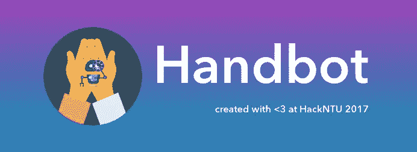
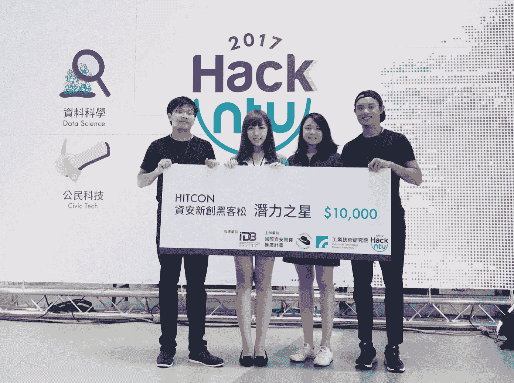
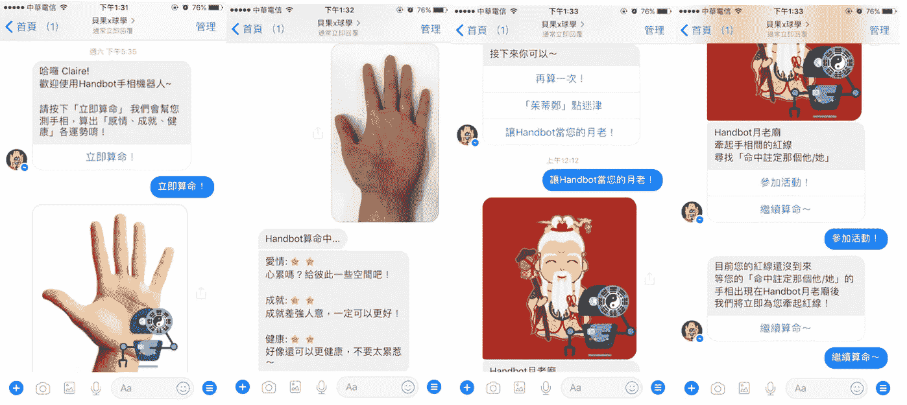
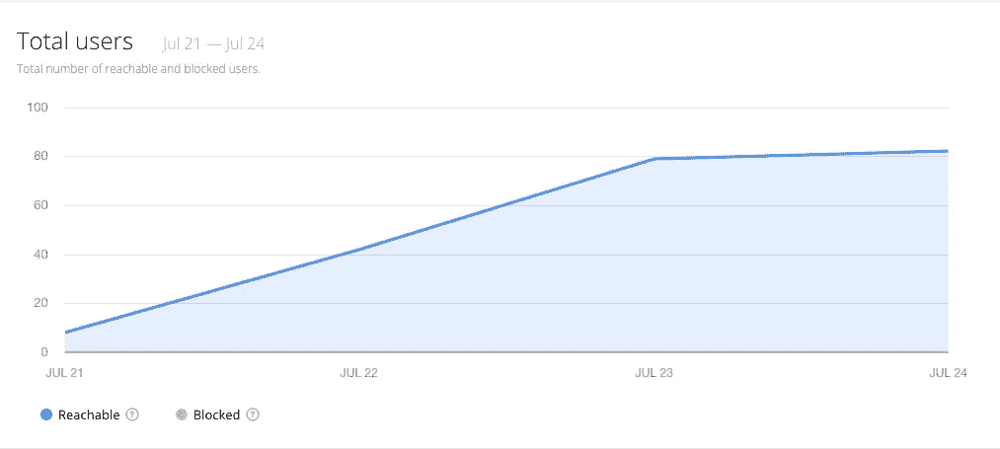
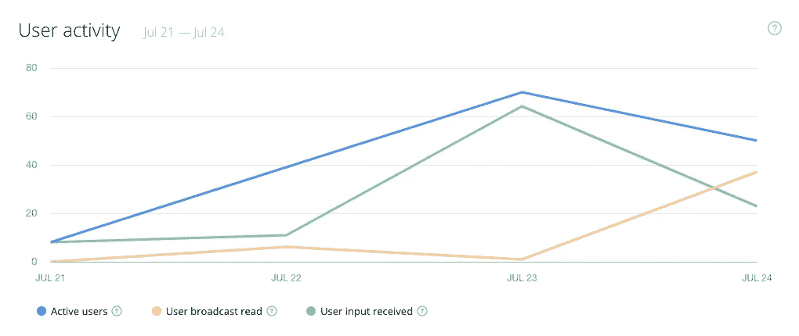
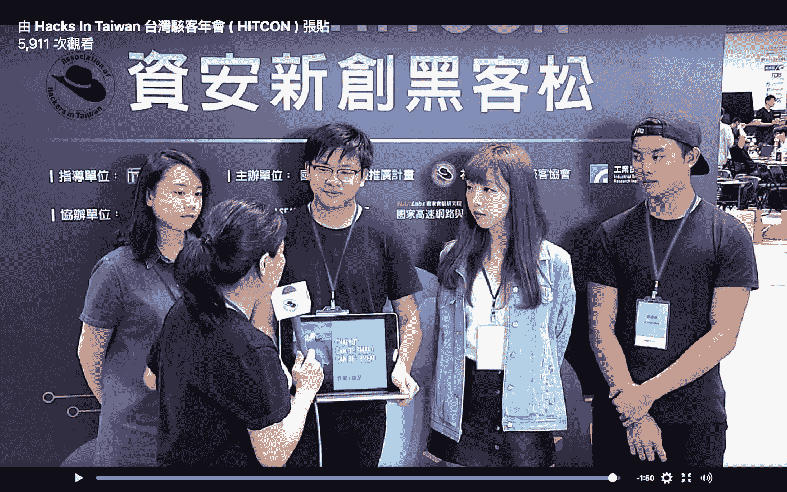

# 当人工智能遇到 3000 年前的中国手相术

> 原文：<https://towardsdatascience.com/when-ai-meets-3000-year-old-chinese-palmistry-a767b7f3defb?source=collection_archive---------8----------------------->

## [Handbot](https://www.facebook.com/handbot2017) —第一个使用深度学习(CNN)分析一个人的手掌来预测他/她的性格特征、健康、职业、关系等许多方面的看手相聊天机器人。

在一次 48 小时的黑客马拉松(HackNTU 2017 @ Taipei，Taiwan)中，我正在实习的初创公司的两位同事、我的一位大学朋友、我的哥哥和我合作开发了第一个手相聊天机器人，又名 [Handbot](https://www.facebook.com/handbot2017) 。我们渴望给有 3000 年历史的中国手相行业带来颠覆性的创新。

幸运的是，我们获得了 Hitcon 颁发的信息安全奖。

如果你是一名科学爱好者，并且难以相信算命，这里有一个更科学的解释，可能会改变你的想法

> 人类的手包含了丰富的信息，因为婴儿的手在怀孕早期就形成了，研究人员喜欢说它们相当于早期发育的“化石记录”，可以为未来的健康提供洞察力“看手相是真的？”，[大西洋。](https://www.theatlantic.com/magazine/archive/2015/07/palm-reading/395288/)

正如我们所知，很多人痴迷于算命，而看手相是每个人能够开始预测他们命运的最简单的方法之一。然而，许多人仍然有识别手掌线条的问题。于是，我们想出了这个点子:结合“**看手相**”、“**深度学习**”、“**聊天机器人”。**

alm 阅读:我们在黑客马拉松的前几个小时学习了基本的手相，包括关系、职业和健康的分析和预测。然后，我们给 2000 多张真实人类手掌的照片贴上标签，并分别给它们的关系、事业和健康打了 6000 多分。(你可以在这里找到我们的标签文件。)

D eep 学习:我们使用 Keras 中的 VGG-16(16 层网络)与 Tensorflow 后端作为我们的 CNN 模型。使用 GPU 加速，我们已经训练了 10 个 epoch，每个 epoch 1000 步。模型的均方误差为 1.3066。况且估值 MSE 是 1.1721。总的来说，这个结果足以预测一个新的手掌。(你可以在这里找到我们的代码。)

C hatbot 相对于 App 和 Web，更容易被移动用户获取，也更容易在社交媒体上传播。因此，我们使用[聊天工具](https://chatfuel.com/)在 Facebook Messenger 上创建了一个人工智能聊天机器人。下面可以看到 Handbot 的用户流量。我们设计的平滑 UX 帮助我们实现了 **80%** 的用户留存率。

*一天之内超过 80 个用户只拥有个人脸书分享。*

*超过 70 个活跃用户，大多数用户在手动机器人上手后都按过按钮。*

*你可以在 HITCON 的流媒体视频* [*这里*](https://www.facebook.com/HITCON/videos/1558077734223543/) *上看到我们的 Demo(从 1:48:00 开始)。
您还可以在这里* *阅读关于本次黑客马拉松(包括我们)获胜者的新闻报道* [*。*](http://campus.chinatimes.com/20170724004521-262301)

## 聊天机器人应用程序隐藏的安全问题

我们在黑客马拉松上推出 Handbot 并在社交媒体上推广的第一个晚上，我们不仅收到了来自我们朋友的消息，还收到了一些 HackNTU 与会者和一些陌生人的消息。我们开始得到他们手掌的照片(有时是他们的脸)，手掌后面的背景，此外，还有他们在脸书的个人信息。我们震惊于从这个聊天机器人中可以获得如此多的用户信息。我们可以知道他们是谁，他们在哪里，甚至他们的指纹！

人们在使用聊天机器人这样的应用程序时，对信息安全风险的意识越来越弱:我们太习惯于在 Messenger 上与朋友随意聊天，所以我们有一种思维定势，认为“在 Messenger 上进行的对话是安全和隐私的。”我们倾向于把聊天机器人当作朋友，我们没有过滤给它发短信。

在 2016 年至 2023 年的预测期内，全球聊天机器人市场预计将呈指数级增长。作为用户，我们应该更加意识到隐藏的安全问题。像脸书这样的大型社交媒体平台应该主动拦截不合适的应用。