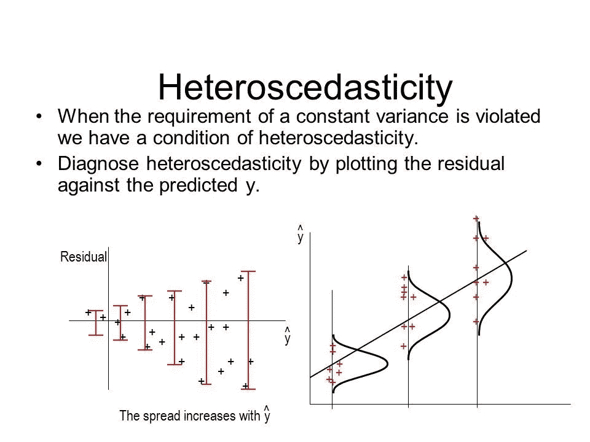
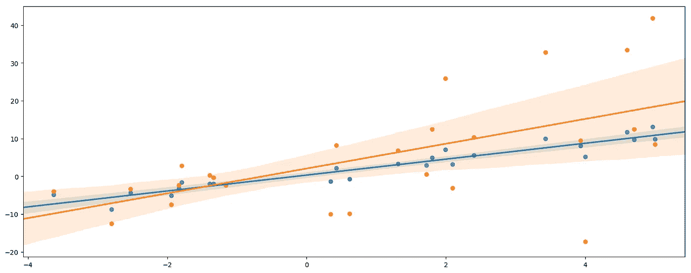
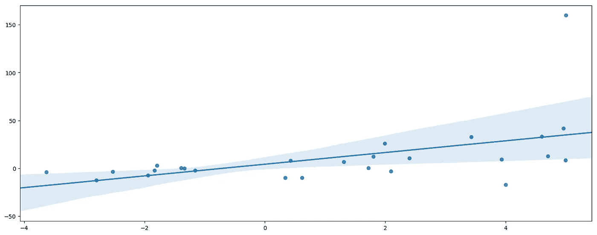
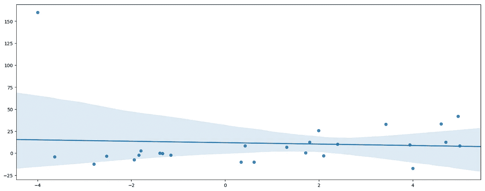

# 何时以及如何使用加权最小二乘(WLS)模型

> 原文：<https://towardsdatascience.com/when-and-how-to-use-weighted-least-squares-wls-models-a68808b1a89d?source=collection_archive---------0----------------------->

# WLS，OLS 被忽视的表弟

在 [Metis](https://www.thisismetis.com) ，我教的第一批机器学习模型之一就是*大部分人*在高中学习的素简[普通最小二乘(OLS)](https://en.wikipedia.org/wiki/Ordinary_least_squares) 模型。Excel 有办法去除 OLS 建模的魅力；学生们经常假设有一个散点图，一些神奇的数学方法可以画出一条最佳拟合线，然后在角落里有一个 r，我们希望它接近 1。事实是，OLS 远不止看上去那么简单，大约一周后，学生们哭着求饶(免责声明:没有学生实际上受到伤害！)当我们深入一个最初看起来如此简单的领域时。

理解了这个广泛适用的模型后，一个自然的反应是将 OLS 用于任何事情。这并不是一个糟糕的想法:尽管 OLS [需要四个](https://www.albert.io/blog/key-assumptions-of-ols-econometrics-review/)——有人说是五个或六个——假设来满足原始或“经过处理”的数据，但是建模范例是相当健壮的，并且通常可以很好地执行，只要我们规范并使用适当的复杂性、对数变换、截取等。

然而，OLS 只是一个杰出的家谱:

> 加权最小二乘法(WLS)是安静平方的表亲，但她有一套独特的技巧，与某些数据集完全一致！

# 输入异方差

我的学生们最喜欢的另一个术语是*异性恋*，这也是“数据科学刽子手”或其他欢乐时光庆祝活动的常见特征。来自古希腊语 *hetero，*意为“不同”，而 *skedasis，*意为“分散”，也可以在英语化的“异方差”(注意附加的‘c’)形式中找到。简而言之，异方差数据具有随输入而变化的可变性。



Source: sarupub.org

事实是，许多数据显示了这种“异方差”。列举一些特征-反应关系的例子，我们通常可以直观地解释为什么:

*   随着年龄的增长，净值趋向分化
*   随着公司规模的扩大，收入趋向分化
*   或者，随着婴儿身高的增加，体重往往会出现差异

OLS 的一个主要假设是数据——以及残差——是本土的。啊哦！好消息是 OLS 可以处理一定程度的异方差。在网上搜索，你可能会发现不同的经验法则，比如“最高可变性不应超过最低可变性的四倍”。还有一个[数量的测试](https://en.wikipedia.org/wiki/Heteroscedasticity#Detection)来统计确定你问题的严重程度。

幸运的是，OLS 的假设不是非黑即白、二元对立的。有一个灰色区域，在那里模型仍然工作得相当好。

> "但是如果我有可怕的——超过 4 倍的异方差——回归怎么办，大师？"
> 
> "那我们就去 WLS 吧，年轻的学徒！"


Yoda taught me everything I know about machine learning!!

# WLS 来救援了！

让我们看看 WLS 是如何在我最喜欢的机器学习环境之一 [scikit-learn](http://scikit-learn.org/stable/) 中实现的。

## 数据设置

让我们生成一些假数据:

```
import numpy as np
import pandas as pd
import seaborn as sns
import statsmodels.api as sm
%matplotlib inline# generate random data
np.random.seed(24)
x = np.random.uniform(-5,5,25)
ϵ = 2*np.random.randn(25)
y = 2*x+ϵ
```

```
# alternate error as a function of x
ϵ2 = ϵ*(x+5)
y2 = 2*x+ϵ2sns.regplot(x,y);
sns.regplot(x,y2);
```



Blue: Regular and Orange: Heteroskedastic

请注意，这些集合来自相同的地面真值函数，但是作为`x`的函数而增加的方差导致橙色模型拟合不同于蓝色的线。在另一次随机抽取中，斜率可能比蓝色低，但总体上更不稳定。

```
# add a strong outlier for high x
x_high = np.append(x,5)
y_high = np.append(y2,160)# add a strong outlier for low x
x_low = np.append(x,-4)
y_low = np.append(y2,160)
```

上面的第一个附录模拟了一个常见的场景，在这个场景中，一个高方差的区域(预期的)会出现一个极端的观察结果。这将对 OLS 产生比 WLS 更大的影响，因为 WLS 将减少差额及其“罚金”的权重。



High outlier, on the top right



Low outlier, on the left

# SKLearn 中的 WLS

为了计算样本重量，记住我们添加的误差作为`(x+5)`的函数而变化；我们可以用这个来反过来衡量这些值。只要相对权重一致，就不需要绝对的基准。

```
# calculate weights for sets with low and high outlier
sample_weights_low = [1/(x+5) for x in x_low]
sample_weights_high = [1/(x+5) for x in x_high]
```

```
# reshape for compatibility
X_low = x_low.reshape(-1, 1)
X_high = x_high.reshape(-1, 1)---------
# import and fit an OLS model, check coefficients
from sklearn.linear_model import LinearRegressionmodel = LinearRegression()
model.fit(X_low, ymod)# fit WLS using sample_weights
WLS = LinearRegression()
WLS.fit(X_low, ymod, sample_weight=sample_weights_low)print(model.intercept_, model.coef_)
print('WLS')
print(WLS.intercept_, WLS.coef_)# run this yourself, don't trust every result you see online =)
```

请注意 WLS 的斜率是如何受到低异常值的更多影响的，这是应该的。低区域应该具有较低的可变性，因此异常值被放大到高于 OLS 值，从而将斜率推得更负。下面让我们看看 WLS 是如何抑制高异常值的。

```
model = LinearRegression()
model.fit(X_high, ymod)WLS.fit(X_high, ymod, sample_weight=sample_weights_high)print(model.intercept_, model.coef_)
print('WLS')
print(WLS.intercept_, WLS.coef_)
```

您将会注意到，在预期方差区域中的异常值是如何减少对参数估计的影响的。请记住，当异常值不完全相等时，请使用 WLS！

# 结论

你有它！实现 WLS 可能有些棘手；`sklearn`没有独特的 WLS 模型，因为论证功能(也用于决策树和其他模型)暗中支持我们的需求。

这是对 WLS 的基本介绍，在这个领域还有很多可以探索的，包括有前途的 [Huber-White“三明治”估计方法](http://en.wikipedia.org/wiki/Heteroscedasticity-consistent_standard_errors)。

最后，道格拉斯·c·蒙哥马利、伊丽莎白·a·佩克和 g·杰弗里·维宁在《线性回归分析简介》一书中推荐了一种加权方法。例如:

1.  建模时总是寻求使用经验或先验信息。
2.  使用模型的残差—例如如果`var(εi)=σ2x_i*var(εi)=σ2x_i` —那么我们可能决定使用`w_i=1/x_i`。
3.  如果回应是`n`观察的平均值，类似于`var(y_i)=var(ε_i)=σ2/n_i*var(y_i)=var(ε_i)=σ2/n_i`，那么我们可能会决定使用`w_i=n_i`。
4.  有时我们知道不同的观测值是由不同的仪器测量的，这些仪器具有一定的(已知的或估计的)准确性。在这种情况下，我们可以决定使用与测量误差方差成反比的权重。

与大多数数据科学工作一样，您的方法必须灵活适应您所拥有的数据类型。

快乐造型！一如既往，感谢您的阅读、联系和分享！