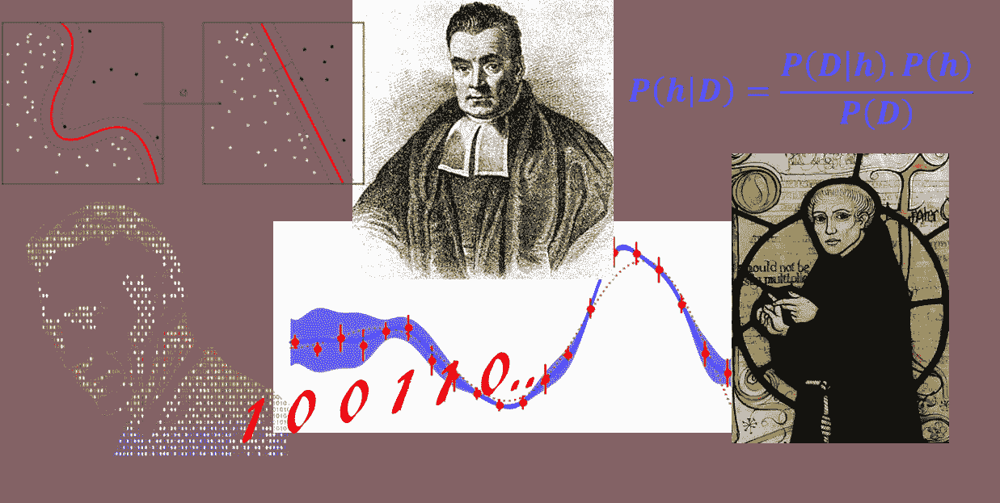
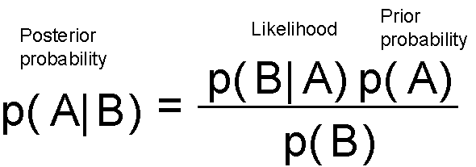
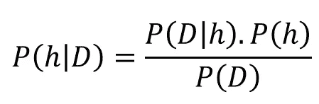
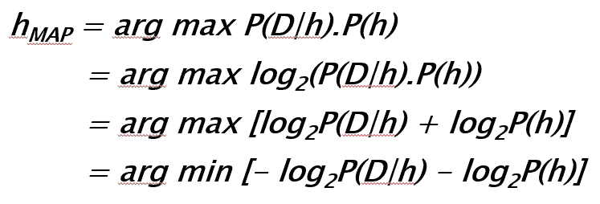
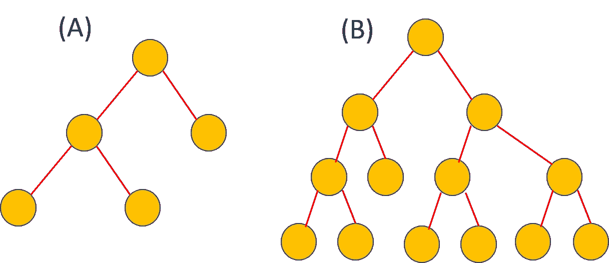
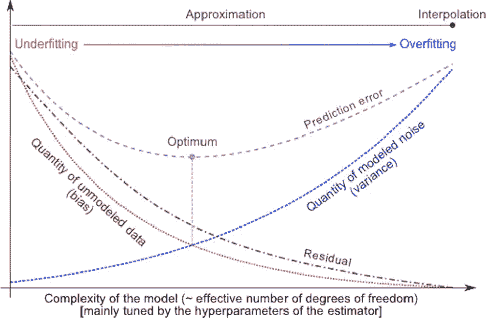

# 当贝叶斯、奥卡姆和香农一起定义机器学习时

> 原文：<https://towardsdatascience.com/when-bayes-ockham-and-shannon-come-together-to-define-machine-learning-96422729a1ad?source=collection_archive---------1----------------------->

## 机器学习基础

## 一个美丽的想法，它将统计学、信息论和哲学的概念结合在一起，为机器学习奠定了基础。

## 感谢

感谢我在佐治亚理工学院的 [CS7641 课程，在我的](https://www.omscs.gatech.edu/cs-7641-machine-learning) [MS 分析项目](https://pe.gatech.edu/degrees/analytics)中，我发现了这个概念，并受到了写这个概念的启发。感谢[马修·梅奥](https://medium.com/u/a0bc63d95eb0?source=post_page-----96422729a1ad--------------------------------)编辑并在 [KDnuggets](https://www.kdnuggets.com/2018/09/when-bayes-ockham-shannon-come-together-define-machine-learning.html) 重新发布这篇文章。

# 介绍

有点令人惊讶的是，在所有机器学习的热门词汇中，我们很少听到一个短语将统计学习、信息论和自然哲学的一些核心概念融合成一个三个词的组合。

此外，它不仅仅是一个为机器学习(ML)博士和理论家准备的晦涩而学究式的短语。对于任何有兴趣探索的人来说，它有一个精确和容易理解的含义，并且对于 ML 和数据科学的实践者来说，它有一个实际的回报。

我说的是 ***最小描述长度*** 。你可能会想这到底是什么…

让我们把这些层剥开，看看它有多有用…

# 贝叶斯和他的定理

## 谁是托马斯·贝叶斯？

我们从(不是按时间顺序)托马斯·贝叶斯牧师[开始，顺便说一下，他从未发表过他关于如何进行统计推断的想法，但后来因同名定理而名垂千古。](https://en.wikipedia.org/wiki/Thomas_Bayes)

那是 18 世纪下半叶，数学科学中还没有叫“概率论”的分支。它被简单地称为听起来相当奇怪的“ [*机会主义*](https://en.wikipedia.org/wiki/The_Doctrine_of_Chances)”——以[亚伯拉罕·德·莫伊弗尔](https://en.wikipedia.org/wiki/Abraham_de_Moivre)的一本书命名。一篇名为《 [*解决机会主义*](http://rstl.royalsocietypublishing.org/content/53/370) 中的一个问题的论文》的文章，最初由贝叶斯撰写，但由他的朋友[理查德·普莱斯](https://en.wikipedia.org/wiki/Richard_Price)编辑和修改，被宣读给皇家学会，并发表在 1763 年伦敦皇家学会的*哲学会刊上。在这篇文章中，Bayes 以一种相当频繁的方式描述了一个关于联合概率的简单定理，它导致了逆概率的计算，即 Bayes 定理。*

## 两个阵营的故事

[从那以后，统计科学的两个敌对派别——贝叶斯主义者和频繁主义者——之间进行了多次斗争。但是为了本文的目的，让我们暂时忽略历史，把注意力集中在贝叶斯推理机制的简单解释上。关于这个话题的超级直观的介绍，请看布兰登·罗勒的伟大教程](https://www.theregister.co.uk/2017/06/22/bayesian_vs_frequentist_ai/)。我会专注于方程式。

这实质上是告诉你在看到数据/证据(*可能性*)后更新你的信念(*先验概率*，并将更新后的信念度赋予术语*后验概率*。你可以从一个信念开始，但是每一个数据点都会加强或削弱这个信念，并且你一直在更新你的假设。

## 让我们来谈谈“假设”

听起来简单直观？太好了。

不过，我在这一段的最后一句中耍了一个花招。你注意到了吗？我把**这个词溜进了*假设*** 。那不是正常的英语。那是正式的东西:-)

在统计推断的世界里，假设是一种信念。这是一种对过程的真实性质的信念(我们永远无法观察到)，这是随机变量产生的背后(我们可以观察或测量，尽管不是没有噪音)。在统计学中，一般定义为概率分布。但在机器学习的背景下，可以想到任何一组规则(或逻辑或过程)，我们相信，这些规则可以产生*示例*或训练数据，我们被赋予学习这一神秘过程的隐藏性质。

所以，让我们试着用不同的符号——属于数据科学的符号——来重铸贝叶斯定理。让我们用 ***D*** 来表示数据，用 ***h*** 来表示假设。这意味着在给定数据 的情况下，我们应用贝叶斯公式来尝试确定 ***数据来自什么假设。我们将定理改写为，***

现在，一般来说，我们有一个大的(通常是无限的)假设空间，也就是说，有许多假设可供选择。贝叶斯推理的本质是我们要检查数据，以最大化最有可能产生观察数据的一个假设的概率。我们主要是想确定 ***argmax*** 中的***P***(***h***|***D***)**即我们想知道对于哪个*，观察到的 ***D*** 最有可能。为此，我们可以放心地把这个术语放在分母*P*(***D***)中，因为它不依赖于假设。这个方案被称为一个相当拗口的名字 [**【最大后验概率(MAP)】**](https://en.wikipedia.org/wiki/Maximum_a_posteriori_estimation)。***

***现在，我们运用下面的数学技巧，***

*   ***事实上，最大化对对数的作用与对原始函数的作用相似，即取对数不会改变最大化问题。***
*   ***乘积的对数是各个对数的和***
*   ***一个数量的最大化等价于负数量的最小化***

******

****好奇者*和*好奇者……*那些负对数为 2 的术语看起来很熟悉……来自**信息论**！***

***克劳德·香农进入**。发明信息时代的天才。*****

# *****香农和信息论*****

*****将需要[多卷](https://www.amazon.com/Mind-Play-Shannon-Invented-Information/dp/1476766681)来描述克劳德·香农的天才和奇特人生，他几乎是单枪匹马奠定了信息论的基础，引领我们进入了现代高速通信和信息交换的时代。*****

*****这是一本关于他的生活和工作的好书，*****

***** [## 游戏中的思维:克劳德·香农如何发明信息时代

### 一种思想在发挥作用:克劳德香农如何发明了信息时代。下载…

www.amazon.com](https://www.amazon.com/dp/B01M5IJN1P/ref=dp-kindle-redirect?_encoding=UTF8&btkr=1) 

[香农的麻省理工学院硕士论文](https://en.wikipedia.org/wiki/A_Symbolic_Analysis_of_Relay_and_Switching_Circuits)电气工程被称为 20 世纪最重要的硕士论文:在这篇论文中，22 岁的香农展示了如何使用继电器和开关的电子电路实现 19 世纪数学家乔治·布尔的逻辑代数。数字计算机设计的最基本特征——将“真”和“假”以及“0”和“1”表示为打开或关闭的开关，以及使用电子逻辑门来做出决定和执行算术——可以追溯到香农论文中的见解。

但这还不是他最大的成就。

1941 年，香农去了贝尔实验室，在那里他研究战争问题，包括密码学。他还致力于信息和通信背后的原创理论。1948 年，这项工作出现在贝尔实验室研究期刊上发表的[著名论文中。](https://en.wikipedia.org/wiki/A_Mathematical_Theory_of_Communication)

## 熵和最小长度

香农通过一个类似于物理学中定义热力学熵的公式 [**定义了一个来源产生的信息量——例如，一条消息中的信息量。用最基本的术语来说，香农的信息熵是对一条信息进行编码所需的二进制位数。并且对于概率为 ***p*** 的消息或事件，该消息的最有效(即紧凑)编码将需要 **- *log2(p)*** 比特。**](https://en.wikipedia.org/wiki/Entropy_(information_theory))

这正是出现在从贝叶斯定理导出的*最大后验概率*表达式中的那些术语的本质！

因此，我们可以说，在贝叶斯推理的世界里，最可能的假设依赖于两个引起长度感的术语——**而不是最小长度。**

> 但是在这些术语中，长度的概念是什么呢？

# 长度(h):奥卡姆剃刀

[奥卡姆的威廉](https://en.wikipedia.org/wiki/William_of_Ockham) ( *约*1287–1347)是英国方济各会修士和[神学家](https://en.wikipedia.org/wiki/Theologian)，也是一位有影响力的中世纪[哲学家](https://en.wikipedia.org/wiki/Philosopher)。他作为一个伟大的逻辑学家的声望主要来自于他的格言，被称为[奥卡姆剃刀。术语*剃刀*指的是通过“剔除”不必要的假设或将两个相似的结论分开来区分两个假设。](https://en.wikipedia.org/wiki/Occam%27s_razor)

归功于他的准确的话是: *entia non sunt 被乘数 da praeter necessitem*(实体不得被乘以超过必要性)。用统计学的术语来说，这意味着我们必须努力用最简单的假设来解释所有令人满意的数据。

类似的原则得到了其他杰出人士的响应。

伊萨克·牛顿爵士:“*除了那些既真实又足以解释自然现象的原因之外，我们不会承认更多的原因。*

伯特兰·罗素:“*只要有可能，用已知实体的结构代替对未知实体的推断。*

> **总是偏爱较短的假设**。

需要举例说明什么是 ***一个假设的长度*** 是多少？

以下哪个决策树的*长度小于*长度？ **A** 还是 **B** ？

即使没有一个假设的“长度”的精确定义，我确信你会认为左边(A)的树看起来*更小*或*更短*。当然，你是对的。因此，*更短的*假设是具有更少的自由参数，或者不太复杂的决策边界(对于分类问题)，或者这些**属性的某种组合，这可以代表其简洁性。**

事实上，奥卡姆剃刀的数学形式主义最终形成了一种叫做“ [**索洛莫洛夫的归纳推理理论**](https://en.wikipedia.org/wiki/Solomonoff%27s_theory_of_inductive_inference) ”的东西，它被认为是通向人工一般智能(AGI)的[基础垫脚石](https://en.wikipedia.org/wiki/AIXI)。

著名的麻省理工学院物理学家和人工智能研究人员 [Max Tegmark](https://space.mit.edu/home/tegmark/) 最近使用奥卡姆剃刀原理构建了被吹捧为“ [**”的人工智能物理学家**](https://www.technologyreview.com/2018/11/01/1895/an-ai-physicist-can-derive-the-natural-laws-of-imagined-universes/) ”，这是一个无监督的学习代理，以[学习和理论操纵](https://arxiv.org/abs/1810.10525)为中心，能够简约地预测未来的两个方面(从过去的观察结果)以及这些预测准确的领域。

## 那‘长度(D | h)’呢？

它是给定假设的数据长度。那是什么意思？

直观上，与假设的正确性或表示力有关。在给定一个假设的情况下，它决定了数据可以“推断”得多好。**如果假设很好地生成了数据，并且我们可以无误差地测量数据，那么我们根本不需要数据。**

想到[牛顿运动定律](https://en.wikipedia.org/wiki/Newton%27s_laws_of_motion)。

它们最初出现在 [*原理*](https://en.wikipedia.org/wiki/Philosophi%C3%A6_Naturalis_Principia_Mathematica) 中时，背后并没有任何严谨的数学证明。它们不是定理。它们很像假设，基于对自然物体运动的观察。但是他们很好的描述了数据。因此，它们变成了物理定律。

这就是为什么你不需要保存和记忆，所有可能的加速度，作为物体所受力的函数。你只要相信紧致假设 aka 定律 ***F=ma*** 并且相信你需要的所有数字，都可以在必要的时候从中计算出来。这使得 ***长度【D | h】***确实很小。

但是如果数据偏离紧凑假设很多，那么你需要有一个关于这些偏离是什么的很长的描述，对它们可能的解释，等等。

> 因此， ***Length(D|h)*** 简洁地捕捉到了“**数据与给定假设**的吻合程度”这一概念。

本质上，这是错误分类或错误率的概念。对于一个完美的假设，它很短，在极限情况下可能为零。不完全符合数据的假设往往很长。

> 而且，这是一种权衡。

如果你用奥卡姆剃刀剃掉你的假设，你可能会剩下一个简单的模型，一个不能适合所有数据的模型。因此，你必须提供更多的数据来增强信心。另一方面，如果您创建一个复杂(长)的假设，您可能能够很好地拟合您的训练数据，但这实际上可能不是正确的假设，因为它违反了具有小熵假设的 MAP 原则。

> 听起来像是偏差-方差权衡？是的，还有那个:-)

**Source**: [https://www.reddit.com/r/mlclass/comments/mmlfu/a_nice_alternative_explanation_of_bias_and/](https://www.reddit.com/r/mlclass/comments/mmlfu/a_nice_alternative_explanation_of_bias_and/)

## 把所有的放在一起

因此，贝叶斯推断告诉我们，**最佳假设是使两项之和最小的假设:假设长度和错误率**。

> 在这一句意义深远的话中，它几乎囊括了所有(受监督的)机器学习。

想想它的后果，

*   一个**线性模型**的模型复杂度——选择什么次数的多项式，如何减少残差平方和
*   一个**神经网络**架构的选择——如何不过度拟合训练数据，达到良好的验证精度，同时减少分类误差。
*   **支持向量机**正则化和核选择——软硬余量之间的平衡，即在准确性和决策边界非线性之间进行权衡。

## 我们真正的结论是什么？

从对最小描述长度(MDL)原则的分析中，我们可以得出什么结论？

> 这是否一劳永逸地证明了短假设是最好的？

号码

MDL 显示的是，如果假设的表示被选择为使得假设的大小为 log2 P( ***h*** )，并且如果异常(错误)的表示被选择为使得编码长度为 D，给定为 ***h，*** 等于-log2p(***D***|

*然而，为了表明我们有这样的表示，我们必须知道所有的先验概率 P( ***h*** )，以及 P(***D***|***h***)。没有理由相信 MDL 假设相对于假设和错误/误分类的任意编码应该是优选的。*

*对于实际的机器学习来说，对于人类设计者来说，指定一个表示来获取关于假设的相对概率的知识可能比完全指定每个假设的概率更容易。*

*这就是知识表示和领域专长的问题变得至关重要的地方。它缩短了(通常)无限大的假设空间，并将我们引向一组极有可能的假设，我们可以对这些假设进行最佳编码，并努力从中找到一组映射假设。*

> ***…最佳假设是最小化两项之和的假设:假设的长度和错误率**。*

# *总结和反思*

*这是一个奇妙的事实，对概率论的一个基本恒等式进行这样一组简单的数学操作，就可以对监督机器学习的基本限制和目标进行如此深刻和简洁的描述。对于这些问题的简明处理，读者可以参考这篇博士论文，名为[“为什么机器学习有效”，来自卡耐基梅隆大学](http://www.cs.cmu.edu/~gmontane/montanez_dissertation.pdf)。同样值得思考的是，所有这些如何与[没有免费的午餐定理](https://en.wikipedia.org/wiki/No_free_lunch_theorem)联系在一起。*

## *如果你对这方面的深入阅读感兴趣*

1.  *"[没有免费的午餐和最小描述长度](http://citeseerx.ist.psu.edu/viewdoc/download?doi=10.1.1.160.798&rep=rep1&type=pdf)"*
2.  *"[没有免费的午餐对抗监督学习中的奥卡姆剃刀](https://pdfs.semanticscholar.org/83cd/86c2c7e507e8ebba9563a9efaba7c966a1b3.pdf)"*
3.  *[没有免费的午餐和问题描述长度](http://www.no-free-lunch.org/ScVW01.pdf)****** 

****如果您有任何问题或想法要分享，请通过[**tirthajyoti【AT】Gmail . com**](mailto:tirthajyoti@gmail.com)联系作者。此外，您可以查看作者的 [**GitHub 资源库**](https://github.com/tirthajyoti?tab=repositories) 中其他有趣的 Python、R 或 MATLAB 代码片段和机器学习资源。如果你像我一样，对机器学习/数据科学充满热情，请随时[在 LinkedIn 上添加我](https://www.linkedin.com/in/tirthajyoti-sarkar-2127aa7/)或[在 Twitter 上关注我。](https://twitter.com/tirthajyotiS)****

**** [## Tirthajyoti Sarkar -高级首席工程师-低压设计工程-半导体上|…

### 查看 Tirthajyoti Sarkar 在世界上最大的职业社区 LinkedIn 上的个人资料。Tirthajyoti 有 8 份工作…

www.linkedin.com](https://www.linkedin.com/in/tirthajyoti-sarkar-2127aa7/)****