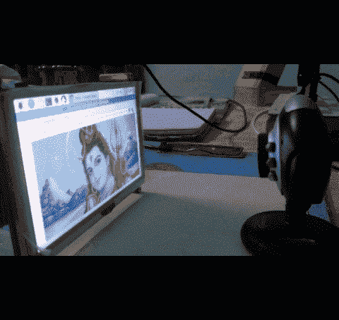
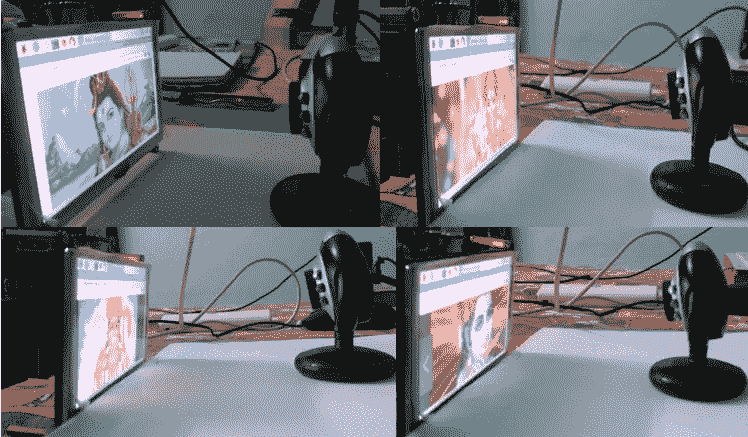
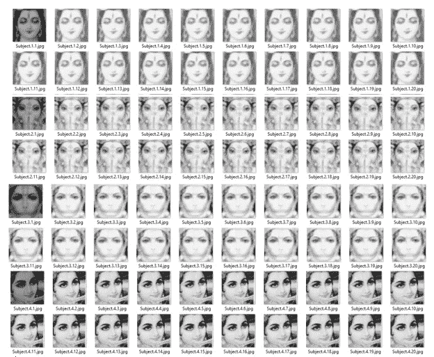
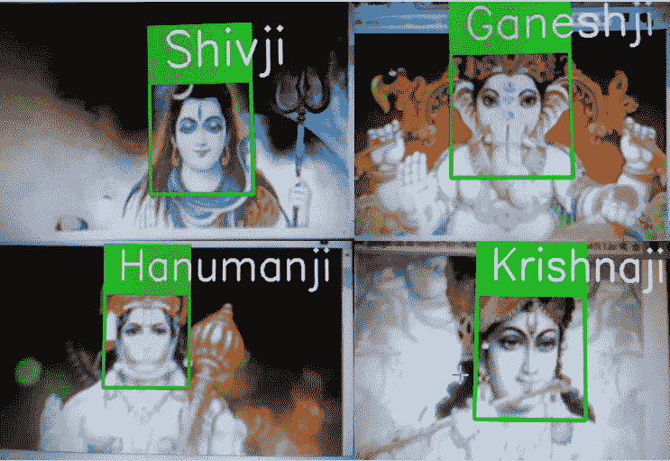
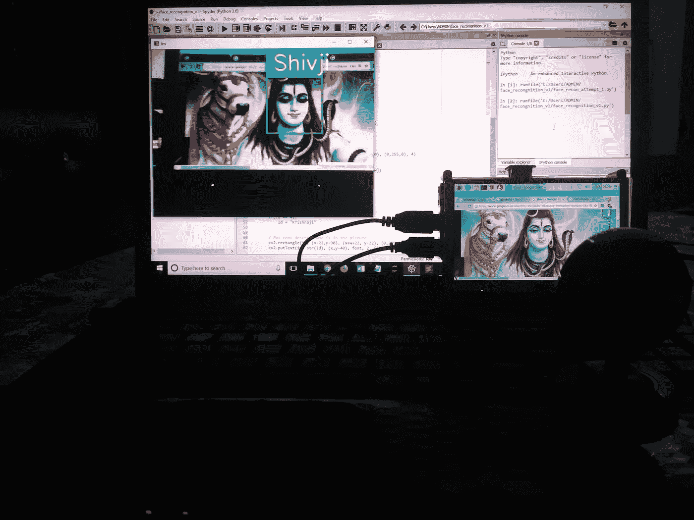

# 当计算机视觉遇到印度教的神！！

> 原文：<https://towardsdatascience.com/when-computer-vision-meets-hindu-gods-927b5fa22063?source=collection_archive---------4----------------------->

正如有史以来排名第九的畅销小说作家 J. K .罗琳所说,“我们不需要魔法来改变我们的世界，我们已经拥有了我们内心需要的所有力量。我们有能力让**把**想象得更好。”。这些特别的台词把我带到了一个制作一个我从未想过的项目的旅程，一个我从未想象过的项目。就像所有其他人一样，我也开始寻找每个角落的想法，从我不久前发表的名为“[用 TensorFlow 检测模型进行实时物体检测](/real-time-object-detection-with-tensorflow-detection-model-e7fd20421d5d)”的项目开始，但我无法拿出一些非凡的东西。

一天，当我在浏览我的脸书账户时，奥地利理论物理学家埃尔温·薛定谔的一句话引起了我的注意，他因在量子力学方面的贡献而闻名，这句话是“**任务是……不要去看别人还没看过的东西；而是去思考没有人思考过的东西，思考每个人都看到的东西。，它最终帮助我确定了我的旅程的方向，直到现在我都没有方向。**

嗯，我知道宇宙以神秘的方式运作的一个事实，所以所有这些引用和事件使我能够进入我的下一个项目，即“**使用计算机视觉对印度教神进行面部识别”**，因为我练习计算机视觉有一段时间了，所以我有意挑战自己，以这样一种方式建立一个面部识别系统，即使在计算有限的平台上，它也应该及时地执行识别任务，并具有可观的准确性。

在我寻求为印度教神制作一个面部识别系统的过程中，是时候我应该做出选择了(在 3300 万或 33000 万印度教神中)我应该选择哪一个，来建立一个可以做两件事的系统。

首先是认识印度教的神，其次是在需要的时候容易发现神。因此，从简单的观点来看，我选择湿婆神、甘尼萨神、哈奴曼神，最后但同样重要的是奎师那神。

所以，在向你们解释了灵感、动机、我的项目是什么以及项目的预期结果之后，我知道我的读者朋友们，你们一定都进入了怀疑的模式，你们一定都有数百万个问题在脑海中，比如我是如何做到的，我是如何实现的，我是如何使这个项目或这个尝试成为可能的。

是时候打破不确定性，进入项目的执行部分了。从这一点开始，我将向你解释这个项目的每一个细节，并消除你头脑中所有的疑惑。所以，系好你的安全带，准备好迎接这一独特而永恒的旅程吧，我相信你以前从未经历过。

但是在进入执行部分之前，我需要分享一些我使用的硬件和软件信息，这些信息对项目的前景非常重要。

硬件:

1.  由 [Nvidia GeForce 410M](https://www.geforce.com/hardware/notebook-gpus/geforce-410m/specifications) GPU 组成的笔记本电脑。
2.  一个 7 美元的网络摄像头。
3.  A [树莓 pi 3 Model B](https://www.raspberrypi.org/products/raspberry-pi-3-model-b/) 带 [5 寸 HDMI 液晶](https://www.waveshare.com/wiki/5inch_HDMI_LCD)只是为了炫耀:)，可以用手机或者自己的笔记本电脑抓拍脸部。

软件(仔细查看版本)

1.  蟒蛇与 Python [版本 3.6.3](https://anaconda.org/anaconda/python/files?version=3.6.3) 。
2.  OpenCV( [版本 3.4.0](https://www.scivision.co/install-opencv-python-windows/) )

操作系统 Windows 10，就是这样

现在，让我们来谈谈步骤，整个项目分为三个部分:

1.  **收集数据集**简而言之，这一步允许我制作自己的定制数据集，在这一步中，我收集了我想要为之构建面部识别系统的印度教神灵的面部。我使用的算法是[基于 Haar 特征的级联分类器](https://docs.opencv.org/trunk/d7/d8b/tutorial_py_face_detection.html)，我收集不同印度教神的图像的方式如下所示。

Collecting images for dataset using a Webcam and a Raspberry pi

在我完成捕捉人脸的这一步后的结果可以在下面的图像中看到，虽然上面的图像是彩色的，但代码是以这样一种方式编写的，它将识别图像中的人脸，只提取人脸并将其存储在灰度模式中。

A look on my Hindu Gods Custom Dataset

2.为了让你知道，我收集了 4 个印度教神的 100 张脸。收集数据集后，下一个重要步骤是在我的自定义数据集上训练分类器，当我执行这一步骤时，我最终得到了一个名为 **train.yml** 的文件，其中包含了所有关于印度教神的面孔及其 id 的信息。

3.最后一步对我来说是关键时刻，它的结果表明我的面部识别和检测系统能够准确地检测到印度教的神，结果可以在下图中看到。

哒哒哒！！任务完成工作做得很好我的项目检测印度教神的脸与有限的计算资源的可用性看到一个预期的结束，上面的图像是不言自明的。但是等等，这不是我需要深入的全部(我喜欢这个词，因为我也是一名深度学习实践者)来让你理解关于我的项目或方法的一些关键点，所以请为这最后一部分努力。

让我们深入一点

**首先**，这个项目是为了检测印度教神的面孔，因此为了识别众多神中的四个印度教神，我将每个神与一个 id 相关联，例如，我将湿婆神作为 id 1，甘尼萨神作为 id 2，等等，你可以在文件名 **face_dataset_v1.py** 中找到代码，你可以在我的 GitHub 存储库中找到，不要担心我在参考部分提到了所有的链接。

如果你想制作自己的印度教神数据集，而不是我的 GitHub 库中已经有的数据集，如果你想对多个不同的脸进行面部识别，只需每次运行该程序，给出一个数字 id，如 1，2，3 等，并将其保存在一个名为 datasets 的文件夹中。

**其次**，当你完成了自己的定制数据集，然后只运行 **training_v1.py** 文件，这样它就可以从 datasets 文件夹中转换你的所有图像及其各自的 id，并将其保存到另一个文件夹名称 train，文件名为 train.yml。

嗯，我的项目的主角不是别人，正是**haarcascade _ frontal face _ default . XML**文件，它是预先构建的正面人脸训练模型，用于人脸检测，因此请确保它应该与其他文件存在于同一目录中，否则即使是创建数据集的第一步也不会起作用。

最后，在你成功地运行了上面提到的两个 Python 文件之后，只需运行 face_recognition_v1.py，就能看到神奇之处，或者我会说感受一下神奇之处，有时我听起来确实很有诗意。下面是文章的最后一张相关图片，请欣赏！！

Final Setup of my Face recognition System ,look look it detected Lord Shiva perfectly :)

参考资料:

1.  这个项目代码的 GitHub 库链接可以在这里找到。
2.  为了了解更多关于面部识别系统的信息，您可以查看[这里](https://en.wikipedia.org/wiki/Facial_recognition_system)。
3.  为了了解更多关于计算机视觉的知识，你可以查看[这里](https://en.wikipedia.org/wiki/Computer_vision)。
4.  最后但同样重要的是，你可以在这里查看 YouTube 视频。

**感谢您的关注**

你用*你的*时间来阅读*我的*作品对我来说意味着整个世界。我完全是这个意思。

如果你喜欢这个故事，疯狂鼓掌吧👏 **)** 按钮！这将有助于其他人找到我的工作。

还有，**想的话就跟我上** [**中**](https://medium.com/@naveenmanwani) ！我很乐意。