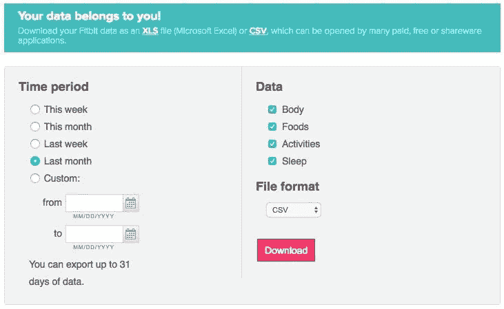
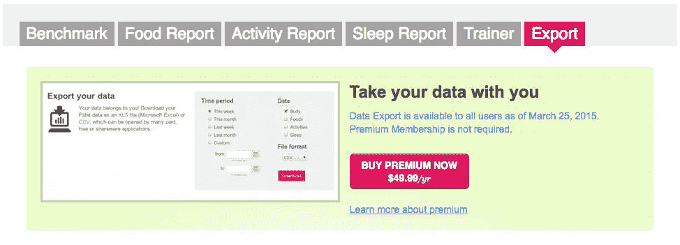

# 当 Fitbit 说“你的数据属于你！”…

> 原文：<https://towardsdatascience.com/when-fitbit-says-your-data-belongs-to-you-d477270bc8d2?source=collection_archive---------9----------------------->

Ok, prove it!

…他们真正的意思是

> “我们很不情愿地允许您有限地访问一小部分数据”

在我继续说下去之前，我想说我是 Fitbit 的粉丝。在过去的几年里，我有几个追踪器，我每天都使用我的[充电 2](https://www.fitbit.com/charge2) 和[咏叹调](https://www.fitbit.com/aria)量表。我甚至很快就放弃了 Apple Watch，因为我更喜欢 Fitbit 更长的电池寿命和睡眠跟踪功能，并意识到我正在寻找一个活动监视器，而不是一个功能齐全的智能手表。

但是，我也是一个数据呆子，因此我不喜欢 Fitbit 的**围墙花园**策略。我理解他们的动机，但我也认为——即使考虑到他们自己的利益——他们被误导了。我坚信，他们在这个领域的制胜策略将是进一步开放他们的数据 API。

让我解释一下:

最初，Fitbit 只允许向他们的高级用户输出数据。这一限制于 2015 年[取消](https://www.fitbit.com/premium/export):

从那以后，他们允许用户从他们的网站免费下载活动数据。

然而，至少可以说，他们所提供的非常有限。身体、食物、活动和睡眠测量的每日总量。没有当天数据，没有跟踪活动的数据，没有心率数据。没有付费选项来获得更精细的访问。

当我在 Twitter 上抱怨这件事时，他们的回应是:

对此我称之为扯淡！他们自己的应用程序似乎完全有能力为成千上万的日常用户快速可靠地加载这些数据。如果这真的与服务器负载有关，有多种方法可以处理，包括限制 API 的速率，只允许每个用户每天大量下载一次，等等。

现实是，他们不希望数据“在那里”。他们希望将用户限制在只能通过自己的工具查看和分析数据的体验中。

当然，聪明的书呆子已经找到了多种方法来解决这个问题，例如:

 [## simonbromberg/googlefitbit

### 用于 fitbit 数据下载的 Google Sheets 脚本

github.com](https://github.com/simonbromberg/googlefitbit)  [## corynes en/fitbitScraper

### 用于抓取 fitbit 数据的 fitbitScraper - R 包

github.com](https://github.com/corynissen/fitbitScraper) 

…这就是 Fitbit 的问题所在。书呆子是早期采用者。他们可能会转向提供更好的数据访问的制造商，随着新的创新工具和更活跃的生态系统围绕这种开放战略出现，其他用户群也会很快效仿。

Fitbit 的战略优势并不在于硬件追踪器的制造——这些现在已经相当商品化了。事实上，他们一直在[收购陷入困境的竞争对手](https://techcrunch.com/2016/11/30/fitbit-pebble/),以维持他们在这个低利润、低准入门槛市场的地位。

Fitbit 的战略优势在于他们占主导地位的品牌知名度和市场份额。保持这一地位的方法是成为活动数据的“数据中心”。但是，只有当用户真正感觉到数据确实是他们的，并且通过围绕数据托管提供非凡的体验和增值，这才是可能的。

像软件领域的大多数传统供应商一样，我相信 Fitbit 很想摆脱“永久”业务(在他们的情况下是销售硬件)，转向弹性更大、利润更高的订阅业务。成功的关键是数据，而不是硬件。但就像许多 SaaS 消费公司在他们之前发现的那样，他们必须意识到，信任的关键是用户对自己数据的完全、无障碍的访问。数据真正“属于你”的感觉。并不是说大多数人会访问或下载这些数据，但他们想知道他们可以——如果真到了那一步。在一个运行良好的生态系统中，他们会希望与其他服务共享数据，反过来让这些服务与 Fitbit 的数据存储共享数据，并将其存储在 Fitbit 的数据存储中。

Fitbit 需要将自己从一家销售“永久”硬件的硬件公司转变为一家向消费者出售“活动数据中心”(可能会存储来自其他“量化自我”追踪器的数据)订阅服务的数据公司，并将数据(他们[已经保留了这种权利](https://www.fitbit.com/legal/privacy))汇总给医疗服务提供商、设备制造商和研究公司。

如果他们能够实现这种转变，Fitbit 的未来是光明的。否则，在一个越来越便宜、竞争越来越激烈的硬件市场保持利润将被证明是非常困难的。