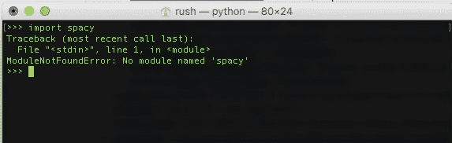
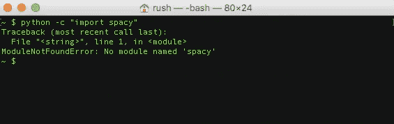
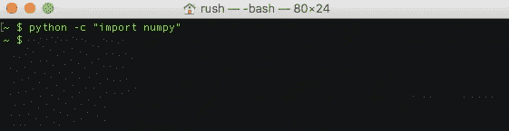
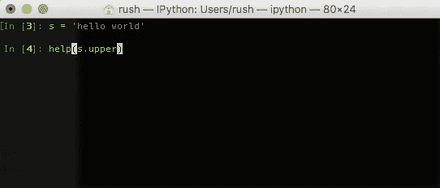
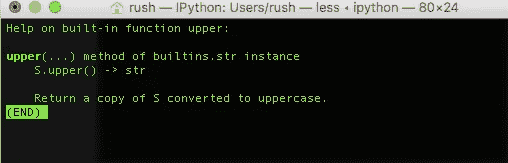
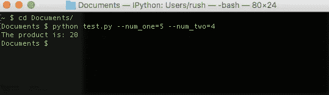

# 初级 Python 黑客

> 原文：<https://towardsdatascience.com/when-learning-a-new-programming-language-theres-always-a-sense-that-there-will-be-a-few-commands-c81a023e033e?source=collection_archive---------8----------------------->

当学习一门新的编程语言时，总有一种感觉，我们会不断重用一些命令、技巧和变通办法；通常称为 80/20 法则——20%的活动负责 80%的工作。Python 自然适合这种范式，Python 化意味着最小化，但具有更大的吞吐量。让我们看看其中的一些启发。

## 检查第三方库

您正在使用 Anaconda，或者更大胆一些，您已经通过 Python 在本地设置了一些虚拟环境。一个是专门用于自然语言处理的，另一个是用于机器学习的，甚至还有一个更深奥的——深度学习。在这三种环境中的一种，你不确定你是否已经安装了自然语言处理的 *nltk* 或 *spacy* 。要进行检查，您可以运行 Python repl，并键入

```
import spacy
```



好的，所以你知道，spacy 是不可用的，你必须通过 pip 或 conda 安装它。不需要转到 repl，更快的方法是直接在终端中输入这个命令，假设 python 包含在终端的路径中:

```
python -c “import spacy”
```



瞧！你得到同样的输出。如果包裹确实在那里，就不会打印投诉。



## 在代码外部保存用户凭据

总是需要连接到远程数据库或访问 REST API，其中需要用户名和密码。如果你是通过编程来实现的，你可以为它们创建单独的变量，将它们编码成字符串。

```
db_user_name = ‘me@example.com’db_password = ‘an_awS0mE1Pass.Word#’
```

这很糟糕，原因有几个。主要是如果你使用一些版本控制软件，比如 GIT，这意味着每个参与项目的人都可以看到这些凭证。解决这个问题的一个快速而肮脏的实现是将这些变量填充为空字符串，然后让用户键入他们的凭证。这可能会变得令人厌倦和笨拙。我提倡使用 [python-dotenv](https://github.com/theskumar/python-dotenv) ，它本质上是一个帮助通过*访问这些凭证的包。env* 文件(键值对)。如果你使用 GIT，简单地添加这个。env 文件到*。gitignore* 确保在保存你的工作时不会涉及到它。假设上述用户凭证保存在一个. env 文件中，在代码中调用它们的一个实现是:

```
import osfrom dotenv import load_dotenv, find_dotenvload_dotenv(find_dotenv())db_user = os.environ.get(‘db_user_name’)db_pw = os.environ.get(‘db_password’)
```

## 文档帮助

现在，你可以告诉我喜欢与 Python REPL 一起工作。更是如此，伊普森。后者是因为我可以使用 tab 键来自动完成命令。总是需要查找文档。上网用谷歌搜索是很常见的。有些人会把他们经常去的网站加入书签。甚至存在与语言或库无关的文档浏览器，提供了在一个地方离线查找文档的额外优势。具体来说，[破折号](https://kapeli.com/dash)和[热心](https://zealdocs.org/)。虽然这在某些情况下很理想，但有时在 REPL 提取文档很方便；只是召唤*帮助*命令上的一个功能:



你会得到这个



## 命令行参数

诚然，这可能相当复杂，即使用例足够简单。我将提倡使用来自标准 Python 库的 *argparse* 。下面是一个简单的程序，它将通过命令行输入的两个数字相乘:

```
import argparseparser = argparse.ArgumentParser()
parser.add_argument(“--num_one”, default=1, help=”Enter Number 1", type=int)
parser.add_argument("--num_two”, default=1, help=”Enter Number 2", type=int)args = vars(parser.parse_args())product = args[‘num_one’] * args[‘num_two’]print(“The product is: {}”.format(product))
```

这就是你将如何运行它:-



## 关键字参数(**kwargs)

当调用一个函数时，传递参数是再熟悉不过的了。例如，在前面的例子中， *add_argument* 函数被传递了变量名的参数，在没有提供变量名的情况下默认值应该是什么，最后是要显示的帮助消息。关键字实参允许你传递这些参数，但是当写出你的实际函数时，没有必要在函数“header”中显式地拼写它们。演示:

```
def print_name(**kwargs):  print(‘First name: ‘, kwargs.pop(‘first_name’))
 print(‘Last name: ‘, kwargs.pop(‘last_name’))print_name(first_name=”Rush”, last_name=”Kirubi”)
```

***

我很想听听你的妙计。当一个人刚刚入门或者开始欣赏一门特定语言(在这里是 Python)的长处时，它们会非常有用。请随意评论或提出你自己的建议。