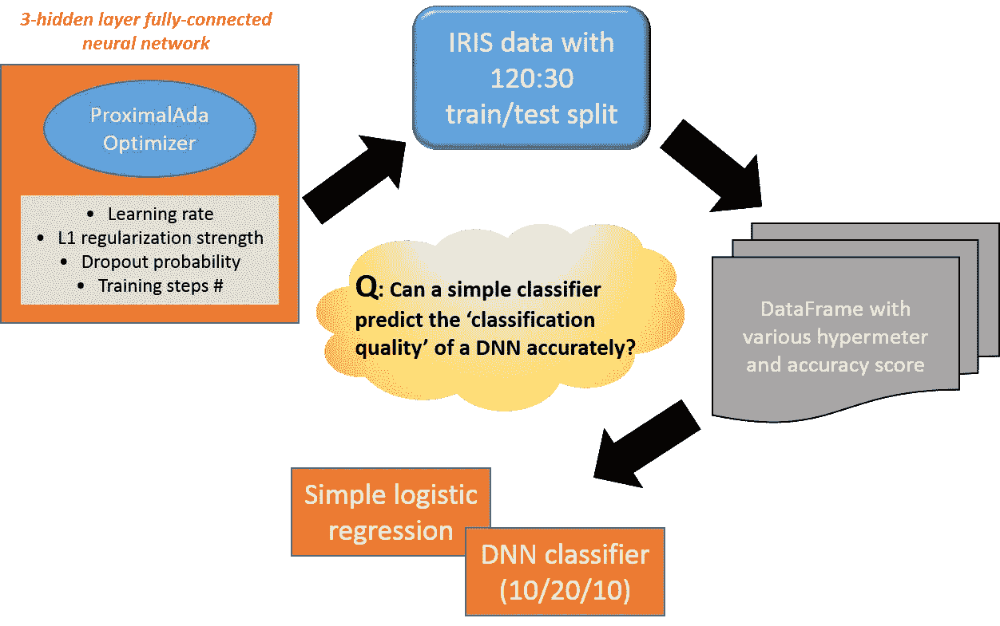
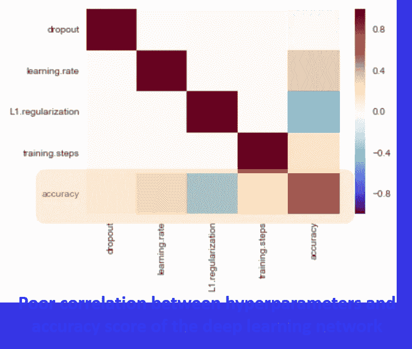

# 当机器学习试图预测机器学习的性能时…

> 原文：<https://towardsdatascience.com/when-machine-learning-tries-to-predict-the-performance-of-machine-learning-6cc6a11bb9bf?source=collection_archive---------1----------------------->

## 我试图通过另一种机器学习算法来‘预测’深度学习网络的质量。结果并不令人鼓舞。

看过[我之前关于媒体的文章](/how-to-choose-effective-moocs-for-machine-learning-and-data-science-8681700ed83f)的人都知道，我不是机器学习或数据科学专家。我来自半导体技术背景，最近才开始摆弄机器学习技术。

作为一个新手，只要我能克制自己，我就不敢冒险进入深度学习。平心而论，当我参加[Ng 教授的 Coursera 课程](https://www.coursera.org/learn/machine-learning)时，我确实使用 MATLAB 编写了简单的 1 或 2 层感知机，甚至使用 NumPy stack 尝试了他更新的 [Deeplearning.ai 课程](https://www.coursera.org/learn/deep-neural-network)的前几个例子。但是它们只涉及很少的“深层内容”和极少量的超参数。

正是这个深度学习领域的超参数问题一直让我着迷。我认为这很自然，因为我来自一个技术设计背景，我也每天在我的半导体工艺或器件设计工作中使用大量高水平参数，它们经常以令人难以置信的复杂和(有时)不可预测的方式结合，导致我的设计成功或失败。

我试着告诉自己，这只是一大锅简单的配料——量子力学、基尔霍夫定律、麦克斯韦方程——我应该能够非常自信地预测结果。而且，我经常能做到。但是有些情况下，设计的质量并不完全符合预期，根本原因很难在整个开发过程中使用的超级参数的迷宫中找到。

因此，当我最终开始摆弄 [TensorFlow](https://www.tensorflow.org/) 时，我直接开车去进行自学练习，在那里我摆弄各种超参数以及它们对预测器最终质量的影响。现在，这句话“*各种参数及其影响*”听起来像什么？一个等待机器学习分析的问题，对吗？

没错。我试图通过深度学习(和简单的逻辑回归)来“学习”是什么推动了深度学习模型的性能！

我不会涉及太多的技术和实现细节。有兴趣的读者可以简单的**参考/下载我的** [**GitHub repo**](https://github.com/tirthajyoti/HyperparameterLearningTF) 中的代码。相反，我将用简单的术语描述高层次的步骤，

*   首先，我选择了一个简单而众所周知的数据集——著名的[***鸢尾物种数据***](https://en.wikipedia.org/wiki/Iris_flower_data_set) ，这也是在[**tensor flow Estimator API**教程页面](https://www.tensorflow.org/get_started/estimator)中使用的。这是一个具有实值特征的多项式分类问题。标准又干净。
*   然后我决定了一个特定的优化器:[***ProximalAdagradOptimizer***](https://www.tensorflow.org/api_docs/python/tf/train/ProximalAdagradOptimizer)。我相信您可以(并鼓励您尝试)选择任何其他优化方法，而不会失去通用性。
*   此后，我选择了 4 个超参数，在我看来，它们足够通用，可以出现在人们可以解决的深度学习问题的任何高级甚至阵列级实现中:

a) **学习率**，b) **辍学率/概率**，c) **L1 (LASSO)正则化强度**，d) **【网络的训练步数**。

*   选择了超参数后，我以对数的方式将它们分布在一个很大的范围内，而不是线性的，只是为了用少量的点覆盖一个很大的范围。
*   然后，我构建了一个全因子循环(所有级别的超参数都与所有其他级别交叉)，并通过跨越该多级循环开始训练一个 3 层(5，10，5)全连接前馈神经网络。我保持网络足够小，以便在我简单的笔记本电脑上实现不错的训练速度:)
*   在循环的一次执行中，我提取并保存了基于拒绝集的预测的“准确性”。
*   在整个“循环”执行结束时，我将参数和准确度分数(DNN 分类器预测质量的指标)转换成一个 [Panda DataFram](https://pandas.pydata.org/pandas-docs/stable/generated/pandas.DataFrame.html) e，供以后分析。
*   并且，我对 4 种类型的激活函数重复这个过程:a) sigmoid( *x* )、b)整流线性单元(RELU)、c) tanh( *x* )和 d) [指数线性单元(ELU)](https://arxiv.org/abs/1511.07289) 。
*   现在，我有 4 个激活函数的 4 个数据帧——每个数据帧都包含关于神经网络的超参数的数据作为特征，精度作为输出。Prime 供另一个机器学习算法分析，或者自己分析！
*   为了将准确度分数转换成分类数据，我只是将它们任意分为三类:*低、中*和*高*。这简单地表示深度学习网络的'*质量*'。例如，小于 0.5 的准确度表示*低*分数，而> 0.8 的分数得到*高*分类。
*   此后，我构建了一个简单的[逻辑回归分类器(来自 scikit-learn](http://scikit-learn.org/stable/modules/generated/sklearn.linear_model.LogisticRegression.html) ),并试图从超参数中预测质量等级。
*   并且，我使用另一个 DNN 分类器模型尝试了相同类型的预测。我在这一步使用了一个更大的神经网络(20-20-20 个隐藏的神经元),因为我只需要运行一次，并且还需要训练更多的步数(最少 5000)。
*   并重复了所有 4 个激活功能的全部内容。

> **结果充其量是喜忧参半。我得到了高达 0.8 的准确性和 F1 分数，但当我尝试各种随机分割和交叉验证时，平均表现为 0.4-0.6，有时低至 0.35。**

数据集很简单，DNN 分类器的准确度分数总体上令人满意，但是机器学习模型不能很好地理解神经网络性能对各种超参数的依赖性。唯一明显的特征是激活函数的选择——tanh 和 ELU 给出了明显比 sigmoid 和 RELU 更好的结果。但这种认识可以通过简单地查看准确度得分表来实现，并不保证机器学习模型。除此之外，没有从超参数空间明确的学习来实现 DNN 模型部分的更好的准确度分数。甚至更高的训练步骤数也没有显示出与更高的准确度分数有任何明确的相关性。

同样值得注意的是，当 DNN 分类器从超参数数据集学习时，它并不比简单的逻辑回归模型(对数据进行 [*最小最大标量变换*](http://scikit-learn.org/stable/modules/generated/sklearn.preprocessing.MinMaxScaler.html#sklearn.preprocessing.MinMaxScaler) )表现得更好。因此，这可能不是模型的限制，而是数据集本身充满了不确定性和无法解释的变化。下图显示了与 ELU 激活函数相对应的数据集的关联热图(从原始虹膜数据的角度来看，这是性能较好的函数之一)

超参数优化，甚至是选择一组好的超参数，仍然感觉像是深度学习领域的“黑魔法”。

> 即使对于像鸢尾属物种分类这样相对简单的问题，机器学习方法也不能很好地理解全连接神经网络的超参数对最终精度的影响。

***免责声明*** :请随意从 GitHub 中获取代码，并自己进行实验，如果您发现了有趣的东西，请告诉我:)我的联系方式是:*tirthajyoti[AT]Gmail[DOT]com。*