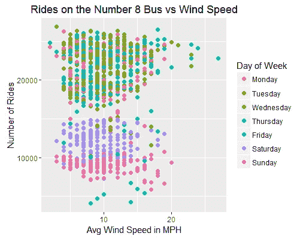
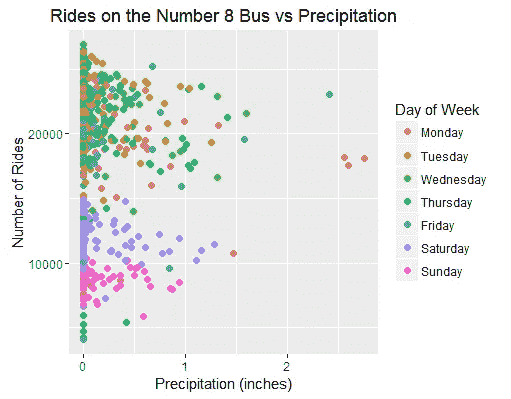
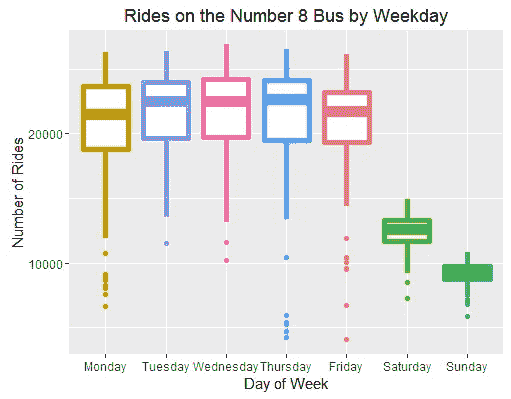
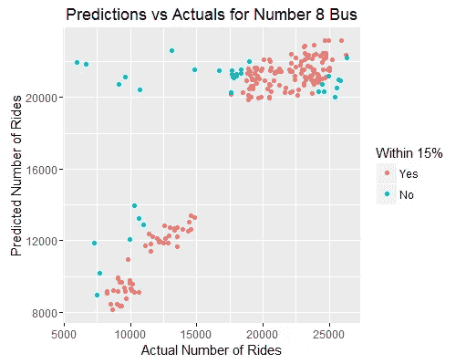

# 我应该什么时候在芝加哥乘公共汽车？

> 原文：<https://towardsdatascience.com/when-should-i-ride-the-bus-in-chicago-21a4bc26e033?source=collection_archive---------7----------------------->

source: [unsplash.com](http://unsplash.com)

随着芝加哥整个春天的天气变得越来越好，我注意到我每天乘坐公交车上下班的拥挤程度有所波动。越来越多的人是令人沮丧的，随着温度的升高，我越来越倾向于骑自行车上下班。一年中这个时候芝加哥的天气变化无常，当外面天气不太理想时，我不愿意骑自行车，所以我决定收集一些信息来帮助我判断什么更糟糕——天气还是公交车上的人群。

首先，我必须找到用于此的数据。幸运的是，芝加哥市有一个开放的数据门户，这绝对是了不起的。公交路线数据很干净，格式也很好，这大大弥补了它直到 2016 年 11 月才完成的事实。至于天气数据，我是从[地下](http://wunderground.com)气象站刮来的。

一旦我得到了这些数据集，我就把它们上传到 R 中，用 ggplot2 进行一些探索性的可视化。我特别研究了天气和 8 号路线之间的关系，因为那是我最常乘坐的巴士路线。

下面我们可以看到，随着气温的上升，工作日的乘客数量下降。尤其是气温超过 60 度的时候。然而，在周末，不管气温如何，乘客量仍然相当平稳。

检查风速与下面的乘客人数似乎没有太大的关系。我们可以肯定地看到，一周中的日子是一个很大的因素，就像前面的图表一样，但没有那么多风。

就像风速一样，降水似乎对车友的量没有太大影响。这让我有些惊讶，因为我确实感觉到雨天公交车上的人更多，但这可能是一种错觉，因为潮湿导致不太舒服。

不出所料，在之前的图表中看到一周中的日子被分开后，周末乘坐公交车的人数比工作日低得多。这意味着当考虑周末的交通方式时，公共汽车很可能不会拥挤。

为了在未来帮助自己，我想看看我是否能预测某一天的乘客数量。根据上面获得的知识，似乎唯一有价值的预测变量是温度和星期几。我将数据分成 80-20 份用于训练和测试，然后在训练数据上使用一周中的某一天和一天中的最高和最低温度来组合 glm。以下是将该模型应用于测试数据时，该模型的预测值与实际乘坐人数的对比。不幸的是，误差很大，但 84%的预测值与实际值相差在 15%以内。

在深入研究了上述关系并试图预测公交车流量后，我想弄清楚如何实际决定是骑自行车还是跳上公交车。为此，我决定为天气和公交车的拥挤程度创建“痛苦”指数。公共汽车上乘坐量的痛苦指数只是一个从 0 到 100 范围内的标准化。存在的公式是:misery _ I = 100 *(riders _ I-min(riders)/(max(riders)-min(riders))。至于天气指数，我分别用 40、40 和 20(温度是倒数)组合了温度、降水和风速的归一化。这种分裂仅仅是我个人对最让我畏缩的属性的偏好。现在，痛苦指数被放在一起，我有一个评级系统来决定是坐公共汽车还是骑自行车:如果天气指数高于公共汽车，那么它就是，如果公共汽车指数高于它，那么是时候跳上我的自行车了。

激动人心的部分来了。该模型是否能很好地预测乘客量，以决定是骑自行车还是乘公共汽车？将我们预测的公交乘客量与公交痛苦指数相加，并将其与观测到的天气痛苦指数进行比较，然后将由此得出的决策与原始的观测决策进行比较，我们得到了 91.1%的准确率。不算太坏。

基于这一切，我决定用 Shiny 创建一个互动工具，你可以在这里查看。该工具接收您计划乘坐的公交路线，并从 Weather Underground 的 API 中获取当前天气，然后根据更新的数据运行上述模型，以预测公交路线的拥挤程度并计算痛苦指数。除此之外，还有一个选项可以显示你对天气有多“强硬”,这个选项为天气痛苦指数增加了参数和乘数。

感谢阅读！