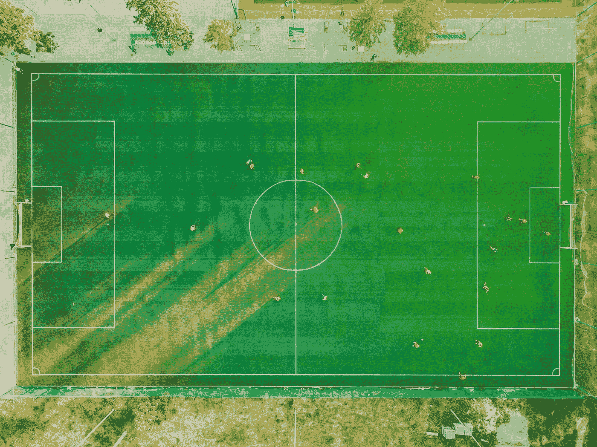
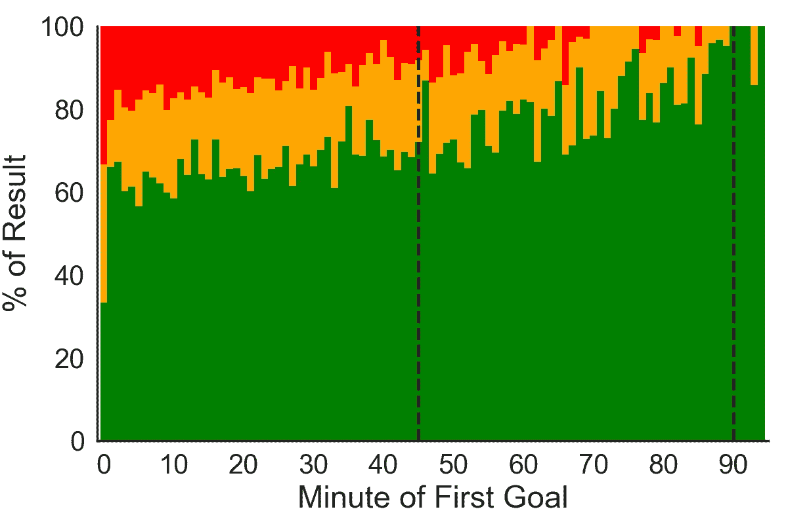
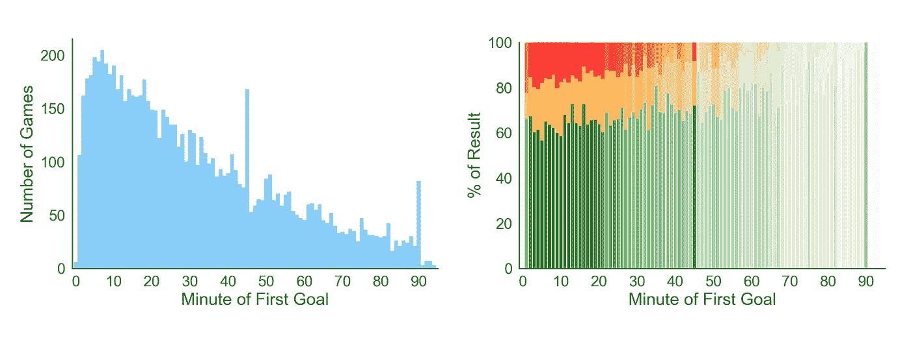
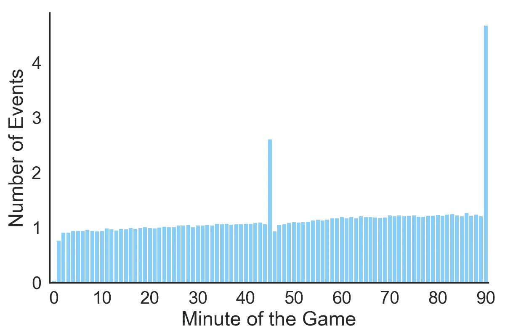
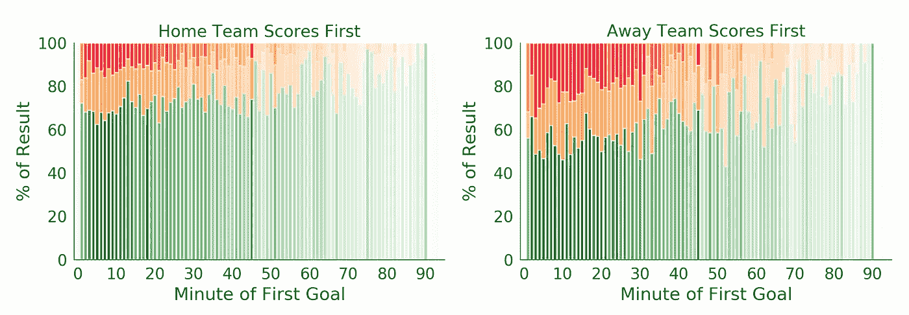

# 先别进球，梅西！

> 原文：<https://towardsdatascience.com/when-to-score-the-first-goal-to-beat-your-opponent-in-soccer-8d7b4e94035?source=collection_archive---------9----------------------->

## 看一看足球比赛中得分的最佳时机。

Picture from [pexels.com](https://www.pexels.com/photo/three-women-playing-soccer-game-685382/)

比赛开始，你的球队在比赛的第一分钟踢进第一个球。这听起来很理想，但是你的对手回来的几率增加了吗？如果你在其他任何一分钟打进比赛的第一个进球，你赢得比赛的机会有多大，它们相比如何？

使用[这个 Kaggle 数据集](https://www.kaggle.com/secareanualin/football-events)(其中包括从 2012 年到 2017 年欧洲一些顶级联赛的 9K 场比赛的详细事件)，我试图了解在职业足球比赛中打入第一个进球的最佳时间，以增加你最终赢得比赛的机会。

**第一个进球**是足球比赛中最重要的里程碑之一。它可以给得分队增加能量和信心，给失球队增加压力，使他们更容易再次失球。有人可能会推断，尽快打进第一个球是最理想的，但数据显示并非如此。我们来探索一下。

如果你进球早，你的球队可以放松，甚至可以踢得更好，进更多的球。过早得分也会让对手立即紧张，因此更有可能犯更多的错误，让你的球队再次得分。

但是提前进球对对手来说也是好消息。你的团队可能会因为领先而放松，并招致坚定的对手的压力，因为他们知道自己有足够的时间扳回一局。

## **相关，不是因果**

这一分析旨在作为理解第一个进球的时间和赢得比赛的概率之间的相关性的简单的第一步。由于这只是观察数据*，因此无法断言因果关系*。

## 方法论

对于数据集中的每一场比赛，我记下了第一个进球的时刻。因此，t *他的方法从数据集中排除了所有以 0-0 平局结束的比赛。然后，我通过比较每支球队的进球数来计算每场比赛的赢家(或平局)。*

最后，对于第一个进球的每一分钟，我都会计算进球球队获胜、平局或失败的比赛百分比。这是结果。

**Figure 1.** Probability of each result for each minute of the first goal. The result is from the perspective of the team that scored the first goal. **Legend**: Green — Win, Orange — Draw, Red — Loss. The two dotted vertical lines indicate the half time (45) and full time (90) minutes.

## 样本大小

为了增加上述分布的可信度，我绘制了每一分钟内第一个进球得分的游戏数量(即每个条形的样本大小)。比赛越多，我们对结果的分配就越有信心。在一次聪明的数据可视化的*尝试*中，我重新创建了上面图 1 中的图，并使每个条形的透明度与其样本大小成比例。因此，第 20 分钟的条形图比第 76 分钟更不透明，因为有更多的比赛在第 20 分钟取得了第一个进球，而不是第 76 分钟(149 比 39)。不透明度的精确计算是通过将游戏数量的范围归一化到[0，1]区间来完成的。

**Figure 2\. Left:** The number of games in the dataset that had their first goal scored in each minute. **Right:** The distribution of results for each minute when the first goal was scored. Each bar’s transparency is weighted according to plot on the left. The two bright bars are on the 45th and 90th minute (half time and full time).

# **花絮**

1.  **平均而言，打进比赛第一球的球队有 69%的可能赢得比赛，** 19%的可能打平，11%的可能输掉比赛。上半场进第一球的球队，概率分别是 66%、20%、14%。最后，下半场攻入第一球的球队有 79%、16%和 5%的概率。
2.  无论你在哪一分钟打进第一球，你赢得比赛的概率保持相对稳定。这很有趣，因为平局要求对手至少进一个球(因为你的球队进了第一个球)，因此你越早进球，对手越有可能进球。这种*可能*表明失败的一方表现出“额外的努力”来扳平比分，如果他们落后的话，但他们会更加谨慎地比赛，这样他们就不会再次得分。
3.  一般来说，你越晚打进比赛的第一个球，你赢得比赛的机会就越大。如图 2(左)所示，随着比赛的进行，第一个进球会越来越少。可以想象，持续很长时间没有进球的比赛可能表明两支队伍势均力敌。因此，他们中的任何一个得分的可能性都较低。
4.  以上两点表明**你得分越晚**你输的概率越低。有趣的是，你的**抽到**的概率并不会随着你得分的增加而降低。
5.  **线性回归的斜率在后半段更陡。**图 1 还显示，如果你单独观察每一半，赢的概率在两个部分都在增加。但是它在下半年增长得更快。
6.  最佳得分时间是在中场休息后。也许从剧情中跳出来的最有趣的事情之一是，如果你在半场结束后的第一个进球**中打进了比赛的第一个球，你赢得比赛的机会就会大大增加。这可能是由多种原因造成的。比赛中过早得分会给对手留下充足的反击时间。另一方面，你“等待”得分的时间越长，你得分的可能性就越小，而被得分的可能性就越大。因此，半场结束后进球可能是最佳时机。这一发现也可能是由下半场开始并立即得分的对手的心理所驱动的。最后，结果可以简单地是相关性:也许得分队的经理做出了战术上的改变，并发表了半场讲话，使球队变得更好，这反过来又提高了得分的概率，并普遍赢得了比赛。**

## 结论

这显然主要是理论分析。如果你在比赛的最后阶段打进第一球，赢得比赛的机会非常高，但这并不一定意味着一支球队应该*有目的地* *等待*晚进球，因为这允许*的对手*先进球。或许这一分析中最具可操作性的见解之一是，下半场的前几分钟非常关键。各队应该格外小心，不要认输。

然而，这一分析提供了一个有趣的数据驱动的视角，即下次你最喜欢的球队在比赛早期得分时，你是否应该真正放松！

教练会建议在关键时刻得分吗？这种分析在其他体育/电竞中是什么样子的？

感谢阅读！

*你可以在这里* *找到产生了本帖提到的所有分析的 jupyter 笔记本* [*。*](https://github.com/yortos/soccer-first-goal)

如果你想要更多的足球数据分析，我也写了一篇关于 2-0 领先是否是足球中“最危险的领先”的文章。你可以在这里看到帖子**。**

## *附注:关于额外时间的说明*

*我们注意到在第 45 分钟和第 90 分钟有第一个进球的比赛数量大幅上升。峰值如此之大，仅仅说团队在最后几分钟更加匆忙并产生更多行动是无法合理解释的。*

*我的**假设**是那些“分钟”实际上是几分钟，因为它们占了所有增加的(也叫受伤，也叫额外)时间。在足球比赛中，每半场结束时都会多打几分钟，以弥补实际比赛中损失的时间。*

**

***Figure 3.** Number of events per game per minute*

*增加的分钟数由裁判指示，旨在捕捉任何由于犯规、进球或任何其他停止比赛的事件而损失的比赛时间(但不是时钟)。但这意味着，理论上，第 45 分钟(上半场的最后一分钟)可以再拖几分钟。这是因为进入加时赛的 1 分钟是**而不是**第 46 分钟，因为第 46 分钟是*下半场的第一分钟。*对每场比赛每分钟发生的事件数量的研究揭示了一个相对稳定的趋势。它还显示了在第 45 分钟发生的事件的数量大约是 2.6，而在之前的几分钟大约是 1。这表明在半场结束时平均增加的时间大约是 2.6 分钟，这听起来是正确的。同样的分析显示全职工作平均增加了 3.8 分钟，这听起来也很合理。如果你有其他假设，请告诉我。*

## ***加时赛编辑:主场 vs 客场***

*感谢 Rich Ford 对取得第一个进球的球队(主场或客场)的分析结果的评论。这是它看起来的样子。*

*当主队打进第一个球时，他们总是比客队打进第一个球时更有可能赢得比赛。如果我们将获胜概率视为得分时间的线性函数，则上述见解可以重新表述为线性模型的截距主队高于客场队。*

**

*How the chances of winning change depending on the minute of the first goal, broken down by the team that scored the first goal, home or away.*

*但是即使客队获胜概率的截距低于主队，客队的**斜率也更陡。这意味着客队得分越晚，他们获胜的机会就比主队增加得越快。也许这表明了一种震惊和压力因素，主队在自己的球迷面前发现自己落后于比分。***