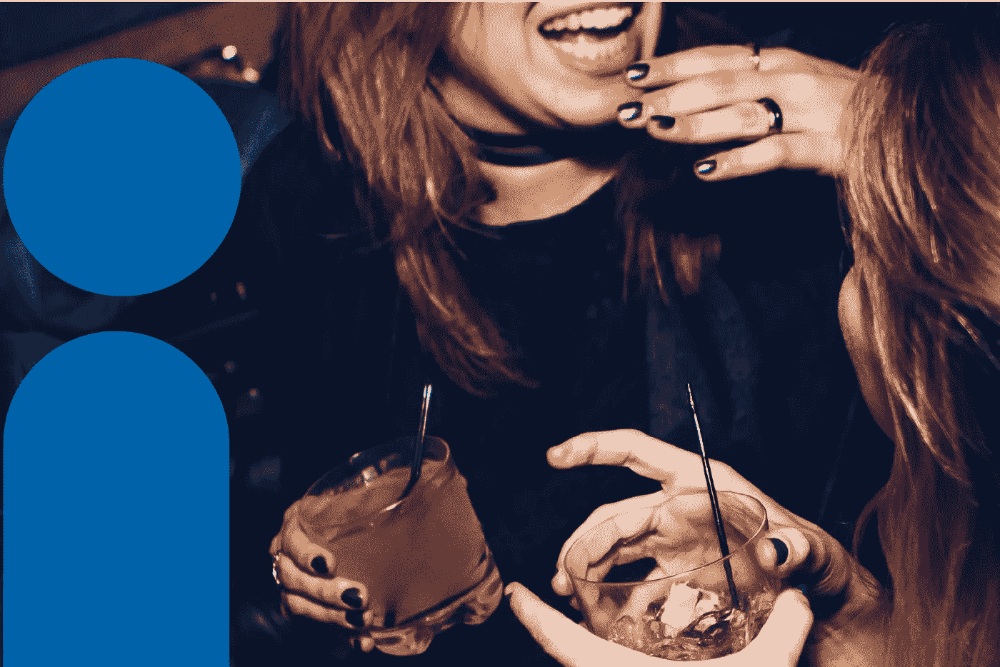
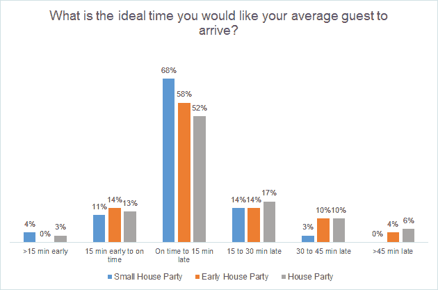
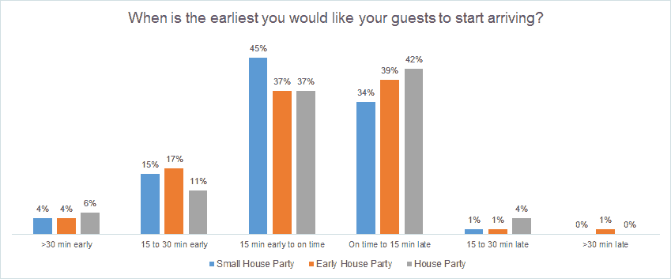
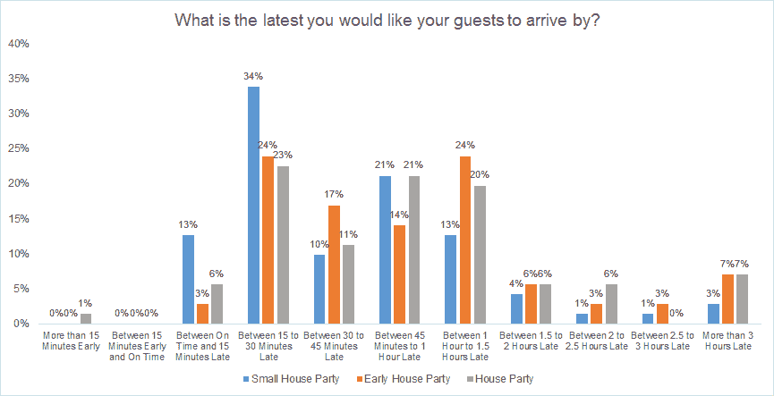
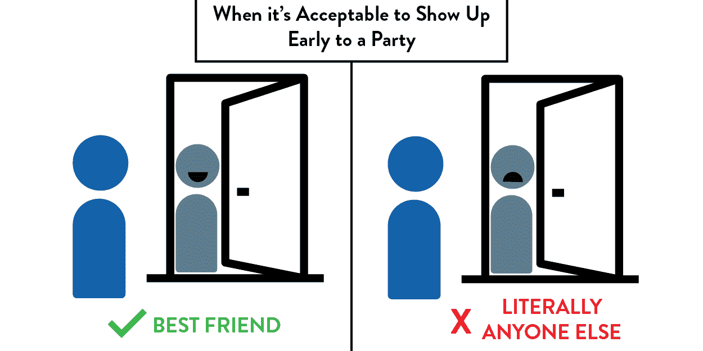
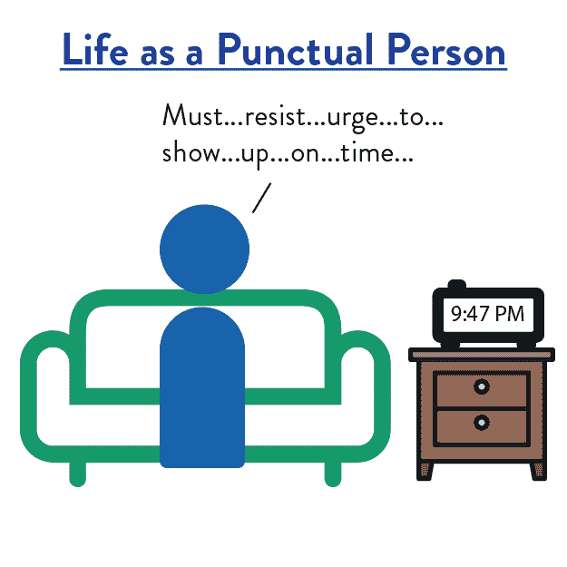
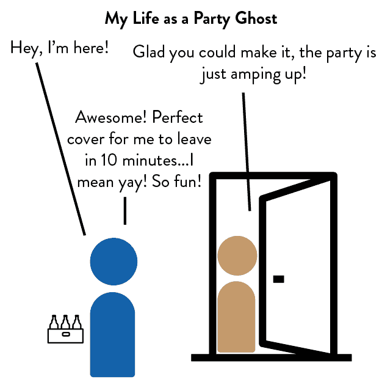
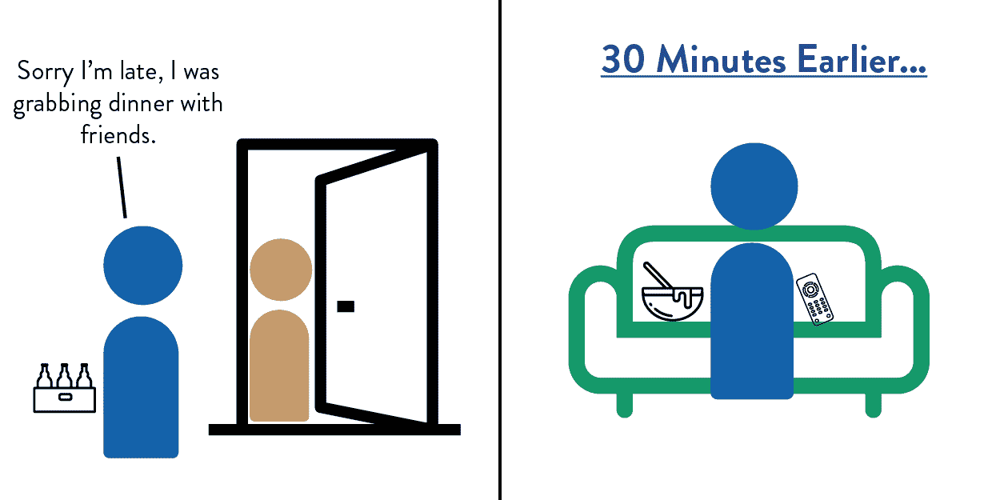
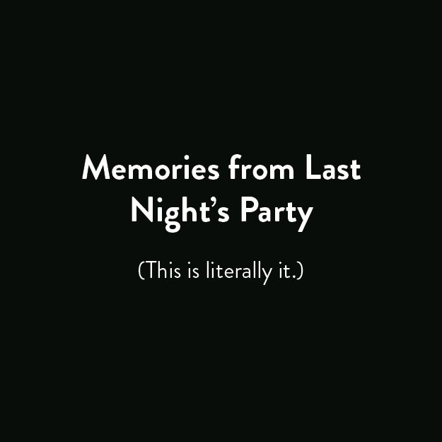

# 什么时候去参加聚会比较合适？

> 原文：<https://towardsdatascience.com/when-to-show-up-to-a-party-and-what-it-says-about-you-71641dce9a83?source=collection_archive---------2----------------------->

## 关于“时髦迟到”实际含义的指南

# 啊…一个聚会

如果你不喜欢我，你就不会和我说话。如果你恨我，你会邀请我参加你的派对。

除了需要在聚会上与人交谈，聚会的另一个问题是决定什么时候去。我是一个准时的人。“时髦地迟到”与我存在的核心相冲突。

然而，我参加过足够多的聚会，意识到守时并不总是受欢迎的。我记得参加了一个朋友的朋友举办的聚会。脸书邀请的开始时间是晚上 9 点。我和我的朋友在晚上 9:05 出现。

只有我们在那里。

其中一位主持人甚至没有完全打扮好，她说她没想到会有人这么早来。我被弄糊涂了，我们不是准时吗？

所以，如果准时是一种虚伪，那么什么时候才是出现的正确时间呢？像我在生活中面临的许多问题一样，我转向了互联网。**我进行了一项在线调查，以确定参加聚会的最佳时间。**之后，我还采访了我那些社交能力更强的朋友，想弄清楚**不同的派对到达时间会告诉你什么。**

# 我在网上随便问了些什么？

我招募了 71 个人，给他们看了三个派对:

*   常规家庭聚会——20 至 50 人的家庭聚会，正式开始时间为晚上 10 点
*   小型家庭聚会——10 到 20 人的家庭聚会，正式开始时间是晚上 10 点
*   *早期家庭聚会*——20 到 50 人的家庭聚会，正式开始时间是晚上 8 点

对于每个假设的聚会，我问了参与者三个问题:

1.  你希望你的客人最早什么时候到达？
2.  您希望您的客人最晚什么时候到达？
3.  你希望普通客人什么时候到达？

这是我的发现:

# 调查显示…

## 1.准时出现，不要迟到 15 分钟。

**超过 50%的人希望客人准时到达，不要迟到 15 分钟。对于较小的聚会来说尤其如此:68%的人说那是理想的出席时间。**

对于大型派对，近三分之一的人希望客人比正式开始时间晚 15 分钟到达。所以，如果你是一个守时的人，在出发去你的社交聚会之前，在办公室再看一集。

## 2.如果你不得不早到，不要早到超过 15 分钟

超过 50%的人不介意客人在三个派对的正式开始时间之前到达。但是，不要太早到达*。很少有人认为客人提前 15 分钟以上到达是可以接受的。如果你过早出现会有危险，在敲门之前，在附近多走几圈。*

**

## *3.有时髦的迟到，也有迟到超过一个半小时的。*

*人们认为客人多晚出现是可以接受的，这一点各不相同。*

*对于小型聚会，78%的人说客人不应该迟到超过一个小时。对于大型聚会，75%的人不介意客人迟到 1.5 小时。7%的人也属于“我不在乎 CK”一类，他们不在乎客人何时出现。*

**

## *4.仅仅因为一个聚会在晚上早些时候开始并不意味着你可以晚些出现。事实上，聚会越小，你越应该准时。*

*我认为聚会开始时间会影响人们对客人到达时间的预期。我错了。数据表明**不管派对是在晚上 8 点还是 10 点开始，你都应该准时或者稍微晚一点到达。***

*聚会的规模对准时性的期望有更大的影响——聚会越小，你应该越准时。*

# *你的派对到达时间说明了你什么*

*数据告诉我什么时候去参加聚会。**但是当你提前 30 分钟或迟到 2 小时到达聚会时，人们实际上在想什么呢？我招募了一些更擅长社交的朋友(比如:高中里的酷孩子),并采访了他们关于派对到达时间的问题。我发现，当你出现在派对上时，会透露出很多关于你的信息——你的个性、你与主人的关系，以及你当晚的目标。***

## *1.你很早就出现了*

**

*如果你早到，你无疑是第一个到的。你可能看到主人正在布置或穿衣服。期待一些关于“不要这么早期待任何人”的评论*

*你…*

1.  *是主人最好的朋友*
2.  *错误地认为人们欣赏你的早到。*
3.  *不知道去派对需要多长时间*

*如果你是主人最好的朋友，一切都可以原谅。你可能已经预料到了。你的存在意味着你可以帮助东道主设置，或者更好的是，赛前。*

*如果你是 2)，就当这是你的觉醒。希望这些数据已经让你相信那些“你来早了！”不是因为主人见到你很兴奋。*

*很可能你是 3)。你不确定到达聚会需要多长时间，所以你比预期的要早到达。你没有绕着街区转几圈，而是决定按门铃——最坏会发生什么？当你看到主人脸上困惑和判断的表情时，你立刻后悔自己的决定。下次你早到的时候，你会像正常人一样耐心地在车里等着。*

## *2.你准时出现*

**

*你很可能仍然是第一个到达的人，除非有一个奇怪的人提前出现。我是说谁会那样做，即使你比那更有社交技巧。*

*取决于你的主人准备得如何，两种情绪中的一种会掠过他们的脑海。如果他们被安排好了，他们会因为人们真的来参加聚会而感到宽慰。当其他客人出现时，你也可以让派对看起来更受欢迎。*

***如果你的主人还在设置，他们在诅咒你的存在。**他们知道邀请*严格来说*说的是晚上 9 点，但是谁*实际上在晚上 9 点*出现呢？现在，他们不得不继续准备，同时感到有义务进行闲聊。*

*那你为什么准时出现？你要么是…*

1.  *准时的*
2.  *无聊的*

*一种选择是你喜欢准时。你的大学绰号是“守时”。你手腕上纹了个秒表。脸书邀请函上说晚上 10 点，该死的，你得在晚上 10 点出现。*

*另一个选择是这个派对是你今晚的巅峰。一天能看的*真侦探*集就这么多。实际上，现在只有两季，而你今天已经看完了。所以你准时到达，因为你宁愿做别的事情，也不愿在你的住处多呆一分钟。*

## *3.你在开始时间后十五到二十分钟出现*

**

*人们开始稀稀拉拉地进来，每个人都站成一大圈。你真的可以听到其他人说话。*

*您可以:*

1.  *我讨厌大群人。*
2.  *有别的地方要去。*

*也许你更喜欢在较小的群体中聊天，但不想与主持人进行一对一的闲聊。如果你在聚会上不认识很多人，相对早一点到达是一个好策略。虽然聚会很小，但你可以在那里见到每个人。随着人们慢慢进入，人们也会被你所在的社交圈吸引，并向你介绍自己。*

*这个时候出现也可能意味着这个派对不是你今晚的最终目的地。你觉得自己有义务去露面，但你实际上只是在等待一段可接受的时间，然后你就可以去你真正的目的地了。与此同时，你不能拒绝别人送的酒。*

## *4.你迟到了三十分钟到一个小时*

**

*派对越来越热闹，饮酒游戏已经出现，人们没有喝醉，但他们肯定在喝酒。*

***如果这个时候到了，说明你是正常的。***

*当你走进房间时，你在心里为自己时髦的迟到而拍拍自己的背。别介意你在过去的两个小时里一直在看猫的视频，这样你就不会早到了。*

*每一个决定都是计划好的。你带了 6 瓶啤酒——足够显示你不是一个贪财的人，但又不够让人认为你渴望朋友。你的衣柜放在一起足够好看，但不要太*放在一起看起来这个派对是一件大事。事实上，你试穿了五套不同的衣服，然后才找到你现在穿的那套，这不是重点。**

## *5.你迟到了一个半小时到三个小时。*

**

*聚会进行得如火如荼。对话包括对着对方的耳朵大喊大叫。像一个入侵物种，红色的 Solo 杯在房间里蔓延。啤酒乒乓球桌有一个等候名单。*

*你…*

1.  *不认识主持人。*
2.  *是从其他地方来的*

*你没见过主持人。事实上，你并不知道这个派对的存在，直到 10 分钟前你的朋友带领你的朋友们来到这里。**你在这里只是因为第一次聚会没有酒了，这是所有人能想到的最好的选择。**这是在收到几条确认这个聚会确实是“poppin”的短信之后。*

*或者这是今晚的第二或第三站。你在“之前最酷的酒吧”并且让你遇到的任何人都明白。现在你要让自己的陶醉程度与派对的水平相匹配。如果你的水平太低，你就拍一些镜头来赶上。如果你水平太高，还是拍些镜头来埋尴尬。*

## *6.你迟到了三个多小时。*

**

***你喝醉了。***

*你不知道你是怎么来的。当你环顾四周，你不认识房间里的任何一个人。人们瞥了你一眼，并和他们的朋友窃窃私语，但你无法理解这一切意味着什么。你会打电话给你的朋友，但是你在两个目的地之前丢失了你的电话。现在你只是坐在沙发上，手里拿着一杯水，还是一杯啤酒？你只需要让你的眼睛休息一小会儿…*

# *派对时间到了…*

*所以希望你现在知道什么时候出现在你的下一个派对上——耶。如果你不相信你真的*想要* *出现* [我有一篇文章要写给你](http://www.latenightfroyo.com/archive/2017/4/30/how-to-get-out-of-going-out)但是现在，我必须拍一张照片，抓起我的夹克，带上微笑，然后出门……唉。*

# *你可能喜欢的其他文章*

*如果你喜欢这篇文章，请访问[**LateNightFroyo.com**](http://latenightfroyo.com/)，阅读引发关于爱情、生活等话题的话题。*

*[如何走出去？](https://www.latenightfroyo.com/archive/2017/4/30/how-to-get-out-of-going-out)*

*[多年轻才算年轻到不能约会？](https://www.latenightfroyo.com/archive/2016/10/2/how-young-is-too-young)*